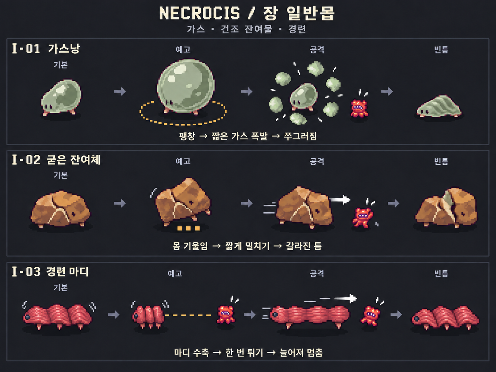
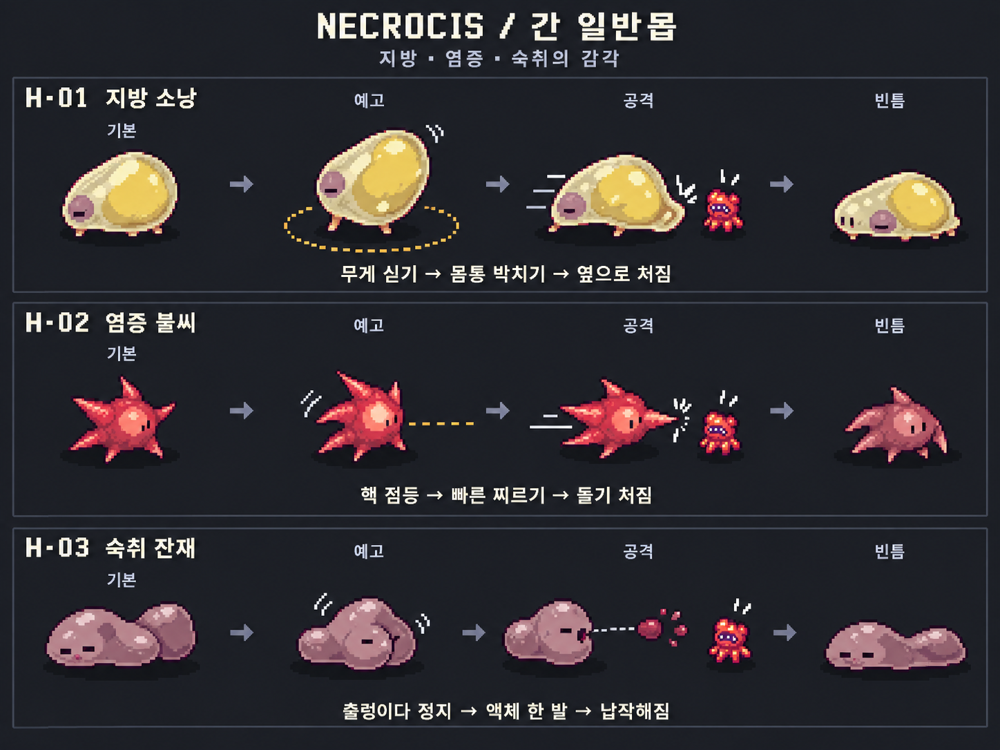
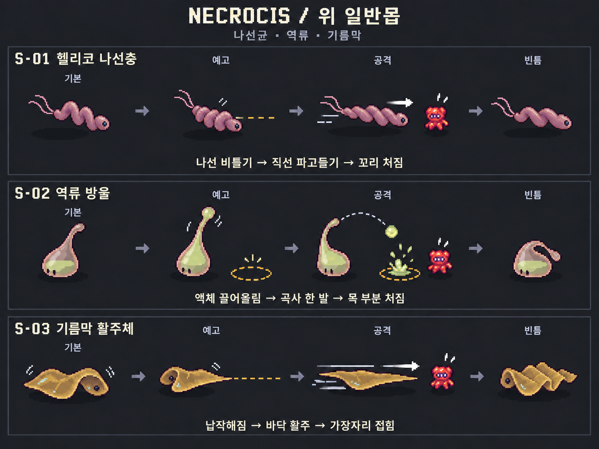
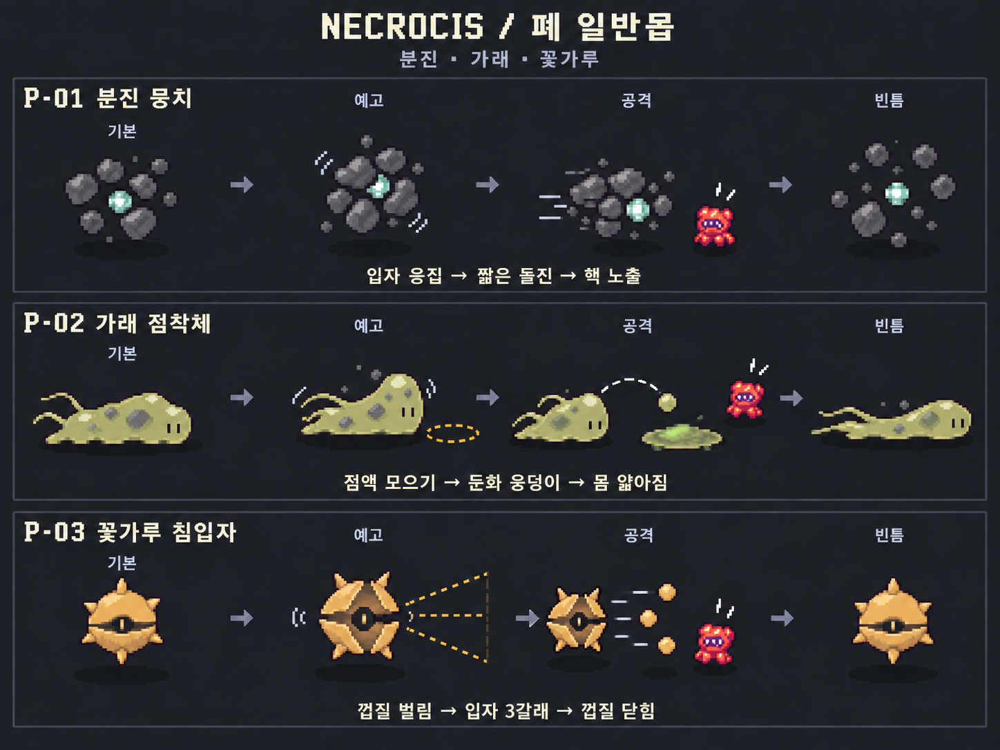

# Necrocis 일반몹 도트 레퍼런스 · Modern Life v2

2026-09-12 · 일반몹 12종 · 바이옴별 3종 · 이미지 4장

> **2026-09-16 v3 업데이트:** 현재 전투 규칙·공격 동작·조합의 기준은 [공격 패턴 v3](ATTACK_PATTERNS_v3.md)이며, 개정한 동작과 대응을 담은 [v3 도트 레퍼런스 4장](../ModernLife_v3/README.md)을 새로 제작했다. 아래의 공격 수치·이미지는 2026-09-12 v2 기록으로 보존한다.

현대 생활에서 떠올릴 수 있는 신체 현상·재질·감각을 게임적으로 의인화한 콘셉트다. 기존 보스의 형태를 입력으로 사용하지 않고, 작은 일반몹과 플레이어 스프라이트의 도트 표현만 참고했다. **우선 제작 추천 8종과 비교 후보 4종을 모두 시각화**했다. 엘리트는 포함하지 않는다.

이 묶음은 외형·공격 동작·빈틈을 검토하는 2D 도트 레퍼런스다. 프레임이 잘린 투명 스프라이트 시트나 게임에 연결된 구현 결과가 아니다. 이미지 제작은 내장 `image_gen`을 사용했다. [실제 생성·수정 프롬프트](PROMPTS.md)를 함께 보관한다.

## 이미지와 제작 우선순위

| 바이옴 | 이미지 | 우선 제작 추천 | 비교 후보 |
| --- | --- | --- | --- |
| 장 | [장 시트](Intestine_Normal_v2.png) | 가스낭 / 굳은 잔여체 | 경련 마디 |
| 간 | [간 시트](Liver_Normal_v2.png) | 지방 소낭 / 염증 불씨 | 숙취 잔재 |
| 위 | [위 시트](Stomach_Normal_v2.png) | 헬리코 나선충 / 역류 방울 | 기름막 활주체 |
| 폐 | [폐 시트](Lung_Normal_v2.png) | 분진 뭉치 / 가래 점착체 | 꽃가루 침입자 |

이미지의 각 행은 **기본 → 예고 → 공격 → 빈틈** 순서다. 몬스터는 확대된 도트 참고 그림이며, 작은 빨간 플레이어는 공격 방향을 설명하기 위한 표식이다. 이미지 안의 몸 크기·거리·원형 표시는 축척이 정확한 판정 도면이 아니다.

## 공통 전투 규칙 — 모두 시작 제안값

- **W = 플레이어 지상 충돌체의 가로 폭.** Unity 월드 단위나 이미지 픽셀 수가 아니다. 예: 실제 폭이 0.6 월드 단위일 때 2W는 1.2 월드 단위.
- 시간·거리·탄속·둔화 수치는 플레이테스트 전 시작값이다. 체력·피해량은 이번 외형/패턴 레퍼런스의 확정 대상이 아니다.
- 예고 시작 때 방향/착탄점을 고정한다. 발사나 돌진 직전 플레이어를 다시 조준하지 않는다.
- 이동 공격의 바닥 예고는 몸의 폭까지 포함한다. 도해의 화살표는 방향을 보여 주는 요약이며 구현 시 실제 경로 전체를 표시한다.
- 예고 중 일반 피격 경직이 발생하면 준비 중 공격 취소. 처치 시 준비 중 공격은 항상 취소한다.
- 한 번의 공격에 접촉·돌진·발사체 판정이 겹쳐도 같은 대상에게 중복 피해를 주지 않는다.
- 빈틈 동안 추격과 새 공격을 중단한다. 별도로 적지 않은 적도 계속 피격 가능하며, 외형 변화만으로 무적 상태를 만들지 않는다.
- **쿨다운은 빈틈 종료 후 재준비 가능까지의 시간.** 발사체는 발사 뒤 독립적으로 이동하며, 사수는 착탄을 기다리지 않고 빈틈에 들어간다.
- 벽에 막힌 돌진은 종료하고 빈틈에 들어간다. 길이 막혔다고 플레이어를 통과하거나 지형 너머로 순간이동하지 않는다.
- 근접/원거리 캐릭터 모두 바닥 표식과 형태 변화로 대응할 수 있도록 한다.

## 장 바이옴

### I-01 가스낭 · 우선 제작 추천

**외형:** 비대칭 배 모양의 얇은 회녹색 막. 내부 빈 공간과 두 개의 작은 접점만 남겨 가볍게 보이게 한다.

**소재:** 가스와 복부팽만의 팽팽한 감각.

| 단계 | 제안 |
| --- | --- |
| 접근·발동 조건 | 느린 접근. 플레이어가 3W 안에 들어오면 멈추고 공격 준비. |
| 예고 | 0.9초. 제자리에서 막이 팽팽해지고, 중심 반경 2W의 바닥 원을 표시. |
| 공격 | 0.15초. 자기 중심 반경 2W에 단 한 번 가스 폭발 피해. 가스는 투사체가 아니며 별도 잔류 판정 없음. |
| 빈틈 | 1.2초. 막이 낮게 쭈그러지고 이동·공격 중단. 핵은 살아 있고 공격 가능. |
| 쿨다운 | 3.5초 |

**회피·반격:** 원이 나타나면 바깥으로 빠졌다가 쭈그러진 동안 접근해 공격.

**단순화 기준:** 기본안은 자폭·연쇄 폭발 없이 반복 가능한 가스 방출 1개만 사용. 예고 중 처치하면 폭발 취소.

**애니메이션 출발점:** 대기 4 / 이동 4 / 팽창 4 / 폭발 본체 2 + 분리 VFX 4 / 빈틈 3. 프레임 수는 제안이며 고정 규격이 아니다.

### I-02 굳은 잔여체 · 우선 제작 추천

**외형:** 낮은 사다리꼴에 가까운 갈라진 갈색 덩어리. 큰 균열 3개와 밑면 돌기로 구분.

**소재:** 건조하고 굳은 잔여물.

| 단계 | 제안 |
| --- | --- |
| 접근·발동 조건 | 느린 접근. 전방 1.6W 안에 플레이어가 있으면 준비. |
| 예고 | 0.65초. 몸 전체를 뒤로 기울이며 앞으로 밀릴 짧은 범위를 예고. |
| 공격 | 0.25초. 고정 방향으로 0.8W 이동하면서 앞면으로 1회 밀치기. 중심 이동과 앞면 판정을 합친 범위는 약 1.5W 이내. |
| 빈틈 | 1.0초. 앞으로 기울어진 채 틈이 벌어짐. 회전·이동 중단. |
| 쿨다운 | 2.0초 |

**회피·반격:** 앞면에서 옆으로 이동하고 벌어진 틈이 보이는 동안 공격.

**단순화 기준:** 회전 구르기와 긴 돌진 없음. 틈은 반격 시간의 시각 신호이며 별도 약점 배율·방어막 시스템은 기본안에서 사용하지 않음.

**애니메이션 출발점:** 대기 3 / 이동 4 / 기울임 3 / 밀치기 2 / 빈틈 3. 프레임 수는 제안이며 고정 규격이 아니다.

### I-03 경련 마디 · 비교 후보

**외형:** 짧은 근육 띠 3개가 이어진 아코디언 실루엣. 검은 점은 신경절 표식이며 이빨이나 입을 달지 않는다.

**소재:** 움찔거리는 근육 수축.

| 단계 | 제안 |
| --- | --- |
| 접근·발동 조건 | 짧은 움찔 이동. 플레이어가 4W 이내면 정지. |
| 예고 | 0.75초. 세 마디를 압축하고 고정된 직선 이동 경로를 표시. |
| 공격 | 0.2초. 3W 길이로 단 한 번 뻗으며 전방으로 이동. 몸의 진행 방향 앞쪽이 공격면. |
| 빈틈 | 1.0초. 근육이 느슨하게 늘어진 상태로 정지. |
| 쿨다운 | 3.0초 |

**회피·반격:** 압축 동작과 직선을 보고 옆으로 이동한 뒤 도착 지점을 공격.

**단순화 기준:** 몸통 접촉과 돌진 피해를 같은 공격으로 처리해 1회 동작에서 중복 피격되지 않게 함. 연속 점프 없음.

**애니메이션 출발점:** 대기 4 / 이동 4 / 압축 3 / 뻗기 2 / 빈틈 3. 프레임 수는 제안이며 고정 규격이 아니다.

## 간 바이옴

### H-01 지방 소낭 · 우선 제작 추천

**외형:** 크림색 막 안에 노란 지방방울 하나가 치우쳐 작은 보라색 핵을 옆으로 밀어낸 형태.

**소재:** 지방의 축적과 무게감.

| 단계 | 제안 |
| --- | --- |
| 접근·발동 조건 | 몸이 출렁이는 느린 접근. 2W 이내에서 준비. |
| 예고 | 0.75초. 몸이 뒤로 기울고 지방의 무게가 뒤늦게 따라감. |
| 공격 | 0.3초. 무게를 실어 1W 앞으로 짧은 몸통 박치기. 좁은 전방 판정 1회. |
| 빈틈 | 1.1초. 한쪽으로 처져 핵이 잘 보이는 자세로 정지. |
| 쿨다운 | 2.5초 |

**회피·반격:** 몸이 기울 때 옆으로 돌고, 처진 뒤 공격.

**단순화 기준:** 이번 기본안은 지방층의 피해 흡수나 껍질 파괴를 넣지 않고 몸통 박치기만 사용. 얼굴이 아니라 지방이 실린 쪽이 박치기 방향.

**애니메이션 출발점:** 대기 4 / 이동 4 / 무게 싣기 4 / 박치기 2 / 빈틈 3. 프레임 수는 제안이며 고정 규격이 아니다.

### H-02 염증 불씨 · 우선 제작 추천

**외형:** 불규칙하게 뾰족한 붉은 세포와 작은 밝은 핵. 불꽃·무기 없이 앞쪽 세포 돌기를 공격면으로 사용.

**소재:** 붉게 달아오른 염증의 시각적 의인화.

| 단계 | 제안 |
| --- | --- |
| 접근·발동 조건 | 빠르게 다가오되 2.5W 안에서 반드시 예고를 하고 공격. |
| 예고 | 0.55초. 핵의 색이 밝아지고 뒤쪽 돌기가 뒤로 접히며 방향 고정. |
| 공격 | 0.16초. 약 1.4W의 짧고 빠른 전방 찌르기 1회. |
| 빈틈 | 0.75초. 돌기와 색이 처지며 제자리 정지. |
| 쿨다운 | 2.0초 |

**회피·반격:** 핵 점등을 신호로 옆걸음하거나 대시. 공격 후 짧은 빈틈에 타격.

**단순화 기준:** 짧은 사거리의 빠른 압박형. 발화 장판·폭발·원거리 탄을 추가하지 않음.

**애니메이션 출발점:** 대기 3 / 이동 4 / 점등 3 / 찌르기 2 / 빈틈 3. 프레임 수는 제안이며 고정 규격이 아니다.

### H-03 숙취 잔재 · 비교 후보

**외형:** 앞뒤 두 덩이가 서로 다른 박자로 따라오는 탁한 연보라 액체. 눈과 작은 분출구만 사용.

**소재:** 숙취의 울렁거리는 감각을 액체 생물로 비유.

| 단계 | 제안 |
| --- | --- |
| 접근·발동 조건 | 좌우로 짧게 비틀거리며 이동. 6W 안에서 멈춘 후 준비. |
| 예고 | 0.8초. 뒤쪽 액체가 따라와 앞쪽 분출구로 모임. |
| 공격 | 0.12초의 발사 동작으로 직선 액체탄 1발. 탄속 6W/초, 최대 이동 7W, 비유도. |
| 빈틈 | 1.0초. 뒤쪽 덩어리가 납작하게 처지고 발사 중단. |
| 쿨다운 | 3.2초 |

**회피·반격:** 움직임이 멈추면 발사를 예상하고 옆으로 이동. 탄이 지난 뒤 접근.

**단순화 기준:** 단발 사수로 유지. 2차 분출과 장판 없음. 재질만으로 숙취가 전달되는지 추가 아트 검토가 필요한 비교 후보.

**애니메이션 출발점:** 대기 4 / 이동 6 / 액체 모으기 3 / 발사 2 / 빈틈 3. 프레임 수는 제안이며 고정 규격이 아니다.

## 위 바이옴

### S-01 헬리코 나선충 · 우선 제작 추천

**외형:** 짧은 나선형 몸과 뒤쪽 가는 편모 2개. 머리와 편모가 공격 방향을 명확히 구분.

**소재:** 나선형 균의 형태.

| 단계 | 제안 |
| --- | --- |
| 접근·발동 조건 | 짧은 흔들림 이동. 4.5W 안에서 준비. |
| 예고 | 0.7초. 몸을 비틀고 머리 앞의 직선 경로 고정. |
| 공격 | 0.25초. 머리부터 3.5W의 직선으로 파고들기 1회. |
| 빈틈 | 0.9초. 나선과 꼬리가 늘어지고 정지. |
| 쿨다운 | 2.6초 |

**회피·반격:** 머리 방향과 직선을 보고 옆으로 피함. 돌진 종료 지점이 반격 위치.

**단순화 기준:** 잠복 무적·유도 추적 없이 지면 흔적과 실루엣으로 표현. 벽을 통과하지 않으며 지형 충돌 시 종료.

**애니메이션 출발점:** 대기 4 / 이동 4 / 비틀기 3 / 파고들기 3 / 빈틈 3. 프레임 수는 제안이며 고정 규격이 아니다.

### S-02 역류 방울 · 우선 제작 추천

**외형:** 무거운 아래쪽 액체와 위로 늘어나는 가느다란 목. 입·치아보다 액체 이동으로 공격을 표현.

**소재:** 산성 액체가 위로 올라오는 역류의 움직임.

| 단계 | 제안 |
| --- | --- |
| 접근·발동 조건 | 중거리 유지. 6W 이내에서 플레이어 위치를 한 번 지정. |
| 예고 | 0.8초. 액체가 목으로 올라가고 반경 0.8W의 착탄 원 표시. |
| 공격 | 발사 동작 0.15초. 곡사탄 1발이 약 0.65초 후 고정 착탄점에서 1회 피해. |
| 빈틈 | 0.8초. 발사 직후 목이 접히며 빈틈 시작. 투사체는 독립적으로 비행. |
| 쿨다운 | 3.0초 |

**회피·반격:** 착탄 원을 벗어나며 접근. 목이 접힌 적을 공격.

**단순화 기준:** 명중 후 즉시 종료하는 단발 착탄. 산성 장판과 되돌아오는 탄은 없음. 탄과 착탄에 이중 피해를 주지 않음.

**애니메이션 출발점:** 대기 4 / 이동 4 / 액체 상승 4 / 발사 2 / 빈틈 3 + 탄/착탄 VFX 분리. 프레임 수는 제안이며 고정 규격이 아니다.

### S-03 기름막 활주체 · 비교 후보

**외형:** 다리가 없는 납작한 황토색 막. 한쪽 말린 가장자리와 얇은 넓이로 구분.

**소재:** 기름막의 미끄럽고 접히는 질감.

| 단계 | 제안 |
| --- | --- |
| 접근·발동 조건 | 낮게 기어다니다 6W 안에서 경로 준비. |
| 예고 | 0.85초. 가장자리가 낮아지고 뾰족한 전방 활주 경로를 표시. |
| 공격 | 0.5초. 5W 길이의 고정된 직선으로 바닥 활주. 접촉 판정 1회. |
| 빈틈 | 1.1초. 도착 지점에서 가장자리가 접히며 정지. |
| 쿨다운 | 3.2초 |

**회피·반격:** 길게 뻗은 경로를 가로질러 피하고, 막이 접힐 때 반격.

**단순화 기준:** 다른 돌진형보다 길지만 예고와 빈틈도 길게. 플레이어의 조작을 미끄럽게 만들거나 잔류 기름 장판을 남기지 않음.

**애니메이션 출발점:** 대기 4 / 이동 4 / 납작해짐 3 / 활주 3 / 빈틈 3. 프레임 수는 제안이며 고정 규격이 아니다.

## 폐 바이옴

### P-01 분진 뭉치 · 우선 제작 추천

**외형:** 작은 청록색 핵 주위에 검은 덩이 7–9개가 모인 군체. 덩이 사이의 빈 공간이 핵심 실루엣.

**소재:** 미세먼지·매연 입자의 모임과 흩어짐.

| 단계 | 제안 |
| --- | --- |
| 접근·발동 조건 | 낮게 떠서 접근. 바닥 그림자는 핵의 위치를 따라감. 3.5W 이내에서 준비. |
| 예고 | 0.65초. 분진이 뭉치고 짧은 돌진 방향 고정. |
| 공격 | 0.2초. 2.5W 앞으로 한 번 돌진. |
| 빈틈 | 1.0초. 분진이 흩어져 핵이 드러나고 이동 중단. |
| 쿨다운 | 2.5초 |

**회피·반격:** 입자가 모이면 옆으로 피하고, 흩어진 핵을 공격.

**단순화 기준:** 분진은 외형이며 각각 별도 적이나 충돌체가 아님. 핵은 전 구간 피격 가능하고 빈틈은 공격하기 쉬운 정지 상태로 표현.

**애니메이션 출발점:** 대기 4 / 이동 4 / 응집 3 / 돌진 2 / 빈틈 4. 프레임 수는 제안이며 고정 규격이 아니다.

### P-02 가래 점착체 · 우선 제작 추천

**외형:** 먼지가 박힌 낮고 긴 점액, 가는 섬모 찌꺼기 2개. 두꺼운 앞부분에 분출 방향 표시.

**소재:** 끈적한 가래의 늘어나는 질감.

| 단계 | 제안 |
| --- | --- |
| 접근·발동 조건 | 중거리에서 느리게 이동. 5W 이내의 플레이어 위치를 지정. |
| 예고 | 0.85초. 앞부분으로 점액을 모으고 반경 1W 착탄 원 표시. |
| 공격 | 발사 동작 0.15초. 점액 1발이 약 0.6초 후 착탄해 3초 둔화 웅덩이 생성. |
| 빈틈 | 0.9초. 발사 직후 본체가 얇고 길어지며 정지. |
| 쿨다운 | 3.5초 |

**회피·반격:** 착탄 원 밖으로 움직이고 웅덩이 가장자리로 우회. 발사 후 얇아진 본체 공격.

**단순화 기준:** 기본안은 피해 없이 이동속도 20% 감소만 적용. 둔화 중첩 없음, 개체당 웅덩이 1개, 원본 개체 처치 시 웅덩이 소멸. 묶기·끌어당김 없음.

**애니메이션 출발점:** 대기 4 / 이동 4 / 점액 모으기 3 / 발사 2 / 빈틈 3 + 탄/웅덩이 VFX 분리. 프레임 수는 제안이며 고정 규격이 아니다.

### P-03 꽃가루 침입자 · 비교 후보

**외형:** 짧은 돌기 6개와 가로로 열리는 황토색 껍질. 중앙의 작은 핵으로 열림·닫힘 표현.

**소재:** 꽃가루 껍질과 입자의 형상.

| 단계 | 제안 |
| --- | --- |
| 접근·발동 조건 | 중거리 유지. 6W 안에서 발사 방향을 준비. |
| 예고 | 0.75초. 껍질이 가로로 벌어지고 전방 부채꼴 예고. |
| 공격 | 발사 동작 0.12초. -18도/0도/+18도 방향으로 탄 3발 동시 발사. 탄속 4W/초, 수명 1.5초, 비유도. |
| 빈틈 | 0.8초. 껍질이 닫히고 돌기가 기울며 정지. |
| 쿨다운 | 2.8초 |

**회피·반격:** 멀리서는 탄 사이로, 가까이서는 부채꼴 옆으로 이동. 예고 중 근접 경직으로 발사 차단.

**단순화 기준:** 껍질 닫힘은 무적이나 방어막이 아님. 탄 사이 통과 간격은 실제 플레이어 충돌 크기로 검증. 같은 발사에서 중복 피해 방지.

**애니메이션 출발점:** 대기 4 / 이동 4 / 벌림 3 / 발사 2 / 빈틈 3. 프레임 수는 제안이며 고정 규격이 아니다.

## 처음 검토할 조합

| 바이옴 | 소규모 조합 예시 | 확인할 재미 |
| --- | --- | --- |
| 장 | 굳은 잔여체 2 + 가스낭 1 | 느린 몸통을 옆으로 피하면서 팽창 원 밖으로 이동 |
| 간 | 지방 소낭 1 + 염증 불씨 2 | 느린 박치기와 빠른 찌르기의 예고 차이 |
| 위 | 헬리코 나선충 2 + 역류 방울 1 | 직선 경로와 고정 착탄점 사이로 이동 |
| 폐 | 분진 뭉치 2 + 가래 점착체 1 | 작은 둔화 구역을 우회하며 분진 핵 노출 때 반격 |

위 조합은 추천 8종만으로 시작한다. 같은 역할의 예고가 겹치면 일반몹끼리 공격 준비 시작 시점을 분산한다. 가스낭과 가래의 구역 효과로 유일한 탈출로가 막히지 않게 넓은 공간에서 먼저 검토한다.

## 도트 제작으로 옮길 때

- 본체는 32×32 또는 48×48 논리 캔버스 후보에서 먼저 재도트화하고 작은 화면 크기로 확인한다. 생성 이미지가 정확히 이 격자에 맞춰진 원본이라는 의미는 아니다.
- 외곽선 1px, 재질당 약 3단계 명암, 큰 픽셀 덩어리로 재질을 표현한다. 고해상도 시트의 디테일을 그대로 축소해 사용하지 않는다.
- 기본/예고/공격/빈틈에 동일한 바닥 중심 앵커와 방향 기준을 사용한다. 나선충은 머리가 진행 방향, 편모가 뒤쪽이다.
- 분진 뭉치의 핵·그림자·실제 충돌 위치를 일치시킨다. 분진 각각에 독립 충돌체를 달지 않는다.
- 본체와 가스·액체탄·착탄·웅덩이 VFX를 분리한다. 피격 1–2프레임, 사망 약 4프레임을 별도로 준비한다.
- 실제 애니메이션 프레임과 방향별 시트, 피벗·투명도·임포트 설정은 후속 에셋 제작 단계에서 결정한다.
- 이번 작업에서는 Unity 씬·카메라·스폰 설정·기존 에셋을 수정하지 않았다.

## 검수

이미지 4장의 몬스터명, 순서, 기본·예고·공격·빈틈 구획과 패턴 도해를 직접 확인했다. 가스낭의 자기 중심 폭발과 쭈그러진 빈틈, 나선충의 머리 방향, 가래 착탄 표시, 꽃가루 발사 칸의 본체를 수정 후 다시 확인했다.

파일 검증 항목은 PNG 디코딩/크기, 원본과 저장본 해시 일치, 이미지·문서 링크, 고유 ID 12개와 우선 추천 8개다. Unity에서의 시인성·애니메이션 재생·판정·성능·밸런스는 아직 검증하지 않았다.

후속 플레이테스트 체크리스트:

- [ ] 실제 카메라에서 색을 제외해도 실루엣으로 종류를 구별할 수 있다.
- [ ] 예고 동작이 보이고, 예고한 범위 안에서만 공격한다.
- [ ] 근접 캐릭터가 빈틈 안에 들어가 반격할 시간이 있다.
- [ ] 돌진 종료 지점과 바닥 충돌 판정이 일치한다.
- [ ] 탄 3갈래 사이에 실제 플레이어가 통과할 공간이 있다.
- [ ] 한 공격에 중복 피격되지 않으며 둔화 구역에서 스스로 빠져나올 수 있다.
- [ ] 한 화면의 적 수가 늘어도 본체·공격·배경을 구분할 수 있다.
