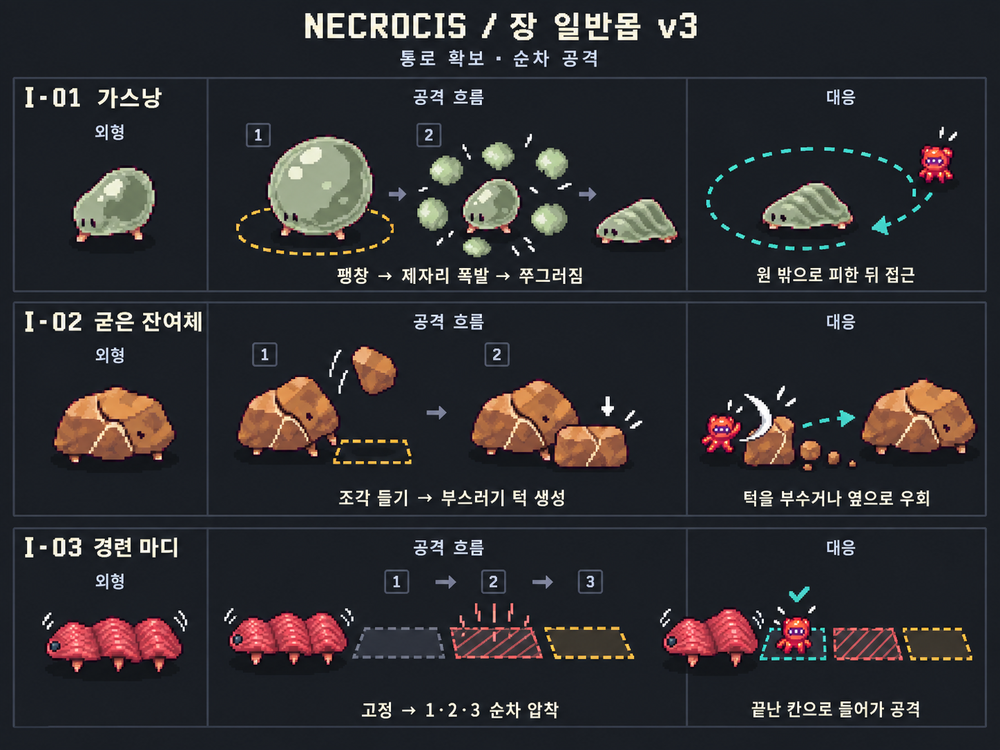
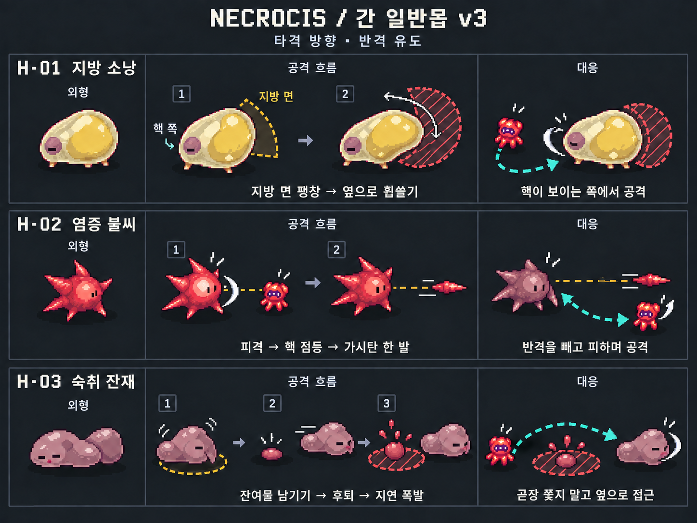
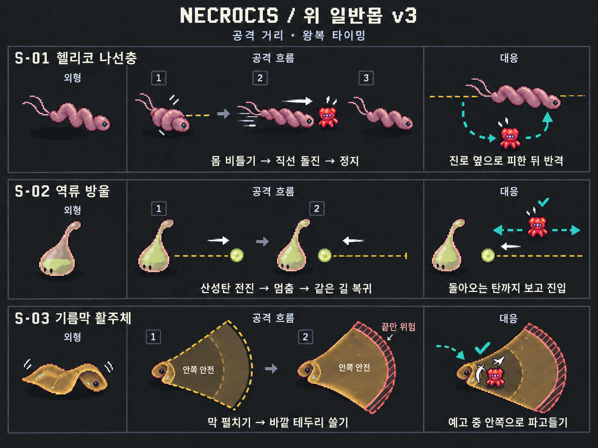
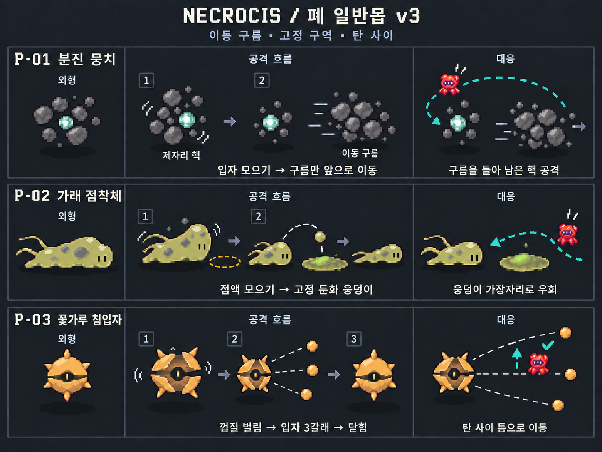

# Necrocis 일반몹 도트 레퍼런스 v3

2026-09-16 · 바이옴별 3종 · 일반몹 12종 · 이미지 4장

기존 Modern Life v2의 외형을 유지하며, [공격 패턴 개정안](../ModernLife_v2/ATTACK_PATTERNS_v3.md)을 도트 도해로 반영했다. 8종은 공격을 바꾸고 4종은 기존 역할을 유지했다. 엘리트는 포함하지 않는다.

**읽는 순서: 외형 → 공격 흐름 → 대응.** 이전처럼 공격 후 쉬는 모습만 보여 주는 대신, 플레이어가 어디로 움직이거나 무엇을 때리는지 오른쪽 칸에 담았다.

- 황색 점선: 공격 예고 또는 고정된 경로.
- 붉은 사선 영역: 현재 위험한 범위.
- 청록색 경로·체크: 플레이어의 이동 방향 또는 안전한 위치.
- 흰 화살표·동작선: 공격이나 타격의 방향.
- 숫자로 구분한 작은 그림은 시간 순서다. 동일한 몬스터를 소환하는 의미가 아니다.

거리·크기는 설명용이며 정확한 충돌 판정 도면이 아니다. 프레임이 분할된 투명 스프라이트 시트가 아니라 콘셉트/애니메이션 제작 참고용이다. 실제 판정·경직·밸런스는 아직 게임에서 검증하지 않았다.

## 바로 보기

| 바이옴 | 이미지 | 초점 |
| --- | --- | --- |
| 장 | [장 v3](Intestine_Normal_v3.png) | 통로 확보와 순차 공격 |
| 간 | [간 v3](Liver_Normal_v3.png) | 타격 방향과 반격 대응 |
| 위 | [위 v3](Stomach_Normal_v3.png) | 공격 거리와 왕복 타이밍 |
| 폐 | [폐 v3](Lung_Normal_v3.png) | 이동 구름·고정 구역·탄 사이 |

## 장

| ID | 몬스터 | 공격 흐름 | 대응 |
| --- | --- | --- | --- |
| I-01 | 가스낭 | 제자리 팽창 폭발 | 원 밖으로 피한 뒤 접근 |
| I-02 | 굳은 잔여체 | 부스러기 턱 생성 | 턱을 부수거나 옆으로 우회 |
| I-03 | 경련 마디 | 가까운 칸부터 1·2·3 순차 압착 | 끝난 칸으로 들어가 공격 |

## 간

| ID | 몬스터 | 공격 흐름 | 대응 |
| --- | --- | --- | --- |
| H-01 | 지방 소낭 | 지방 면 방어와 옆 휩쓸기 | 핵이 보이는 쪽에서 공격 |
| H-02 | 염증 불씨 | 피격 예고 뒤 가시탄 한 발 | 반격을 유도하고 피하며 공격 |
| H-03 | 숙취 잔재 | 이전 위치에 잔여물을 놓고 후퇴, 지연 폭발 | 곧장 쫓지 말고 옆으로 접근 |

## 위

| ID | 몬스터 | 공격 흐름 | 대응 |
| --- | --- | --- | --- |
| S-01 | 헬리코 나선충 | 머리부터 한 번의 직선 돌진 | 진로 옆으로 피한 뒤 반격 |
| S-02 | 역류 방울 | 산성탄이 같은 경로로 전진 후 복귀 | 돌아오는 탄까지 보고 진입 |
| S-03 | 기름막 활주체 | 고정된 핵 앞에서 막 끝 테두리만 펼쳐져 쓸기 | 예고 중 안쪽 안전 공간으로 진입 |

## 폐

| ID | 몬스터 | 공격 흐름 | 대응 |
| --- | --- | --- | --- |
| P-01 | 분진 뭉치 | 핵은 남고 분진 구름만 앞으로 이동 | 구름을 돌아 남은 핵 공격 |
| P-02 | 가래 점착체 | 점액 한 발로 고정 둔화 웅덩이 | 웅덩이 가장자리로 우회 |
| P-03 | 꽃가루 침입자 | 동시에 나가는 입자 세 갈래 | 탄 사이 틈으로 이동 |

## 생성과 검수

내장 `image_gen`으로 이전 시트를 편집했다. [실제 생성·수정 프롬프트](PROMPTS.md)에 입력 경로와 전체 프롬프트를 보관했다. 기존 v2 이미지는 덮어쓰지 않았다.

시각 검수에서 다음을 확인하고 필요한 부분을 수정했다.

- 장: 가스낭의 자기 중심 폭발, 별도 부스러기 장애물, 경련 마디의 완료/현재/다음 칸 구분.
- 간: 지방 면과 핵 쪽 구분, 공격자가 있던 방향으로의 단일 반격탄, 본체가 후퇴한 뒤 이전 자리에 남는 잔여물.
- 위: 머리부터 진행하는 나선충, 하나의 산성탄이 같은 경로로 돌아오는 흐름, 막 끝의 위험 구역과 핵 근처 안전 공간.
- 폐: 제자리 핵과 이동 구름 분리, 고정 웅덩이 우회, 꽃가루 세 발과 그 사이 안전 위치.

최종 PNG의 크기·무결성·원본과 저장본 일치, 이미지/문서 링크, 12종의 ID를 확인했다. Unity 씬·게임 코드·스폰 설정은 변경하지 않았다.

