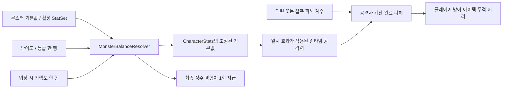

# 엘리트 몬스터·밸런스 통합 구현 문서

작성일/통합일: 2026-09-19  
단일 기준 문서: 구현 계획, 밸런스 수치 소유권/계산식, 네 바이옴 작업 카드, 검증 계획과 진행 기록을 이 파일에 통합했다.

**진행 방식:** 공통 기반 → 장 → 간 → 폐 → 위 → 통합 검토. 제작 전에 해당 몬스터의 패턴·모션·공격 예고 표현안을 제시하고 사용자 확인을 받는다. 확인된 범위의 구현·검증·결과 제시 뒤 다음 지시를 받으며, 다른 단계는 자동 진행하지 않는다.

**2026-09-23 방향 표현 범위 확정:** 선정 8종 모두 처음 제작할 때 필요한 방향 표현과 사망 모션을 포함한다. 기존 제작분도 같은 기준으로 보완한다. 현재 후속 순서는 [방향 보완 진행표](#directional-rollout)를 우선하며, 후속 사용자 정정으로 장 → 간 → 폐 → 위 순서를 확정했고, “맞아 진행해”에 따라 가스낭 I-01-D-1 미술 제작을 승인했다. 현재 결과는 9.2절 진행표를 따른다. 코드 연결·실행 검증은 각각 제시된 단계의 진행 지시를 받아 수행한다.

- [A. 구현 계획과 진행표](#implementation)
- [몬스터 공통 표현 규칙 — 공격 범위·방향·사망 모션](#monster-presentation-rules)
- [8종 방향별 제작 범위·공통 연결 설계](#directional-presentation)
- [방향 보완 순서와 다음 승인 단계](#directional-rollout)
- [B. 밸런스 데이터·계산·Inspector 설계](#balance)
- [C-1. 장: 가스낭·굳은 잔여체](#biome-intestine)
- [C-2. 간: 염증 불씨·숙취 잔재](#biome-liver)
- [C-3. 폐: 분진 뭉치·꽃가루 침입자](#biome-lung)
- [C-4. 위: 헬리코 나선충·기름막 활주체](#biome-stomach)
- [D. 현재 구현 결과와 검증 기록](#implementation-results)

수치와 행동 요구사항을 모두 보존해 통합했다. 이전에 나뉜 밸런스/바이옴 계획 파일은 본문으로 흡수한다. 아래의 “현재 코드” 조사 표는 C-01 착수 전 기준이며, 실제 완료 여부는 A의 진행표와 D의 검증 기록을 따른다. 추천 수치와 아직 확정되지 않은 정책은 계속 제안으로 취급한다.

<a id="implementation"></a>

## A. 구현 계획·순차 진행표

### 1. 목표와 결정 상태

기존 레퍼런스 중 선정한 8종을 **바이옴 엘리트**로 구분하고 맵 생성 시 전용 지점에 소량 배치한다. 등장에는 일반몹 처치 수를 사용하지 않는다. 기존 처치 수 기반 엘리트 시스템과 별도로 동작하며 그 시스템을 교체하거나 끄지 않는다. 경험치와 공격 피해는 일반몹보다 높게 설정한다.

| 항목 | 기준 | 상태 |
| --- | --- | --- |
| 대상 | 네 바이옴에 각 2종, 총 8종 | 사용자 선정 |
| 등장 방식 | 맵 생성 시 바이옴 전용 지점에 소량 배치, 처치 수 조건 없음 | 사용자 요청 |
| 등장 밀도 | 일반몹보다 적게 배치 | 사용자 요청 |
| 보상·위력 | 일반몹보다 높은 경험치와 피해 | 사용자 요청 |
| 밸런스 구조 | 개체 기본값과 진행도 배율을 분리하고 편집을 쉽게 구성 | 사용자 제안을 설계에 반영 |
| 제작 방식 | 바이옴/몬스터/기본·추가 패턴을 나누어 하나씩 구현 결과 확인 | 사용자 요청 |
| 방향 표현 | 8종의 필요한 방향·모션·사망을 초기 제작 범위에 포함하고 기존 제작분도 보완 | 2026-09-23 사용자 방향 확정, 단계별 실행 지시는 별도 |
| 추가 패턴 후보 | 가스낭 가스탄 / 꽃가루 2차 탄막 | 나선충 꼬리 휩쓸기는 사용자 지시로 제외 확정 |
| 진행도 해석 | 현재 런의 서로 다른 바이옴 보스 처치 수 | 추천 기본안 |
| 현재 배치 | 각 300×300 맵 전체 총 2지점, 종류별 1지점, 지점 사이 최소 64칸 | 2026-10-05 사용자 수량 제한·간격 확대 요청 반영 |
| 초기 재생성 정책 | 스포너당 한 런에 한 번 처치, 재입장/계속하기에서도 처치 유지 | 추천 기본안 |

진행도 해석·재생성 정책·기타 구체적인 수치는 회의 확정값으로 간주하지 않는다. 개체 수는 2026-10-05 사용자 요청으로 각 맵 전체 2마리로 제한했고, 간격 확대 요청에 따라 최소 64칸을 적용했다. 변경 시 영향 범위를 해당 설정 계층에 한정한다. 이미 저장된 배치 계획은 유지하며 새 배치 계획부터 적용한다.

### 2. 구현 대상 8종

| ID | 바이옴 | 엘리트 | 핵심 구현 |
| --- | --- | --- | --- |
| I-01 | 장 | 가스낭 | 제자리 팽창 예고 → 자기 중심 폭발 → 쭈그러진 빈틈 |
| I-02 | 장 | 굳은 잔여체 | 부스러기 1개를 내려놓아 짧은 장애물 생성, 타격으로 파괴 |
| H-02 | 간 | 염증 불씨 | 피격 반응 예고 뒤 공격자가 있던 방향으로 가시탄 1발 |
| H-03 | 간 | 숙취 잔재 | 이전 위치에 잔여물을 남기고 후퇴, 잔여물 지연 폭발 |
| P-01 | 폐 | 분진 뭉치 | 핵은 제자리에 남고 분진 구름만 이동 |
| P-03 | 폐 | 꽃가루 침입자 | 간격이 있는 3갈래 탄막 |
| S-01 | 위 | 헬리코 나선충 | 방향 고정 후 머리부터 한 번 직선 돌진 |
| S-03 | 위 | 기름막 활주체 | 핵을 고정하고 막을 펼쳐 전방의 넓은 부채꼴 전체를 단발 타격 |

[최신 도트 레퍼런스](../Art/Concepts/BiomeEnemies/ModernLife_v3/README.md)와 [패턴 v3](../Art/Concepts/BiomeEnemies/ModernLife_v2/ATTACK_PATTERNS_v3.md)를 동작 자료로 사용한다. 해당 이미지의 “일반몹” 표기는 이전 기획의 기록이며, 위 8종의 계획상 등급은 Elite다. S-03의 최신 공격 규칙은 이 문서의 [전체 광역 공격 결정](#oil-film-full-area)을 따른다.

경련 마디·지방 소낭·역류 방울·가래 점착체는 이번 엘리트 구현 대상에서 제외한다. 기존 일반몹을 이 8종으로 교체하지 않는다.

기존 육아종/항체의 처치 수 기반 등장 구성은 유지한다. 새 바이옴 엘리트 목록에는 선정 8종만 사용하고 기존 EliteSpawner에 등록하지 않는다. 기존 레퍼런스의 공략법을 기본 A로 먼저 확인하고, 가스낭·꽃가루·나선충의 보완 B는 별도로 제작·검토한다. 소환·아군 버프·복수 페이즈는 이 추가안에 포함하지 않는다.

### 3. 현재 구조와 연결 지점

| 확인한 코드/데이터 | 현재 상태 | 구현에서 할 일 |
| --- | --- | --- |
| [ProceduralBiomeBridge](../Scripts/World/Biomes/Runtime/ProceduralBiomeBridge.cs) | 네 실제 바이옴 씬이 사용. isElite인 룰을 기존 EliteSpawner에 등록 | 기존 등록은 유지하고 별도 바이옴 엘리트 배치 서비스 연결 |
| [EliteSpawner](../Scripts/Gameplay/Enemies/Spawning/EliteSpawner.cs) | 등록된 일반 적 처치 수를 합산해 일정 간격마다 기존 엘리트 소환 | 유지. 바이옴 엘리트 등록/소환에는 사용하지 않음 |
| [EnemySpawner](../Scripts/Gameplay/Enemies/Spawning/EnemySpawner.cs) | 초기 무리·부족 수 보충·거리 이탈 후 재생성 | 엘리트 생명주기와 분리. 공통 자원만 재사용 |
| [EnemyController](../Scripts/Gameplay/Enemies/Core/EnemyController.cs) | 공통 체력·피격·FSM·사망 이벤트, owner가 EnemySpawner 타입 | 등급과 전용 패턴 연결, 스폰 소유자 계약 일반화 |
| [EnemyPooling](../Scripts/Gameplay/Enemies/Core/Behaviors/EnemyPooling.cs) | 현재 풀 키가 이름과 poissonSalt 기반 | 배치 설정과 분리된 안정적인 몬스터 정의 ID로 분류 |
| [BiomeObjectState](../Scripts/World/Biomes/Runtime/BiomeObjectState.cs) | 월드 오브젝트의 차단/제거 상태 관리 | 패턴 임시 장애물과 영구 스폰 기록을 혼동하지 않게 분리 |
| [SaveModels](../Scripts/Core/Save/SaveModels.cs) | 맵 시드·진입 횟수·런별 보스 진행은 저장, 엘리트 배치/처치 목록은 없음 | 엘리트 배치 계획과 처치 ID, 방문 밸런스 Context 확장 |
| [DifficultyBalanceProfile](../Scripts/Core/Difficulty/DifficultyBalanceProfile.cs) | 일반 적/보스 구분만 존재 | Elite 행과 단일 계산 경로 연결 |

ConfigurableBiomeManager의 기존 처치 수 기반 등록도 유지한다. 두 생성 경로 모두 바이옴 엘리트는 전용 설정만 읽고 별도 배치한다. MonsterTier.Elite는 밸런스 등급이며 처치 수 기반 소환에 등록하라는 뜻이 아니다.

현재 간·위·폐의 EnemySpawnConfig는 비어 있다. 새 엘리트 등록은 일반몹 룰 수가 0이어도 동작해야 한다. 비어 있는 일반몹 목록을 임의로 채우는 작업은 별도 콘텐츠 작업이다.

### 4. 모듈 분리

#### 4.1 밸런스

수치의 소유 위치, 계산식, 페이즈 기본값, Inspector, 이관 규칙은 [밸런스 분리 설계](#balance)를 유일한 기준으로 한다. 이 문서나 스포너에 같은 배율표를 복제하지 않는다.

엘리트와 일반몹의 상대적인 강함은 에디터 비교용으로만 보여 준다. “일반몹 체력 × 4”처럼 다른 몬스터 에셋을 런타임 기본값으로 참조하지 않는다. 기본값은 각 몬스터가 독립적으로 소유한다.

#### 4.2 스폰

- BiomeEliteSpawnConfig: 등장 정의 참조 2개, 전체 개체 수 범위, 종류별 최소 배정, 최소 간격, 시작/보스방 제외 거리, 활성화·해제 거리, 복귀 범위, 재생성 정책.
- ElitePlacementService: 맵 준비 이후 유효 위치를 선택하고 해당 바이옴의 전체 배치 계획 생성.
- EliteFieldSpawner: 고정된 스폰 지점의 단일 개체 활성화와 해제 관리.
- RunEliteState: 런에 속한 배치 계획과 처치 여부의 단일 소유자.
- 스포너에는 체력·공격력·경험치·전용 패턴 피해의 사본을 넣지 않는다.

최초 버전의 추천 정책은 OncePerRun이다. 시간제 재스폰까지 동시에 구현해 설정을 늘리지 않는다. 추후 재스폰이 필요하면 이 정책을 별도 교체한다.

Normal/Hard와 진행도가 엘리트 개체 수를 자동 증폭하지 않는다. 기존 일반몹용 world.enemyMaxAlive / enemySpawnerDensity 배율을 엘리트 스포너에 재사용하지 않는다. 초기 엘리트 배치 수는 전용 스폰 설정만 읽는다.

#### 4.3 전투

- 기존 EnemyController·CharacterStats·피격·사망·풀링을 재사용한다.
- ElitePatternController가 준비/공격/회복 상태와 패턴 실행기를 관리한다.
- 종별 실행기는 기본 행동과 확인된 보완 행동을 분리한다. 선택/연계는 한 컨트롤러가 관리하고, 한 번에 하나의 공격 사이클만 실행한다.
- 기본 행동 데이터는 A/B에서 공유 참조하고 복제하지 않는다. 추가 사용 여부와 거리/순서 조건은 패턴 선택 설정에만 둔다.
- 전용 패턴을 실행하는 동안 기본 FSM의 공격이 같이 나가지 않도록 공격 소유권을 명확히 한다.
- 엘리트 등급 설정에 보스방 제한 무시 플래그를 사용하지 않는다. 등급·보스방 처리·AI 제어는 각각 별도 책임이다.
- DamageRequest와 최종 경험치 지급 경로는 밸런스 설계의 공통 계약을 사용한다.

<a id="monster-body-contact"></a>

#### 4.3.1 모든 몬스터의 몸 접촉 피해 — 2026-09-29 최신 공통 지시

사용자 **“다른 몹들 전부 확인해 충돌피해는 있어야 돼”**에 따라 일반몹·기존 처치 수 엘리트·바이옴 엘리트·보스·보스 소환몹의 **몸 접촉 피해를 활성화**한다. 과거 가스낭/굳은 잔여체/염증 불씨/숙취 잔재 기록에 남아 있는 ‘몸 접촉 피해 끔/없음’은 당시 상태이며 이 지시로 대체한다.

- `MonsterDefinition.contact.enabled=true`, 양수 피해 계수를 사용한다. 기본 공격력 × 난이도/진행도 × 접촉 계수를 기존 경로에서 한 번만 적용한다. 접촉이 없는 회복 구간을 임의로 만들지 않는다.
- 이번에는 꺼져 있던 I-01/I-02/H-02/H-03만 켰다. 기존 공격력 2·접촉 계수 0.5를 유지하여 현재 Normal/Hard·진행도 0에서 몸 접촉 피해는 1이다. 켜져 있던 다른 정의의 계수/능력치·난이도 값은 변경하지 않았다.
- 사망·해제·풀 반환된 몸에는 피해가 없어야 한다. 피격 무적/대시 무적과 보스방 비활성·처치 상태의 보호는 공통 전투 규칙으로 유지한다.
- 폐 보스는 기존 전용 접촉 주기 경로가 피해를 담당한다. 공통 콜라이더 경로를 동시에 켜 중복 적용하지 않는다. 일반 공격/투사체/범위 공격과 접촉 피해는 원본을 분리하며 피격 무적을 우회하지 않는다.
- 바닥 잔여물·부스러기·장판은 몬스터 본체와 구분한다. 숙취 잔여물은 여전히 단발 폭발만, 굳은 잔해는 착지 이후 이동 차단만 수행한다. 기름막은 전방 부채꼴 전체를 타격하며 핵 몸통의 접촉 피해는 별도로 유지한다. 막 전체를 상시 접촉 피해나 이동 차단 영역으로 만들지 않는다.
- 미구현 P-01/P-03/S-01/S-03도 접촉 사용/양수 계수를 유지한다. 패턴을 새로 만들 때 이 기본값을 끄지 않고 실제 생성/충돌을 검증한다. 미구현 정의의 데이터 검증을 전투 구현 완료로 표시하지 않는다.

<a id="player-hit-fairness"></a>

#### 4.3.2 플레이어 피격은 안쪽, 공격은 몸체 가장자리까지 — 2026-09-29

사용자가 “맞는 피격 범위는 불합리하지 않게, 때리는 피격은 살짝 유도리 있게”를 요청했다. 현 상태를 실행 검토한 뒤, **받는 판정은 몸통 안쪽으로 / 공격은 적 몸체 가장자리와 작은 여유를 인정 / 몬스터 접촉 피해 유지** 수정안에 “진행해”로 승인했다.

- **플레이어 피격:** 기본 대기 시트 중 가장 좁은 프레임 폭의 90%로 실제 CapsuleCollider를 맞춘다. 현재 기본 대기 폭은 0.88~1.04m이며 최종 피격 폭은 **0.792m / 반경 0.396m**다. 이전 폭 1.3434m에서 줄였다. 애니메이션·직업이 바뀔 때마다 크기를 바꾸지 않으며, 아이템으로 몸 크기가 변하면 기존 Transform 비율을 따라 한 번만 스케일된다. 물리 캡슐 자체가 줄어 접촉과 탄에 같은 작은 형태가 적용된다.
- **이동과 접촉:** 지형 보행의 `ProceduralTerrainMotor.terrainHalfExtents=(0.68,0.48)`는 유지했다. 몬스터 몸 접촉은 계속 켜져 있고 실제 닿으면 피해를 준다. 공격 중 커진 적의 공격 콜라이더 전체를 본체 접촉 피해로 취급하지 않도록, 접촉 피해에는 원래 몸체 범위 확인을 추가했다.
- **받는 탄/근접:** 일반 적탄도 가스탄/가시탄과 같은 정확한 원·캡슐 쓸기 판정을 사용한다. 사각형 모서리 확장으로 생기던 대각선 과대 피격을 제거했다. 일반 근접 공격의 임의 0.2m 도달 보너스와 실제 범위가 빗나간 뒤 다시 원형 거리로 적중시키던 fallback을 제거했다. 물리 접촉 skin만 최대 0.02m 허용한다. AI의 공격 시작 판단과 실제 근접 타격이 같은 범위를 확인한다.
- **대시:** 일반 적탄/근접 공격도 `PlayerController.TakeDamage(EnemyDamageRequest)`를 통과해 대시 무적을 확인한다. 기존에는 Health로 바로 전달하는 경로가 이를 우회했다. 피해 계수/난이도 배율은 추가로 곱하지 않는다.
- **플레이어 공격:** 공격 가장자리의 추가 여유는 **0.08m**다. Q는 적 몸체와 공격 박스의 겹침을 확인하며, 범위/부채꼴과 가까운 대상 탐색은 적 중심점 대신 몸체 충돌체 가장자리를 기준으로 한다. 부채꼴 뒤쪽에 완전히 떨어진 대상은 맞지 않는다. 몸통 크기를 다시 추가해 이중으로 범위를 넓히지 않는다.
- **플레이어 탄:** 기존 물리 반경과 보조 반경 중 큰 값에 같은 0.08m를 더한다. 현재 기본 W는 0.50→0.58m, 물리 콜라이더가 없는 기본 스킬 탄 보조 판정은 0.35→0.43m다. 기존에 맞던 접촉 경로를 줄이지 않는다. 탄/적의 피해 수치와 실제 발사 범위 원본은 유지한다.
- **기존 바닥 예고:** 가스낭/잔여체/숙취 잔여물 등의 빨간 범위 공격에는 공격자 편의용 여유를 더하지 않는다. 적의 위험 범위와 플레이어 지면 중심 판정의 기존 계약을 유지한다.

**Inspector 조절:** Hub의 Player → `PlayerController` → **피격·공격 판정**에서 `Hurtbox Width Ratio`(현재 0.9), `Attack Edge Padding`(현재 0.08m)을 조절한다. 피격 비율은 다음 물리 스텝에, 공격 여유는 다음 판정에 반영된다. 편집 씬의 Capsule 숫자를 직접 축소 저장하는 방식이 아니라 Play 시작 때 기준 몸통에서 계산하며, 비율을 왕복 편집해도 중복 축소되지 않는다. 캐릭터의 지형 이동 여유와 몬스터별 피해 계수는 별도 원본이다.

<a id="monster-presentation-rules"></a>

#### 4.4 몬스터 공통 표현 규칙

레퍼런스 PNG와 실제 게임용 제작본을 구분한다. 종별 행동에 필요한 Idle/Move/Telegraph/Attack/Recovery/Hit/Death 프레임과 VFX를 준비한다. 표현 설정은 밸런스 원본과 분리한다.

**사용자 공통 지시 — 2026-09-20, 적용 범위 재확인 2026-09-21**

공격 범위 표시와 스프라이트 좌우 방향은 **모든 바이옴의 일반몹·엘리트·보스에 적용하는 공통 제작·수정 기준**이다. 가스낭·굳은 잔여체 전용 규칙이 아니다. 이후 개체별 작업 카드에서 반복하지 않아도 반드시 적용하며, 이전 레퍼런스나 표현안과 충돌하면 이 절을 따른다. 2026-09-23에 선정 엘리트 8종의 정면·후면과 방향별 공격 표현을 아래 4.5절 범위로 추가했다. 기존 일반몹·보스 전체의 방향별 미술 재제작까지 이번 작업에 포함하지 않는다. 실제 적용 상태는 9.2절을 따르며, 과거 좌우 검증을 정면·후면 완료로 간주하지 않는다.

- 몬스터 스프라이트 제작 시 **사망 모션을 같은 제작 범위에 포함**한다. 회복 포즈를 사망 모션 대신 쓰거나, 사망 프레임을 누락한 채 표현이 완성됐다고 보고하지 않는다.
- 사망 연출의 형태·프레임 구성은 제작 전에 제안하고 확인받는다. 사망 판정 시 공격·충돌·탄은 즉시 종료하며, 시각적 사망 모션의 재생 때문에 피해나 보상을 중복 처리하지 않는다.
- **단순 투사체에는 바닥 UI를 붙이지 않는다.** 발사 방향 화살표, 경로선, 별도 바닥 범위 표시는 사용하지 않고, 본체 준비 모션과 탄 자체로 읽히도록 제안한다.
- **범위형 공격의 위험 표시는 빨간 반투명 배경으로 실제 판정 범위 전체를 채운다.** 예고 시작부터 원·사각형·부채꼴 등 해당 공격의 전체 위험 영역을 보이며, 테두리나 균열은 보조 표현으로 사용한다. 채움이 커지는 연출 때문에 최종 범위를 늦게 드러내지 않는다. 고리처럼 안쪽이 안전한 공격은 피해가 있는 띠만 채워 안전 공간을 남긴다. 판정이 끝난 뒤에는 위험 표시를 제거한다.
- **2026-10-01 표현 의미 보완:** 바닥 위험표에 맞춘다는 이유로 꼬리나 무기를 땅에 붙이지 않는다. 실제 공격의 높이·큰 휘어짐·휘두름을 유지하고, 공중 공격을 지면에 투영한 위치/범위를 빨간 위험표와 연결한다. S-01의 꼬리를 지면의 직선으로 바꾼 구현은 사용자 의도와 달라 반려됐다.
- **2026-10-01 원본 유지 보완:** PNG 파일을 수정하지 않았어도, 화면에서 원본 꼬리를 가리고 선/새 메시로 대체하면 원본 유지가 아니다. 기존 그림 사용 지시가 있을 때 형태·굵기·질감·색을 함께 유지한다. S-01-B에서 이 원칙을 검토했으나, 이후 사용자 지시로 꼬리 공격 자체를 제외했다. 원본 유지 원칙은 다른 몬스터에도 적용한다.
- **측면 도트는 좌우 대칭으로 반대편도 바라보게 한다.** 원본 방향을 기준으로 `SpriteRenderer.flipX`를 적용한다. 정면·후면이 필요한 종은 전용 시트를 선택하며, 위아래 반전이나 측면 시트 회전으로 대체하지 않는다. 이동·대기에서는 플레이어 또는 복귀 방향을 바라보고, 방향을 확정한 공격은 예고·공격·회복까지 유지한 뒤 Ready에서 다시 선택한다. 방향 경계에는 유지 구간을 두고, 목표 방향이 없는 경우 마지막 방향을 유지한다.
- **H-03 숙취 잔재의 사용자 승인 예외 — 2026-09-29:** 모든 동작과 사망은 카메라 쪽 정면 시트를 유지한다. 이동·후퇴 벡터만 목표/지형에 따라 달라지며, 정면을 좌우 반전하거나 측면/후면으로 자동 전환하지 않는다. 사망·위험 범위·접지·실제 판정 규칙은 공통 기준을 그대로 따른다. 다른 종의 방향 선택 기준은 유지한다.
- 방향 선택은 대기·이동·준비·공격·회복·피격·사망에 일관되게 적용한다. 사망 모션은 마지막 방향을 이어받고 풀 재사용 시 새 위치에 맞게 초기화한다. 방향별 발사·분리 기준점은 표현 설정으로 맞추며, 실제 조준·판정·피해는 패턴이 소유한다. 시각적 반전 때문에 피해 수치나 판정 크기가 달라지지 않게 한다.
- 폭발·장판처럼 실제 바닥 범위가 공격의 핵심인 경우에는 구체적인 예고 모양·타이밍을 제작안에 포함한다. 사용하는 범위 예고는 실제 판정과 일치해야 한다. 빨간 배경 표시와 좌우 대칭 자체는 이미 확정된 공통 지시이므로 개체마다 적용 여부를 다시 묻지 않는다.
- 새 몬스터·추가 패턴·표현 변경은 **구체안을 먼저 묻고 확인된 범위를 제작**한다. 프레임 수, 사망 모습, 바닥 UI를 임의로 추가한 뒤 사후 검토만 요청하지 않는다.

제작 전 제안에는 `대상/단계 · 공격 방식 · 준비/공격/회복/사망 모션 · 탄/VFX와 바닥 표시 여부 · 이번 구현 범위`를 포함한다. 예: “I-01 가스낭 — 기존 A/B 동작 유지, B 바닥 화살표 제거, 전용 사망 모션의 구체안 제안 후 제작.” 이 예시는 사망 연출 방식이나 제작 승인을 대신하지 않는다.

**개체별 완료 확인:** 빨간 배경과 실제 판정의 위치·크기·안전 공간 일치, 단순 투사체의 바닥 UI 없음, 좌우·정면·후면 및 대각선 접근, 공격 중 방향 고정과 회복 후 재전환, 피격·사망 방향 유지, 풀 재사용 후 방향 초기화를 실제 게임 화면과 실행 검증으로 확인한다. 기름막 활주체는 2026-10-03 사용자 결정에 따라 전방 부채꼴 전체를 빨갛게 채운다. 가까운 안쪽도 공격 범위이며 피해 없는 구멍을 두지 않는다.

<a id="directional-presentation"></a>

#### 4.5 선정 8종의 방향별 제작·연결 기준 — 2026-09-23

**최초 결정:** 전면 검토 결과를 바탕으로 필요한 방향 표현을 처음부터 모두 구현하는 방향을 채택했다. **2026-09-29 후속 결정:** 숙취 잔재는 [정면 고정 예외](#hangover-front-fixed)를 적용한다. 최초 안에서는 가스낭을 포함한 7종을 정면·후면 제작 범위에 넣었다. 이후 숙취 잔재는 제작한 후면을 보관하고 정면만 실사용하도록 확정했다. 분진 뭉치는 방향성이 없는 본체를 공유하고 입자 응집·구름 분리를 방향에 맞춘다. 기존 제작분은 활용하면서 부족한 방향을 보완한다. 새로운 공격이나 미승인 B 패턴의 추가는 별도 단계다.

정면은 **화면 아래를 향해 얼굴이 보이는 모습**, 후면은 **화면 위를 향해 등·뒤쪽 구조가 보이는 모습**이다. 이동 평면의 방향을 카메라 기준으로 해석하며 월드 높이 Y와 혼동하지 않는다. 기본은 측면 원본과 좌우 대칭, 정면, 후면의 4방향이다. 나선충은 긴 몸의 돌진 방향을 읽을 수 있도록 첫 미술 제안에 사선 4방향까지 포함한 8방향 구성을 제시한다. 방향별 프레임 수·공유 가능 구간은 해당 미술 단계에서 확정한다.

| 대상 | 초기 제작·기존 보완 범위 | 공격 생성물과 개체별 주의점 |
| --- | --- | --- |
| I-01 가스낭 | 정면·후면 대기/이동 표현, 팽창, A 폭발·B 발사 자세, 수축·피격 표현과 사망 | 자기 중심 폭발·구형 가스탄은 공유. B의 발사 시작점과 몸의 방향을 맞추고 A/B에서 같은 팽창 프레임 원본을 사용 |
| I-02 굳은 잔여체 | 정면·후면 대기·이동·조각 들기·내려놓기·회복·피격·사망 | 얼굴·등·들린 조각의 겹침과 착지 연결 확인. 사용자 승인으로 좌우 가로·상하 세로 잔해를 적용한다. 준비 때 확정한 몸체 방향을 따라 미술·빨간 예고·피해·차단·파괴 축을 함께 바꾼다. 범위는 2.2×0.7m 공통 |
| H-02 염증 불씨 | 정면·후면 대기·이동·가시 준비·발사·회복·피격·사망 | 준비하는 가시와 실제 탄의 방향·발사 위치를 일치시킴. 가시탄 원본은 공유하고 기존 지면 비행·벽 차단 검증을 유지 |
| H-03 숙취 잔재 | [사용자 확정 정면 고정](#hangover-front-fixed): 본체 12·사망 6장을 모든 이동 방향에 공유. 제작한 후면/측면은 보관 | 조준 벡터와 그림의 바라보기를 분리. 자기 위치에 잔여물을 남기고 실제 대상 반대 방향으로 후퇴. 후퇴 뒤 잔여물 가시성·접지·빨간 범위 일치 확인 |
| P-01 분진 뭉치 | 본체 대기·응집·방출·회복·피격·사망을 첫 제작에 포함. 방향별 본체 복제 없이 전 방향 응집·분리 표현 구현 | 핵은 고정. 응집 위치와 구름의 방출 방향을 연동하고 위아래 진행에서도 핵·구름·플레이어의 가림 관계 확인 |
| P-03 꽃가루 침입자 | 정면·후면 대기·이동에 필요한 자세, 껍질 벌림·발사·닫힘·피격·사망 | 개방부와 3갈래 발사 방향 일치. 탄 원본 공유. B 승인 시 껍질 회전과 두 번째 발사에도 같은 방향 기준 적용 |
| S-01 헬리코 나선충 | 머리·몸통·편모가 읽히는 정면·후면 및 사선 자세를 첫 미술안에 포함. 대기/이동·비틀기·돌진·회복·피격·사망 | 방향에 따른 몸통 원근과 마디 겹침 표현. 머리부터 전진하고 편모가 뒤따름. B 승인 시 꼬리 들기·후방 휩쓸기를 각 방향에 맞춰 제작 |
| S-03 기름막 활주체 | 정면·후면 대기/이동에 필요한 자세, 펼침·쓸기·접힘·피격·사망 | 본체·막 연결점과 지면 위 막의 방향 일치. 막은 실제 공격 방향에 맞춰 표현하고 전방 부채꼴 전체의 빨간 예고·단발 피해 범위를 일치시킴 |

각 종의 실제 행동에 존재하는 모션을 빠짐없이 연결한다. 기존에 단일 포즈로 처리하던 구간을 별도 애니메이션으로 늘릴지는 미술 제안에 명시한다. **정면·후면에서 죽을 때 측면으로 바뀌지 않게 전용 사망을 함께 제작**한다. 완전히 부서지거나 녹은 마지막 잔해만, 방향별 사망에서 자연스럽게 이어지는 것을 확인한 후 공유할 수 있다. 프레임 재사용 때문에 얼굴이나 몸의 앞뒤가 순간적으로 바뀌면 완료로 인정하지 않는다.

**공통 연결 C-04의 책임 분리:**

| 소유 위치 | 책임 | 중복하지 않을 값 |
| --- | --- | --- |
| 종별 Presentation 원본 | 방향별 동작·사망 프레임, 원본 측면 방향, 재생 정보, 발/몸체 기준점과 발사·분리 시각 기준점 | 체력·피해·경험치·공격 범위·난이도/진행도 배율을 넣지 않음 |
| 공통 방향·재생 처리 | 카메라 기준 방향 선택, 경계 유지, 프레임 전환, 마지막 사망 방향과 풀 재사용 초기화 | 각 패턴에 방향 선택 계산을 복제하지 않음. 방향 전환만으로 공격 시간이나 재생을 다시 시작하지 않음 |
| 종별 패턴·공격 생성물 | 실제 조준 방향과 확정 시점, 사이클·후퇴·판정, 생성 위치의 충돌 안전성 | 4/8방향 그림 선택 때문에 실제 조준을 강제로 4/8방향으로 꺾지 않음. 공통 플레이어 피해/밸런스 계산을 재사용 |

- 방향 정보는 전용 패턴과 사망 재생까지 연결한다. 현재 일반 방향 애니메이션을 우회하는 패턴 프레임 경로와 단일 사망 배열 경로도 함께 다룬다. 이미지 필드만 늘려 놓고 런타임을 측면 고정으로 남기지 않는다.
- Inspector에서는 **방향 → 동작 → 프레임/기준점**을 선택해 원본을 편집하고 누락을 확인할 수 있게 한다. 실제 공격 수치 편집 위치는 기존 밸런스·패턴 설정을 그대로 사용한다.
- 발 기준과 월드 크기를 방향마다 맞추되 정면·후면의 원근에 따른 폭 차이는 보존한다. 후면에 얼굴을 억지로 표시하지 않는다. 그림자를 포함한 접지, Point 가져오기와 안정적인 피벗을 확인한다.
- 위아래 발사·분리의 가림 순서는 실제 생성 위치와 깊이에 맞춘다. 표현 기준점 보정이 벽 너머 발사, 근거리 판정 누락, 지면 관통 또는 과도한 공중 비행을 만들지 않게 검증한다.

**승인 경계:** 이 절은 8종의 제작 요구사항이다. 미술 결과 확인 → 공통/개체 연결 → 실제 전투 검증을 각각 제시하고 진행 지시를 받는다. 기존 검증 기록은 당시 결과로 보존하며 이번 방향 확장의 통과 근거로 재사용하지 않는다.

### 5. 전용 스포너의 배치 규칙

1. MapGenerator가 준비된 뒤 시작 지점에서 도달 가능한 보행 영역을 후보로 수집한다.
2. 시작 위치, 포털, 보스방/예약 접근로, 맵 밖, 지나치게 좁은 길목을 제외한다.
3. 맵 시드와 바이옴을 사용해 **맵 전체**에서 소수의 위치를 선택한다. 청크마다 4~6마리씩 만드는 방식이 아니다.
4. 서로 다른 엘리트 종류 사이에도 같은 최소 간격을 적용한다.
5. 두 종류가 모두 등장하도록 종류별 최소 배정을 우선하고 나머지를 배정한다.
6. 한 지점에는 한 개체만 둔다. 기존 EnemySpawner의 maxAlive 무리 생성/보충 루프를 사용하지 않는다.
7. 배치 계획은 먼저 고정하고, 각 청크가 로드될 때 해당 지점의 스포너만 생성한다.
8. 실제 적은 시야에 들어오기 전에 활성화한다. 눈앞에서 생성되거나 전투 중 잠깐 멀어졌다고 사라지지 않도록 활성화/해제 거리에 여유를 둔다.

후보가 부족하면 겹침·접근 불가능 조건을 풀어서 수량을 억지로 채우지 않는다. 안전하게 줄여 배치하고 에디터 검증 메시지에 부족 수를 표시한다.

배치 검사에서는 몬스터 기본 수치를 변경하지 않는다. 맵이 크거나 주변 일반몹이 많다는 이유로 숨은 공격력 보정을 적용하지 않는다.

### 6. 저장·재입장·풀링

#### 6.1 저장 데이터의 소유자

추천 추가 데이터:

- biome별 EliteSpawnPlanEntry 목록: spawnId, monsterDefinitionId, gridPosition.
- 런의 defeatedEliteSpawnIds 집합: 실제 처치된 스포너 ID만 보관.
- 계속하기를 위한 방문 BalanceContext: 밸런스 설계에서 정의한 visitId / stageAtEntry 등.

배치 항목에 별도 defeated 플래그를 중복 저장하지 않는다. 처치 판정은 defeatedEliteSpawnIds만 조회한다. 체력·공격력·난이도 배율의 사본도 저장하지 않는다.

spawnId는 배치 계획을 생성할 때 부여해 이후 변하지 않는 식별자다. 리스트 순번이나 Unity InstanceID를 저장 식별자로 사용하지 않는다. monsterDefinitionId도 표시 이름·파일명 변경에 따라 달라지지 않게 한다.

배치 계획은 해당 런의 첫 바이옴 생성 때 만들고 저장한다. 같은 맵 시드라도 나중에 Inspector 목록 순서나 배치 수를 바꿨다는 이유로 기존 런의 스폰 ID/종류가 바뀌지 않게 한다. 새 배치 설정은 새 런에서 적용한다. 밸런스 기본값은 저장된 몬스터 정의 ID를 통해 최신 에셋에서 읽는다.

#### 6.2 런타임 상태

| 사건 | 처리 |
| --- | --- |
| 처음 활성화 | 처치 목록에 없는 경우에만 1마리 생성 |
| 전투 중 | 해당 스포너의 생존 개체를 추가 생성하지 않음 |
| 실제 처치 | 스폰 ID를 한 번 기록하고 최종 경험치를 한 번 지급 |
| 거리/청크 해제 | 풀로 반환. 처치 기록·경험치 지급 없음 |
| 미처치 개체 재활성화 | 추천 초기 정책은 현재 방문 Context의 최대 체력으로 재생성 |
| 같은 런 재입장/계속하기 | 처치한 ID는 계속 비활성 |
| 새 런 | 새 배치 계획과 빈 처치 집합 사용 |
| Normal 사망 | 기존 런 진행 유지 정책에 맞춰 처치 기록 유지 |
| Hard 사망/새 시작 | 종료된 런의 기록을 다음 런으로 가져가지 않음 |

완벽한 전투 중간 상태 저장은 추가하지 않는다. 살아 있는 적의 정확한 좌표·남은 패턴 시간·잔여 투사체는 저장하지 않는다. 처치와 비활성화를 구분하는 것이 우선이다.

#### 6.3 풀링과 보상

- 기존 EnemySpawner 전용 owner 참조를 스폰 소유자 인터페이스 또는 명확한 어댑터로 일반화한다.
- 사망 이벤트와 풀 반환 이벤트를 분리한다. Defeated에서 처치 판정을 하고 거리 해제를 사망으로 처리하지 않는다.
- 상태 변경과 경험치 지급은 중복 호출에 안전하도록 한 번만 소비하는 경로로 처리한다.
- 풀 반환 때 DamageTaken/Defeated 구독, 코루틴, 공격 예약, 일시 효과와 패턴 생성물을 모두 정리한다.
- 소유자 세대 토큰 또는 동등한 검증으로 이전 개체의 지연 콜백이 재사용된 개체를 공격하지 못하게 한다.
- 스포너당 개체 수와 경험치는 UI 경고/사망 애니메이션 콜백 횟수에 영향을 받지 않아야 한다.

저장 스키마를 확장할 때 기존 저장 파일에 새 컬렉션이 없어도 안전한 기본값으로 읽도록 한다. 최초 이관된 구세이브에는 엘리트 처치 기록이 없다는 점을 명시하고, 가짜 처치 ID를 추정해 넣지 않는다.

### 7. 바이옴별 제작 패키지

기본 순서는 **공통 기반 → 장 → 간 → 폐 → 위 → 통합 검토**다. 2026-09-23 이후에는 [기존 제작분의 방향 보완 순서](#directional-rollout)를 먼저 적용한 뒤 H-MAP → 폐 → 위로 이어간다. 사용자 지시가 있으면 지정 범위의 순서를 바꿀 수 있지만, 필요한 공통 선행 조건은 생략하지 않는다.

| 순서 | 상세 작업 카드 | 이 바이옴의 엘리트가 추구하는 것 | 대상 | 추가 패턴 검토 |
| --- | --- | --- | --- | --- |
| 1 | [장](#biome-intestine) | 안전거리와 통로를 직접 확보 | 가스낭 / 굳은 잔여체 | 가스낭의 원거리 가스탄 |
| 2 | [간](#biome-liver) | 공격 후 반응과 추격 방향 판단 | 염증 불씨 / 숙취 잔재 | 우선 기존 공략법 완성, 새 패턴 보류 |
| 3 | [폐](#biome-lung) | 이동 구름과 탄 사이의 안전 공간 선택 | 분진 뭉치 / 꽃가루 침입자 | 꽃가루의 회전 예고 후 두 번째 탄막 |
| 4 | [위](#biome-stomach) | 공격 방향·거리·완결 시점 읽기 | 헬리코 나선충 / 기름막 활주체 | 추가 꼬리 휩쓸기 제외 · 기본 돌진/회복 유지 |

각 작업 카드는 **전투 의도 → 기본 A → 추가 B(있는 종만) → Inspector 항목 → 검증 기준 → 보여줄 장면 → 멈출 지점 → 바이옴 적용** 순서로 구성한다.

8종의 기본 A는 모두 구현 대상이다. 추가 B는 가스낭·꽃가루·나선충의 3개 검토 안으로 분리한다. B의 존재가 구현/활성화 승인을 뜻하지 않는다. 사용자에게 A를 보여준 뒤, 추가 구현·조정·보류·제외 지시를 받아 별도 진행한다. 다른 5종에 두 번째 공격을 자동 배정하지 않는다.

행동 세부 기준은 위 작업 카드가 원본이다. 수치의 기본값·배율·계산은 밸런스 문서만 따르고, 실제 작업 상태와 사용자 결정은 9절 진행표에만 기록한다. 기존 v3 시트는 기본 공략 참고 자료이며 세 가지 B 추가 동작은 아직 이미지에 반영되어 있지 않다.

생성물의 상한과 수명을 패턴 설정으로 관리한다. 가스·장애물·잔여물·분진 구름은 본체 사망/해제 시 함께 정리한다. 임시 부스러기는 영구 월드 오브젝트 제거 기록이나 엘리트 처치 집합에 넣지 않는다.

### 8. Inspector 완료 목표

[밸런스 설계의 편집 구성](#balance)을 그대로 구현한다.

- 한 진입점에서 등급/바이옴/몬스터를 선택.
- 기본값, 난이도, 진행도, 스폰을 서로 다른 탭으로 구분.
- 원본 에셋을 편집하고 계산 결과는 읽기 전용 표시.
- 선택한 난이도·단계·보스 페이즈의 체력/피해/경험치 계산 근거 표시.
- 사용하지 않는 보스 패턴/구필드 숨김.
- 플레이 모드 상태가 에셋 기본값으로 역저장되지 않음.
- 스폰 배치 미리보기는 전용 지점·최소 간격·제외 영역을 보여 주고 전투 수치에 영향을 주지 않음.
- 기본 A와 추가 B의 사용 여부·선택 조건·연계 순서를 구분해 표시. 미구현 B는 활성화 불가이며, 추가를 끄면 확인한 기본 버전으로 복귀.
- 선택된 공격 사이클의 최종 회복과 재사용 대기를 표시해, 기본과 추가의 대기시간이 중복 가산되지 않는지 확인.

### 9. 순차 구현·사용자 검토 진행표

#### 9.1 실행 단위

- **2026-09-21 사용자 재지시: 진행 절차별로 반드시 승인받는다.** 다음 작업의 구체적인 대상·변경 범위·확인 결과·멈출 지점을 먼저 제시하고 승인된 단계만 수행한다. 단계 안의 구현·필요한 검증·결과 제시는 묶어서 진행하되, 결과를 보여준 뒤 다음 단계는 별도 승인받는다. “다음 작업 뭔지 출력하고 진행해”를 아직 제시하지 않은 세부 절차 전체의 승인으로 해석하지 않는다.
- 제작 전 확인이 우선이다. “다음 작업” 지시에는 먼저 다음 대상과 구체안을 제시하며, 새 공격·스프라이트·사망 연출·바닥 표시를 임의로 결정해 바로 구현하지 않는다. 이미 확인된 구체안과 범위 안의 구현·검증은 반복 확인 없이 진행한다.
- 기본 실행 단위는 아래 **ID 한 개**다. 해당 범위의 구현·필요한 테스트·재현 준비까지 마친 뒤 결과를 제시한다.
- 검토를 받기 전에 다음 ID, 다음 몬스터 또는 다른 바이옴을 자동 구현하지 않는다. 이는 “하나씩 구현된 것을 보며 지시”하겠다는 사용자의 요청에 따른 작업 경계다.
- 사용자가 여러 ID 또는 명확한 묶음을 한 번에 지시하면 그 범위 안에서 연속 진행한다. 이미 허용한 같은 범위 안에서 확인을 반복 요구하지 않는다.
- 선행 기반이 없다면 이를 숨기고 개체 완료로 보고하지 않는다. 선행 작업 범위를 먼저 알리고 공통 단계부터 결과를 확인받는다.
- “가스낭 기본만”은 I-01-A, “가스낭 추가 패턴”은 I-01-B처럼 해석한다. 단순히 “가스낭부터”라면 A부터 보여주는 것을 기본으로 한다.
- A/B 결과가 수정 요청이면 같은 ID에서 수정·재검증한다. B 보류는 미완료로 남기며, 제외는 사용자의 명시적 범위 변경으로 기록한다.
- 기술 검증 통과와 사용자 확인은 구분한다. 실행하지 못했으면 “미검증”을 보고하고 확인 완료로 바꾸지 않는다.
- 몬스터의 기본 패턴 확인, 추가 패턴 확인, 해당 바이옴의 본맵 적용 확인을 서로 구분한다.
- **2026-09-23 사용자 결정:** 선정 8종의 필요한 방향 표현을 처음부터 모두 갖추고 기존 제작분도 보완한다. 최초 요청은 통합 문서 갱신과 다음 작업 제시였으며, 후속 “맞아 진행해”로 가스낭 I-01-D-1 미술 단계를 승인했다. 이후 개별 제작 단계의 착수는 각 진행 지시를 따르며, 방향 확장 동의를 미승인 B·본맵 등록의 실행 승인으로 확대하지 않는다.

#### 9.2 현재 진행 상태

**선정한 8종의 승인된 패턴·방향/사망·전용 본맵 배치가 완료됐으며 [ALL-01 통합 검토](#elite-all01-results)에서 실제 게임/저장/밸런스 경로를 다시 확인했다.** 장은 가스낭 A+B·굳은 잔여체 A, 간은 염증 불씨 A·정면 고정 숙취 잔재 A, 폐는 분진 A·꽃가루 A+B, 위는 나선충 A·기름막 A를 사용한다. 나선충 꼬리 휩쓸기는 제외 상태다. 등록 종수는 각2종이며, 2026-10-05 변경 기준 맵 전체 수량은 장·간·폐·위 각각2마리(종류별1마리), 지점 사이 최소 간격은64칸이다. 저장된 기존 배치 계획은 유지한다. 기본 수치와 Normal/Hard Elite 배율은 초기값을 유지하고 있으며, 정밀 수치 튜닝의 완료를 의미하지 않는다. 이 절의 표가 작업 상태의 단일 원본이다.

**2026-10-05 배치 조정 검증:** 네 맵의 실제 씬과 `MapGenerator`·`BiomeEliteField`를 Unity Editor 배치 모드에서 실행해 맵별 10개 시드, 총 40개 지형을 생성했다. 현재 Normal 장 시드 `118692`를 포함하며, 총 448개 조건 검사 통과·실패 0이다. 모든 표본에서 전체 2마리·종류별 1마리와 최소 64칸 간격을 만족했고, 실측 지점 간 거리는 100.45~316.43칸이었다. 입구에서의 도달 가능성, 입구/포털/보스 구역 제외, 평지 여유, 동일 시드 재생성을 검사했다. [상세 결과](../../../output/share/biome-elite-summary/Elite-Placement-2x64-results.json). 기존 C-03 배치·처치 기록·계속하기·Normal/Hard 격리·이전 저장 스키마 검사 3그룹도 통과했다. 원본 저장 파일의 SHA-256은 동일하며 씬·설정은 검증 과정에서 저장하지 않았다. 이번 검증은 배치와 저장 경로이며 전투 패턴 전체 재검증은 아니다. 이전 단계 기록의 4~6마리·18칸 수치는 당시 검증값으로 보존한다.

| ID | 범위 | 이번 단계에서 할 일 | 사용자에게 보여줄 결과 | 선행/진행 조건 | 현재 상태 |
| --- | --- | --- | --- | --- | --- |
| C-01 | 공통 | 원본 기본값·등급·계산기·최소 Inspector 미리보기 | 선정 수치의 기본값/배율/최종값과 검산 결과 | 대상 범위 시작 지시 | 사용자 확인·C-02 진행 지시 수신 |
| C-02 | 공통 | 기존 일반몹/보스의 피해·경험치·페이즈 연결 이관 | 기존 동작 회귀와 중복 배율 방지 결과 | C-01 확인 | 사용자 확인·C-03 진행 지시 수신 |
| C-03 | 공통 | 바이옴 엘리트 맵 배치·방문 진행도·처치 저장·풀링·패턴 실행 소유권 | 검증용 개체의 배치/청크 왕복/처치 1회/계속하기 재현 | C-02 확인 | 사용자 확인·I-01-A 진행 지시 수신 |
| C-04 | 공통 | [방향별 Presentation·재생·사망·Inspector 연결](#directional-presentation) | I-01 승인 미술의 4방향 재생과 기존 개체의 호환성 검증 | CLI 연결 확인 후 진행 지시 수신 | [구현·실행 검증 통과](#directional-c04-results) · 사용자 I-01-D-2 진행 지시 수신 |
| I-01-A | 장 | 가스낭 기본 팽창 폭발 | 단독 폭발 예고·이탈·재접근·회복 | C-03 확인 | 후속 진행 지시 수신·V2 표현 유지 |
| I-01-B | 장 | 가스낭 원거리 가스탄 추가 | 거리별 선택과 기본/추가 사용 비교 | I-01-A 확인 + B 진행 지시 | I-02-A 후속 진행 지시 수신. [지면 비행 기록](#gas-sac-ground-flight) / [사망 모션 기록](#gas-sac-death-revision) |
| I-02-A | 장 | 굳은 잔여체 기본 부스러기 턱 | 턱 파괴/우회·차단 해제 | I-01 검토 범위 결정 | [구현·실행 검증 통과](#residue-i02a-results)·사용자 I-MAP-1~3 진행 지시 수신 |
| I-MAP | 장 | 두 엘리트의 장 본맵 배치·조합 | 길 확보와 가스 회피, 스폰/저장 | 장의 A 확인 + B 적용/보류/제외 결정 | [기존 등록](#intestine-map-results) 및 [방향 보완 후 통합 검증](#intestine-map-directional-results) 통과 |
| H-02-A | 간 | 염증 불씨 피격 반격 | 단타/연타/예고 중 처치 비교 | I-MAP 확인 | [3단계 전투·투사체 검증 통과](#ember-battle-stage3)·사용자 결과 검토 대기 |
| H-03-A | 간 | 숙취 잔재 후퇴·지연 폭발 | 직선 추격/우회·벽 근처 후퇴 비교 | H-02-A 확인, 방향 미술 확인·C-04 이후 2단계 진행 지시 | [정면 고정 표현 사용자 확정](#hangover-front-fixed). 정면 18프레임·잔여물/터짐 6프레임 연결. [A-3 종합 검증 통과](#hangover-a3-results) · 사용자 H-MAP 진행 지시 수신 |
| H-MAP | 간 | 두 엘리트의 간 본맵 배치·조합 | 공격 순서와 추격 경로, 스폰/저장 | 간의 A 둘 및 방향 보완 확인, 아래 보완 순서 완료 | [본맵 등록·실행 검증 통과](#liver-map-results) · 93 PASS / FAIL 0. 사용자 결과 검토 대기 |
| P-01-A | 폐 | 분진 뭉치의 제자리 핵·전 방향 응집/이동 구름·사망 | 구름 우회와 핵 공략 비교 | H-MAP 확인 | [A-3 종합 실전 검증 완료](#dust-clump-a3-results) · 118 PASS / FAIL 0. 사용자 P-03-A-1 진행 지시 수신 |
| P-03-A | 폐 | 꽃가루 방향별 미술·사망과 기본 3갈래 탄막 | 근거리 측면 회피와 원거리 탄 사이 통과 | P-01-A 확인 | [A-3 종합 실전 검증 완료](#pollen-a3-results) · 117 PASS / FAIL 0. 후속 B 채택·P-MAP 완료 |
| P-03-B | 폐 | 꽃가루 껍질 회전·두 번째 탄막 | 첫 틈 유지/새 틈 이동 비교 | P-03-A 확인 + B 진행 지시 | [B 구현·검증 완료](#pollen-b-results) · B 61 PASS + A 회귀21 PASS. 후속 P-MAP에서 본맵 사용 확인 |
| P-MAP | 폐 | 두 엘리트의 폐 본맵 배치·조합 | 구름과 탄막의 회피 경로, 스폰/저장 | 폐의 A 확인 + B 적용/보류/제외 결정 | [완료](#lung-map-results) · Normal/Hard 본맵25+25, 조합24+24 = 98 PASS / FAIL 0. 다음 S-01-A-1 승인 대기 |
| S-01-A | 위 | 헬리코 나선충 방향별 미술·사망과 기본 돌진 | 직선/사선 돌진·종료 지점 반격·벽 충돌 | P-MAP 확인 | [A-3 종합 실전 검증 완료](#helico-a3-results) · B 제외 후 기본 돌진 → 회복 유지. [제외 반영](#helico-tail-removed) |
| S-01-B | 위 | 꼬리 휩쓸기 | 추가 패턴 전체 제외 | 사용자 “그냥 꼬리후리기는 빼자” | [제외 확정](#helico-tail-removed) · 런타임·설정·Inspector에서 제거. 과거 미술/검증 자료만 보존 |
| S-03-A | 위 | 기름막 방향별 미술·사망과 전방 부채꼴 전체 광역 공격 | 옆/사거리 밖 회피와 회복 반격 | S-01 검토 범위 결정 | [A-3 종합 검증 완료](#oil-film-a3-results) · A-3 140 PASS + A-2 회귀37 PASS / FAIL 0. [S-MAP 본맵 등록 완료](#stomach-map-results) |
| S-MAP | 위 | 두 엘리트의 위 본맵 배치·조합 | 직선 돌진과 넓은 부채꼴 회피, 스폰/저장 | 위의 A 확인 + B 적용/보류/제외 결정 | [완료](#stomach-map-results) · Normal/Hard 본맵25+25, 조합13+13 = 76 PASS / FAIL 0. [ALL-01 검토 완료](#elite-all01-results) |
| ALL-01 | 전체 | 확인된 범위의 통합 조정·편집 UX·회귀 | 네 바이옴·Normal/Hard·진행도 비교와 잔여 범위 보고 | 네 MAP 확인 | [통합 검토 완료](#elite-all01-results) · 게임418 + Inspector/연결248 PASS, 실패0. 사용하지 않는 중복 편집 항목2종 정리. 수치 튜닝·독립 탭/필터 개선은 별도 범위 |

상태는 미착수 / 구현 중 / 실행 검증 통과·사용자 검토 대기 / 사용자 확인 / 수정 요청 / 보류 / 제외로 구분한다. 실제 진행 때 결과 링크·검증 요약·사용자 결정은 해당 행과 연결된 보고 기록에 남긴다. 문서가 만들어졌다는 이유로 구현 상태를 완료로 바꾸지 않는다.

<a id="monster-contact-results"></a>

##### 전 몬스터 몸 접촉 피해 수정·검증 — 2026-09-29

사용자의 공통 수정 지시에 따라 18개 정의와 모든 실제 생성 경로를 조사했다. **꺼져 있던 가스낭·굳은 잔여체·염증 불씨·숙취 잔재 4종을 활성화**했다. Setup 코드도 같은 기본값으로 바꾸어 재생성 시 꺼지지 않게 했다. 활성/피해 계수는 기존 Inspector의 개체 기본값 → 접촉 피해에서 조절하며, 기존 캡처 계약에 따라 다음 생성부터 반영된다.

| 검증 대상 | 범위와 결과 |
| --- | --- |
| 구현된 일반몹/소환몹 4종 | 대식세포(Macrophage)·NKCell·BCell·장 보스 소환 기생충. 실제 생성 규칙의 비트리거 콜라이더에 걸어 들어가 피해 확인 |
| 기존 엘리트 2종 | Antibody·Granuloma. 실제 생성 규칙과 물리 충돌로 피해 확인 |
| 구현된 바이옴 엘리트 4종 | I-01/I-02/H-02/H-03. 새 접촉 설정을 캡처한 실제 개체의 트리거 충돌로 피해 확인 |
| 보스 4종 | 장·간·위의 실제 보스 규칙/패턴 초기화와 1·2페이즈를 검사. 폐는 형제 생성 및 실제 형제 사망으로 2페이즈를 만든 뒤 전용 접촉 Update를 검사 |
| 미구현 4종 | P-01/P-03/S-01/S-03은 접촉 사용·양수 계수와 Normal/Hard 계산값만 확인. 새 패턴이나 맵 등록을 구현한 것이 아님 |

**전용 검증:** `Logs/MonsterContact-all-results.txt` **51 PASS / FAIL 0**. 구현된 14종을 Normal/Hard·진행도 0에서 검사했다. 이 중 보스는 두 페이즈 모두 포함한다. 기존 접촉 경로를 직접 호출해 맞은 것처럼 만들지 않고 `TryMoveByWorld`로 실제 물리 프레임을 진행했다. 일반/기존 엘리트/소환몹은 Collision, 새 바이옴 엘리트/장·간·위 보스는 Trigger, 폐는 기존 전용 접촉 경로를 확인했다. 첫 진단 실패 기록은 최종 51개에 합산하지 않는다.

- 현재 두 난이도의 해당 피해 배율은 1이므로 구현된 종류들의 기본 몸 접촉 피해는 1, 폐 보스 2페이즈는 2다. 난이도 값을 새로 바꿔서 만든 결과가 아니다.
- 피격 후 8개 물리 프레임 동안 무적으로 중복 피해가 없는지 확인했다. 폐 보스는 전용 접촉 1회와 공통 경로의 중복이 없음을 확인했다. H-03은 추가 상하좌우 검사도 통과했다.
- H-03 접촉 계수를 임시로 0.5→1.5로 편집하면 새 개체의 실제 접촉 피해가 1→3으로 바뀌고 기존 개체는 1을 유지했다. 시험 후 계수 0.5 복구·접촉 켬 유지. 사망/풀 반환 뒤 피해 없음도 확인했다.
- 폐 보스 첫 검사에서는 형제 배치 직후 아직 동기화되지 않은 Rigidbody 위치를 기준으로 플레이어를 배치해 접촉 지점에 도달하지 못했다. 검증 도구가 물리 프레임 뒤 실제 위치를 읽도록 수정해 두 페이즈 모두 통과했다. 폐 보스의 접촉 동작이나 배율은 변경하지 않았다.

**접촉을 켠 상태의 기존 패턴 회귀:** 아래는 이번 변경 뒤 새로 실행한 로그다. 과거 PASS를 재사용하지 않는다. 패턴 피해를 측정하는 곳에서는 몸 접촉 영역과 분리해 둘을 혼동하지 않았다.

| 실행 로그 | PASS |
| --- | --- |
| `Logs/Hangover-H03-A2-results.txt` | 19 |
| `Logs/Ember-H02-connection-results.txt` | 4 |
| `Logs/Residue-I02A-results.txt` | 19 |
| `Logs/GasSac-I01A-results.txt` | 10 |

모두 실패 0. 숙취 잔재 Inspector 폭발 검사는 원래 몸과 겹치는 위치에서 측정해 접촉 피해까지 더해지던 조건을 조정했다. 이 과정의 테스트 대기 구간 누락도 수정했으며, 게임 후퇴 코드는 변경하지 않았다. 회복 중에도 몸 접촉은 켜져 있다는 기준으로 과거 ‘접촉 없음’ 검증 문구를 정정했다. 부스러기/잔여물의 지속 접촉 피해를 추가하지 않았다.

**변경 범위:** `Data/MonsterBalance/Definitions/I-01.asset`, `I-02.asset`, `H-02.asset`, `H-03.asset`의 `contact.enabled`만 false→true. `Editor/MonsterBalance`의 해당 Setup 4개와 기존 접촉 꺼짐 전제 검사들을 갱신하고 `MonsterContactPlayModeRunner.cs`를 추가했다. Unity 경로 접두사는 `Assets/_Project/`다. 게임 런타임의 공통 충돌/피해 코드와 능력치·피해 계수·난이도/진행도·본맵 배치는 유지했다.

**재현:** Edit Mode에서 `NecrocisEditor.MonsterContactPlayModeRunner.Run()`을 실행한다. 저장된 씬을 먼저 확인하고 임시 저장소/Hub에서 실제 몬스터 생성 규칙을 사용한다. 완료 시 원래 씬·Editor 옵션·임시 Inspector 값을 복구하고 임시 저장소를 제거한다. 전체 본맵 전투 시나리오를 검증했다는 뜻은 아니다. 공통 설정 확인과 개체별 충돌 경로 검증이며, H-03-A-3 및 H-MAP 단계는 별도다.

<a id="hit-fairness-results"></a>

##### 플레이어 피격·공격 판정 수정 결과 — 2026-09-29

**수정 전 재현:** `Logs/HitFairness-review.txt`에서 플레이어 충돌체 폭 1.3434m와 당시 표시 스프라이트 폭 0.96m를 측정했다. 일반 적탄은 대각선 오프셋 (0.740,0.740)m, 거리 1.046m에서 둥근 합산 반경 0.822m를 벗어나도 사각형 검사로 HP 60→59가 됐다. 반경 1m 플레이어 범위 스킬은 적 중심이 1.1m, 실제 몸체 가장자리가 0.475m 안에 있는데도 적 HP 500→500으로 빗나갔다.

**최종 새 실행:**

| 로그 | PASS | 확인 범위 |
| --- | --- | --- |
| `Logs/HitFairness-results.txt` | 42 | 몸통 90%·직업/크기 안정성·Inspector 왕복, 적탄 8방향 경계 ±2cm·30/120m/s, 과거 모서리 오류 재현점, Q/범위 7cm 적중·10cm 빗나감, 몸체 일부가 걸친 범위/부채꼴, 탄 여유, 근접/대시, 실제 일반/기존 엘리트 AI 접근·공격 |
| `Logs/MonsterContact-all-results.txt` | 51 | 구현된 14종의 Normal/Hard·보스 1/2페이즈 실제 접촉, 무적 중복 방지·사망/반환·Inspector. 미구현 4종은 데이터만 검증 |
| `Logs/Hangover-H03-A2-results.txt` | 19 | 숙취 잔재 기존 연결·접지·범위/피해·사망/정리·Inspector |
| `Logs/Ember-H02-connection-results.txt` | 4 | 염증 불씨 기존 반격·실제 피해·Inspector |
| `Logs/Residue-I02A-results.txt` | 19 | 굳은 잔여체 착지·피해·차단·정리 |
| `Logs/GasSac-I01A-results.txt` | 10 | 가스낭 예고·폭발·회피·접촉·Inspector |

총 **145 PASS / FAIL 0**은 이번 코드에서 새로 실행한 마지막 로그들의 PASS 기록 합계다. 처음 대기 한 장 대신 전체 대기 프레임의 최소 폭을 쓰도록 보수적으로 조정했고, 그 이전 측정/중간 38 PASS를 합산하지 않는다. 가장 좁은 기본 대기 폭 0.88m × 0.9 = 최종 0.792m이며 0.864m 중간안이 최종값은 아니다.

**실제 확인한 결과:**

- 8방향 적탄은 새 합산 경계 안쪽 2cm에서 피해 1, 바깥 2cm에서 0. 빠른 탄도 지나간 선분 전체를 검사하되 대각선 사각 모서리를 만들지 않았다. 과거 (0.74,0.74)m 피격점은 0이다.
- Q와 범위 스킬은 적 몸 가장자리와 7cm 떨어진 경우 적중, 10cm에서는 빗나갔다. 반경 밖에 중심이 있어도 몸체가 들어오면 맞는다. 부채꼴 가장자리에 걸친 몸체는 맞고 완전히 뒤쪽/먼 대상은 맞지 않는다.
- W 및 스킬 탄도 추가 여유의 경계 안팎에서 실제 HP 감소/없음을 확인했다. Inspector 여유 0→0.08m 편집이 같은 위치의 명중을 바꾸며 피해 값은 바꾸지 않았다.
- 일반 적 근접 공격은 실제 둥근 겹침보다 5cm 바깥에서 빗나가고 안쪽에서는 맞는다. 실제 대시 코루틴이 활성인 동안 일반 근접/적탄 모두 피해가 없었다. Macrophage/NKCell/Granuloma/Antibody의 AI가 실제 접근하고 공격해 피해를 주는 것도 몸 접촉 경로와 분리해 확인했다.
- 모든 몬스터 접촉 사용 설정을 유지했다. 실제 구현 14종은 작은 플레이어 판정에서도 접촉 피해가 발생하며, 사망/반환 뒤나 무적 중 중복 피해는 없었다.

**비교 화면:** `Logs/HitFairness-before-after.png`는 실제 게임 캐릭터 위에 이전 물리 충돌체 크기(빨강)와 현재 크기(초록)를 확인용 선으로 그려 촬영했다. 이 선은 디버그 비교용이며 게임 플레이에 상시 표시하지 않는다. 카메라만 확대하고 당시 대기 프레임을 정지했으며 PNG 미술은 수정하지 않았다. 촬영 뒤 선 오브젝트/재질과 임시 Play 씬을 정리했다. `output/art/HangoverRemnantDirections/preview.html` 맨 위에 비교와 결과를 추가했다.

**구현 위치:** `Scripts/Gameplay/Player/Runtime/PlayerController.HitGeometry.cs`에 조절값/안정적 몸통 맞춤, `Scripts/Gameplay/Enemies/Combat/CombatHitGeometry.cs`에 정밀 평면 교차, `Scripts/Gameplay/Player/Combat/PlayerAttackGeometry.cs`에 공격 가장자리 규칙을 둔다. 기존 PlayerAttack/Projectile/SkillProjectile/SkillTargeting과 EnemyProjectile/EnemyCombat/EnemyMovement/EnemyContactDamage/GasSacOrb를 해당 경로에 연결했다. Unity 경로 접두사는 `Assets/_Project/`다. 검사 도구는 `Editor/MonsterBalance/HitFairnessPlayModeRunner.cs`와 `.Checks.cs`이며 Edit Mode에서 `NecrocisEditor.HitFairnessPlayModeRunner.Run()`으로 재현한다.

**종료 확인/범위:** Hub Edit Mode 복귀, 씬/정의 dirty=false, 접촉 비활성 정의 없음, 컴파일 오류 0, 확인용 오버레이 제거. 기존 프리팹/씬/몬스터 데이터/난이도/진행도 에셋 바이트는 변경하지 않았다. 실제 본맵 전체 조합이나 미구현 적의 패턴을 완료했다고 보지 않는다. 다음 바이옴 단계의 별도 승인 경계는 유지한다.

<a id="directional-rollout"></a>

##### 9.2.1 방향 보완 순서·단계별 승인

**사용자 순서 정정 — 2026-09-23:** 작업 중인 숙취 잔재를 먼저 보완하던 제안은 철회한다. **가스낭 → 굳은 잔여체 → 염증 불씨 → 숙취 잔재 → 분진 뭉치 → 꽃가루 침입자 → 헬리코 나선충 → 기름막 활주체** 순으로 진행한다. 바이옴별 MAP 검증은 해당 두 종 이후에 배치한다. D-1은 미술·사망·프리뷰, D-2는 Unity·패턴·Inspector 연결과 기본 동작 확인, D-3은 실제 전투·방향·접지·판정 회귀 검증이며 각각 별도 실행 단계다.

| 순서 | 실행 ID | 구체 범위와 제시 결과 | 착수 조건·현재 상태 |
| --- | --- | --- | --- |
| 1 | **I-01-D-1** | [가스낭 정면·후면 미술](#gas-sac-directional-art): 각 본체 8+사망 6, 총 28프레임·PNG 4개. 기존 측면과 합친 4방향 팽창·회복·사망 미리보기 | [미술 제작·브라우저 검증 완료](#gas-sac-directional-art-results) · 사용자 C-04 진행 지시 수신 |
| 2 | C-04 | 공통 방향 데이터·선택·재생·사망·Inspector 구현. 승인된 가스낭 미술로 방향 전환을 보여주고 기존 개체 호환성 확인 | 1번 미술 확인 후 별도 지시. 상태는 위 C-04 행 |
| 3-A | I-01-D-2 | 가스낭 A/B 방향 고정·해제, 생성 기준점·지면 발사·앞뒤 가림 연결과 기본 확인 | [연결·기본 검증 통과](#gas-sac-d2-results) · 사용자 D-3 진행 지시 수신 |
| 3-B | I-01-D-3 | 전 방향·대각선·높이/벽 경계·판정·게임 플레이 종합 검증 | [종합 검증·수정 통과](#gas-sac-d3-results) · 사용자 I-02-D-1 진행 지시 수신 |
| 4-A | I-02-D-1 | 정면·후면 각각 본체 11+사망 6, 총 34프레임과 4방향 미리보기 | [미술 제작·브라우저 검증 완료](#residue-directional-art-results) · 사용자 D-2 진행 지시 수신 |
| 4-B | I-02-D-2 | 방향·조각 출발점·착지·Inspector 연결과 기본 확인 | [승인된 v7 정렬안 적용·검증 통과](#residue-v7-connected) · 17 PASS / FAIL 0. 사용자 D-3 진행 지시 수신 |
| 4-C | I-02-D-3 | 경고/충돌·파괴/우회·전 방향 실전 검증 | [전투·지형 종합 검증 통과](#residue-d3-results) · 최종 전투 41 + 지형 32 PASS / FAIL 0. 사용자 결과 검토 대기 |
| 5 | I-MAP-D | 보완한 장 2종의 실제 본맵 조합, 청크 재활성화·저장·피해/보상과 기존 처치 수 소환 분리 회귀 | [통합 검증 통과](#intestine-map-directional-results) · 조합 22 + Normal 16 + Hard 16, 총 54 PASS / FAIL 0. 결과 검토 대기 |
| 6-A | H-02-D-1 | 염증 불씨 정면·후면 각각 본체 10+사망 6, 총 32프레임과 4방향 미리보기 | [미술 제작·프리뷰 확인 완료](#ember-directional-art-results) · 사용자 D-2 진행 지시 수신 |
| 6-B | H-02-D-2 | 승인 미술 가져오기·방향 고정/해제·방향별 발사 출발점·사망·Inspector 연결 | [연결·기본 검증 통과](#ember-d2-results) · 방향 17 + 기존 연결 4 PASS / FAIL 0. 사용자 D-3 진행 지시 수신 |
| 6-C | H-02-D-3 | 전 방향 가시 발사·지면 높이·벽/근거리 판정·실제 전투·사망/재사용 검증 | [종합 실전 검증 통과](#ember-d3-results) · 106 PASS / FAIL 0. 사용자 결과 검토 대기 |
| 7 | H-03-A-1D | [숙취 잔재 정면·후면 미술](#hangover-directional-art): 각 본체 12+사망 6, 총 36프레임·PNG 4개와 4방향 미리보기 | [정면 고정 표현 사용자 확정](#hangover-front-fixed) · 정면 18프레임 사용, 후면/측면 보존 |
| 8-A | H-03-A-2 | 정면 고정·준비·분리·후퇴·폭발·회복·사망·Inspector 연결과 기본 검증 | [연결 검증 통과](#hangover-a2-results) · 19 PASS / FAIL 0. 사용자 결과 검토 대기 |
| 8-B | H-03-A-3 | 전 방향·대각선·추격/우회·벽/단차·피해/저장·사망/풀 재사용 종합 검증 | [종합 검증 완료](#hangover-a3-results) · 사용자 H-MAP 진행 지시 수신 |

위 순서가 끝나면 **H-MAP → P-01-A → P-03-A → P-03-B 채택 여부 검토 → P-MAP → S-01-A → S-01-B 제외 확정 → S-03-A → S-MAP → ALL-01**로 이어간다. 미착수 4종은 첫 미술 단계부터 4.5절의 방향·사망 범위를 포함하며, 미술·연결·실전 검증을 각각 확인받는다. MAP과 B의 기존 승인 경계도 유지한다.

**현재 멈출 지점:** [ALL-01 전체 통합 검토](#elite-all01-results)를 완료했다. 8종의 현재 게임 배치·기존 저장 계속하기·Inspector 원본 편집 및 공통 피격/보상 경로를 확인했다. 기본 능력치·난이도/진행도·패턴/스폰 수치의 추가 튜닝이나 새 패턴·미술은 사용자 지시를 기다린다.

<a id="residue-d2-final-results"></a>

##### I-02-D-2 v6 연결 결과 — 2026-09-27 · 이전 기록

사용자 **“내가 원한게 이거야 진행해”**로 v6 방향별 미술과 D-2 연결을 승인받았다. Unity CLI 연결을 먼저 확인한 뒤 승인된 세로 뷰를 가져와 실제 패턴에 연결했다. 이 기록은 v6 연결 당시의 결과다. 이후 세로 축 보정안 적용 상태는 [v7 연결 결과](#residue-v7-connected)를 따른다.

- **방향별 원본:** 좌우는 기존 `Residue_Main_11`, 정면/후면은 `HardenedResidue_Rubble_Turntable_v6_01`을 사용한다. v6의 사선 뷰 `_00`은 형태 비교용으로 보관하며 런타임에는 지정하지 않는다. 몸체의 4방향 정책을 유지하므로 대각선 조준도 준비 때 선택한 몸체 방향의 가로/세로 축으로 고정된다.
- **미술 가져오기:** `Art/Generated/BiomeElites/HardenedResidue/Directions/HardenedResidue_Rubble_Turntable_v6.png`의 원본 바이트를 보존했다. Point/no mip/Uncompressed, 정수 바닥 피벗, 기존 Sprite ID 재사용을 적용한다. 세로 뷰는 PNG 좌상단 기준 rect `(1004,127)–(1497,881)`, 바닥 기준 `(1295,875)`다. PNG 해시와 제작 프롬프트는 아래 v6 기록을 따른다.
- **바닥과 높이:** 기존 **길이 2.2m × 폭 0.7m**를 빨간 예고·착지 피해·BoxCollider·이동 차단·파괴 검사에 공통으로 사용한다. 그림 전체 높이를 바닥 길이로 압축하지 않고, `verticalRubbleGroundDepthFraction=0.78`로 이미지 중 바닥 깊이가 차지하는 비율을 지정한다. 남는 높이는 두꺼운 앞면/윗면 표현에 해당한다. 원본 비율을 유지하는 균일 배율이며 중앙 늘림·평면 회전·flip은 사용하지 않는다. 이 값은 표현 전용이며 피해 범위나 배율을 바꾸지 않는다.
- **동작 연결:** 정면·후면 34 Sprite를 기존 17개 본체/사망 키와 연결했다. 준비 중 방향 고정, 방향별 들린 조각 출발점, 고립된 비행 조각, 착지 때 방향별 잔해 교체, 카메라 쪽 바닥 끝 정렬과 앞뒤 가림을 연결한다. 회복·취소 시 방향을 해제하고 사망 방향 유지·6프레임 사망·풀 재사용 초기화를 확인했다.
- **Inspector 편집 위치:** `MonsterBalanceCatalog` → I-02 → `1-A · 굳은 잔여체 / 부스러기 턱`에서 실제 착지·차단 길이/폭을, `1-V · 굳은 잔여체 표현`에서 방향 원본·비행 조각·세로 잔해·`세로 잔해 바닥 길이 비율 (표현 전용)`을 조절한다. UI Toolkit 화면에 범위 필드와 표현 비율 필드가 각각 존재하는 것을 확인했다. 예: 표현 비율을 0.78→0.9로 바꾸면 다음에 생성된 잔해의 그림 배율만 바뀌며 이미 생성된 개체와 2.2×0.7m 판정은 유지된다. 시험 뒤 원본 0.78을 복구했다.
- **실행 검증:** `Logs/Residue-D2-results.txt` **17 PASS / FAIL 0**. 실제 장 전용 스포너의 0처치 생성, 가져오기/원본 보존, 4방향×11 본체 포즈, 조각 출발/연속 낙하/착지, 가로·세로 실제 피해 경계 ±0.02m, 두 축 이동 차단과 투사체 파괴 경계·즉시 해제, Inspector 출발점/표현 비율의 다음 생성 반영, 기절 취소, 낙하 중 사망/6프레임/풀 초기화를 포함한다. 기존 C-04 38 PASS는 과거 실행 기록이며 이번 17 PASS에 합산하지 않는다.
- **실제 Game 화면:** `Logs/Residue-D2-v6-front-connected.png`, `Logs/Residue-D2-v6-back-connected.png`, `Logs/Residue-D2-v6-side-connected.png`. 앞·뒤의 세로 잔해와 기존 가로 잔해, 바닥 접점과 뒤쪽 잔해의 가림을 확인했다. 화면의 빨간 바닥 표시는 착지 후 범위를 보기 위한 `ReviewOnly_LandedFootprint`이며 실제 패턴의 예고는 착지 때 제거된다. 비교 페이지는 `output/art/HardenedResidueRubbleDirections/fit-review.html`이다.
- **종료 확인:** Play Mode 종료, Hub 씬 dirty=false, 미술/패턴 원본 dirty=false, 표현 비율 0.78 및 footprint `(2.2,0.7)` 복구, 표현 검증 오류 없음, Console error 0·컴파일 실패 없음. 기존 플레이어 스킬 SFX 누락 경고는 남아 있다.

**다음 승인 대상 — I-02-D-3:** 실제 이동·대시·공격을 사용해 전 방향/대각선, 지형 높이·벽·코너, 경고와 실제 피격 범위, 조각 비행 높이·접지·앞뒤 가림, 잔해 파괴·우회·해제, 사망·재사용을 종합 검증한다. D-2의 기본 확인을 전체 실전 행렬 완료로 간주하지 않는다. 사용자 진행 지시를 받은 뒤 시작하며 장 두 종의 본맵 조합/저장/보상 회귀는 이후 I-MAP-D 범위다.

<a id="residue-vertical-alignment"></a>

##### 세로 잔해 기울기 수정안 — 2026-09-27

사용자가 상하 잔해가 기울어져 보인다고 지적했다. 원본 v6의 위쪽 끝이 바닥 중심보다 왼쪽으로 치우친 것을 확인했다. 재생성 시안은 기울기와 원래 폭·윤곽을 함께 보존하지 못해 채택하지 않았다. **“원본 픽셀을 줄 단위로 옮기는 Python/Pillow 방식”**을 제시한 뒤 사용자 “진행해”로 이 방식의 수정안 제작·비교까지 승인받았다. Unity 적용 승인을 받은 것은 아니다.

- **수정 원본:** 승인된 `HardenedResidue_Rubble_Turntable_v6.png`의 기존 Unity 세로 Sprite rect `(1004,127)–(1497,881)`만 사용한다. 재생성 시안의 픽셀은 사용하지 않는다. 원본 시트 SHA-256은 위 기록과 같으며 수정하지 않았다.
- **방법:** 잘라낸 493×754 영역의 각 줄을 정수 픽셀만큼 오른쪽으로 옮긴다. 로컬 y에 대한 이동량은 `max(0, round(65 * (748 - y) / 723))`다. 위쪽은 최대 67px, 바닥 기준점 y=748에서는 0px다. 행의 RGBA 바이트를 그대로 복사하며 보간·회전·색상 보정·세로 늘림을 하지 않는다. 빈 공간을 확보한 출력 크기는 560×754이고 바닥 기준점은 PNG `(291,748)` / Unity 픽셀 피벗 `(291,6)`이다.
- **결과:** `output/art/HardenedResidueRubbleDirections/HardenedResidue_Rubble_Vertical_v7_aligned.png`. SHA-256 `1fb1d15805e08361bcf2f7b977a01a5eefbed7a7ca65266a6d8d1ae6ef23c4d3`. 제작 재현 스크립트는 같은 폴더의 `align_residue_vertical.py`, 기계 검증 기록은 `HardenedResidue_Rubble_Vertical_v7_alignment.json`이다.
- **픽셀 검증:** 출력 PNG를 다시 읽고 754개 줄을 역이동 대조하여 각 줄의 모든 RGBA 바이트가 원본과 같은지 확인했다. 투명하지 않은 픽셀의 색/투명도별 개수, 각 줄의 폭, 전체 세로 길이, 바닥 기준점도 유지했다. alpha≥200인 윗부분(원본 y=152)과 아랫부분(y=856)의 실루엣 중앙 x 차이는 **64px→1px**다. 불규칙한 돌 외곽을 좌우 대칭으로 만들지는 않는다.
- **제시:** `fit-review.html` 맨 위에 같은 크기·같은 바닥 기준의 기존/수정 비교를 추가했다. 두 그림에 같은 중심선·바닥선을 표시해 정렬을 볼 수 있다. 정적 비교 PNG는 `HardenedResidue_Rubble_Vertical_v7_comparison.png`다. 이전 게임 화면은 접힌 영역에 보존하고 모두 v6 적용본임을 구분했다.
- **미술 비교 당시 승인 경계:** v7는 미술 비교안이고 게임은 v6_01을 유지했다. 이후 사용자 “수정안으로 진행하자”로 적용을 승인받아 아래 [v7 연결 결과](#residue-v7-connected)까지 진행했다. 과거 v6의 17 PASS를 재사용하지 않고 v7로 다시 검증했다.

<a id="residue-v7-connected"></a>

##### 승인된 v7 세로 축 보정안 연결 결과 — 2026-09-27

사용자 **“수정안으로 진행하자”**로 게임 적용을 승인받았다. 먼저 Unity CLI에서 해당 프로젝트의 Editor 6000.3.9f1 / Pipeline `ready`, live eval, URP, Edit Mode와 저장된 Hub 상태를 확인했다. 아래 결과가 현재 적용 상태다.

- **적용 에셋:** `Assets/_Project/Art/Generated/BiomeElites/HardenedResidue/Directions/HardenedResidue_Rubble_Vertical_v7_aligned.png` → `HardenedResidue_Rubble_Vertical_v7_aligned_00`. 승인 PNG를 바이트 그대로 가져왔다. v6 시트와 기존 좌우 `Residue_Main_11`은 보존했다. 본체·사망 미술은 바꾸지 않았다.
- **가져오기/표현:** Sprite Editor Data Provider의 생성·이름·영역·피벗·border 편집 capability를 확인했다. Point/no mip/Uncompressed/FullRect, 560×754 전체 영역, PPU 141, 바닥 피벗 `(291,6)`을 사용한다. 높이 754px와 피벗은 v6 세로 Sprite와 동일하다. 위쪽 픽셀의 가로 위치만 보정한 승인 원본을 사용하므로 기존 균일 배율과 바닥 접점을 그대로 사용한다.
- **밸런스·Inspector:** `verticalRubbleGroundDepthFraction=0.78`, 판정 `footprint=(2.2,0.7)`을 유지했다. 가져오기 도구가 이미 조절한 표현 비율을 새 미술 지정 때 초기화하지 않도록 수정했다. 적용 전/후 패턴 설정의 전체 직렬화 값을 비교해 착지 거리·준비/낙하/회복 시간·잔해 수명·파괴 횟수 등이 바뀌지 않았음을 확인했다.
- **실행 검증:** `Logs/Residue-D2-results.txt`를 v7로 새 실행하여 **17 PASS / FAIL 0**. 승인 PNG/전체 프레임/피벗, 네 방향 본체 및 조각 출발·낙하·착지·방향 고정/해제, 가로·세로 피해/차단/파괴 경계, Inspector 출발점과 표현 비율의 다음 생성 반영, 기절 취소, 낙하 중 사망·사망 6프레임·풀 재사용을 통과했다. 기존 v6 결과를 합산하지 않는다.
- **실제 화면:** `Logs/Residue-D2-v7-front-connected.png`, `Logs/Residue-D2-v7-back-connected.png`에서 세로 정렬·바닥 접점·뒤쪽 잔해가 본체에 가려지는 순서를 확인했다. 전체 이미지의 화면 높이는 두 방향 모두 약 1.994404m, 바닥 길이 투영은 약 1.555635m로 기존과 동일하다. 프레임 폭의 증가는 이동한 픽셀을 담는 투명 여백을 포함하며 판정 폭 변경을 뜻하지 않는다. 캡처는 착지 직후 검토용 정지 화면이고, 남는 빨간 표시는 `ReviewOnly_LandedFootprint`다.
- **종료 상태:** Play Mode 종료 후 Hub 복귀, 씬/미술/패턴 dirty=false, 표현 검증 오류 없음, Console error 0·컴파일 실패 없음. 표현 비율 0.78, 피벗 `(291,6)`, PPU 141과 원래 패턴 설정을 재확인했다. 기존 플레이어 스킬 SFX 누락 경고는 별개로 남아 있다.
- **제시/다음 단계:** 기존 `fit-review.html` 맨 위를 v7 실제 Game 적용 화면으로 갱신한다. 미술 전후 비교와 과거 v6 화면은 구분해 보관한다. 이 연결 완료 당시 I-02-D-3은 승인 전이었다. 후속 사용자 “진행해”로 승인받은 결과는 [D-3 실전 검증](#residue-d3-results)을 따른다.

<a id="residue-d3-results"></a>

##### I-02-D-3 — 굳은 잔여체 실전 검증 결과 · 2026-09-27

사용자 **“진행해”**로 D-3을 승인받았다. Unity CLI에서 해당 프로젝트의 `ready`를 먼저 확인하고, 실제 장 맵·플레이어·전용 필드 스포너·임시 저장소를 사용하는 실행기를 확장했다. **v7 미술, 게임 동작 코드, 기본 밸런스와 2.2×0.7m 범위는 변경하지 않았다.** 이번 코드 변경은 Editor 검증 실행기와 결과 기록에 한정한다.

| 최종 결과 | PASS 기록 | 범위 |
| --- | --- | --- |
| `Logs/Residue-D3-battle-results.txt` | 41 | 8방향/대각선 준비·조각 출발·보이는 조각의 비행 높이·착지·피해·가림·6프레임 사망, 실제 걷기/대시 회피, 가로·세로 양끝 우회, 일반 탄 8방향, 근접/스킬 탄 4방향, 수명/풀 해제, 기본 속도 접근 |
| `Logs/Residue-D3-terrain-results.txt` | 32 | 8방향 벽 중심/코너 여유 공간, 두 축 좁은 통로, 준비/낙하 중 새 장애물, 실제 0m·0.5m 지면의 4방향 착지, 양방향 단차, 입구/맵 밖 배치 제외 |

합계 **73 PASS / FAIL 0**은 두 최종 로그의 PASS 기록 수다. 과거 D-2의 17 PASS, 첫 실행이나 중간 진단 결과는 합산하지 않았다.

- **방향·높이:** 목표가 대각선이면 착지 중심은 정확한 XZ 조준 벡터를 따르고, 몸체와 잔해의 가로/세로 축은 준비 때 확정한 4방향을 유지한다. 조각은 선택한 몸체 출발점에서 착지 피벗까지 역행/옆 튐 없이 이어진다. 승인 PNG의 alpha≥128 픽셀 영역을 실제 렌더 Transform에 대입해 비행 중 바닥 관통이 없음을 확인했다. 관측한 보이는 조각의 높이는 지면 기준 약 0.021~1.501m이며, 착지 후 보이는 바닥 끝은 지면에서 0.02m 이내다. 단순 비행 조각에는 바닥 UI가 없다.
- **피해·회피:** 8방향 중심 착지는 피해 3을 한 번 주고, 남은 잔해는 접촉 피해를 주지 않는다. 실제 `TryMoveByWorld`/물리 프레임 걷기와 `DashCoroutine`으로 예고를 벗어나면 피해 0이다. 대시 무적이 끝난 뒤 착지하는 조건에서도 확인했다. 기본 이동속도로 대각선 목표에게 접근한 뒤 준비 중 이동을 멈춘다.
- **차단·우회:** 가로·세로 모두 직접 걷기/대시가 통과하지 못하고, 겹친 위치에서 바깥으로 빠져나오기와 양 끝 우회는 가능했다. 긴 이동·공격 검사를 위해 임시 잔해 수명을 10초로 두었으며, 기본 2초 수명 종료 검사도 별도로 수행했다. 종료 후 원본 수명 2초를 복원했다.
- **파괴:** 실제 기본 탄 Prefab을 8방향으로 발사해 잔해를 부순 뒤 뒤쪽 본체에 피해 2가 도달함을 확인했다. 실제 근접 공격과 스킬 탄은 4방향에서 파괴되며, 스킬 탄도 잔해에 소모되지 않고 본체까지 진행한다. 본체 사망·수명 종료·준비/낙하/착지 이후 풀 해제 때 경고·잔해·차단을 정리하고 다음 생성에 이전 방향 잠금/지연 착지가 남지 않는다.
- **배치 안전:** 실제 BiomeManager의 런타임 차단 셀을 추가/제거했다. 벽/코너의 발 크기 여유 공간이 부족하거나, 좁은 통로의 우회 경로가 사라지는 위치에는 공격 자체가 시작되지 않는다. 준비 중 또는 낙하 중 착지 지점이 막히면 피해 없이 취소하며 즉시 비활성화·차단 해제 후 프레임 경계에서 GameObject와 소유 목록이 정리된다.
- **높이 범위:** 검증한 장 맵에는 level 0(0m)·level 1(0.5m) 보행 지면이 있어 각각 4방향 착지의 경고·그림·Collider 높이와 피해를 확인했다. 단차에 걸친 착지/우회 범위는 양방향에서 거부했다. **level 2에는 보행 가능한 셀이 없어 INFO로 남겼으며 해당 지면의 착지를 PASS로 세지 않았다.** 모든 생성 시드의 전수 검사를 했다는 의미는 아니다.
- **실행기 보강:** 첫 실행의 공격 준비 대기 시간 초과와 취소 검사 중 예상 밖 피해 1을 진단했다. 단독 개체 검사에 새 청크의 일반 몹 및 실제 키 입력이 섞이지 않도록 런타임 생성 목록/입력을 분리하고 최종 검증을 다시 수행했다. 또한 `Destroy`의 프레임 종료 처리를 고려해 ‘즉시 비활성화/차단 해제’와 ‘다음 프레임 삭제’를 나눠 확인했다. 이 중간 기대값 불일치를 게임 동작 결함으로 확정하거나 최종 통과 수에 포함하지 않는다.

**재현:** `NecrocisEditor.HardenedResiduePlayModeRunner.RunDirectionBattle()`와 `RunTerrainChecks()`를 Edit Mode에서 각각 실행한다. 실행기는 `HardenedResiduePlayModeRunner.Battle.cs`, `.Terrain.cs`이며 기존 공통 실행기에 D-3 분기와 시간 초과 진단 정보를 추가했다. 기존 플레이 저장소 대신 임시 저장소를 쓰고 종료 시 삭제한다. 임시 벽·생성 설정·입력은 테스트 Play 세션에 한정되며 원래 Hub 씬과 Editor 옵션으로 돌아온다.

**실제 화면:** `Logs/Residue-D3-diagonal-before-break.png` / `Logs/Residue-D3-diagonal-after-break.png`. 45도 조준의 착지 뒤 실제 근접 공격을 실행했다. 파괴 직전 차단 개수 1 → 직후 0, 잔해 inactive, 남은 타수 0, 직접 이동 경로 허용을 확인했다. 이 두 화면에서는 착지 뒤 검토용 빨간 오버레이를 꺼서 실제 게임의 예고 종료 상태로 제시했다. `fit-review.html`에서 검증 요약과 파괴 전후를 볼 수 있다.

**종료 확인:** Play Mode 종료·Hub 복귀, 씬/미술/패턴 dirty=false, 컴파일 실패 없음, 최종 Editor Console error 0. Pipeline 누적 버퍼에는 초기 검증 실패 3건이 진단 이력으로 남아 있으며 최종 실패를 뜻하지 않는다. 기존 플레이어 스킬 SFX 누락 경고 1종은 별개다. 패턴 전체 직렬화 값이 적용 전과 같고, v7_00 참조·표현 비율 0.78·footprint `(2.2,0.7)`·수명 2초·생성 유예 0.75초를 재확인했다.

**D-3 완료 당시 다음 승인 대상 — I-MAP-D:** 당시에는 자동으로 착수하지 않았다. 후속 사용자 “진행해”로 승인받은 조합·청크·저장·피해/보상 결과는 아래 [장 방향 통합 검증](#intestine-map-directional-results)을 따른다.

<a id="intestine-map-directional-results"></a>

##### I-MAP-D — 장 두 종 방향 보완 후 본맵 통합 검증 · 2026-09-29

사용자 **“진행해”**로 I-MAP-D를 승인받았다. Unity Editor 프로세스가 없어 기존 6000.3.9f1을 실행하고 Pipeline `ready`와 live eval을 확인했다. 패키지 버전이나 생산 설정은 바꾸지 않았다. 기존 I-MAP 실행기를 확장해 승인된 가스낭 방향 미술과 굳은 잔여체 v7을 검증했다.

| 최종 실행 | PASS 기록 | 결과 파일 |
| --- | --- | --- |
| 방향별 조합 전투 | 22 | `Logs/Intestine-I-MAP-D-combination-results.txt` |
| 실제 본맵 Normal | 16 | `Logs/Intestine-I-MAP-D-Normal-results.txt` |
| 실제 본맵 Hard | 16 | `Logs/Intestine-I-MAP-D-Hard-results.txt` |

합계 **54 PASS / FAIL 0**. 이전 D-2/D-3/2026-09-21 I-MAP 결과를 합산하지 않은 이번 실행의 기록 수다.

- **본맵 배치:** 생산 원본은 두 종·전체 4~6마리·최소 간격 18m를 유지한다. 이번 시작 맵에서는 Normal 5마리, Hard 4마리가 일반몹 처치 0회에서 자동 배치됐다. 종류별 최소 배정, 입구/포털/보스방·접근로 제외, 보행 가능 위치와 지점 간격을 검사했다. 간·폐·위 전용 목록은 계속 비어 있다.
- **처치 수와 분리:** 기존 일반몹 10처치 경로를 호출해 원래 `legacy-elite.*`가 생성되는 동안에도 바이옴 엘리트의 저장된 배치 목록은 동일했다. 바이옴 두 종에 처치 수 기반 소환을 추가하지 않았다.
- **조합 전투:** 임시 저장소의 실제 맵·전용 스포너로 각 1마리를 생성했다. 임시 두 지점만 가까운 열린 공간에 배치하고 적 이동을 멈춰 공격 겹침을 고정했다. 본맵 간격·플레이어 속도·준비 시간·잔해 수명·피해는 원본을 사용한다. 오른쪽/뒤/왼쪽/앞 4방향 각각 실제 Q 파괴 후 걷기, 음/양쪽 끝 우회라는 3경로 모두 가스 폭발 전에 벗어났고 피해는 0이었다. 상하에는 승인된 v7 세로 잔해가 연결됐고 두 본체는 준비 때 확정한 방향을 유지했다.
- **가스탄·사망:** 두 종이 있는 조건에서 가스탄을 8방향으로 발사했다. 실제 XZ 조준, 지면 +0.3m, 단순 탄의 바닥 UI 없음, 주인 해제 즉시 탄 정리를 확인했다. 두 개체를 함께 처치하면 가스 예고와 세로 잔해의 차단이 즉시 사라지고, 두 사망 애니메이션이 끝난 뒤 처치 지점이 재생성되지 않았다.
- **공격 중 실제 청크 왕복:** Normal/Hard 각각 가스 A 준비, 가스탄 비행, 잔여체 준비·낙하·착지 후의 5상태에서 청크 밖으로 이동했다. 이전 세대의 경고/탄/잔해는 즉시 비활성화되고 소유 목록은 비워졌다. 같은 지점으로 돌아오면 새 생성 세대에 방향 미술이 연결되며 방향 잠금·기존 공격 오브젝트가 남지 않았다. 청크 이탈은 처치로 기록하지 않고 저장된 배치도 바꾸지 않았다.
- **Inspector·피해:** 실제 생산 필드 개체에서 두 난이도 각각의 원본을 임시 편집해 새 개체 HP `42×1.5=63`, 실제 플레이어 피해 `4×1.5×2=12`를 확인했다. 기존 개체의 캡처된 HP는 유지됐다. 확인 뒤 원본을 복구했다. 현재 Normal/Hard 기본 엘리트 배율을 임의로 다르게 조정하지 않았다.
- **보상·사망 프레임:** 각 종의 실제 필드 개체를 중복 처치/보상 호출해도 원본에 따른 XP는 한 번만 지급됐다. 처치 ID는 사망 재생 중 이미 저장되고, 선택한 방향의 사망 6프레임이 모두 나온 뒤 개체가 제거됐다.
- **진행도·저장:** 실제 Hub 왕복으로 두 난이도 모두 진행도 0~4의 HP·피해·보상·대기 배율을 검산했다. 현재 방문은 고정되고 다음 방문에서 새 단계가 한 번 적용된다. 두 처치 기록과 원래 배치가 재입장·디스크 저장/메모리 초기화/계속하기 후 유지됐으며, 새 런에서는 진행도와 처치 기록이 초기화됐다. 모든 검사와 Hard 해금은 임시 저장소에서 수행했다.

**실행기 변경:** `IntestineEliteMapRunner.Directions.cs`에 방향별 조합과 공격 중 청크 검증을 추가했다. 기존 `.Production.cs`의 본맵·저장·난이도 검증을 재사용하면서 방향 원본 연결과 사망 6프레임 확인을 더했다. 공통 실행기에는 변경 중인 씬 보호, 기존 씬 복귀, 백그라운드 실행, 임시 일반 몹/키 입력 분리를 보강했다. 게임 동작 코드·미술·밸런스 원본은 변경하지 않았다.

**재현:** Edit Mode에서 `NecrocisEditor.IntestineEliteMapRunner.RunDirectionalCombination()`, `RunDirectionalNormal()`, `RunDirectionalHard()`를 각각 실행한다. 프리뷰는 `PreviewDirectionalCombination()`이며 근접한 임시 배치에서 가스 원형 예고와 상하 잔해 사각 예고가 겹친 시점에 정지한다. 검증용 적 이동 정지를 쓰는 프리뷰이고 실제 본맵의 18m 간격을 바꾸지 않는다.

**실제 화면:** `Logs/Intestine-I-MAP-D-combined-tells.png`. 가스낭 Right/잔여체 Back의 두 준비 동작과 빨간 배경 위험 표시를 확인했다. 기존 `output/art/HardenedResidueRubbleDirections/fit-review.html` 맨 위에 이 단계의 결과와 화면을 추가하고 이전 단계는 접힌 기록으로 보존한다.

**종료 확인:** 프리뷰까지 종료한 뒤 Hub/Edit Mode 복귀, 씬 dirty=false·프로젝트 ScriptableObject dirty 목록 비어 있음, 임시 저장소 제거, Console error 0·컴파일 실패 없음. 시작 전에 저장한 **37개 밸런스/표현/맵 배치 에셋의 SHA-256이 모두 동일**하다. 생산 목록 I-01/I-02, 수량 4~6·간격 18, v7_00·표현 비율 0.78·footprint `(2.2,0.7)`을 재확인했다. 기존 SFX 누락 경고는 별개다. 이번에 사용한 생성 맵/설정의 실행 검증이며 모든 시드나 최종 플레이 감각의 밸런스 확정을 뜻하지 않는다.

**다음 승인 대상 — H-02-D-1:** 염증 불씨의 정면·후면 대기·이동·가시 준비·발사·회복·피격과 사망 미술을 제작하고 기존 측면과 합친 방향별 프리뷰를 제시한다. 기존 돌출 가시와 실제 탄의 출발 방향이 이어지도록 미술 기준을 잡는다. Unity/패턴 연결 H-02-D-2와 실전 검증 H-02-D-3, 간 본맵 H-MAP은 후속 별도 승인 범위이며 이번 I-MAP-D에서 시작하지 않는다.

<a id="ember-directional-art-results"></a>

##### H-02-D-1 — 염증 불씨 정면·후면 미술 결과 · 2026-09-29

아래는 미술 제작 당시 기록이다. 후속 승인에 따른 현재 게임 연결 상태는 [H-02-D-2 결과](#ember-d2-results)를 따른다.

사용자 **“진행해”**로 정면·후면 본체 및 사망 미술 제작만 승인받았다. Unity CLI `ready`와 기존 URP/본체 10·사망 6·가시탄 2 프레임을 읽기 전용으로 확인했다. 내장 `image_gen`으로 방향별 PNG 4개를 제작했다. 이번에는 Python/Pillow로 이미지를 수정하지 않았으며, 알파 영역 분석·파일 복사와 HTML 표시 메타데이터 작성에만 사용했다.

| 산출물 | 크기/배치 | 프레임 | 완전 투명 픽셀 |
| --- | --- | --- | --- |
| [정면 본체](../../../output/art/InflammationEmberDirections/InflammationEmber_Front_Main.png) | 1983×793 / 5열×2행 | 10 | 63.87% |
| [후면 본체](../../../output/art/InflammationEmberDirections/InflammationEmber_Back_Main.png) | 1983×793 / 5열×2행 | 10 | 64.25% |
| [정면 사망](../../../output/art/InflammationEmberDirections/InflammationEmber_Front_Death.png) | 1536×1024 / 3열×2행 | 6 | 75.07% |
| [후면 사망](../../../output/art/InflammationEmberDirections/InflammationEmber_Back_Death.png) | 1536×1024 / 3열×2행 | 6 | 79.25% |

- **본체 순서:** 대기 2 → 이동 2 → 준비 3 → 발사 1 → 회복 1 → 피격 1. 기존 붉은 둥근 몸체·복숭아색 핵·짧고 두꺼운 가시·어두운 자주색 하부를 기준으로 제작했다. 정면은 중앙 얼굴과 화면 아래를 향하는 앞쪽 가시, 후면은 얼굴이 가려진 등과 화면 위쪽의 먼 발사 가시로 구분한다. 단순 좌우 대칭으로 상하를 대체하지 않았다.
- **사망:** 정면·후면 모두 바라보는 방향을 유지하며 핵/하이라이트가 어두워지고 가시가 접혀 낮은 잔해로 내려앉는다. 첫 정면 사망 시안은 중후반이 측면처럼 바뀌어 제외하고 정면 원본만 참조해 다시 제작했다. 최종 정면 불투명 실루엣 높이는 `376→321→255→206→136→85px`, 후면은 `312→266→215→178→137→111px`로 단조 감소한다. 후면 어느 프레임에도 눈이나 얼굴을 넣지 않았다.
- **기존 원본:** 오른쪽을 바라보는 기존 측면 본체/사망과 가시탄 PNG는 그대로 공유한다. 왼쪽은 원본을 가로 대칭한다. 가시탄 미술을 새로 만들거나 바닥 UI를 추가하지 않았다.
- **표시 기준:** PNG를 자르거나 재인코딩하지 않고 `frames.json`의 정수 rect/anchor로 표시한다. 신규 프레임의 가로 기준은 알파≥160 실루엣 중심, 세로 기준은 같은 실루엣의 하단이다. 본체는 기존 측면과 같은 셀 배율로, 사망은 해당 방향의 첫 본체 높이에 맞춘 고정 배율로 표시한다. 각 사망 프레임을 따로 확대하지 않는다. 표시용 PPU 환산값은 정면/후면 본체 178, 정면 사망 240, 후면 사망 215이며 아직 Unity Importer 값으로 적용한 것은 아니다.
- **파일 검증:** 32개 셀 모두 비어 있지 않고 셀 가장자리와 최소 6px 이상 분리된다. RGBA와 실제 투명 알파를 확인했고 생성 원본과 프로젝트 복사본의 SHA-256이 일치한다. 원본 픽셀의 회전·늘림·색상 보정은 하지 않았다.
- **미리보기:** [4방향 미술 프리뷰](../../../output/art/InflammationEmberDirections/preview.html)는 이미지 7개를 내장한 단일 HTML이다. 신규 정면/후면을 먼저, 기존 좌우를 함께 비교한다. 준비→발사→회복, 대기, 이동, 피격, 사망, 본체 전체 프레임을 선택하고 개별 프레임·밝은/어두운/초록 배경을 볼 수 있다. 사망은 6번째 자세에서 정지한다. 브라우저에서 이미지 전부 로드, 동작 선택, 프레임 슬라이더, 마지막 사망 정지, 밝은 배경의 잔해와 어두운 배경의 최대 준비 자세를 확인했다.
- **승인 경계:** 미술 검토 단계다. 파일은 `output/art/InflammationEmberDirections/`에만 저장했고 Unity의 H-02 표현/패턴/밸런스 및 간 본맵 목록은 바꾸지 않았다. 가시탄이 실제로 출발하는 위치·지면 높이·앞뒤 가림·충돌 검증은 H-02-D-2/3에서 수행한다. 이 HTML을 실제 게임 연결 완료로 표현하지 않는다.

**재현:** `python3 output/art/InflammationEmberDirections/build_preview.py`는 PNG를 읽어 메타데이터와 HTML만 다시 만든다. 기존 Sprite rect/피벗의 읽기 전용 캡처는 `source-sprites.json`에 보관했다. 로컬 프리뷰는 `python3 -m http.server 8871 --bind 127.0.0.1 --directory output/art/InflammationEmberDirections` 후 `http://127.0.0.1:8871/preview.html`에서 연다.

**생성 원본과 해시:** 생성 파일은 `/Users/kjh/.codex/generated_images/01a093cd-a6b4-7760-8b3a-9d8ea4aaf755/`에 보존했다.

- `InflammationEmber_Front_Main.png` ← `exec-64219c8d-cc66-49f9-8269-8fa8797432d0.png` · SHA-256 `bf7a527f645d3a8dc67df22f8a4e44ef734f553b5f005c6238d34e4524c87b11`
- `InflammationEmber_Back_Main.png` ← `exec-65721c42-a640-433b-9b40-23ea91fecaf7.png` · SHA-256 `151a97e382a914da2f7b7db87bfb51f38abe3f075a340cb81b7bc3fc3b9aea58`
- `InflammationEmber_Front_Death.png` ← `exec-e05e9f3c-0ac9-47bf-aa6e-44916d9efb02.png` · SHA-256 `0b9ae90f95d5cf0b37d76214b09584d233f7de7553b24bbe100587b4b3b81f4a`
- `InflammationEmber_Back_Death.png` ← `exec-e1d57c78-410c-4e9f-96da-af8c1c58ce0b.png` · SHA-256 `59f3c99477c44bc1436ec5b17811fdac9581eac3bcf273d5e4f925e8a57027dc`

**다음 승인 대상 — H-02-D-2:** 사용자가 이 미술을 확인하면 Sprite 분할·Point/피벗·공통 방향 데이터·준비 중 방향 고정/회복 후 해제·방향별 발사 기준점·전용 사망·Inspector를 연결한다. 기존 지면 가시탄의 낮은 비행을 유지하며 기본 동작을 확인한다. D-3 종합 실전 검증과 H-MAP은 자동 진행하지 않는다.

<details>
<summary>H-02-D-1 내장 이미지 생성 프롬프트 · 최종 4개</summary>

**정면 본체**

```text
Use case: identity-preserve. Asset: FRONT-FACING 10-frame 2D pixel-art sprite sheet for the existing NECROCIS Inflammation Ember enemy. The attached image is its ACTUAL APPROVED SIDE animation sheet, the identity and pixel-rendering reference. Turn that exact creature toward the camera; do not invent another enemy.
Identity: compact chunky CORAL/CRIMSON organic sphere, warm peach-orange glowing nucleus on its front face, two tiny dark vertical eyes, six irregular SHORT THICK fleshy triangular spines, two low bottom nubs touching ground. Preserve the existing plump volume, deep burgundy/plum shaded underside and outline, cream upper-left pixel highlights and clustered pixel density. No flames, armor, limbs, long needles, extra boss features or flat star icon.
View: exact FRONT view, the creature faces SCREEN DOWN toward the player/camera in a fixed orthographic 2.5D game camera looking down about 40 degrees. The face is centered on the near/lower hemisphere; both eyes centered and visible. The left/right side spines and receding upper spines overlap naturally. One existing front-directed short spine is foreshortened toward screen bottom, below the face; use it as the firing spine. Never keep a sideways-facing face or sideways-firing spine. Keep a broad rounded body, not a narrow spear shape or a new symmetric logo.
Sheet layout: EXACTLY TEN isolated sprites in FIVE equal SQUARE columns and TWO rows on a WIDE 5:2 canvas (ideally 2560x1024). Consistent scale, center x at 50% of each cell, shared ground baseline at 86% cell height. Normal body including spines occupies about 68% width and 65% height of its cell. Clear transparent gutters, no overlap or clipping. Keep the same body size through the living sequence, only subtle motion.
Reading LEFT TO RIGHT, top row then bottom row:
1 neutral front idle; 2 gentle front breathing idle; 3 short shuffle with left ground nub slightly lifted; 4 opposite nub shuffle; 5 front nucleus mildly brighter, front firing spine tenses;
6 nucleus brighter, front firing spine straightens directly toward screen bottom; 7 maximum ready pose, small white-peach core highlight, same thick spine tense and foreshortened, no inflation; 8 release with slight recoil AWAY from camera/up, firing spine relaxes, no detached projectile; 9 lowered tired recovery with slightly drooping spines and dimmer living core; 10 short hit flinch, eyes squeeze closed, slight squash, still alive.
Match the attached SIDE sheet's exact creature/material/style; this is new viewing direction only. Actual transparent alpha background. No floor, cast shadow, baked glow halo, black background, checkerboard, text, numbers, cell borders, guides, arrows, effects or UI. No projectile in the sheet. Death is a separate sheet. Exactly ten sprites.
```

**후면 본체**

```text
Use case: identity-preserve. Asset: BACK-FACING 10-frame pixel-art sprite sheet of the same NECROCIS Inflammation Ember.
Reference 1 is the approved existing SIDE animation sheet and defines the creature. Reference 2 is the matching FRONT view for directional consistency. Create the BACK view of this exact red organic enemy, not another creature.
Keep the same compact plump crimson sphere, six short thick fleshy triangular spines, two low ground nubs, clustered pixel shading, dark burgundy/plum underside/outline, warm upper-left specular highlights and dimensional volume. The camera is fixed orthographic, looking down about 40 degrees. The creature faces SCREEN UP, away from us. We see its rounded BACK and rear/side spines. NO EYES anywhere on the back. NO large peach front nucleus painted on the back. The bright peach nucleus is on the hidden opposite face: at most a small warm reflected rim near the far top in ready poses. Give the back a rich crimson rounded surface and a small upper-left specular highlight, not a second face. Preserve physical mass and irregular short-spine identity from the side reference. Not a flat star icon, flame, shell with markings, or new boss.
The front firing spine is on the FAR side and points AWAY / toward SCREEN TOP. In preparation its short pointed tip can rise just above the far/top silhouette, remaining attached. Near/rear spines stay relaxed. Never aim a side spine left/right in this sheet. Release recoils slightly TOWARD camera/down. No detached projectile; existing projectile art is shared.
Exactly TEN equal SQUARE cells, FIVE columns by TWO rows, WIDE 5:2 canvas ideally 2560x1024. Same creature scale and fixed horizontal centers in all frames, shared ground baseline 86% each cell. Body+spines roughly 68% cell width, 65% cell height. Leave clear transparent gutters, no clipped or touching frames.
Frame order left-to-right:
TOP: 1 neutral rear idle; 2 subtle breathing; 3 short shuffle left nub lifts a little; 4 opposite nub lifts; 5 counterattack tension begins, faint warm light on far/top rim.
BOTTOM: 6 hidden front nucleus brightens, far/top firing spine straightens; 7 maximum preparation, far spine tense UPWARD and warm reflected rim, no new rear nucleus; 8 shot release with slight recoil toward screen bottom, far spine relaxes; 9 tired lowered recovery with subtly drooping spines; 10 brief hit flinch with small squash, no eyes suddenly appearing.
Keep all living frames the same animal and proportions. True transparent alpha, no background, floor, shadow, glow halo, checkerboard, text, numbers, arrows, guidelines, borders, effects or UI. No death frames here. Exactly ten separate rear sprites.
```

**정면 사망**

```text
Use case: identity-preserve. Make a FRONT-VIEW six-frame death animation of ONLY the exact front-facing red spiky creature in the attached image. Use NO side-view reference. Every frame must stay squarely FRONT FACING, pointing toward SCREEN BOTTOM. The camera does not move and the creature NEVER TURNS sideways during collapse.
Identity must stay identical: round chunky red organic body, peach-orange nucleus and eyes centered on the frontal midline, six short thick red spines, two small near ground nubs, one small central front spine pointing downward between the nubs. Strong 2.5D volume, dark-plum outline/underside, warm upper-left light, crisp stepped pixels matching the attachment.
Critical front-view landmarks throughout frames 1-4: the nucleus stays on the EXACT CENTER VERTICAL LINE of the body, not on the right or left lobe. Left and right flanking spines remain visible as a balanced pair. The small central forward spine remains centered below the nucleus, then folds under the body. The top spine sags straight toward center, not to the right. Do not show a profile, do not shift the glowing core onto the right side, do not rotate the nose or carcass toward either edge. The last remains are also a frontal flattened arrangement, with a small centered stub and paired left/right fragments.
Layout EXACTLY 3 columns x 2 rows, SIX square cells, 1536x1024 canvas. Fixed cell-center x, ground baseline 88% cell height. Same world scale, no per-frame zoom. Large clear gutters.
Sequential poses read left to right:
1 front body flinches, both eyes closed ><, nearly full height, core starts dimming.
2 front body compresses to 82% height, closed eyes centered, spines fold inward, core orange-red.
3 front body sags to 62% height, CENTERED nucleus dark red, no eyes, paired side spines fold down evenly, central front stub still centered.
4 front body flattens to 42% height, low broad CENTERED mound, core almost dark, paired folded spines and centered front stub.
5 26% height, low burgundy crumpled remains, no eyes, no glow, clearly centered frontal arrangement.
6 16% height, tiny settled dark-plum remains at the same ground baseline, no eyes, glow or tall spine.
Death collapses DOWN, no lateral rolling, no rotation, no explosion, flying pieces, projectiles, smoke, liquid or loot. Each silhouette visibly decreases in height. Actual transparent alpha, no floor, shadows, halo, background, checkerboard, text, labels, borders, grid or UI. Preserve exactly this front design, not a new design.
```

**후면 사망**

```text
Use case: identity-preserve. Asset: six-frame BACK-VIEW DEATH animation of the exact red spiky creature in the attached BACK living sheet. Match this identity and rear orientation; do not refer to a side or front creature.
The character faces SCREEN UP, away from the camera, throughout EVERY frame. Fixed orthographic game camera about 40 degrees above the ground. We see the round crimson BACK shell, short thick triangular side/rear spines and two bottom nubs. The front nucleus and eyes are hidden on the opposite side. NO eyes, closed-eye X marks, face, mouth or peach front disk may appear at ANY point. Keep the same small upper-left rear specular highlight, deep plum underside/outline and chunky stepped pixel shading from the reference. This must remain the same broad plump body; never turn into a profile, flat star symbol, new monster or fragment pile from another direction.
Exactly SIX isolated sprites, THREE columns x TWO rows of equal square cells, 1536x1024 canvas. Fixed cell horizontal center and ground baseline at 88% cell height. Frame 1 roughly 68% cell width and 65% height. SAME world scale across the sheet. Collapse DOWN onto the baseline, never float toward cell center or enlarge late remains. Clear transparent gutters.
Order left to right:
1 almost full-height rear flinch, rear body tenses, hidden front light starts dimming, no face.
2 82% height, rear dome compresses, symmetric side spines fold inward/down and top/far firing spine slumps straight inward.
3 62% height, rear dome sags noticeably lower, paired side spines fold flat, surface darkens to crimson, no visible front nucleus.
4 42% height, low broad back-view crumpled mound, folded paired spines and near ground nubs flatten.
5 26% height, small burgundy rear-view organic remains, no bright center or glow, no tall spine.
6 16% height, fully settled low dark-plum remains seen from BACK, paired short folded side stubs and a tiny far/top stump, no eyes, face or bright core.
Keep the rounded rear mass centered in all six; no lateral rolling or change to side view. Quiet organic collapse, not an explosion. No flying spikes, projectiles, fire, smoke, liquid, loot or death ring. True transparent alpha background, no floor, cast shadow, glow halo, checkerboard, text, numbering, grid, borders, arrows or UI. Exactly six frames.
```

</details>

<a id="ember-d3-results"></a>

##### H-02-D-3 — 염증 불씨 종합 실전 검증 결과 · 2026-09-29

사용자 **“진행해”**로 D-3를 승인받았다. 종료돼 있던 Unity Editor를 기존 프로젝트로 다시 열어 CLI `ready`(Unity 6000.3.9f1, Pipeline 0.7.0-exp.1)를 확인했다. 실제 간 씬의 임시 전용 스포너·Normal 난이도·임시 저장소에서 검증했다. 생산 간 맵 등록은 하지 않았다.

**최종 결과:** `Logs/Ember-H02-D3-results.txt` **106 PASS / FAIL 0**. 이 수치는 마지막 종합 실행의 PASS 기록 수다. 이전 D-2의 21개 및 상하 발사 직후 사망 항목을 추가하기 전 첫 실행의 98개는 합산하지 않는다.

| 확인 범위 | 검증 결과 |
| --- | --- |
| 전 방향 낮은 비행 | 0°부터 45° 간격의 8방향. 두 탄 프레임의 장축이 실제 XZ 진행 방향과 일치하며 중심은 지면 +0.16m. 표시 전체의 높이는 좌우 0.047~0.273m, 대각선 0.068~0.252m, 상하 0.160m. 바닥 관통·단순 탄 아래 UI 없음 |
| 피해 경계·고속 | 플레이어 실제 CapsuleCollider와 탄 반경을 합친 경계 0.832m 기준 안쪽 0.807m에서는 피해 3, 바깥 0.857/1.132m에서는 0. 8방향 발/발목의 화면 투영 접촉과 실제 피해를 함께 확인. 임시 30/120m/s에서도 경계 안팎 판정 유지 |
| 가까운 반격·연타·지속 피해 | 8방향 × 거리 0.8/3m에서 첫 타격의 방향/준비를 유지하고 1발·피해 3만 발생. 0.7초 준비·회복 고정·해제, 독 지속 피해, 재사용 대기 중 예약 누적 방지. 같은 위치일 때 잘못된 방향의 탄 없음 |
| 회피·반격·Inspector | 실제 걷기/대시로 고정 방향 회피, Q 근접 공격으로 회복 중 반격, 몸 접촉 피해 없음. 임시 Inspector 회복 0.1초/재사용 0초에서도 동시 생존 탄 1개 제한. 테스트 후 원본 복구 |
| 벽·모서리·단차 | 정면 벽/인접 발사점 통과 방지. 네 대각선 모서리에서 0.135m 여유는 차단, 0.185m는 통과. 실제 높이 0/0.5m에서 접지 유지 및 두 높이 사이 오르막·내리막 경계에서 탄 제거·상대편 피해 없음 |
| 사망·풀 재사용 | 8방향 × 준비 중/발사 직후 사망 16조합에서 선택된 방향의 사망 6프레임 유지, 비행 탄 즉시 비활성화. 반대 방향으로 재사용하면 이전 예약·탄·이벤트 없이 1발만 발사. 기절 취소·수명/화면 이탈 정리도 통과 |
| 필드·보상·저장 | 실제 전용 스포너의 청크 이탈은 처치로 기록하지 않음. 실제 처치 시 경험치 50을 한 번만 지급하고 처치 상태 저장. 중복 치명타/GrantExp 재호출에도 중복 보상 없음. 청크 왕복 뒤 재생성·잔류 탄 없음 |

**시각 확인:** `Logs/Ember-H02-D3-front-diagonal.png`는 정면 미술을 사용하는 300° 비행, `Logs/Ember-H02-D3-back-start.png`와 `Ember-H02-D3-back-diagonal.png`는 후면 미술을 사용하는 120°의 초기 가림/약 1.28m 이동 뒤 비행이다. 실제 게임의 탄을 이동시켜 촬영했으며 위치를 수동으로 되돌리지 않았다. 보기 쉽게 카메라를 확대했다. 공격 벡터는 연속 방향이고 본체 미술은 승인된 **4방향 선택/경계 유지**를 사용한다. 8방향 새 미술을 만들었다는 뜻이 아니다.

**변경 파일·재현:** `InflammationEmberConnectionRunner.DirectionalBattle.cs`를 추가하고 기존 Runner의 진입/결과 파일 및 Battle의 필드 검증 순서만 확장했다. Edit Mode에서 `NecrocisEditor.InflammationEmberConnectionRunner.RunDirectionalBattleChecks()`를 호출하면 동일 범위를 실행한다. 게임 런타임 수정이나 새 미술 제작은 필요하지 않았다. `output/art/InflammationEmberDirections/preview.html`에 결과와 사선 실제 화면을 추가하고 이전 D-2 화면은 접어서 보존했다.

**종료 확인:** Play 종료·Hub 복귀, 씬/표현/방향 dirty=false, 검증 에러 및 Console error 0, 컴파일 실패 없음. 기존 플레이어 스킬 SFX 누락 경고 1종은 별개다. 미술·방향·패턴·능력치·바이옴·난이도 원본 119개 파일의 SHA-256은 시작 전과 모두 동일했다. 정면 기준점 `(0,0.18)`, 탄 길이 0.7m·반경/높이 0.16m·속도 4m/s 등 기존 원본을 유지했다. 임시 저장소는 제거했으며 생산 간 목록은 계속 0개다.

**다음 승인 대상 — H-03-A-1D:** 기존 숙취 잔재와 같은 회보라색 재질·돌출부·몸체 특징을 유지한 정면/후면 각 본체 12 + 사망 6, 총 36프레임과 4방향 비교를 제작한다. 이 미술 단계만 별도 승인받으며 Unity 패턴 연결 H-03-A-2와 실전 검증 H-03-A-3, 간 본맵 H-MAP은 자동 착수하지 않는다.

<a id="ember-d2-results"></a>

##### H-02-D-2 — 염증 불씨 방향·발사 위치·사망 연결 결과 · 2026-09-29

사용자 **“진행해”**로 H-02-D-2를 승인받았다. Unity CLI `ready`와 URP를 확인하고 승인된 정면/후면 32프레임을 연결했다. 이번 범위는 가져오기·공통 방향/사망·발사 기준점·Inspector와 기본 동작 확인이며 D-3 종합 검증은 포함하지 않는다.

- **원본 연결:** 신규 PNG 4개를 `Assets/_Project/Art/Generated/BiomeElites/InflammationEmber/Directions/`에 바이트 그대로 가져왔다. 기존 본체 10·사망 6, 총 16개 source 키에 정면/후면 32 Sprite를 매핑했다. 오른쪽 원본의 방향을 보존하도록 `authoredFacingLeft=false`다. 기존 측면·가시탄 PNG는 공유한다.
- **가져오기:** `InflammationEmberDirectionalImport.Run()`은 `frames.json`의 승인 SHA-256·정수 rect/anchor·PPU를 사용한다. Sprite Editor capability(생성·영역·피벗·이름·border)를 확인하고 Point/no mip/Uncompressed/FullRect로 분할한다. 이름별 Sprite ID를 재사용하며 재호출로 Inspector의 발사 기준점을 초기화하지 않는다.
- **동작/사망:** `InflammationEmberPresentation.directionalPresentation`과 새 `InflammationEmber_Directions.asset`을 추가했다. 생성 때 공통 방향 데이터를 캡처하고 대기·이동·준비·발사·회복·피격·사망을 선택한다. 첫 유효 피격 때 방향을 고정하여 추가 피격이나 목표 이동으로 바뀌지 않고, 회복/취소 뒤 해제한다. 사망은 해당 방향의 6프레임을 유지하고 풀 재사용 시 방향·탄 상태를 초기화한다.
- **낮은 발사 위치:** `EmberThorn`은 방향별 Visual 기준점의 **XZ만 지면 출발점에 적용**한다. 높이는 기존 반두께 0.16m에서 계산하며 그림의 Y 편집으로 탄이 떠오르지 않는다. 속도 4m/s·전체 길이 0.7m·반경 0.16m·수명 2초·피해와 준비/회복/재사용 수치는 유지했다.
- **정면 출발 보정:** 기본 지면 출발점에서는 앞쪽 가시 끝과 탄 꼬리 사이에 짧은 틈이 보여 `frontOrigin=(0,0.18)`로 설정했다. 현재 카메라에서 지면 출발점을 몸체 쪽으로 약 0.127m 옮기며, 탄을 높이지 않는다. 측면/후면은 `(0,0)`을 유지한다. 보정 후 생성 위치의 탄 꼬리는 본체 바닥 끝에 화면 투영 기준 약 0.0016m 겹친다. 이 값은 새 개체에 캡처되는 표현 기준점이며 피해 길이/반경 원본을 복제하지 않는다.
- **Inspector:** `MonsterBalanceCatalog` → H-02 → `1-V · 염증 불씨 표현`의 방향 원본 필드 및 ‘염증 불씨 방향 → 동작 → 발사 기준점 편집’ 버튼으로 조절한다. 기존 `1-A`의 피해/속도/길이/반경과 구분된다. 예: `frontOrigin.x/y`를 바꾸면 다음 생성의 지면 발사 위치만 바뀌고, 현재 개체의 캡처된 위치 및 비행 높이·탄 길이는 유지된다.

| 새 실행 결과 | PASS 기록 | 핵심 범위 |
| --- | --- | --- |
| `Logs/Ember-H02-D2-results.txt` | 17 | 임시 간 전용 필드의 0처치 생성, PNG/피벗/Inspector, 4방향×10 본체 포즈, 방향 고정/해제·원본 발사 위치·비행 높이·가림·피해 3, Inspector 다음 생성 반영, 4방향 사망 6프레임, 기절/풀 정리 |
| `Logs/Ember-H02-connection-results.txt` | 4 | 기존 피격 반격 경로, 0.7초 준비·낮은 탄 1발·피해 3·1.2초 회복·2.5초 재사용, 원본 Inspector 변경 후 실제 피해 12 및 복구 |

합계 **21 PASS / FAIL 0**. 정면 기준점 보정 뒤 다시 실행한 결과이며, 보정 전 기록이나 이전 H-02-A-3 결과를 합산하지 않았다. 가시탄 중심은 지면 +0.16m이며 표시 쿼드 전체는 좌우 약 0.047~0.273m, 상하 0.160m로 바닥을 관통하지 않는다. 두 가시탄 프레임, 진행 방향과 일치하는 긴 축, 후면/정면 깊이 정렬과 바닥 UI 없음을 확인했다.

**실제 화면:**

- `Logs/Ember-H02-D2-front-connected.png`: 실제 정면 발사 후 짧게 이동한 탄.
- `Logs/Ember-H02-D2-front-muzzle-connected.png`: 일시정지 상태에서 탄을 기록된 실제 `LaunchPosition`으로 되돌려 생성 위치의 연결을 확인한 검토 화면. 게임의 이동 결과를 그대로 촬영한 비행 장면과 구분한다. 보정 전 비교는 `Ember-H02-D2-front-muzzle-before.png`다.
- `Logs/Ember-H02-D2-back-start.png` / `Logs/Ember-H02-D2-back-flight-connected.png`: 처음 몸 뒤에 가려진 상태와 실제 약 1.26m 이동 뒤 나타나는 가시탄. 후자의 이동은 Play를 재개해 수행했다.

**재현:** Edit Mode에서 `NecrocisEditor.InflammationEmberConnectionRunner.RunDirections()`를 실행한다. 기본 연결 회귀는 기존 `Run()`이다. `PreviewDirections(0/90/180/270, false)`는 방향별 준비 자세, 두 번째 인자 `true`는 초기 비행 프리뷰다. 모두 임시 간 맵·임시 저장소를 사용한다. 생산 간 목록은 계속 0개다.

**종료 확인:** Play Mode 종료·Hub 복귀, 씬/표현/방향 원본 dirty=false, 검증 오류 및 Console error 0·컴파일 실패 없음, 임시 저장소 제거. 원래 37개 원본 중 바뀐 파일은 H-02 표현의 방향 참조 추가뿐이며 기존 능력치·패턴 수치·난이도·맵 배치 파일은 동일하다. 새 방향 에셋과 신규 미술은 별도 추가했다. 정면 기준점 `(0,0.18)`, 나머지 `(0,0)`, 간 본맵 미등록을 재확인했다. 기존 스킬 SFX 누락 경고는 별개다.

**화면/기록:** `output/art/InflammationEmberDirections/preview.html`을 실제 연결 결과와 미술 비교를 함께 보는 화면으로 갱신했다. 순수 D-1 미술 프리뷰는 `art-preview.html`에 보존하며 `build_preview.py`도 이 파일을 만든다. `frames.json`은 미술의 분할 원본이고 현재 구현 상태는 이 통합 문서를 따른다.

**다음 승인 대상 — H-02-D-3:** 대각선을 포함한 전 방향 발사·근거리/연타/지속 피해·가시탄의 지면 높이·벽/모서리/단차·사망/해제/풀 재사용·실제 피해/보상의 종합 검증을 진행한다. 새 미술이나 범위/밸런스 변경이 필요하면 구체안을 제시한다. H-03 숙취 잔재와 H-MAP은 이번 단계에서 자동 착수하지 않는다.

<a id="residue-d2-progress"></a>

##### I-02-D-2 진행 기록 — 2026-09-27

아래는 시간순의 이전 진행·제안·재제작 기록이다. 각 기록의 “현재/미연결/대기”는 당시 상태이며, 최신 적용 상태는 [v7 연결 결과](#residue-v7-connected)를 따른다.

- 사용자 “I-02-D-2 방향·조각 출발점·착지 연결 진행하자”로 이 단계를 승인받았다. 초기 CLI 미연결에서 Editor 프로세스 부재를 확인하고 Unity 6000.3.9f1을 실행해 Pipeline `ready` 및 live `eval`을 확인했다.
- 승인된 PNG 4개를 `Art/Generated/BiomeElites/HardenedResidue/Directions/`에 가져와 정면·후면 34 Sprite를 기존 측면 17개 키에 연결했다. PNG 바이트 보존, Point/no mip/Uncompressed, 정수 발 피벗을 확인했다.
- 공통 동작 enum 뒤에 이동/내려놓기 분류를 추가해 기존 번호를 보존했다. 대기·이동·들기·내려놓기·회복·피격·사망을 연결하고 공격 중 방향 고정, 회복/취소 후 해제, 사망 방향 유지와 풀 초기화를 적용했다.
- 승인된 정면 마지막 들기 자세의 고립된 조각을 `Residue_AirborneChip` Sprite로 분할했다. PNG 생성이나 픽셀 수정 없이 같은 텍스처를 공유한다. 착지 시 기존 공유 잔해로 바뀐다.
- `HardenedResidue_Directions`의 Visual 로컬 출발점은 측면 `(0.26950353, 1.1702127)`, 정면 `(-0.13793103, 1.3448275)`, 후면 `(-0.006993007, 1.3496504)`로 시작한다. 측면 반대쪽은 X 대칭을 적용한다. 방향 원본과 비행 조각은 카탈로그의 굳은 잔여체 표현 영역에서 편집한다. 변경은 다음 생성부터 반영되며 피해 배율이나 착지 크기의 원본을 복제하지 않았다.
- `Logs/Residue-D2-results.txt`: **13 PASS / FAIL 0**. 실제 장 전용 스포너, 미술 가져오기, Inspector 분류, 4방향×11 본체 포즈, 방향 고정과 해제, 조각 출발점/연속 이동/착지/앞뒤 가림, Inspector 변경의 실제 생성 반영, 기절 취소, 낙하 중 사망과 후면 사망 6프레임, 풀 초기화를 확인했다.
- `Logs/MonsterPresentation-C04-results.txt`: **38 PASS / FAIL 0**. 공통 방향과 가스낭/잔여체/염증 불씨 호환 회귀를 확인했다. 컴파일 실패와 Console error는 0건이며 기존 플레이어 스킬 SFX 누락 경고는 별개다.
- 실제 Game 카메라의 후면 분리 모습은 `Logs/Residue-D2-back-drop.png`에 저장했다. 이 검증은 **기존 가로 고정축 버전**의 결과다. 상하 세로 잔해 변경이나 D-3 종합 검증까지 완료했다는 의미가 아니다.

**상하 잔해 수정 제안:** 사용자가 상하 공격에서는 돌을 세로로 놓는 편이 맞다고 지적했다. 상하용 잔해 미술을 먼저 제시하고 확인 뒤 착지 예고·단발 피해·이동 차단·파괴 판정을 같은 축과 크기로 연결한다. 스프라이트만 회전하지 않는다. 신규 스프라이트는 먼저 물어보고 제작하라는 기존 지시에 따라 질문했고, 사용자가 “상하용 잔해 미술부터 제작”을 선택했다. 미술 제작·비교 화면까지 완료하고 사용자 확인을 기다린다. 잔해 회전 정책의 런타임 변경은 아직 실행하지 않았다.


##### 상하용 잔해 미술 결과 — 2026-09-27

사용자가 **“상하용 잔해 미술부터 제작”**을 선택했다. 승인 범위는 미술 제작·비교 제시까지이며 세로 배치의 Unity/판정 연결은 미술 확인 후 별도 진행한다.

- 1차 세로 시안(사용자 형태 수정 요청): `output/art/HardenedResidueRubbleDirections/HardenedResidue_Rubble_Vertical.png`. 현재 선택 원본은 아래 사용자 1번 선택 기록(v2)을 따른다.
- 비교 화면: `output/art/HardenedResidueRubbleDirections/preview.html`. 기존 가로 잔해와 상하 공용 세로 잔해를 원본 PNG 그대로 표시한다. 화면상의 크기는 실루엣 비교용이며 실제 월드 크기/피해 판정은 아직 적용하지 않았다.
- 내장 이미지 생성 도구로 제작했다. 첫 시안의 큰 앞뒤 폭 차이와 높은 덩어리 인상을 줄이고, 긴 윗면·낮은 앞면·연결된 판 조각으로 보완했다. 상하 공격은 같은 월드 세로 축을 공유하므로 공용 잔해 1개를 제시한다.
- 1차 시안 PNG는 1254×1254 RGBA, 완전 투명 픽셀 81.21%, alpha 128 기준 실루엣 영역 `(426, 231)–(833, 1052)`이다. 복사 원본 SHA-256은 `195b9e9a4084e3bbb2aad8b5fb7ccf7e1d6770613b069de104f01e1c5697014f`이며 재인코딩/래스터 보정은 하지 않았다.
- 생성 원본: `/Users/kjh/.codex/generated_images/01a093cd-a6b4-7760-8b3a-9d8ea4aaf755/exec-f789a4a4-9bf2-4d8a-b2bc-807211933ac6.png`. 최초 보완 전 시안은 `exec-e8691b43-83ac-4b04-8827-050a832de6f8.png`이며 게임용 원본으로 지정하지 않았다.
- **미술 제작 당시 미연결 범위:** 세로 잔해 가져오기와 착지 축/판정 연결은 아래 후속 승인으로 진행했다. 기존 D-2 51개 PASS는 이전 가로 고정축 기준이며, 최신 연결 검증 및 남은 승인 항목은 아래 추가 기록을 따른다. D-3은 미착수다.

**사용자 형태 수정 요청 후 재제작:** 사용자가 기존 가로 잔해와 전혀 다른 모양이라고 지적했다. 1차 세로안은 세 조각을 이어 붙인 구조가 되어 원본의 한 덩어리 정체성을 보존하지 못했다. 1차안을 게임용으로 채택하지 않는다.

- 형태 수정 당시 마지막으로 제시한 파일은 `output/art/HardenedResidueRubbleDirections/HardenedResidue_Rubble_Vertical_v3.png`였다. 원본 가로 잔해의 큰 돌판 하나, 한쪽 끝의 갈라진 작은 판, 낮은 두께를 기준으로 내장 이미지 생성 도구에서 다시 제작하고 바닥 방향의 비율을 한 번 보완했다. 당시 먼저 제시한 `Vertical_v2.png`와 길이를 보완한 v3를 비교한 뒤, 사용자는 아래 기록처럼 1번(v2)을 선택했다. 현재 비교 화면은 v2를 표시한다.
- v3 원본은 1374×1145 RGBA, 완전 투명 픽셀 80.87%, alpha 128 실루엣 `(427, 237)–(948, 964)`다. SHA-256은 `f9232b9374af695afc269b58b77d43cc9691f0df3f91f2a77decc04f7a01b9fc`다. 원본 바이트를 그대로 복사했으며 픽셀 편집이나 재인코딩은 하지 않았다.
- 생성 원본은 `exec-85d65d3c-bdae-4d4e-856a-a95448558978.png`, 형태 수정 중간안은 `exec-24a13be6-c25a-4a18-b19c-6e576509152a.png`다. 위치는 위와 같은 생성 이미지 폴더다.
- 비교 HTML은 원본 비율을 유지하고 두 그림의 alpha 128 이상 표시 면적을 맞춰 새 잔해만 크게 보이는 차이를 줄였다. 이 화면의 표시 크기는 게임의 월드 크기 또는 판정을 확정하지 않는다. 브라우저에서 원본 가로 잔해와 수정 세로안 표시를 확인했다.
- 현재는 **1번(v2) 미술 선택 · 세로 배치/판정 연결 승인 대기**다. 이번 형태 수정에서 Unity 코드·미술 에셋·잔해 판정은 추가 변경하지 않았다.

**사용자 선택 — “1번이 좀 더 좋은 것 같다”:** 바로 앞에서 순서대로 제시한 두 수정안 중 첫 번째인 짧고 넓은 형태(v2)로 이해하고 해당 이미지를 다시 보여주었다. 선택 원본은 `output/art/HardenedResidueRubbleDirections/HardenedResidue_Rubble_Vertical_v2.png`이며, 생성 원본은 `exec-24a13be6-c25a-4a18-b19c-6e576509152a.png`다. SHA-256은 `560bd449a4627faca160a9a4ae82bf2ed63416c257c843c37c339a43775195d3`, 1374×1145 RGBA, 완전 투명 픽셀 87.18%, alpha 128 기준 영역은 `(442, 331)–(933, 848)`이다. 비교 화면을 1번으로 갱신했으며 원본 비율을 유지했다. 미술 선택만 기록했고, Unity 가져오기·세로 착지 예고·피해·차단 연결은 다음 승인 단계다.

**선택안 연결 진행 — 후속 사용자 승인:** 사용자가 설명 후 진행하고 승인 필요 지점을 알리라고 지시했다. CLI `ready` 및 live Editor 연결을 확인하고 아래 작업을 진행했다.

- 선택한 `HardenedResidue_Rubble_Vertical_v2.png`를 `Assets/_Project/Art/Generated/BiomeElites/HardenedResidue/Directions/`에 가져왔다. 원본 바이트 보존, Point/no mip/Uncompressed, 정수 바닥 피벗이며 `HardenedResiduePresentation.verticalRubble`에 연결했다.
- 좌우에는 기존 가로 잔해, 정면/후면에는 선택한 세로 잔해를 사용한다. 준비 시 몸체가 결정한 4방향을 기준으로 착지 축을 고정한다. 대각선도 해당 몸체 방향의 축을 따르며 공격 중 재조준하지 않는다.
- `footprint` 하나에서 회전된 빨간 예고, 착지 피해, BoxCollider, 이동 차단, 파괴 검사를 계산한다. 착지 시각 기준점은 충돌 로컬 앞쪽이 아니라 카메라 쪽 바닥 끝으로 계산하여 상하에서 옆으로 어긋나지 않게 했다. 원본 Sprite 비율은 유지했다.
- `Logs/Residue-D2-results.txt`: **16 PASS / FAIL 0**. 4방향 경고/충돌 축, 원본 선택/피벗/가림/연속 이동, 실제 피해 경계 ±0.02m, 두 축의 이동 차단, 투사체 파괴 경계와 즉시 차단 해제, Inspector 출발점/사망/풀 검증을 통과했다. 공통 C-04 38 PASS는 이전 실행 결과다.
- 실제 화면에서 원래 상하 길이 2.2m × 폭 0.7m를 유지하면 선택된 Sprite의 화면 높이는 약 0.737m인데 바닥 길이의 투영은 약 1.556m여서, 돌 뒤에 긴 차단 영역이 남는 점을 확인했다. 원본을 길게 늘리거나 새 미술로 바꾸지 않고 해결하려면 상하 범위의 비율 조정이 필요하다.
- **승인 요청안:** 상하만 길이 1.4m × 폭 1.1m. 좌우 2.2m × 0.7m와 피해량은 유지하고, 총면적은 둘 다 1.54m²다. 면적이 같아도 실제 피격/차단 위치가 달라져 별도 범위 밸런스 승인 대상으로 질문했으나 사용자가 기존 범위 유지를 선택하여 이 조정안은 적용하지 않는다.
- 실제 Game 카메라 비교: `Logs/Residue-vertical-current.png`, `Logs/Residue-vertical-proposed.png`. 두 번째는 검토용 임시 값으로만 실행했다. 빨간 사각형은 착지 뒤 범위를 보려고 추가한 `ReviewOnly_LandedFootprint`이며 실제 패턴에서는 착지 때 예고가 제거된다. 미리보기 종료 후 원본 `footprint=(2.2,0.7)`, dirty=false, Edit Mode 복귀를 확인했다.
- 최초 범위 비교 화면은 `output/art/HardenedResidueRubbleDirections/fit-review.html`에 제시했다. 사용자가 기존 범위 유지를 선택했으므로 1.4×1.1m는 저장하지 않았다. 현재 이 화면은 아래의 동일 범위 표현 비교로 갱신되어 있다.

**범위 유지 선택 후 표현 재검토:** 상하도 길이 2.2m × 폭 0.7m를 유지한다. 선택한 1번 PNG로 만든 임시 Sprite에 위쪽 균열 220px/아래쪽 앞면 55px 영역을 두고, 끝부분의 배율을 보존한 채 가운데만 늘리는 렌더링을 시험했다. 원본 PNG·SpriteImporter 메타데이터·실제 런타임 렌더링 코드는 이 시안 때문에 변경하지 않았다.

- `Logs/Residue-vertical-kept-range.png`: 원본 비율로 폭을 맞춘 상태.
- `Logs/Residue-vertical-sliced-review.png`: 같은 2.2×0.7m 범위에서 중앙 길이만 보정한 임시 렌더링. 화면 폭 약 0.7m, 전체 높이 약 1.633m(바닥 투영 1.556m + 낮은 앞면 0.077m)로 표시된다.
- 범위는 덮지만 중앙 도트가 세로로 늘어지는 단점이 있다. 새 미술 제작은 먼저 확인받으라는 사용자 지시에 따라 **1번 구조로 세로 미술 재제작 / 중앙 길이 보정 시안으로 연결**을 질문했다. 사용자는 “1번 구조로 세로 미술 재제작”을 선택했다. 아래 v4 결과를 제시하며 중앙 늘림 시안은 확정 반영하지 않았다.
- 임시 Sprite는 정리하고 Play Mode를 종료했다. 비교 페이지는 두 화면 모두 기존 범위를 쓰는 표현 검토임을 명시한다. D-2는 표현 확정과 최종 확인이 남아 있으며 D-3은 별도 승인 전이다.


**사용자 재제작 승인 후 v4 미술 결과:** 사용자가 **“1번 구조로 세로 미술 재제작”**을 선택했다. 기존 2.2m × 0.7m 범위를 유지하며 새 미술 제작과 임시 Game 비교까지 진행했다. 중앙 늘림 방식은 확정하지 않았다.

- 새 후보 원본: `output/art/HardenedResidueRubbleDirections/HardenedResidue_Rubble_Vertical_v4.png`. 내장 이미지 생성 도구로 v2의 한 덩어리·큰 판·끝부분 균열을 참조해 다시 그렸다. 최초 요청은 도구 출력 필터에서 실패해 파일이 생성되지 않았고, 평평한 지형 돌판 조건을 명확히 한 재요청으로 결과를 얻었다.
- 원본은 954×1648 RGBA, 완전 투명 픽셀 67.26%, alpha 128 기준 실루엣 `(216,218)–(738,1392)`, 세로/가로 비율 약 2.249다. SHA-256은 `253579726509227da943b1be3a28f4a3d2fca4fb95189bfb04fe1eb9d7b0920a`다. 원본 PNG 바이트를 그대로 복사했고 래스터 늘림이나 재인코딩을 하지 않았다.
- 생성 원본은 위 생성 이미지 폴더의 `exec-75fa1461-4941-43e2-87e4-d57951f33480.png`다. 범위를 축소하는 1.4×1.1m 안은 사용자 결정대로 적용하지 않았다.
- 임시 Game 확인에서 단순 Sprite 렌더링과 균일 배율 약 0.186932를 사용했다. Sprite 사각형의 화면 폭 0.7m, 높이 약 1.5644m이며 투명 여백을 제외한 높이는 약 1.5564m로, 기존 바닥 길이의 화면 투영 약 1.5556m와 맞는다. 중앙을 늘리는 Sliced 렌더링은 사용하지 않았다.
- 검토용 분할 정보: PNG 좌상단 기준 rect `(213,215)–(741,1395)`, 발 기준 `(477,1392)`; Unity rect `(213,253,528,1180)`, pivot 픽셀 `(264,3)`, 임시 PPU 141. 향후 확정 연결 시 원본 알파/피벗을 재확인한다.
- 실제 Game 카메라 검토 이미지: `Logs/Residue-vertical-v4-review.png`. 기존 v2와의 같은 범위 비교를 `output/art/HardenedResidueRubbleDirections/fit-review.html`에 갱신했다. 빨간 사각형은 이전과 동일한 검토용 착지 범위 표시다.
- **현재 단계:** v4의 범위 맞춤은 확인했으나, 사용자가 성기를 연상시키는 외형이라고 지적하여 미술 수정 요청 상태로 전환했다. v4는 확정 적용 대상에서 제외한다. 임시 Sprite/Texture는 정리했고 정식 `verticalRubble` 참조는 아직 v2다. 기존 16 PASS는 v2가 연결된 방향/피해/차단 기본 검증 기록이며 D-2 완료를 뜻하지 않는다.
- **각진 돌판 제안:** 사용자가 “다시해”로 제작을 승인했다. 둥근 끝·목·끝을 감싸는 균열을 없애고 비대칭 외곽과 짧은 사선 균열을 사용한 v5를 만들었으나, 후속 가로 잔해와 다르다는 지적으로 확정 적용하지 않는다. 이후 원본 재사용 검토는 아래 기록을 따른다.


**사용자 “다시해” 이후 v5와 원본 재사용 검토:** 위 각진 돌판 제작안을 승인받아 내장 이미지 생성으로 v5를 제작했다. 그러나 사용자가 **“가로 방향으로 사용하는 애랑 비슷하게 가야 하지 않을까, 너무 달라”**라고 지적했다. v5는 기존의 두툼한 잔해에서 얇은 판 형태로 바뀌어 미술 수정 요청 상태이며 확정 적용하지 않는다.

- v5 파일: `output/art/HardenedResidueRubbleDirections/HardenedResidue_Rubble_Vertical_v5.png`. 1025×1535 RGBA, 완전 투명 픽셀 63.18%, alpha 128 실루엣 `(243,123)–(818,1425)`, 비율 약 2.264. SHA-256 `2070665f7483940f813c0b2fa6689a1105b2cee7383f900b092df4c499036dd6`. 생성 원본은 위 폴더의 `exec-d0a8000e-3782-4595-8295-2ffdac5d0322.png`다.
- 새 PNG를 다시 그리기 전에 **실제 사용 중인 가로 Sprite `Residue_Main_11` 자체를 재사용**한 임시 표현을 만들었다. PNG는 `Assets/_Project/Art/Generated/BiomeElites/HardenedResidue/HardenedResidue_Main.png`, Unity rect는 `(1124,74,272,117)`, 피벗은 `(143,6)`이다.
- 임시 Game에서는 카메라 평면 기준 Z -90도 회전과 flipY, 균일 배율을 적용하고, 회전된 표시 영역의 가운데/아래쪽을 착지 기준점에 정렬했다. 그림의 색·균열·픽셀 자체는 바꾸지 않았다. 2D 회전/대칭 시안이며 새로 그린 입체 방향 원본이라고 설명하지 않는다.
- 기존 범위는 2.2×0.7m 그대로이고 화면상 전체 Sprite 영역은 약 0.7×1.63m다. `Logs/Residue-vertical-original-art-review.png`에 실제 Game 검토 화면을 저장했다. `fit-review.html`은 같은 PNG의 가로/방향 전환 표시와 Game 화면으로 갱신했다.
- **당시 상태:** 원본 재사용 방식을 제시했으나 후속 사용자 지적으로 제외했다. v5 임시 Sprite/Texture는 제거하고 Play Mode를 종료했다. 이 검토 때문에 런타임 코드·정식 미술 참조·피해/차단 원본은 변경하지 않았다. 정식 상하 참조는 아직 v2이며 D-2는 최종 표현 연결 전이다.


**같은 물체의 입체 방향 표현으로 기준 정정:** 사용자는 가로와 세로가 같은 돌로 보이지 않는다고 강하게 정정했다. 같은 PNG를 평면 회전했다는 설명으로는 요구를 충족하지 못한다. **물체를 바닥에서 돌릴 때 큰 판·작은 판·앞쪽 쐐기 및 균열 위치가 입체면을 따라 유지되는 모습**이 기준이다. 평면 회전/대칭 시안은 채택하지 않는다. 또한 바닥 판정 사각형에 전체 그림 외곽을 강제로 맞추며 원본의 두께와 높이를 바꾼 접근을 반복하지 않는다.

- 실제 원본 Sprite `Residue_Main_11`만 Unity `PreviewRenderUtility`로 단독 렌더해 `output/art/HardenedResidueRubbleDirections/HardenedResidue_Original_Rubble_Reference.png`(544×234 RGB)을 만들었다. 참조용 렌더이며 원본 PNG 수정은 없다. 이 작업 뒤 Hub 씬 dirty=false, Edit Mode를 확인했다.
- 참조를 전체 몬스터 시트가 아닌 이 돌 하나로 제한하고, 내장 이미지 생성 도구로 사선과 세로의 **두 방향 형태 비교안**을 한 이미지로 제작했다. 파일은 `output/art/HardenedResidueRubbleDirections/HardenedResidue_Rubble_Turntable_v6.png`다. 이는 3D 모델 파일이나 물리적으로 검증한 회전 렌더가 아니라, 원본의 면 관계를 기준으로 그린 2D 비교안이다.
- v6 원본은 1536×1024 RGBA, 완전 투명 픽셀 60.81%, SHA-256 `f30c0e8eb6ef79092a27ada1130fa7b040db9637e9b0fa93108a476cc138c001`이다. 생성 원본은 위 생성 이미지 폴더의 `exec-58652b86-bc2f-4ca1-924a-c190c96a7b60.png`이며 바이트 그대로 복사했다.
- `fit-review.html`은 실제 가로 원본 / 사선 비교안 / 세로 비교안의 세 화면으로 교체했다. 표시 영역은 사선 `(34,206)–(905,833)`, 세로 `(1004,127)–(1497,881)`를 사용한다. 생성 이미지 두 뷰는 동일 표시 배율이며, 게임의 최종 크기·투명도·가림·지면 정렬을 검증한 상태로 간주하지 않는다.
- **미술 비교 제시 당시:** v6는 물체 동일성 검토 단계여서 Unity 가져오기나 정식 표현 교체를 하지 않았다. 후속 사용자 “내가 원한게 이거야 진행해”로 승인받아 위 [D-2 최종 연결 결과](#residue-d2-final-results)까지 진행했다. D-3은 별도 승인 전이다.

<details>
<summary>v6 방향별 형태 비교 프롬프트 · 내장 이미지 생성</summary>

```text
Use case: identity-preserve.
Asset: a TWO-VIEW pixel-art turntable study of the EXACT SAME ROCK PROP in the attached reference.
The attached image is the actual existing game sprite, isolated from the sheet. It is the identity, geometry, material and style reference. This is NOT a request for a different rock, a generic stone slab, a paving tile, or a rotated bitmap.

Reconstruct the visible physical object and rotate it ON THE FLOOR about its vertical axis while the camera stays fixed, orthographic and looking down 45 degrees. Preserve its substantial block-like thickness and chunky beveled volume. The reference has:
A) one large broad mass at the LEFT, with a wide ochre top plane and a substantial dark-brown front wall;
B) a smaller block at the RIGHT, slightly lower at its outer corner;
C) a small front-right wedge adjoining that smaller block;
a single branching fracture between A, B and C, dark in its upper groove and cream-lit along its exposed beveled edge.
These exact connected masses and this fracture must remain on the SAME places on the physical object in both views. No extra blocks, no thin plate, no empty long plank, no three repeated sections. Keep the same irregular bevels and squat height as the reference. Do not redesign its silhouette to meet an image aspect ratio.

Produce exactly TWO isolated views side by side, with no text:
LEFT CELL: the rock rotated 45 degrees ON THE FLOOR so the reference's smaller RIGHT end comes toward the camera at lower-right, and the large LEFT mass goes away toward upper-left. The top plane and original front wall should change visible proportions naturally in perspective.
RIGHT CELL: continue that SAME rotation to 90 degrees. The reference's RIGHT end is now closest to the camera at SCREEN BOTTOM; the large LEFT mass recedes toward SCREEN TOP. The long floor axis is vertical. Show the smaller end's thick near-facing wall and the receding broad top of the large mass. The fracture wraps with the volume: the branch formerly on the front wall becomes partly hidden on the side, rather than remaining pasted across the screen.
This is a true change of view of one modeled object, not a screen-plane rotation or flip. Ground-facing and vertical faces must not swap roles. Keep the rock's original thickness; do not flatten it into a board.

Both views use the SAME physical scale, camera and upper-left world illumination. The 90-degree view will be narrower than the 45-degree view, not enlarged to fill its cell. Their heights should be comparable. Keep generous transparent gutters, each rock complete within its half, grounded at a similar baseline. Suggested canvas 1536x1024 with two columns.
Match the source's warm ochre/brown palette, cream edge highlights, deep plum contour, stepped pixel clusters and broad simple facets. Pixel density consistent in both views. No creature, face, feet, standalone end cap, cylindrical form, wood grain, new decorations, text, arrows, labels, floor, cast shadow, background or checkerboard. True transparent alpha.
```

</details>

<details>
<summary>v5 제작 프롬프트 · 내장 이미지 생성 · 사용자 수정 요청안</summary>

```text
Use case: stylized-concept.
Asset: one transparent pixel-art ENVIRONMENT PROP for a 2.5D dungeon game.
Reference image: use ONLY the faceless low ochre stone slab in the BOTTOM-RIGHT cell for palette, outline weight, low thickness and pixel style. Ignore all creature poses. Design a NEW ANGULAR outline rather than copying a rounded outline.
Subject: ONE long, LOW, FLAT piece of BROKEN FLAGSTONE lying on the ground with its long axis pointing straight away from the camera, screen UP-DOWN. Orthographic camera looking down 45 degrees. Ground footprint about 2.2m long, 0.7m wide, only 0.15m high. Projected solid silhouette about 2.25–2.35 times taller than wide. Suggested solid bounds 340px wide by 780px high, centered on a portrait transparent canvas with margins.
ESSENTIAL SILHOUETTE: irregular angular polygon, unmistakably a chipped slab of paving stone. NO rounded ends. The entire FAR/TOP edge is a straight oblique broken edge sloping down to the right, with a large triangular corner chipped out at the far-left. The NEAR/BOTTOM edge is another straight broken edge at a DIFFERENT angle, with the near-right corner cut off. Left and right edges have small uneven steps and chips at DIFFERENT heights. Keep the slab a continuous solid piece and generally consistent width; no narrowed neck, no bulb, no smooth tapered oval, no central symmetry.
TOP SURFACE: one broad continuous flat ochre stone plane with only a few angular faceted color patches. A SINGLE short thin diagonal fissure starts at ONE SIDE EDGE around the upper-middle and stops before the center. No end cap, no ring, no Y-shaped end fracture, no band wrapping around an end, no stacked/repeated segments. Do not use rounded highlights. Put a small sharp polygonal cream highlight on the upper-left plane/edge, not a glossy spot at an end.
LOW HEIGHT: only a thin dark brown/plum side face is visible along the nearest oblique edge and one small chipped corner. It must read as a flat ground obstacle, not an upright column, sign, gravestone, tower or wall.
Style: crisp square pixel clusters and stepped contour matching the reference; warm ochre and orange-brown stone, cream angular upper-left light, muted brown shadow planes, deep plum outlines. Redraw pixels at uniform density on both axes; no stretched bitmap, wood-grain streaks, smooth illustration or 3D render.
Exactly ONE complete isolated angular slab. Real transparent alpha. No creature, face, eyes, feet, separate rubble pieces, glow, cast shadow, ground, background, checkerboard, labels, UI or other assets.
```

</details>


<details>
<summary>v4 재제작 프롬프트 · 내장 이미지 생성</summary>

```text
Create one transparent pixel-art ENVIRONMENT PROP for a top-down dungeon game: a long low rectangular flagstone lying FLAT on the floor, viewed from an orthographic camera looking down 45 degrees.
The attached image is the approved stone MATERIAL/CRACK reference: warm ochre-brown rock, dark plum outline, cream light from upper-left, one small branching crack near one short end and a large unbroken central stone surface. Preserve that simple one-piece design. There must not be a row of separate stones.
This is a pavement-like low barrier made from one rock slab. Its long ground axis runs vertically in the image, away from the camera. The solid sprite should be 2.3 times as tall as wide, for example 300 pixels wide and 690 pixels high, centered with clear margins on a portrait transparent canvas. Keep parallel long edges and angular chamfered corners. Show a broad continuous top surface and a very low dark edge at the nearest bottom end. The rock is only 0.25m high; its ground rectangle is 2.2m long by 0.7m wide.
Place the small branching crack within the far/top 20 percent of the stone. The remaining main plate is uninterrupted, with a few broad quiet faceted shading areas. Do not divide it into stacked or repeated sections. Keep the nearest low front edge within the bottom 6 percent of the sprite.
Redraw crisp square pixel clusters at uniform density so that the long central surface is NOT a vertically stretched bitmap. Match the reference palette and chunky dark outline. No wood grain, vertical streaks, checker patterns or smooth rendering.
Exactly ONE isolated complete flat ground slab sprite. Real transparent alpha, no ground plane, scenery, shadows outside the stone, labels, UI, borders or additional assets.
```

</details>


<details>
<summary>형태 재제작 프롬프트 · 내장 이미지 생성</summary>

```text
Use case: precise-object-edit.
Asset: corrected up/down-facing ground rubble sprite for NECROCIS.
Input image 1 is the authoritative reference. The ONLY object to reinterpret is the FACELESS LOW SLAB in ROW 3, COLUMN 4 — the BOTTOM-RIGHT cell. Ignore the other eleven creature poses. Do not borrow their rounded body plates.
Reproduce this specific SINGLE flattened rock slab as the SAME physical object turned ninety degrees ON THE GROUND, so its long axis runs away from the camera toward screen top. Fixed orthographic game camera tilted downward about 45 degrees, upper-left illumination.
IDENTITY TO PRESERVE: one continuous broad flattened ochre-brown rock; a large uninterrupted main plate occupies most of its length; a small branching Y-shaped crack is clustered near ONE END; the crack divides only that small end into two or three facets. Warm cream light on the upper-left edge, broad quiet brown front side, deep plum outer border. Its outline is a slightly irregular low rounded rectangle, NOT three rocks in a row.
In the new ground orientation, the large uninterrupted main plate occupies the near/bottom two-thirds of the top surface. The SMALL branching cracked cap is at the far/top third. Keep the long middle uninterrupted. The cream-edged Y crack should connect around the end's side like on the reference; it must NOT become two huge black transverse bands.
The object rests low on the floor. Show a continuous gently faceted top surface receding in depth and a low dark-brown front lip along the bottom. It is one stout compact slab seen lengthwise. It should NOT become an extremely long thin bar. A projected silhouette around 1.7–2.1 times as tall as wide is acceptable; preserving this exact one-piece slab's identity is more important than forcing an aspect ratio.
Pixel art matching the reference's stepped edges, clustered pixels, ochre/brown/cream/deep-plum palette. Not a 3D render or smooth vector.
Exactly ONE sprite, centered on real transparent alpha with margins. No labels, background, checkerboard, cast shadow, red floor marker, glow, feet, face, eyes, monster, extra debris, separate rocks, repeated segments, braided shape, bread loaf, three tiers, boulder stack, upright pillar, tower, pedestal, or additional comparison view. Do not simply rotate the image plane; reconstruct the same low volume turned on the floor while keeping lighting from upper-left.
```

비율 보완:

```text
Use case: precise-object-edit.
Edit target is image 1, the revised SINGLE low cracked rock slab. Image 2 provides the original object's palette/style in its LAST bottom-right cell only.
Keep the exact one-piece identity, the SINGLE branching crack near the far/top end, and the large uninterrupted main plate. Do not add, duplicate or move cracks. Do not add more plates or segments.
Change ONLY the projected ground proportions: image 1 is too short and wide, almost square. Narrow the slab's horizontal dimension by about 25 percent and extend the uncracked main plate along the vertical ground direction by about 25 percent, REDRAWING consistent pixel clusters rather than blurry bitmap stretching. The resulting solid silhouette should be about 1.7–1.8 times as tall as wide. Make its near/bottom and far/top widths more similar: fixed orthographic camera, minimal taper. Keep gently irregular rounded corners and a low dark-brown front lip at the very bottom. Preserve the upper-left lighting and one continuous flat top. It must still look like exactly the same single rock with the same end crack, lying flat on the floor toward screen top, not three boulders, a segmented loaf, an upright pillar, a wall, a pile, or stairs.
Do not change the palette, fracture placement, low thickness, pixel style or silhouette details except for those ground proportions. Exactly one complete isolated sprite on TRUE transparent alpha, no background, UI, text, shadow, effects, feet, face, extra rock or surrounding debris.
```

</details>


<details>
<summary>이전 1차 시안 프롬프트 · 사용자 형태 수정 요청 전 기록</summary>

최초안:

```text
Use case: stylized-concept.
Asset type: one transparent production pixel-art ground obstacle sprite for NECROCIS, Hardened Residue elite.
Input image 1 is the material and shape reference. Use ONLY the LOW HORIZONTAL FACELESS RUBBLE SLAB in the LAST cell, bottom-right of the reference sheet. The creature poses in the other cells are palette/style references only, never draw a creature.
Primary request: redraw that same low cracked ochre rock slab with its LONG GROUND AXIS aligned SCREEN UP–DOWN (world depth), instead of screen left–right. This is a grounded flat elongated obstacle lying AWAY FROM THE CAMERA, NOT a standing pillar and NOT a 90-degree rotation of the flat picture. Preserve the chunky fused stone plates, warm orange/brown rock, cream upper-left highlights, deep plum crevices, thick dark outline and crisp stepped pixel clusters.
Camera: orthographic 2.5D game camera looking down about 45 degrees, no sideways yaw, far end points straight toward top of image, near end straight toward bottom. Show a long illuminated TOP SURFACE receding toward screen top and only a SHORT low front vertical face at screen bottom. The top surface is most of the silhouette. The rock is one continuous low slab with three or four adjoining irregular polygonal plates and one or two deep cracks, not a stack of separate boulders. Rough world proportions: 2.2 units ground length, 0.7 ground width, only 0.35 height. The projected image silhouette should be about 2.3 to 2.8 times taller than wide because it lies along the ground depth, NOT because it stands upright. Near and far widths are nearly equal (orthographic camera). The object should clearly read as the same low obstacle seen turned on the floor.
Composition: exactly ONE complete isolated sprite centered on a square transparent canvas with generous clear margins, no animation grid, no alternate views. Intended to be shared for both up and down attacks because the resting obstacle has the same world axis.
Lighting stays from upper LEFT of screen, never rotate the highlights with the object.
Real transparent alpha. No eyes, mouth, feet, face, creature, UI, red warning area, cast ground shadow, glow, dust, text, arrows, checkerboard, scene, pedestal, tall column, tower, upright stone, smooth gradients, or 3D render. Do not place the old horizontal version in the output.
```

보완안:

```text
Use case: precise-object-edit.
Edit target: image 1, the newly generated ochre vertical rubble. Image 2 is style/material reference only: its LAST bottom-right sprite is the existing low horizontal slab.
Correct ONLY geometry and ground perspective of image 1. It currently resembles a tapered pile of tall boulders. It must be ONE LOW, FLAT, LONG slab lying on the floor along screen UP-DOWN. Redraw as an elongated rounded-rectangular strip with about 2.4 times as much SCREEN height as screen width, with nearly parallel left/right long edges. The far end at top should be almost the SAME WIDTH as the near end at bottom. Orthographic 45-degree downward camera: NO strong perspective taper.
Make the rock's large TOP SURFACE continuous from its far rounded cap at top to near cap at bottom. Divide this continuous top with two crooked deep-plum cracks into 3 adjoining FLAT plates along the length. Plates touch and are approximately the same low height. No boulder perched on another boulder. No tall peak. The only dark upright FRONT SIDE is a very SHORT lip along the bottom, no more than 8–12 percent of total silhouette height. This low front lip grounds the slab. Wide top surfaces should dominate. World footprint is narrow horizontally, long in depth, with same low obstacle height as the horizontal reference.
Preserve the original warm orange-brown palette, cream highlights from screen upper LEFT, chunky stepped pixel clusters, deep plum outlines and faceted planar shading, not smooth rendering. One sprite only, centered, complete and not clipped, comfortable transparent margins. Do NOT rotate the existing bitmap: redraw its low solid volume in this ground orientation. True transparent alpha, no cast shadow, pedestal, ground, background, checkerboard, text, UI, glow, eyes, feet, monster, loose debris or second example.
```

</details>


#### 9.3 매 단계의 검토 패키지

1. **범위:** 이번 ID와 구현한 행동, 남겨둔 A/B 범위.
2. **볼 수 있는 결과:** 직접 재현할 수 있는 씬/프리뷰 진입 절차와 짧은 플레이 영상 또는 전후 스크린샷. 아직 없는 재현 경로나 영상을 있다고 보고하지 않는다.
3. **공략 장면:** 정상 예고 → 공격 → 회피/반격을 한 사이클 이상 보여준다. 추가 B는 기본 A와 같은 조건으로 비교한다.
4. **조절 위치:** 실제 Inspector 원본 에셋과 사용한 핵심 필드, 선택한 난이도·진행도, 적용된 최종 수치.
5. **검증:** 실제 실행 결과, 피해/경험치 중복 여부, 사망·해제·풀링 정리, 필요한 회귀 결과.
6. **표현 상태:** 임시 아트/VFX와 완성 아트를 구분한다. 임시 아트로 통과한 동작 테스트를 최종 미술 완료로 부르지 않는다.
7. **사용자 판단:** 그 단계 작업 카드에 적은 질문 1~2개와 다음 선택지를 제시한다. 그 지시를 받기 전 다음 ID에 착수하지 않는다.

공통 기반 C 단계도 확인 가능한 결과를 제공한다. C-01은 Inspector 계산 미리보기와 검산, C-02는 기존 일반몹/보스의 실제 피해·보상 회귀, C-03은 검증용 개체의 고정 배치·청크 재활성화·처치 저장을 보여준다. 공통 기능을 준비하면서 미지시 8종의 패턴이나 본맵 등록을 미리 끝내지 않는다.

#### 9.4 단계 보고 양식

```text
단계 ID:
상태: 실행 검증 통과·사용자 검토 대기 / 수정 필요 / 실행 미검증
이번 구현 범위:
플레이 재현 절차:
확인 자료:
Inspector 조절 위치:
테스트 결과:
임시 표현 / 남은 범위:
사용자에게 확인받을 판단:
다음 가능한 단계: (후보만 표시, 자동 진행하지 않음)
사용자 결정: (실제 답변을 받은 뒤 기록)
```

지시 예시: “C-01부터 진행해”, “I-01-A까지만 만들고 보여줘”, “I-01-B는 보류하고 I-02-A로 가자”, “P-03-A와 B를 이번에는 한 번에 비교할 수 있게 만들어줘”.

### 10. 검증 계획

#### 스폰/저장

- 일반몹을 임계 처치 수 이상 잡아도 바이옴 엘리트의 배치/생성 수는 바뀌지 않는다. 기존 처치 수 기반 엘리트의 동작은 유지한다.
- 일반몹 목록이 비어 있어도 전용 엘리트 스포너가 정상 배치된다.
- 맵 전체 개체 수가 설정 범위 내이며 같은 지점에서 여러 마리가 생성되지 않는다.
- 서로 다른 종류끼리도 최소 간격·입구·보스방 제외 조건을 지킨다.
- 청크를 나갔다 돌아와도 처치한 엘리트가 부활하거나 경험치가 중복 지급되지 않는다.
- 풀 반환만으로 처치 기록이 생기지 않는다.
- 저장/계속하기에서 배치·처치 기록·방문 단계가 유지된다.
- 새 Hard 런에 이전 Normal/Hard의 기록이 섞이지 않는다.
- 기존 세이브에 새 필드가 없는 경우 정상 이관한다.

#### 전투/밸런스

- 일반몹/엘리트/보스가 각각 올바른 난이도 행을 한 번 사용한다.
- 패턴 공격·접촉·지연 생성물의 피해에 난이도/진행도 배율이 누락되거나 두 번 적용되지 않는다.
- 보스 페이즈 변경이 공통 배율을 덮어쓰지 않고 경험치를 중복 지급하지 않는다.
- 진행도 상승이 현재 방문 중 전투의 수치를 바꾸지 않는다.
- 가시 반격, 기름막의 넓은 전방 예고, 탄 사이 틈이 근접/원거리 캐릭터 모두에게 읽힌다.
- 장애물 제거 뒤 이동 차단/내비게이션 상태가 남지 않는다.
- 풀이 재사용한 적에 이전 이벤트·구름·폭발 타이머가 남지 않는다.
- 가스낭·꽃가루·나선충의 B 사용 여부를 바꿔도 기본값/난이도/진행도 배율은 바뀌지 않는다.
- 추가를 껐을 때 이미 확인한 A의 동작이 유지된다. 실행 중에는 한 공격 사이클만 활성화된다.
- 꽃가루 2차 탄막과 나선충 꼬리 연계는 공통 사이클 피해 상한을 지키고, 최종 회복/재사용 대기는 선택된 값 한 번만 적용한다.

수학적 계산 테스트는 [밸런스 설계의 검산표](#balance)를 사용한다. 게임 내 결과는 실제 공격을 발생시켜 별도 확인한다. 일반몹 대량 스폰·보스방 입장·사망/귀환·저장/이어하기에 대한 기존 검증도 회귀 범위에 포함한다.

#### 방향별 표현·접지

- 좌우·정면·후면과 대각선 4곳, 방향 경계 왕복에서 올바른 자세와 안정적인 전환을 확인한다. 나선충은 머리/편모와 실제 사선 이동을 함께 확인한다.
- 대기·이동·준비·공격·회복·피격·사망의 필요한 모든 구간에서 측면으로 되돌아가는 누락이 없어야 한다. 방향 전환 때문에 준비 시간이나 공격이 재시작되지 않아야 한다.
- 공격 시작 때 확정한 방향은 해당 사이클 규칙대로 유지한다. H-03은 정면 시트를 유지한 채 실제 플레이어 반대 방향으로 후퇴하고 정면 사망을 재생한다. 다른 종의 사망은 마지막 방향을 이어받는다. 풀 반환/재활성화 시 이전 방향·잠금 상태를 초기화한다.
- 동일 조건의 전 방향에서 탄·조각·잔여물의 생성 위치, 본체 앞뒤 가림, 발 접지와 그림자, 지면/높이 경계, 벽 근접 상황을 실제 Game 화면으로 확인한다. H-02는 기존 가시탄 높이 검증을 다시 적용한다.
- 시각적 발사 위치 보정 뒤에도 근거리/고속 탄의 피격 누락·벽 통과·중복 피해가 없어야 한다. 방향별 그림 선택과 실제 조준은 분리하고, 빨간 범위·공격 판정·안전 공간의 일치를 유지한다.
- Inspector에서 방향별 프레임·기준점을 바꿔 실제 개체에 반영되는지 확인하고, 기존 기본값·난이도·진행도·계수에 추가 배율이 생기지 않았는지 검산한다. 시각 변경의 적용/재초기화 시점도 명시한다.

### 11. 전체 완료 기준

1. 선정 8종 모두 엘리트로 등록되고 각 바이옴 전용 배치에서 등장한다.
2. 처치 수 기반 소환이 새 구성에 개입하지 않는다.
3. 배치 수와 처치/재생성 정책이 Inspector 설정과 일치한다.
4. 개체 기본값·난이도·진행도·패턴 계수·스폰 설정이 각자의 원본을 한 번만 사용한다.
5. 일반몹·엘리트·보스의 기본값과 최종 계산 결과를 한 Inspector에서 쉽게 확인할 수 있다.
6. 보스 페이즈와 모든 피해/경험치 경로가 통합 계산 규칙을 따른다.
7. 패턴·청크·저장·풀링·Normal/Hard 회귀 검증을 통과한다.
8. 실제 사용 가능한 스프라이트와 VFX가 준비되어 레퍼런스와 판정이 일치한다. 8종 모두 4.5절의 방향·모션·사망 범위와 위 전 방향 검증을 충족한다. 이미지 제작 또는 측면 검증만으로 방향 표현 완료를 보고하지 않는다.
9. 각 A/B와 MAP 단계의 실행 결과 및 사용자 결정이 메인 진행표에 연결되어 있다. 기술 검증 통과만으로 사용자 확인을 대신하지 않는다.
10. 채택한 B는 검증까지 완료하고, 보류/제외한 B는 결정과 남은 범위를 명시한다. 보류가 남아 있으면 “기본 8종 완료, 해당 추가 패턴 보류”처럼 완료 범위를 한정한다.

### 12. 참고 자료

- [몬스터 밸런스 분리 설계](#balance): 수치 소유권과 계산식의 기준.
- [장 작업 카드](#biome-intestine), [간 작업 카드](#biome-liver), [폐 작업 카드](#biome-lung), [위 작업 카드](#biome-stomach): 전투 의도와 단계별 제작/검토 범위.
- [기존 저장·난이도 설계](../../../SAVE_DIFFICULTY_DESIGN_2026-07-28.md): 과거 조사 상태와 구현 후 갱신 부분을 구분해 참고.
- [v3 도트 레퍼런스](../Art/Concepts/BiomeEnemies/ModernLife_v3/README.md): 외형과 플레이어 대응.
- [v3 패턴 설명](../Art/Concepts/BiomeEnemies/ModernLife_v2/ATTACK_PATTERNS_v3.md): 선정한 몬스터의 행동 기준.

문서의 현행 구조 설명은 코드와 직렬화 에셋을 읽어 확인했다. 새 계산식·진행도 표·전용 스포너·Inspector는 구현할 설계이며, 현재 게임에서 동작 확인한 기능으로 표현하지 않는다.

<a id="balance"></a>

## B. 밸런스 분리 설계

### 1. 설계 의견과 적용 범위

몬스터마다 기본 밸런스를 잡고 진행도에 따라 배율을 적용하는 방향을 채택하는 것이 좋다. 개체의 정체성과 게임 전체의 성장 곡선을 따로 조절할 수 있기 때문이다.

여기에 기존 Normal/Hard 설정을 연결하되, 다음 세 책임을 분리한다.

1. **기본값:** 이 몬스터가 기준 상태에서 얼마나 강한가.
2. **난이도:** 같은 진행도에서 Normal과 Hard가 얼마나 다른가.
3. **진행도:** 같은 난이도에서 런이 진행되며 얼마나 강해지는가.

엘리트의 기본 체력을 높게 입력했다면, 엘리트라는 이유로 별도 숨은 체력 배율을 다시 곱하지 않는다. 등급은 난이도 행 선택·보상 정책·스폰 분류에 사용하는 식별값이다.

진행도 기준은 **현재 런에서 처치한 서로 다른 바이옴 보스 수**를 추천한다. 사용자 확정 사항은 아니며 본 계획의 기본 제안이다. 플레이어 레벨, 재입장 횟수, 영구 도감 기록을 함께 곱하지 않는다. 기준이 달라져도 진행도 해석기만 교체할 수 있도록 한다.

이 설계는 몬스터 전투·보상에 적용한다. 플레이어 기본 스탯, 아이템 효과, 플레이어 성장에 필요한 경험치 곡선은 기존 책임을 유지한다.

### 2. 현재 코드에서 확인한 중복과 누락

| 현재 위치 | 확인한 동작 | 정리 방향 |
| --- | --- | --- |
| [EnemySpawnRuleConfig](../Scripts/World/Biomes/Configs/BiomeConfig.cs) | 스폰·전투·스프라이트·접촉 피해·엘리트 옵션이 한 객체에 혼재 | 스폰 설정은 몬스터 정의를 참조하고 전투 수치 사본을 갖지 않음 |
| [DifficultyBalanceProfile](../Scripts/Core/Difficulty/DifficultyBalanceProfile.cs) | 일반 적과 보스 배율만 존재 | 엘리트 행 추가. 한 등급 행만 선택 |
| [EnemyVisual.ConfigureStats](../Scripts/Gameplay/Enemies/Core/Behaviors/EnemyVisual.cs) | 체력과 이동속도에는 난이도 적용, 공격력은 원본값 설정 | 계산기가 만든 조정된 기본 스탯을 한 번 주입 |
| [Health.TakeDamage](../Scripts/Gameplay/Player/Runtime/Health.cs) | 플레이어가 피해를 받을 때 몬스터 난이도 피해 배율 적용 | 공격자 계산 완료 후 수신하는 계약으로 전환. 이곳의 몬스터 배율 재적용 제거 |
| [보스 런타임 룰 구성](../Scripts/World/Biomes/BossArena/MidBossArenaController.cs) | 룰 복제 뒤 overrideStats 배율·최소 체력 보정 가능 | 이관 시 실효 기본값으로 정규화하고 상시 추가 계산층 제거 |
| [간 보스](../Scripts/Gameplay/Enemies/Bosses/LiverBossPattern.cs), [위 보스](../Scripts/Gameplay/Enemies/Bosses/StomachBossPattern.cs) | 페이즈별 공격력·속도를 직접 SetBaseStat | 선택된 페이즈 기본값을 공통 계산기에 전달 |
| [폐 보스](../Scripts/Gameplay/Enemies/Bosses/LungBossPattern.cs) | 형제 체력·광폭화 체력·속도를 직접 설정, 전용 쿨타임 직접 사용 | 페이즈 기본값과 패턴 대기시간을 각각 단일 경로로 적용 |
| [LevelUpManager.AddEnemyKillExp](../Scripts/Gameplay/Player/Progression/LevelUpManager.cs) | 현재 개별 경험치 × 난이도 보상 배율, 마지막에 반올림 | 진행도까지 계산된 정수 보상을 한 번 지급하는 명시적 경로 제공 |

현재 일반 경험치 지급 AddExp는 플레이어 레벨 구간 배율을 사용하지만, 개별 적 처치 지급 AddEnemyKillExp(amount, rewardMultiplier)는 그 배율을 사용하지 않는다. 몬스터 경험치에 플레이어 구간 배율을 새로 중첩하는 변경은 하지 않는다.

### 3. 데이터의 단일 소유 위치

아래 명칭은 새로 구현할 구조의 제안명이다.

| 데이터 | 유일한 편집 원본 | 다른 계층에서 허용하는 것 | 두지 않을 것 |
| --- | --- | --- | --- |
| 몬스터 ID·등급 | MonsterDefinition | 참조·읽기 | 스포너마다 등급을 따로 덮어쓰기 |
| 기본 체력·공격력·이동속도 | MonsterDefinition의 활성 StatSet | 계산기에 입력 | 패턴 컴포넌트·스포너의 별도 기본값 |
| 기본 처치 경험치 | MonsterDefinition.RewardSettings | 계산·지급 요청 | 페이즈별 중복 경험치, 스포너 보너스 XP |
| 공격별 피해 계수 | MonsterDefinition.patternDamage의 ID별 계수 | 행동 설정에서 ID 참조, 기본 공격력에 한 번 곱하기 | 별도 절대 damage와 coefficient 동시 편집 |
| 접촉 피해 | MonsterDefinition.ContactSettings의 사용 여부·피해 계수 | 기본 공격력으로 계산 | 별도 contactDamage 절대값의 병행 사용 |
| 개별 행동의 예고·활성·공격 범위 | AttackPatternSettings의 행동 설정 | 같은 행동을 A/B에서 공유 참조 | 같은 동작 수치를 버전별로 복제 |
| 기본/추가 사용 여부·거리 조건·선택 우선순위 | PatternSelectionSettings | 구현된 공격 사이클 하나를 선택 | 난이도·진행도·스포너에 같은 선택 조건 복제 |
| 기본/추가가 공유하는 동작 | AttackPatternSettings의 공용 행동 참조 | A/B 사이클에서 같은 원본 참조 | 같은 돌진/발사 수치를 B용으로 복사 |
| 단독/연계 사이클의 최종 회복·재사용 대기 | 선택된 사이클 설정 | 사이클 종료 때 한 값만 적용 | 기본 회복 + 추가 회복 + 별도 전역 대기의 무조건 합산 |
| Normal/Hard 배율 | 기존 DifficultyBalanceProfile의 등급별 행 | 정확히 한 행 선택 | 공통 적 배율 × 엘리트 배율의 중첩 |
| 진행도 배율 | MonsterProgressionProfile의 단계별 행 | 정확히 한 행 선택 | 단계 배율 × 누적 방문 배율 × 레벨 배율 |
| 스폰 수·간격·활성화·재스폰 정책 | BiomeEliteSpawnConfig | 몬스터 정의 참조 | 스포너의 체력·공격력·경험치 덮어쓰기 |
| 스프라이트·애니메이션·크기·물리 표현 | MonsterPresentationConfig | 정의에서 참조 | 수치 밸런스를 위한 스케일에 따른 숨은 피해 보정 |
| 계산 결과 | MonsterBalanceResolver / 런타임 스탯 | 읽기·임시 효과 적용 | 최종값을 원본 에셋에 다시 쓰기 |
| 통합 편집 화면 | MonsterBalanceCatalog의 참조 목록과 전용 Inspector | 원본 에셋을 직접 편집 | 카탈로그에 같은 수치의 사본 저장 |

MonsterBalanceCatalog는 찾아가기 쉬운 편집 진입점이다. 기존 DifficultyBalanceCatalog를 참조하며 새 Normal/Hard 카탈로그를 중복 생성하지 않는다. 하나의 MonsterProgressionProfile과 몬스터 정의 목록을 참조한다. 스폰 설정은 별도 탭에서 실제 원본 에셋을 연다.

기존 DifficultyBalanceProfile.progression은 플레이어용 LevelProgressionConfig다. 몬스터 진행도 설정을 여기에 끼워 넣지 않고 별도 이름과 타입으로 구분한다.

바이옴별 출현 목록의 원본은 스폰 설정이다. MonsterDefinition과 스폰 설정 양쪽에 독립적인 바이옴 출현 목록을 두지 않는다.

### 4. 기본값과 페이즈의 모델

#### 4.1 일반몹·엘리트

MonsterDefinition의 필수 구성:

- 변하지 않는 ID, 표시 이름, 등급 Normal / Elite / Boss.
- StatSets: 기본 체력, 기본 공격력, 기본 이동속도. 일반몹·엘리트는 Default 하나.
- RewardSettings: 기본 처치 경험치, 지급 주체.
- ContactSettings: 사용 여부, 공격력 대비 피해 계수, 넉백 거리.
- patternDamage: 행동 ID별 피해 계수. Inspector에서 기본 공격력 옆에서 조절하는 유일한 원본.
- 공격 패턴 설정 참조.
- 패턴 선택 설정 참조. 추가 사용 여부와 선택 조건의 원본은 이 참조 한 곳으로 한정.
- 표현 설정 참조.

일반몹과 엘리트는 같은 필드 구조를 사용한다. 강한 엘리트는 기본 수치 자체를 높게 입력한다. 자동 elitePowerMultiplier 같은 추가 계산층은 만들지 않는다.

기존 additionalBaseStats에 MaxHealth / AttackPower / MoveSpeed가 중복으로 들어 있으면 기본 필드로 정리한 뒤 이관한다. 연결된 스폰 규칙에서 핵심 스탯을 추가 목록에 중복 등록하면 오류로 차단한다.

#### 4.2 보스

보스는 StatSets에 Phase1, Phase2 등 필요한 기본값 묶음을 둔다.

- 현재 페이즈에서 사용할 StatSet 하나만 선택한다.
- Default × PhaseMultiplier × PatternOverride처럼 여러 기본값 계층을 쌓지 않는다.
- 보스 패턴 설정은 페이즈 전환 조건과 행동을 담당하며 별도 체력·공격력·이동속도를 저장하지 않는다.
- 페이즈 전환은 선택된 원본 StatSet에 난이도와 입장 시 진행도를 다시 적용한다. 이미 계산된 현재 스탯에 배율을 다시 곱하지 않는다.
- 현재 HP를 유지할지, 비율을 유지할지, 회복할지는 페이즈 전환 정책이다. 최대 체력 계산과 구분하고 기존 보스 동작을 이관 검증 기준으로 삼는다.
- 기본 보상은 StatSet 밖에 한 번만 둔다. 보스의 지급 주체는 EncounterCompletion으로 설정하고, 형제 개체·변신 중간 단계의 사망에서는 중복 지급하지 않는다. 폐 보스는 최종 생존 개체까지 처치한 시점에 한 번 지급한다.
- 현재 보스 경험치가 0인 에셋은 이관만으로 보상을 새로 만들지 않는다.

#### 4.3 엘리트의 기본/보완 패턴과 연계

기본 A를 먼저 검토하고, 가스낭·꽃가루·나선충의 B를 별도 작업으로 진행한다. 종별 의도와 추가 내용은 [메인 진행표 및 바이옴 작업 카드](#implementation)가 기준이다. 이 문서는 선택/연계 수치의 소유권만 정한다.

- 일반적인 기본형은 공격 사이클 하나를 사용한다. 보완형을 만든 종은 확인된 추가 사이클/연계를 선택 설정에서 활성화한다.
- 기본 폭발·돌진·발사의 수치를 B 에셋에 복사하지 않는다. A와 B는 동일한 공용 행동 데이터를 참조하고, 추가 행동의 계수·범위·예고만 따로 둔다.
- 가스낭은 거리 조건으로 폭발 또는 가스탄 중 하나를 선택한다. 한 번 선택한 사이클이 끝나기 전에는 다른 공격으로 바꾸지 않는다.
- 꽃가루의 껍질 회전 예고가 두 발사 사이 간격을 담당한다. 별도의 발사 대기와 회전 예고를 이중 가산하지 않는다.
- 나선충 연계는 돌진 → 꼬리 예고 → 꼬리 공격 → 최종 회복이다. 기본 돌진 회복과 연계 최종 회복을 무조건 더하지 않는다. 추가를 사용하지 않으면 기본 회복 하나를 선택한다.
- 예고·활성·형태와 피해 ID 참조는 행동 설정, 피해 계수 원본은 MonsterDefinition.patternDamage, 사이클 끝의 회복/재사용 대기는 사이클 설정, 사용 여부·조건·우선순위는 선택 설정으로 구분한다. 이는 AttackPatternSettings 안의 명확한 하위 묶음으로 구현할 수 있으며 불필요한 에셋 수를 늘릴 필요는 없다.
- 한 컨트롤러가 한 번에 하나의 사이클을 실행한다. 마지막에 선택된 사이클의 회복과 대기 한 벌만 적용하고, 별도 전역 추가 대기를 숨겨 넣지 않는다.
- 연계의 여러 공격은 동일 사이클 피해 상한을 공유한다. 탄/타수가 늘었다는 이유로 의도하지 않은 중복 피해 배율이 생기지 않도록 검사한다.
- 추가 사용 여부는 콘텐츠 설정이다. Normal/Hard 배율·진행도 상승·스포너 개체 수가 자동으로 추가 패턴을 켜지 않는다.
- 구현하지 않은 B는 Inspector에서 켤 수 없게 하고, B를 끄면 확인한 A만 실행한다. 기본 버전에서도 미구현 추가 행동의 타이머나 피해 판정이 돌지 않아야 한다.

### 5. 최종 계산식과 적용 경로

B = 선택된 몬스터 기본값  
D = 선택한 난이도에서 해당 등급의 배율  
P = 입장 시 확정한 진행도 단계의 배율  
C = 해당 공격 또는 접촉의 피해 계수

#### 5.1 계산식

```text
기본 최대 체력 적용값 = B.maxHealth × D.maxHealth × P.maxHealth
기본 공격력 적용값   = B.attackPower × D.outgoingDamage × P.attackPower
기본 이동속도 적용값 = B.moveSpeed × D.moveSpeed

패턴 최종 피해 = 런타임 공격력 × 패턴.damageCoefficient
접촉 최종 피해 = 런타임 공격력 × 접촉.damageCoefficient

처치 경험치 = RoundToInt(B.experience × D.experienceReward × P.experience)
재사용 대기 = 선택한 사이클.rearmCooldownSeconds × D.attackCooldown
```

런타임 공격력은 계산된 기본 공격력을 CharacterStats에 주입한 뒤, 기존 일시적 강화·약화가 적용된 값이다. 그 일시적 효과는 기본 에셋을 수정하지 않는다.

초기 진행도 배율 대상은 체력·공격력·경험치 세 개뿐이다. 이동속도·쿨타임·공격 범위·투사체 수·예고·회복 시간에는 진행도 배율을 두지 않는다. 패턴을 익힌 플레이어에게 같은 동작이 뒤늦게 피할 수 없는 공격으로 변하는 상황을 줄인다.

난이도 attackCooldown 배율은 **회복 종료 후 다음 준비까지의 대기시간**에만 적용한다. 예고·공격 활성·회복 시간을 함께 줄이지 않는다. Inspector에서는 “재사용 대기 배율: 0.8 = 대기시간 20% 감소”로 표시한다.

#### 5.2 계산 책임과 피해 계약



- MonsterBalanceResolver는 원본 에셋을 변경하지 않는 순수 계산기로 구현한다.
- 패턴은 계산된 공격력과 자신의 피해 계수를 사용한다. 난이도·진행도 서비스를 직접 다시 조회해 곱하지 않는다.
- DamageRequest는 공격자 계산이 끝난 피해량, 원본 ID/등급, 공격 인스턴스 식별자를 전달한다.
- 플레이어 Health는 방어·아이템·무적 등 수신 측 처리만 한다. 현재 Health.TakeDamage 안의 몬스터 난이도 피해 배율은 새 경로에서 제거한다.
- 출처가 없다는 이유로 현재 게임 상태를 보고 일반몹/보스를 추정하지 않는다. 몬스터·환경 등 피해 출처를 구분한다.
- 접촉·범위·가시탄·분진 구름·보스 특수 공격 모두 같은 계약을 사용한다.
- 이미 계산된 경험치는 배율을 다시 받지 않는 전용 지급 함수로 전달한다. 최대 레벨·직업 선택 대기 등 기존 지급 제한은 유지한다.
- 이전 RawDamage 호출을 처리하는 어댑터가 필요하면 이관 기간에만 사용하고, 모든 호출부 전환 뒤 제거한다. Raw/계산 완료 경로가 같은 공격에 동시에 실행되지 않게 한다.

#### 5.3 검산 예시

다음 값은 계산 검증용 가상 데이터이며 출시 밸런스 확정값이 아니다.

| 항목 | 기본값 | 난이도 배율 | 진행도 배율 | 결과 |
| --- | ---: | ---: | ---: | ---: |
| 체력 | 100 | 1.20 | 1.35 | 162 |
| 공격력 | 8 | 1.25 | 1.20 | 12 |
| 경험치 | 40 | 1.10 | 1.25 | 55 |
| 이동속도 | 2 | 1.10 | 적용 없음 | 2.2 |
| 재사용 대기 | 3초 | 0.80 | 적용 없음 | 2.4초 |

공격 계수 1.5인 패턴의 피해는 12 × 1.5 = 18, 접촉 계수 0.5이면 12 × 0.5 = 6이다. 플레이어 방어 효과가 없을 때 Health에 들어오는 피해는 그대로 18 또는 6이어야 한다. 여기서 난이도나 진행도를 한 번 더 곱하면 오류다.

경험치는 중간 단계에서 반올림하지 않고 마지막에 한 번만 반올림한다. 엘리트라는 이유로 162에 또 다른 등급 배율을 곱하지 않는다.

### 6. 진행도 단계와 적용 시점

#### 6.1 추천 기준

현재 RunSaveData.bosses.DefeatedCount를 기반으로 0~4단계를 선택한다.

[SaveModels](../Scripts/Core/Save/SaveModels.cs)의 DefeatedCount는 서로 다른 네 바이옴 보스의 처치 여부를 합산한다. 영구 ProfileSaveData.bossDiscoveries와 구분되어 있다. 이 값을 직접 노출하는 안전한 진행도 조회 API를 SaveService에 추가한다.

- 영구 도감·이전 런 처치 기록은 사용하지 않는다.
- 플레이어 레벨업, 동일 보스 재처치, 바이옴 재입장만으로 단계가 오르지 않는다.
- 활성 런이 없는 개발 테스트는 명시적으로 Stage 0을 기본 사용한다. 영구 기록으로 자동 대체하지 않는다.
- Normal은 기존 사망 후 진행 유지 정책을 따르고, Hard 새 런은 Stage 0에서 시작한다.
- 다섯 번째 값부터 무한히 지수 증가시키지 않고 단계 범위를 고정한다.

#### 6.2 시작 제안 표

| 단계 | 현재 런 보스 처치 수 | 체력 | 공격력 | 경험치 |
| --- | ---: | ---: | ---: | ---: |
| 0 | 0 | 1.00 | 1.00 | 1.00 |
| 1 | 1 | 1.15 | 1.08 | 1.10 |
| 2 | 2 | 1.35 | 1.20 | 1.25 |
| 3 | 3 | 1.60 | 1.35 | 1.40 |
| 4 | 4 | 1.85 | 1.50 | 1.60 |

표는 Inspector에서 직접 편집하는 시작안이며 플레이테스트 전이다. **Stage 2는 1.35를 한 번 선택**한다. Stage 0~2의 배율을 누적 곱하지 않는다.

초기 MonsterProgressionProfile은 Normal/Hard와 세 등급이 공통으로 참조한다. 난이도 차이는 D에서만 관리해 같은 성장표가 여러 에셋에 복제되지 않게 한다. 추후 등급별 진행도 차이가 필요하면 기존 행을 대체 선택하는 방식으로 확장하고, 공통 P와 별도 P를 중첩하지 않는다.

#### 6.3 입장 스냅샷

보스를 잡거나 플레이어가 레벨업하는 순간 전투 중인 적의 수치가 바뀌지 않게, 실제 바이옴 진입 때 BalanceContext를 만든다.

- Context: runId, biome, visitId, difficulty, stageAtEntry.
- 같은 방문의 모든 청크·새 스폰·보스 페이즈는 같은 stageAtEntry를 사용한다.
- 보스 처치로 런 단계가 올라가도 현재 방문의 Context는 유지한다. 다음 실제 바이옴 입장에서 갱신한다.
- 청크 재로딩은 입장이 아니므로 갱신하지 않는다.
- 저장 후 계속하기는 저장한 visitId와 stageAtEntry를 복원한다. 신규 입장 처리와 명시적으로 구분한다.
- 허브로 나갔다 새로 들어오는 실제 재입장은 새 Context를 만든다.
- 첫 방문 단계로 바이옴을 영구 고정하지 않는다. 모든 바이옴을 먼저 방문해 Stage 0으로 잠그는 상황을 피한다.

Context는 단계/난이도 같은 식별값을 저장하고 계산된 체력·공격력·배율 사본을 영구 저장하지 않는다. 동일 에셋 버전의 계속하기에서는 같은 결과를 얻고, 개발 중 밸런스 에셋을 수정하면 다음 로드·명시적 재생성부터 새 에셋 값이 적용된다.

활성 개체는 생성 시 읽은 기본 StatSets·패턴 수치·선택한 D/P 값을 읽기 전용 런타임 스냅샷으로 사용한다. 보스가 페이즈를 바꿀 때도 이 스냅샷의 원본 StatSet에서 재계산하므로, 플레이 중 에셋을 편집했다고 갑자기 수치가 바뀌지 않는다. 이 스냅샷은 편집 원본이나 영구 저장 데이터가 아니며, 개발용 재생성 또는 재로드 때 최신 에셋에서 다시 만든다.

### 7. Inspector 편집 구성

하나의 MonsterBalanceCatalog를 선택하면 참조된 원본 에셋을 인라인 편집하는 전용 Inspector를 제공한다. 새로운 수치 저장소를 만드는 화면이 아니다.

```text
몬스터 밸런스
  편집 대상: [개체 기본값] [난이도] [진행도] [스폰]
  필터: 등급 / 바이옴 / 몬스터
  미리보기: Normal 또는 Hard / Stage 0~4 / 보스 페이즈

  개체 기본값
    활성 StatSet: Default 또는 Phase1/Phase2
    체력 / 공격력 / 이동속도
    기본 경험치
    접촉 사용 / 공격력 대비 접촉 피해 계수
    표현 설정: 별도 접기

  공격 패턴
    실제 사용하는 패턴만 펼침
    기본 A / 추가 B 사용 여부, 거리 조건·선택 우선순위
    공용 행동 참조 / 추가 행동 / 연계 순서
    피해 계수 / 예고 / 활성 / 회복 / 재사용 대기 / 범위
    선택 사이클의 최종 회복·대기만 표시, 미구현 B 활성화 금지
    예상 피해와 예상 대기시간: 읽기 전용

  적용 결과: 읽기 전용
    원본 에셋 → 기본값 → 난이도 배율 → 진행도 배율 → 최종값
    예: HP 100 × 1.20 × 1.35 = 162
```

편집 규칙:

- 선택한 탭의 원본만 수정한다. 미리보기의 난이도/단계 선택은 실제 플레이 중인 런을 변경하지 않는다.
- 기본값과 배율을 시각적으로 분리하고, 모든 배율의 기본값은 1이다.
- 기본 수치의 단위는 HP·피해량·월드 거리/초·초·XP처럼 명시한다. 퍼센트와 배율을 같은 입력칸에서 혼용하지 않는다.
- Undo/Redo, 에셋 Dirty 표시, 원본 선택 버튼을 지원한다.
- 보스에는 선택된 보스가 사용하는 패턴과 StatSet만 노출한다. 다른 바이옴 보스의 사용하지 않는 항목을 같이 펼치지 않는다.
- 스폰 탭에는 배치/개체 수만 표시하고 공격력 입력칸을 두지 않는다.
- 런타임 실제 스탯은 읽기 전용이다. 디버그용 “선택 개체 재생성”으로 새 원본값을 시험하고, 계산된 현재 HP를 원본 기본 HP에 저장하지 않는다.
- 이미 생성된 적의 수치·체력이 Inspector 조작만으로 조용히 바뀌지 않게 한다.

입력 검증: ID 중복, 잘못된 등급, 누락된 패턴/StatSet, 핵심 기본 스탯 중복, 음수 시간/경험치/계수, 0 이하 체력, 반복 대기 최솟값 위반, 같은 단계를 두 번 정의하는 오류를 표시한다. 이동속도 0은 고정형 적에 유효하므로 무조건 금지하지 않는다.

### 8. 기존 값 이관 규칙

이관은 새로운 값으로 덮어쓰는 작업과 분리한다. 먼저 **기존 실효값을 그대로 재현**하고, 이후 디자이너가 새 엘리트 수치를 조정한다.

| 기존 값/구조 | 이관 목적지 | 이관 후 처리 |
| --- | --- | --- |
| EnemySpawnRuleConfig의 maxHealth / attackDamage / moveSpeed | MonsterDefinition.Default StatSet | 스폰 설정에는 정의 참조만 남김 |
| expReward | RewardSettings.baseExperience | 기존 지급 제한 유지, 배율 재지급 제거 |
| contactDamage | ContactSettings.damageCoefficient | 기존 접촉 피해 ÷ 해당 기본 공격력으로 변환 |
| 일반 attackCooldown | 일반 공격의 rearmCooldownSeconds | 중복 공통 공격 간격 제거 |
| 보스 phase1/2AttackDamage·MoveSpeed·Health | 각 페이즈 StatSet | 패턴 코드의 직접 원본값 설정 제거 |
| 보스 개별 공격 damage | 해당 패턴 피해 계수 | 해당 페이즈 기본 공격력을 기준으로 변환 |
| overrideStats·minimumMaxHealth 등 | 기존 실제 적용 결과를 페이즈 기본값으로 정규화 | 런타임 숨은 보정층 제거 |
| difficulty.enemies / bosses | Normal·Boss 난이도 행 | Elite 행은 이전 enemies 값을 복사해 초기 동작 유지 |
| 기본 스탯과 겹치는 additionalBaseStats | 정규화된 기본 필드 | Inspector 중복 입력 금지 |

기본 공격력이 0인데 공격/접촉 피해가 양수인 기존 데이터는 자동 나눗셈으로 처리하지 않는다. 이관 도구가 해당 항목을 보고하고, 양수의 기준 공격력과 동등한 피해 계수로 정규화한 뒤 검산한다. 공격력이 0이고 모든 피해가 0인 비공격 개체는 계수 0으로 유지한다.

직접 입력된 개별 보스 공격은 페이즈 기본값과 함께 대조한다. 서로 다른 페이즈의 고정 피해를 재현하려면 각 페이즈가 참조하는 공격 설정에 그에 맞는 계수를 둔다. 별도 phaseDamageMultiplier는 추가하지 않는다.

Inspector와 실제 실행이 다른 값을 읽는 과도기를 짧게 유지한다. 전환 완료한 개체는 새 정의만 읽고, 구필드는 숨김/마이그레이션 전용으로 격리한다. 새 값이 있는데 조용히 구값으로 fallback하는 방식은 허용하지 않는다.

### 9. 검증 기준

| 구분 | 반드시 확인할 결과 |
| --- | --- |
| 기본 검산 | 100 × 1.2 × 1.35 = 162 |
| 피해 중복 방지 | 공격력 12, 패턴 계수 1.5이면 방어 없는 대상에게 18. Health에서 재배율 적용 없음 |
| 경험치 중복 방지 | 40 × 1.1 × 1.25 = 55를 한 번 지급. 플레이어 레벨 구간 배율 추가 없음 |
| 등급 선택 | 엘리트는 Elite 난이도 행 한 개만 사용. Normal 행과 중첩하지 않음 |
| 단계 선택 | Stage 2의 배율만 선택. 낮은 단계 배율 누적 없음 |
| 단계 출처 | 새 Hard 런이 영구 보스 발견 기록과 무관하게 Stage 0 |
| 현재 전투 | 보스 처치/레벨업으로 현재 방문 적의 HP·공격력이 중간 변경되지 않음 |
| 재로드 | 같은 방문의 청크 재로딩/계속하기가 stageAtEntry 유지 |
| 다음 입장 | 실제 재입장에서는 현재 런 보스 처치 수로 새 Context 생성 |
| 페이즈 | 원본 StatSet에서 다시 계산. 최대 HP 갱신 정책과 보상 1회 정책 유지 |
| 범위/속도 | 진행도 표를 바꿔도 예고·회복·범위·이동속도·탄 수는 바뀌지 않음 |
| 이관 회귀 | 진행도 배율을 전부 1로 둔 상태에서 기존 일반몹/보스의 기본 동작·보상 재현 |
| 편집 | 원본값 수정 → 계산 미리보기 갱신. 미리보기 조작은 런과 원본값을 변경하지 않음 |
| 기본/추가 분리 | B 사용을 꺼도 A 수치·동작이 유지. 진행도 표만 바꿔도 B가 자동 활성화되지 않음 |
| 연계 대기 | 선택 사이클의 최종 회복/재사용 대기를 한 번 적용. 기본/추가/전역 대기의 중복 합산 없음 |
| 연계 피해 | 각 타격 계수는 공통 공격력에 한 번 적용. 동일 사이클의 중복 피해 방지 유지 |
| 플레이어 처리 | 플레이어 방어·아이템·무적은 유지. 몬스터 배율 제거를 이유로 플레이어 측 처리까지 제거하지 않음 |

계산기 테스트와 실제 피해/경험치 통합 테스트를 분리한다. 표의 수식만 복제한 테스트로 끝내지 않고, 범위 공격·접촉·투사체·보스 페이즈를 통해 실제 적용 결과를 확인한다.

### 10. 구현 산출물의 책임

- MonsterDefinition / StatSet / RewardSettings / ContactSettings: 기본값.
- MonsterDefinition.patternDamage: 행동 ID별 피해 계수의 유일한 편집 원본.
- AttackPatternSettings 및 종별 설정: 행동, 피해 ID 참조, 시간·범위·선택 조건. 절대 피해나 계수 사본은 두지 않는다.
- 기존 DifficultyBalanceProfile / Catalog / Service 확장: 난이도 한 행 선택.
- MonsterProgressionProfile / 진행도 조회기: 단계 한 행 선택.
- MonsterBalanceResolver / BalanceContext: 계산과 적용 시점.
- DamageRequest / 경험치 지급 어댑터: 계산 완료 결과 전달, 중복 적용 차단.
- MonsterBalanceCatalog 전용 Inspector: 원본 편집과 계산 미리보기.
- 스포너·저장·8종 구현의 순서와 완료 조건은 [통합 구현 계획](#implementation)을 따른다.

이 절은 밸런스 목표 설계다. 진행도 기준과 단계별 숫자는 추천안이며, 구현된 범위와 실행 검증 결과는 D절에서 구분한다.

<a id="biome-intestine"></a>

## C-1. 장 엘리트 상세 계획

### 이 바이옴이 추구하는 전투

통로와 안전거리를 스스로 확보하는 전투. 가스낭이 잠깐 거리를 벌리게 하고, 굳은 잔여체가 그 이동 경로에 선택을 만든다.

가스낭은 거리 조절, 굳은 잔여체는 통로 파괴/우회를 담당한다. 둘을 모두 전방 돌진이나 넓은 장판 공격으로 만들지 않는다.

기본값·난이도·진행도 배율·스폰 수는 이 문서에 복사하지 않는다. 여기서는 행동, 플레이어 대응, 패턴 전용 조절 항목과 검토 기준을 정한다. 모든 피해는 공통 계산된 공격력에 해당 공격 계수를 한 번 적용한다.

### 제작 순서

1. **I-01-A — 가스낭 기본 패턴:** 단독 플레이 결과를 보여주고 사용자 확인에서 멈춘다.
1. **I-01-B — 가스낭 추가 패턴:** A 검토 뒤 진행 지시가 있을 때 별도로 제작한다. 기본/추가 비교 결과를 보여주고 멈춘다.
1. **I-02-A — 굳은 잔여체 기본 패턴:** 단독 플레이 결과를 보여주고 사용자 확인에서 멈춘다.
1. **I-MAP — 장 바이옴 적용:** 두 몬스터의 확인된 범위를 본맵에서 조합하고, 다음 바이옴으로 넘어가기 전에 멈춘다.

추가 B는 독립 검토 안이다. 사용자가 보류/제외한 경우 기본 A를 유지하며, 그 결정을 메인 진행표에 기록한 뒤 다음 지정 단계로 갈 수 있다. 다음 바이옴(간)을 이 문서의 작업 범위에 자동 포함하지 않는다.

### I-01 가스낭

**방향 보완:** [4.5절](#directional-presentation)의 I-01 범위를 적용한다. 기존 A/B 동작과 제작본을 활용하며 D-1 미술 → D-2 연결 → D-3 전투 검증을 각각 진행한다. 상태와 순서는 [방향 보완 진행표](#directional-rollout)를 따른다.

**엘리트로서의 의도:** 가까이 붙어 계속 때리거나 멀리서 가만히 공격하는 행동을 모두 흔들고, 공격 직후 다시 파고드는 리듬을 만든다.

<a id="gas-sac-directional-art"></a>

#### I-01-D-1 — 가스낭 정면·후면 미술 제작

2026-09-23 사용자가 가스낭부터 바이옴 순서대로 진행하도록 정정한 뒤 “맞아 진행해”로 첫 미술 단계를 지시했다. 기존 V2 측면 8프레임과 전용 사망 6프레임의 형태·색·입체 도트를 기준으로 아래 방향을 추가한다.

| 방향 | 제작 범위 | 표현 기준 |
| --- | --- | --- |
| 정면 — 화면 아래 바라보기 | 본체 8 + 사망 6 | 얼굴이 하단 중앙에 보이고 두 발의 앞부분이 보임. 팽창해도 얼굴과 접지 기준 유지 |
| 후면 — 화면 위 바라보기 | 본체 8 + 사망 6 | 얼굴 없이 등과 기포, 두 발의 뒤꿈치가 보임. 앞모습에서 눈만 지운 형태로 대체하지 않음 |

- **총 28프레임 / PNG 4개.** 본체는 기존과 같은 1~7 팽창 단계(첫 프레임은 대기와 공유), 8번은 살아 있는 수축·회복 자세다. 이동은 현재의 대기 표현을 유지하고 별도 걷기나 피격 공격을 신설하지 않는다.
- 사망은 힘을 잃음 → 가스가 빠짐 → 몸체가 내려앉음 → 낮은 잔해의 6프레임이다. 각 방향의 얼굴/등·발 방향을 끝까지 유지하며 사망 공격은 없다.
- 기존 측면과 A/B의 공통 폭발·가스탄 표현은 보존한다. 이번 단계에서는 탄을 새로 생성하거나 바닥 UI를 추가하지 않는다.
- 결과는 Unity Assets 밖의 `output/art/GasSacDirections/`에 보관한다. 원본 PNG와 4방향 동시 재생, 동작/프레임 선택, 일시정지, 배경·표시 크기 비교가 가능한 미리보기를 제공한다.
- 실제 게임의 PPU·정수 피벗·방향 선택·사망 재생은 C-04 및 I-01-D-2 진행 지시 후 연결한다. 브라우저 미술 확인과 게임 내 투사체/전투 검증을 구분한다.
- 결과 제시 후 C-04로 자동 진행하지 않는다. 제작 결과와 검증 기록은 D절에 연결한다.

#### I-01-A — 기본 패턴

- **선행:** 메인 진행표의 공통 기반 완료 및 이 단계 진행 지시.
- **이번 범위:** 멈춤 → 팽창과 원형 예고 → 자기 중심 단발 폭발 → 쭈그러진 회복. 기본 단계에서는 이 흐름만 구현한다.
- **동작 규칙:** 이 단계에서는 추가 패턴을 실행하지 않는다. 기본 공격의 예고·회복·피해·보상·해제만 확인한다.
- **Inspector 조절 항목:** 폭발 예고·회복·재사용 대기·피해 계수와 폭발 반경. A에서는 가스탄 설정을 구현/노출하지 않는다.

**검증 기준:**

- 원이 보인 뒤 걸어서 또는 대시로 이탈할 여지가 있다.
- 폭발 피해가 1회 적용되고, 쭈그러진 동안 접근해 반격할 수 있다.
- 예고 중 처치/해제 시 예정 폭발과 VFX가 남지 않는다.

#### I-01-B — 추가 패턴 검토 안

- **선행:** I-01-A 결과에 대한 사용자 확인 및 B 진행 지시. A를 확인하기 전에 두 패턴을 한 번에 완성하지 않는다.
- **추가 내용:** 먼 거리의 플레이어에게 느린 압축 가스탄 한 발을 보내는 보완 패턴.
- **선택/연계:** 폭발은 근거리, 가스탄은 원거리에서 선택한다. 선택 경계에는 여유 구간을 두고, 한 번 고른 공격은 예고부터 회복까지 고정한다. 두 공격을 동시에 실행하거나 폭발 직후 가스탄을 즉시 붙이지 않는다.
- **설정 경계:** 추가 사용 여부와 선택/연계 조건은 패턴 설정에 둔다. 몬스터 기본 스탯·난이도·진행도 표·스포너에 같은 조건을 복제하지 않는다.
- **B의 Inspector 조절 항목:** 기존 폭발 설정은 공유한다. 가스탄 예고·피해 계수·속도·수명, 선택 사이클의 최종 회복·재사용 대기, 근거리/원거리 선택 거리와 우선순위를 추가한다.

**추가 검증 기준:**

- 거리별로 선택되는 패턴을 가까움/경계/멀어짐 세 상황에서 보여준다.
- 가스탄은 느린 단발이며 자동 유도·추가 폭발·잔류 장판을 붙이지 않는다.
- 거리 경계에서 공격이 바뀌거나 예고가 반복 초기화되지 않는다.
- 추가 사용 여부를 껐을 때 검토한 기본 폭발 버전으로 되돌아간다.

#### 사용자에게 보여줄 결과와 멈출 지점

- **플레이 장면:** 플레이어가 접근해 폭발을 유도하고 이탈한 뒤 빈틈에 타격하는 장면. 추가 단계에서는 멀리 떨어졌을 때의 가스탄과 다시 접근하는 장면을 같은 조건으로 비교.
- **함께 제시:** 재현 가능한 프리뷰/씬 진입 절차, 조절한 Inspector 원본과 주요 필드, 실제 피해·경험치 검산, 사망/해제 후 잔여물 정리 결과.
- **표현 상태:** 임시 스프라이트/VFX를 썼다면 명확히 표시한다. 동작 검증 통과를 최종 미술 완성으로 표현하지 않는다.
- **확인받을 판단:** 거리 조절이 재미있는지, 폭발 후 다시 접근할 시간이 충분한지.
- **멈춤:** 현재 A 또는 B 범위의 구현·검증·결과 제시까지 수행한 뒤, 다음 ID를 자동 실행하지 않는다.
- **추가하지 않을 요소:** 자폭, 연쇄 폭발, 시야 밖 가스탄, 공격 선택 중 즉시 회전, 배율 상승에 따른 자동 패턴 해금.

### I-02 굳은 잔여체

**방향 보완:** [4.5절](#directional-presentation)의 I-02 범위를 적용한다. 본체·들린 조각·착지 잔해의 방향 책임을 구분하고 D-1 미술 → D-2 연결 → D-3 전투 검증을 각각 진행한다. 상태와 순서는 [방향 보완 진행표](#directional-rollout)를 따른다.

**엘리트로서의 의도:** 피하기만 하는 전투에 ‘길을 직접 부술지 돌아갈지’라는 작은 선택을 더한다.

#### I-02-A — 기본 패턴

- **선행:** 메인 진행표의 공통 기반 완료 및 이 단계 진행 지시.
- **이번 범위:** 균열에서 조각 들기 → 앞쪽 표시 지점에 부스러기 1개 내려놓기 → 착지 피해 1회 → 잠깐 남는 파괴 가능한 턱 → 본체 회복.
- **동작 규칙:** 한 번에 부스러기 1개만 유지한다. 부스러기는 별도 몬스터가 아니며, 착지 이후 이동만 막고 지속 접촉 피해는 주지 않는다.
- **Inspector 조절 항목:** 조각 착지 예고, 착지 범위·피해 계수, 턱 유지 시간·차단 폭·파괴 조건, 본체 회복·재사용 대기.

**검증 기준:**

- 조각을 부숴 길을 여는 장면과 옆으로 우회하는 장면이 둘 다 성립한다.
- 조각 파괴·수명 종료·본체 사망·청크 해제 뒤 이동 차단이 남지 않는다.
- 입구나 유일한 회피 통로를 완전히 막는 위치에는 조각을 놓지 않는다.
- 원거리 공격이 조각을 무조건 방패처럼 통과 불가능하게 만들지 않는지 확인한다.

#### 추가 패턴의 현재 방침

기존 공략법을 먼저 완성한다. 추가 패턴은 보류이며, 이 몬스터의 A 결과를 본 사용자가 필요성을 판단한다. 다른 몬스터의 B 단계가 있다는 이유로 두 번째 공격을 자동 추가하지 않는다.

#### 사용자에게 보여줄 결과와 멈출 지점

- **플레이 장면:** 같은 배치에서 부스러기 파괴와 우회를 각각 보여주고, 본체 처치 직후 길이 열리는 장면을 확인.
- **함께 제시:** 재현 가능한 프리뷰/씬 진입 절차, 조절한 Inspector 원본과 주요 필드, 실제 피해·경험치 검산, 사망/해제 후 잔여물 정리 결과.
- **표현 상태:** 임시 스프라이트/VFX를 썼다면 명확히 표시한다. 동작 검증 통과를 최종 미술 완성으로 표현하지 않는다.
- **확인받을 판단:** 장애물을 파괴할 이유가 있는지, 이동 방해가 전투보다 번거로움으로 느껴지지 않는지.
- **멈춤:** 현재 A 또는 B 범위의 구현·검증·결과 제시까지 수행한 뒤, 다음 ID를 자동 실행하지 않는다.
- **추가하지 않을 요소:** 영구 벽, 조각 다중 적층, 조각의 경험치 지급, 추가 공격을 만들기 위한 임의 돌진.

### I-MAP — 장 바이옴 적용 검토

**선행:** 두 몬스터의 A 확인 및 해당 B의 진행/보류/제외 결정. 아직 확인하지 않은 추가 패턴을 본맵 설정에 몰래 켜지 않는다.

<a id="intestine-map-approval"></a>

**절차별 승인안 — 2026-09-21**

| 승인 단위 | 승인 후 수행할 범위 | 보여줄 결과와 멈출 지점 |
| --- | --- | --- |
| I-MAP-1 · 두 종 조합 검증 | 임시 저장소의 장 맵에 가스낭 1마리(A+B)와 굳은 잔여체 1마리(A)를 전용 맵 스포너로 배치. 기존 공격·스프라이트·기본 밸런스를 사용하고 부스러기 파괴/우회와 가스 회피를 함께 검증 | 두 회피 경로, 빨간 범위·좌우 방향·사망 정리 결과를 실제 화면으로 제시한 뒤 멈춤. 본맵 콘텐츠 목록은 비워 둠 |
| I-MAP-2 · 장 본맵 배치 | 1단계 결과 확인과 별도 승인 후 장 전용 목록에 두 종 등록. 맵 전체 4~6마리·종류별 최소 1마리·지점 간 최소 18m를 시작안으로 제시하며, 입구/포털/보스방 제외와 실제 스폰을 확인 | 본맵 배치 수·분포·Inspector 조절 위치와 스폰 확인 결과를 제시한 뒤 멈춤. 최종 수량·간격은 이 단계 승인 때 확정 |
| I-MAP-3 · 저장·난이도 통합 검증 | 2단계 결과 확인과 별도 승인 후 청크 왕복·재입장·계속하기·처치/XP 1회·Normal/Hard 및 진행도 배율을 검증 | 검사 결과와 남은 문제를 보고한 뒤 멈춤. 간 바이옴 제작안은 다음 별도 승인 대상으로 제시 |

**사용자 승인 — 2026-09-21:** 위 절차를 제시한 뒤 사용자가 “진행해 3까지 진행해”로 I-MAP-1~3 전체를 승인했다. 현재 I-01 A+B와 I-02 A를 사용해 조합 검증 → 장 본맵 등록 → 저장·난이도 검증까지 연속 수행한다. 이 범위 안에서는 승인 요청을 반복하지 않으며, 다음 간 바이옴은 포함하지 않는다. 조합 검증 중 새 패턴·아트·기본 밸런스·배치 정책 변경이 필요하면 변경안을 따로 제시한다.

- 가스낭 1 + 굳은 잔여체 1부터 검증한다.
- 턱이 가스 폭발의 유일한 탈출로를 막지 않는다.
- 수량·최소 간격·처치 상태는 공통 스폰 설정과 저장 정책을 그대로 사용한다.
- 전용 스포너·종류 배정·최소 간격·입구/보스방 제외를 확인한다.
- 같은 런의 처치 기록, 청크 왕복, 재입장, 계속하기, 경험치 1회 지급을 재현한다.
- 해당 바이옴의 개체만 활성 등록하고 다른 바이옴의 미완성 개체를 자동 생성하지 않는다.
- 기본 Normal/Stage 0에서 동작을 먼저 확인한 뒤, 같은 패턴에 Hard/진행도 배율을 적용해 수치 경로를 확인한다. 배율 때문에 패턴 선택이나 예고가 바뀌면 실패다.

**보여줄 장면:** 부스러기를 부숴 폭발 범위 밖으로 빠지는 경로와, 넓게 우회하는 경로를 각각 재현.

**이 단계 종료:** 장 바이옴의 단독/조합/스폰·저장 결과를 보여주고 사용자 지시를 기다린다. 다음 간 작업에 자동 착수하지 않는다.

<a id="biome-liver"></a>

## C-2. 간 엘리트 상세 계획

### 이 바이옴이 추구하는 전투

공격을 시작한 뒤 돌아오는 반응과 추격 경로를 읽는 전투. 먼저 타격할 대상과 추격 방향을 고르는 판단을 만든다.

염증 불씨는 플레이어의 공격에 반응하고, 숙취 잔재는 후퇴하며 위험을 남긴다. 단순 사수 두 종류로 통일하지 않는다.

기본값·난이도·진행도 배율·스폰 수는 이 문서에 복사하지 않는다. 여기서는 행동, 플레이어 대응, 패턴 전용 조절 항목과 검토 기준을 정한다. 모든 피해는 공통 계산된 공격력에 해당 공격 계수를 한 번 적용한다.

### 제작 순서

1. **H-02-A — 염증 불씨 기본 패턴:** 단독 플레이 결과를 보여주고 사용자 확인에서 멈춘다.
1. **H-03-A — 숙취 잔재 기본 패턴:** 단독 플레이 결과를 보여주고 사용자 확인에서 멈춘다.
1. **H-MAP — 간 바이옴 적용:** 두 몬스터의 확인된 범위를 본맵에서 조합하고, 다음 바이옴으로 넘어가기 전에 멈춘다.

추가 B는 독립 검토 안이다. 사용자가 보류/제외한 경우 기본 A를 유지하며, 그 결정을 메인 진행표에 기록한 뒤 다음 지정 단계로 갈 수 있다. 다음 바이옴(폐)을 이 문서의 작업 범위에 자동 포함하지 않는다.

### H-02 염증 불씨

**방향 보완:** [4.5절](#directional-presentation)의 H-02 범위를 적용한다. 아래 2026-09-21 승인안은 최초 측면 제작 범위이며, 정면·후면은 D-1 미술 → D-2 연결 → D-3 전투 검증으로 추가한다. 기존 가시탄 비행 검증을 보존하고 변경 후 재확인한다. 상태와 순서는 [방향 보완 진행표](#directional-rollout)를 따른다.

**엘리트로서의 의도:** 계속 타격하는 동안에도 반격 예고를 읽고 움직이게 한다. 빠른 공격 빌드를 타격 횟수만으로 불리하게 만들지 않는다.

<a id="ember-approval"></a>

#### 절차별 제작·승인안 — 2026-09-21

사용자가 I-MAP 결과 이후 다음 작업을 요청하면서 절차별 승인을 다시 지시했다. 다음 대상은 **H-02-A 염증 불씨**다. 아래 제작안을 제시한 뒤 사용자가 **“1단계만 진행해”**로 H-02-A-1 미술 제작을 승인했다. 미술 결과를 보여준 뒤 **“진행해”**로 다음 H-02-A-2 패턴·Inspector 연결을 승인했다. 당시 승인에는 H-02-A-3 종합 검증과 H-MAP 본맵 등록이 포함되지 않았다. 이후 사용자가 3단계 진행과 투사체 높이·자연스러운 발사까지 확인하도록 명시적으로 승인했다. H-MAP 본맵 등록과 숙취 잔재는 계속 별도 승인 대상이다. 이전 I-MAP-1~3의 일괄 승인은 이 단계로 이어지지 않는다.

| 승인 단위 | 제안 범위 | 결과 제시 후 멈출 지점 |
| --- | --- | --- |
| H-02-A-1 · 스프라이트 제작 | 기존 간 v3 시트의 H-02를 바탕으로 붉은 핵·불규칙한 짧은 가시·지면에 닿는 하단 돌기를 가진 입체 도트 제작. 대기 2·이동 2·준비 3·발사 1·회복 1·피격 1의 본체 10프레임, 별도 사망 6프레임, 가시탄 2프레임을 제안 | 시트·사망 흐름·좌우 대칭 미리보기를 제시하고 미술 확인을 기다림. 런타임 패턴 연결은 2단계 승인 후 수행 |
| H-02-A-2 · 패턴·Inspector 연결 | 첫 유효 피격 시 방향 고정 → 핵 점등/가시 준비 0.7초 → 가시탄 1발 → 돌기가 처지는 회복 1.2초 → 재사용 대기 2.5초를 시작안으로 구현. 기본 수치·패턴 계수·시간/범위·표현의 기존 소유권 유지 | 단독 동작과 Inspector 조절 위치를 보여주고 다음 검증 단계 승인을 기다림. 탄속·반경·수명·피해 계수 및 접촉 피해 여부는 착수 전 구체안에 포함 |
| H-02-A-3 · 실제 전투 검증 | 단타/연타 모두 사이클당 1발, 예고 중 회피·처치, 행동 불능 취소, 사망·풀 재사용 정리, 좌우 방향, Inspector 실제 반영, XP 1회 지급 검증 | 실제 간 맵의 임시 단독 배치 결과·검증 기록을 제시한 뒤 멈춤. 숙취 잔재와 H-MAP은 별도 승인 대상 |

**1단계 미술안:** 밝은 주황빛 핵, 붉은 돌기, 어두운 자주색 하부 음영으로 부피를 표현한다. 한쪽을 바라보는 원본을 제작하고 모든 본체·피격·사망 프레임은 공통 좌우 대칭 규칙을 따른다. 피격 반격 준비는 핵이 밝아지고 발사 방향의 가시가 뻣뻣해지는 변화로 읽힌다. 사망은 핵이 꺼짐 → 가시가 안으로 접힘 → 바닥에 작은 어두운 잔해로 주저앉는 6프레임을 제안하며 사망 공격은 없다.

**2단계 착수 초기값:** 준비 0.7초, 발사 포즈를 포함한 회복 1.2초, 회복 후 대기 2.5초. 가시탄 속도 4m/s·수명 2초·전체 길이 0.7m·반두께/판정 반경 0.16m·피해 계수 1.5, 기본 공격력 2에서 피해 3. 최초에는 본체 접촉 피해를 껐으나, [최신 공통 지시](#monster-body-contact)로 접촉 피해를 켰다. 피격 반격 패턴은 유지한다. 반격 최대 거리는 8m, 미피격 접근 정지 거리는 1.5m로 시작한다. 위 준비·회복·대기·가시탄 값은 착수 전에 사용자에게 제시했다. 모든 값은 Inspector에서 조절하는 시작값이며 최종 밸런스 확정이 아니다. 피해 계수는 Definition, 동작/탄 크기는 Pattern, 프레임/재생 속도는 Presentation만 소유한다.

가시탄은 단순 투사체이므로 바닥 UI 없이 본체 준비 모션과 탄 자체로 방향을 알린다. 첫 피격 때 확정한 방향을 준비·발사·회복 동안 유지하며 추가 타격으로 탄을 더 예약하거나 예고를 리셋하지 않는다. 각 단계 승인은 해당 단계만 포함하며, 사용자가 구체적으로 여러 단계를 함께 승인한 경우에만 그 범위를 연속 진행한다.

#### H-02-A — 기본 패턴

- **선행:** 메인 진행표의 공통 기반 완료 및 이 단계 진행 지시.
- **이번 범위:** 첫 유효 피격 → 핵 점등과 방향 예고 → 공격자가 있던 방향으로 가시탄 한 발 → 돌기가 처지는 회복.
- **동작 규칙:** 반격 가능한 상태에서 한 번만 예약한다. 이후 연타는 예약 수와 타이머를 늘리거나 리셋하지 않는다. 반격이 끝날 때까지 다른 공격을 예약하지 않는다.
- **Inspector 조절 항목:** 반격 예고, 가시탄 속도·수명·피해 계수, 회복, 재사용 대기. 반격 대상 방향 확정 시점은 선택/이벤트 처리 규칙으로 관리.

**검증 기준:**

- 단타와 다단히트를 각각 맞혀도 한 사이클에 가시탄 1발만 나간다.
- 반격은 즉시 반사 피해가 아니라 눈에 보이는 예고 뒤 발사된다.
- 피하며 공격을 계속하거나 예고 중 처치하는 대응이 가능하다.
- 행동 불능·사망·풀 반환 후 이전 피격 이벤트가 새 개체의 반격을 만들지 않는다.

#### 추가 패턴의 현재 방침

기존 공략법을 먼저 완성한다. 추가 패턴은 보류이며, 이 몬스터의 A 결과를 본 사용자가 필요성을 판단한다. 다른 몬스터의 B 단계가 있다는 이유로 두 번째 공격을 자동 추가하지 않는다.

#### 사용자에게 보여줄 결과와 멈출 지점

- **플레이 장면:** 단타로 반격을 유도하는 장면, 연속 공격을 받는 장면, 예고 중 처치하는 장면을 같은 개체 설정으로 비교.
- **함께 제시:** 재현 가능한 프리뷰/씬 진입 절차, 조절한 Inspector 원본과 주요 필드, 실제 피해·경험치 검산, 사망/해제 후 잔여물 정리 결과.
- **표현 상태:** 임시 스프라이트/VFX를 썼다면 명확히 표시한다. 동작 검증 통과를 최종 미술 완성으로 표현하지 않는다.
- **확인받을 판단:** 반격이 읽히는지, 공격 중 이동을 유도하면서도 공격 자체를 포기하게 하지는 않는지.
- **멈춤:** 현재 A 또는 B 범위의 구현·검증·결과 제시까지 수행한 뒤, 다음 ID를 자동 실행하지 않는다.
- **추가하지 않을 요소:** 피격마다 탄 발사, 즉발 반사, 플레이어 현재 위치를 끝까지 추적, 단순 피격에 의한 예고 무한 리셋.

### H-03 숙취 잔재

**엘리트로서의 의도:** 물러나는 적을 곧장 따라가는 습관을 흔들고, 위험을 돌아서 마무리하는 판단을 만든다.

<a id="hangover-approval"></a>

#### 절차별 제작·승인안 — 2026-09-22

염증 불씨 3단계 결과 이후 사용자가 다음 작업 제시와 절차별 승인을 요청했다. **H-03-A 숙취 잔재**의 아래 제작안을 제시한 뒤 사용자가 **“1만 진행해”**로 최초 측면 미술 제작만 승인했다. 2026-09-23에 정면·후면을 필수 제작 범위로 확정했으며 후속 사용자 정정으로 가스낭부터 먼저 보완하며, 숙취 잔재 차례에는 이미 구현된 C-04를 사용해 H-03-A-1D → H-03-A-2 → H-03-A-3 순으로 진행한다. 패턴 구현·간 본맵 등록은 후속 승인 전까지 시작하지 않는다. 이전 염증 불씨 승인은 숙취 잔재에 이어지지 않는다.

| 승인 단위 | 제안 범위 | 결과 제시 후 멈출 지점 |
| --- | --- | --- |
| H-03-A-1 · 스프라이트 제작 | 간 v3 시트 하단 H-03의 늘어진 회보라색 몸체·뒤늦게 따라오는 덩어리를 입체 도트로 제작. 본체 12장(대기 2·이동 2·준비 3·분리 1·후퇴 2·회복 1·피격 1), 전용 사망 6장, 잔여물 맥동 2장, 터짐 4장을 제안 | 원본 시트와 사망/분리 흐름·좌우 대칭 미리보기를 제시한 뒤 미술 확인을 기다림. Unity 패턴 연결은 2단계 승인 후 수행 |
| H-03-A-2 · 패턴·Inspector 연결 | 방향 미술과 C-04 확인 후, 자기 위치에서 0.65초 준비 → 잔여물 1개를 놓고 후퇴 → 잔여물 생성 후 1.1초 뒤 단발 폭발. 본체는 후퇴 직후 1초 회복하는 흐름을 시작안으로 연결. 정면 고정 동작·전 방향 이동/후퇴·분리 위치·가림 순서를 연결하고 폭발의 빨간 반투명 배경은 예고 시작부터 실제 범위 전체에 표시 | 단독 동작과 기본값·패턴·표현 Inspector 원본을 보여주고 다음 검증 단계 승인을 기다림. 후퇴 거리/속도·폭발 반경·피해 계수·재사용 대기의 구체값은 착수 전에 제시 |
| H-03-A-3 · 실제 전투·표현 검증 | 직선 추격/옆 우회, 벽·모서리·높이 경계의 후퇴, 잔여물 1개 상한, 피해 1회, 예고와 실제 범위 일치, 본체 사망/해제 시 정리, 4방향·대각선 접근·사망 모션, Inspector 실제 반영과 XP 1회 검증. 잔여물 분리·가림 순서·지면 높이·터짐의 자연스러움도 실제 화면에서 확인 | 단독 검증 결과를 제시한 뒤 멈춤. 염증 불씨와의 조합 및 간 본맵 배치는 H-MAP 별도 승인 대상 |

**1단계 미술안:** 기존 레퍼런스의 낮은 회보라색 몸체와 뒤쪽 덩어리를 유지한다. 위쪽은 밝은 살구빛 회보라, 아래는 짙은 자주색 음영으로 입체감을 만들고 바닥에 닿는 아랫면을 분명히 한다. 준비 동작에서는 뒤쪽 덩어리가 처지고, 분리 프레임에서 작은 잔여물 한 개가 떨어지며 본체만 후퇴한다. 사망은 몸체가 힘을 잃음 → 덩어리가 안으로 주저앉음 → 어두운 낮은 얼룩으로 남는 6프레임을 제안한다. 사망 잔해는 밝게 맥동하는 공격 잔여물과 구분하며 사망 폭발은 없다.

최초 측면 본체·피격·사망에는 공통 좌우 대칭 기준을 적용했다. 현재 방향별 제작 범위는 아래 H-03-A-1D를 따른다. 빨간 위험 범위는 이미지에 그려 넣지 않고 2단계에서 실제 공격 반경과 같은 원본으로 표시한다. 잔여물은 본체가 있던 위치에 한 개만 두며 플레이어 발밑 생성·투척·유도·지속 독·연속 후퇴는 추가하지 않는다. 사용자가 구체적으로 묶어서 승인하지 않은 다음 단계로 넘어가지 않는다.

<a id="hangover-front-fixed"></a>

#### H-03 정면 고정 표현 확정 — 2026-09-29

사용자의 “정면을 그대로 쓰면서 이동방향을 다르게” 제안을 프리뷰로 비교한 뒤, **“정면 고정 방식으로 확정할까요?” → “진행해”**로 결정했다. 숙취 잔재만 적용하는 개체별 예외다.

- **사용 미술:** `HangoverRemnant_Front_Main.png` 12장과 `HangoverRemnant_Front_Death.png` 6장. 대기·이동·준비·분리·후퇴·회복·피격·사망 모두 같은 정면을 유지하며 flipX/상하 반전/회전으로 방향을 바꾸지 않는다.
- **실제 방향:** 이동과 후퇴는 게임 평면의 벡터로 처리한다. 준비 시작에 대상과 반대인 후퇴 방향을 확정하고 사이클 도중 목표가 움직여도 뒤집지 않는다. 스프라이트의 시선으로 물리 이동/판정을 계산하지 않는다.
- **잔여물:** 준비 시작의 자기 지면 위치를 고정해 그 자리에 한 개만 남긴다. 본체가 후퇴한 뒤에도 잔여물과 빨간 위험 범위가 읽히도록 거리·깊이 정렬을 실제 게임에서 검증한다. 시각 기준점은 표현 설정에만 두고 실제 폭발 중심을 임의로 옮기지 않는다.
- **보존:** 후면 18장과 기존 측면·사망은 비교 원본으로 남긴다. 프리뷰 기본값은 ‘정면 고정 · 확정’, 다른 방식은 ‘보관용 4방향’으로 구분한다. 다른 몬스터의 공통 방향 규칙은 바꾸지 않는다.
- **이번 승인 범위:** 표현 방식 확정과 문서/프리뷰 반영. 아래 패턴·Inspector 연결은 별도 실행 단계다.

<a id="hangover-a3-results"></a>

#### H-03-A-3 — 숙취 잔재 종합 실전 검증 · 2026-09-30

사용자 **“진행하자”**로 이 단계만 승인받았다. Unity CLI `ready`와 저장된 Hub Edit Mode를 확인한 뒤 실제 간 씬·임시 전용 스포너·격리 저장소에서 실행했다. **최종 `Logs/Hangover-H03-A3-results.txt`: 98 PASS / FAIL 0.** 이전 진단 실행의 통과 수는 합산하지 않는다. 최신 몸 접촉과 플레이어 피격·공격 판정을 포함한 결과다.

| 검증 | 실제 결과 |
| --- | --- |
| 추격·전 방향 동작 | 상하좌우/대각선 8방향 실제 추격, 정면 고정, 준비 0.65초, 후퇴 2.4m/6m·s⁻¹, 생성 후 1.1초 폭발. 목표가 이동해도 중심/후퇴 벡터 고정. 8방향 후퇴 종료 시 본체가 잔여물을 가리지 않음 |
| 직선 접근·옆 우회·반격 | 기본 이동 속도의 실제 이동과 Q 호출로 비교. 후퇴 뒤 직선 접근해 빨간 원 안에서 Q를 쓰면 폭발 3, 옆으로 돌아 Q를 쓰면 받는 피해 0. 회복 중에도 실제 공격으로 HP가 줄며 추가 잔여물이 생성되지 않음 |
| 몸 접촉 | 네 방향에서 실제 물리 이동으로 접근해 접촉 1, 피격 무적 발생. 이후 옆으로 빠지면 폭발 피해 0. 접촉 피해는 회복 중에도 활성 상태 유지 |
| 범위·횟수 | 8방향 각각 빨간 원 경계 ±2.5cm: 안쪽 3 / 바깥 0. 판정 후 추가 틱 없음. 폭발만 측정하는 이 시험 개체의 몸 접촉은 일시 분리했으며 원본 접촉 설정은 켬 유지 |
| 중단·연속 피해 | 준비 중 기절은 취소. 생성 후 기절은 후퇴를 멈추되 원래 폭발 시계 유지. 연타/독 틱이 준비를 연장하거나 잔여물을 추가하지 않음. 회복 0.1초·재사용 0초 시험에서도 잔여물 1개 상한 유지 |
| 벽·모서리·단차 | 8방향 후퇴 경로를 막으면 예고 전에 거절. 실제 0m/0.5m 바닥에서 본체·잔여물 접지, 경고 +0.055m. 실제 오르막/내리막 경계에서는 이동/예고 거절. 뒤늦은 장애물은 후퇴만 중단하고 기존 폭발 시계 유지 |
| 사망·풀·청크 | 8방향 × 준비 중/분리 후 사망에서 정면 사망 6프레임 전부 확인. 경고/잔여물 즉시 숨김, 사후 피해 0, 새 세대 초기화. 청크 이탈은 처치 기록 없이 생성물을 제거하고 돌아오면 새 개체 생성 |
| 보상·저장 | 전용 스포너 실제 처치 XP 50 한 번. 디스크 저장/계속하기/씬 재로드 후 방문 ID·처치 기록 유지, 죽은 지점 재생성 없음 |
| Normal/Hard·진행도 | 두 난이도 각각 진행도 0~4에서 실제 Hub 왕복과 재입장. HP·폭발·XP 한 번 적용, 방문 중 배율 고정, 이동/예고/반경 유지. 현재 두 난이도 모두 폭발 3/3/4/4/5, XP 50/55/62/70/80 |
| Inspector | 준비/거리/속도/지연/반경·공격력·난이도 피해 배율·패턴 계수를 실제 SerializedObject로 변경. 다음 개체에서 피해 12 등 반영, 기존 개체 캡처 유지. 원본 복원 |

**진단 중 시험 수정:** 폭발만 비교하는 초기 시험이 후퇴 중 본체와 접촉해 1+3을 함께 측정했으므로 본체가 빠진 뒤 폭발을 측정하도록 바꿨다. 같은 Play 실행에서 Normal→Hard 새 런을 바꾸는 시험은 `TryRestorePendingSession`을 호출해 GameManager/플레이어도 실제 새 게임 상태로 복원하도록 고쳤다. 두 건 모두 시험 절차의 문제였으며 게임 런타임·능력치·미술을 변경하지 않았다.

**표현 확인:** `Logs/Hangover-H03-A3-diagonal225.png`, `Hangover-H03-A3-diagonal45.png`, `Hangover-H03-A3-burst.png`는 현재 Unity 실제 장면이다. 카메라만 확대했으며 몸/잔여물의 위치는 바꾸지 않았다. 새 미술은 만들지 않았다. 잔여물은 원래 지면 위치, 본체는 2.4m 떨어진 위치, 터짐은 같은 잔여물 자리에서 재생된다. 결과 HTML에 이미지를 내장했다.

**재현:** 저장된 Edit Mode에서 `NecrocisEditor.HangoverRemnantConnectionRunner.RunBattleChecks()` 실행 → `Logs/Hangover-H03-A3-results.txt` 확인. 실제 장면은 기존 `Preview(225, "recovery")`, `Preview(45, "recovery")`, `Preview(45, "burst")`로 정지해서 볼 수 있다. 종료 시 원래 씬·Editor 옵션·원본 설정을 복구하고 임시 저장소를 삭제한다.

**변경 파일:** 기존 `Editor/MonsterBalance/HangoverRemnantConnectionRunner.cs`, `.Checks.cs`에 A-3 진입/보고를 분리하고 `.Battle.cs`를 추가했다. Unity 경로 접두사는 `Assets/_Project/`다. 통합 문서와 기존 결과 HTML을 갱신했다. 게임 런타임·기존 PNG·밸런스/난이도/씬/본맵 에셋 변경 없음.

**종료 확인:** Hub Edit Mode 복귀, 씬/정의/패턴/표현 dirty=false, validation=null, 모든 몬스터 정의의 접촉 활성 유지, 간 등록 0개, 임시 저장소 0개. 컴파일 실패 및 현재 Console 오류 0. 기존 `Resources/Audio/Player/스킬 사용` SFX 누락 경고 1건은 남아 있다. `Logs/Hangover-H03-A3-final-state.json`에 최종 상태를 남겼다.

**후속 상태:** 사용자 “진행하자”로 [H-MAP](#liver-map-results)을 승인받아 등록·검증했다. A-3 당시 간 목록은 0개였으며 현재 등록 상태는 H-MAP 결과를 따른다. 폐/위 몬스터는 별도 승인 대상이다.

<a id="hangover-a2-results"></a>

#### H-03-A-2 — 정면 고정 패턴·Inspector 연결 결과 · 2026-09-29

사용자가 제안값 표를 확인한 뒤 **“진행해”**로 A-2 연결과 기본 동작 검증을 승인했다. Unity CLI `ready`, URP, Edit Mode의 저장된 Hub 씬을 확인한 뒤 실행했다. **최종 `Logs/Hangover-H03-A2-results.txt`: 19 PASS / FAIL 0.** 최초 진단 실패와 중간 18 PASS는 합산하지 않는다. A-3 종합 검증과 H-MAP 본맵 등록은 이번 완료 범위가 아니다.

- **실제 동작:** 2.5m 이내 발동·생성 유예 0.75초 → 자기 지면 위치에 빨간 반경 1.6m 전체 표시와 0.65초 준비 → 잔여물 한 개 → 준비 때 확정한 대상 반대 방향으로 2.4m/6m/s 후퇴 → 잔여물 생성 1.1초 후 피해 한 번. 후퇴 후 회복 1초와 잔여물 표현 정리가 끝나면 재사용 3.5초를 한 번 적용한다. 준비/후퇴 중 목표 이동으로 방향이나 폭발 중심이 바뀌지 않는다.
- **정면·사망:** 본체 12·사망 6장은 정면만 연결하며 이동·피격·후퇴에서도 좌우 반전하지 않는다. 기존 잔여물 맥동 2·터짐 4장을 공유했다. 새 이미지를 만들지 않고 승인 PNG 4개를 바이트 그대로 가져왔다. Point/no mip/Uncompressed/FullRect, 원본 해상도, 정수 바닥 피벗을 사용했다. 2172px 터짐 시트도 축소 없이 가져오도록 최대 크기를 4096으로 설정했다.
- **판정·예고:** `burstRadius` 하나로 빨간 채움과 플레이어 지면 중심의 폭발 판정을 계산한다. 실제 경계 1.6m의 안쪽 1.575m는 피해 3, 바깥 1.625m는 0이다. 경고는 폭발 판정과 함께 사라지고 터짐 4프레임만 이어진다. 후속 공통 지시에 따라 몸 접촉 피해는 1로 켰다. 잔여물은 지면 위치에 고정되고 깊이 정렬은 월드 Z를 따른다.
- **안전·수명:** 준비 전/분리 전에 후퇴 경로의 몸체 폭과 높이, 벽·맵/보스방 경계, 잔해 차단 및 폭발 바닥 영역을 확인한다. 경로가 막혔으면 예고를 만들지 않는다. 생성 후 장애물이 생기면 안전 위치에서 멈추며 잔여물의 원래 폭발 시계는 유지한다. 준비 중 기절은 취소한다. 생성 후 기절은 후퇴를 멈추고 잔여물 시계는 유지하도록 연결했다. 사망/풀 반환은 경고·잔여물·타이머를 즉시 정리한다.
- **진단 중 수정:** 첫 실행에서 Rigidbody의 보간된 Transform 위치로 이동량을 누적하여 후퇴가 길어졌다. 누적/목표 계산을 실제 `Rigidbody.position` 기준으로 수정했다. 최종 네 방향 검증에서 실제 물리 위치가 시작점에서 정확히 2.4m인 것을 확인했다. 다른 개체의 공통 이동·방향 코드는 수정하지 않았다.

| 최종 기본 검증 | 결과 |
| --- | --- |
| 가져오기·연결 | 승인 24 Sprite의 원본/정수 피벗/필터 검증, 실제 간 임시 전용 스포너의 0처치 생성, 카탈로그 Inspector 분리 |
| 정면 동작 | 실제 네 방향 1m/s 접근 및 피격, 네 방향 준비/두 후퇴 프레임/회복, 방향 고정·유예·거리·속도 확인 |
| 잔여물·범위·피해 | 자기 위치 고정, 지면 높이 일치, 후퇴 종료 후 본체와 화면상 비겹침, 지연 1.1초·피해 3 한 번, 반경 경계 ±0.025m |
| Inspector 실제 반영 | 준비 0.35초·후퇴 1.8m/3m/s·지연 0.8초·반경 2m로 편집해 다음 생성에서 실제 경고/이동/폭발 확인. 공격력 4 × Normal 피해 배율 1.5 × 계수 2 = 피해 12. 기존 개체의 캡처값은 유지되고 시험 후 원본 복구 |
| 취소/정리 | 시작 전 막힌 경로 거절, 준비 기절 취소, 뒤늦은 장애물의 후퇴 중단·폭발 시계 유지, 준비 중/분리 후 사망의 즉시 정리와 정면 6프레임·풀 초기화, 직접 풀 반환의 즉시 제거 |
| 보상/저장 | 실제 전용 스포너 처치에서 XP 50 한 번과 처치 저장, 중복 치명타/보상 호출 방지, 죽은 임시 지점 제거, 생산 간 목록 0개 유지 |

**실제 화면:** 같은 Play 실행을 재개해 `Logs/Hangover-H03-A2-warning.png`(빨간 전체 예고), `Hangover-H03-A2-retreat.png`(후퇴 후 원래 자리에 남은 덩어리), `Hangover-H03-A2-burst.png`(터짐 두 번째 프레임)를 촬영했다. 카메라만 보기 쉽게 확대했으며 몸/잔여물 위치를 연출용으로 되돌리지 않았다. 후퇴 화면의 실제 이동은 2.4m, 잔여물 Y=지면 0m, 본체/잔여물 sortingOrder는 4939/4915다. 촬영 시 폭발은 생성 1.114초 뒤 발생해 프레임 단위로 1.1초 설정을 따랐다.

**수정 파일·원본 위치:**

- `Scripts/Gameplay/Enemies/BiomeElites/HangoverRemnantPatternSettings.cs`, `HangoverRemnantPresentation.cs`, `HangoverRemnantElitePattern.cs` — 시간/거리·표현·동작 책임 분리.
- `Editor/MonsterBalance/HangoverRemnantSetup.cs` — Sprite Editor capability 확인·안정적 이름/ID 분할·명시적 가져오기. 이미 있는 패턴/표현 편집값을 재호출로 초기화하지 않는다.
- `Editor/MonsterBalance/HangoverRemnantConnectionRunner.cs`, `.Checks.cs` — 임시 저장소/간 씬의 기본 검증과 프리뷰.
- `Editor/MonsterBalance/MonsterBalanceCatalogEditor.cs` — H-03의 `1-A 분리·후퇴·지연 폭발`과 `1-V 정면 고정 표현` 추가. 기본 능력치/보상·패턴 피해 계수·난이도/진행도는 기존 원본을 사용한다.
- `Data/MonsterBalance/Definitions/H-03.asset`에 패턴 참조·`hangover-burst` 계수 1.5 연결. 후속 공통 지시로 접촉 피해도 켰다. 신규 원본은 `Patterns/HangoverRemnant_A.asset`, `Presentations/HangoverRemnant_Presentation.asset`. 기존 HP 30/공격력 2/이동 1/XP 50 유지.
- 미술은 `Art/Generated/BiomeElites/HangoverRemnant/`. 위 Unity 경로의 공통 접두사는 `Assets/_Project/`다. 결과 HTML은 `output/art/HangoverRemnantDirections/preview.html`, 미술 비교는 `art-preview.html`로 보존한다.

**재현:** Edit Mode에서 `NecrocisEditor.HangoverRemnantConnectionRunner.Run()`을 실행한다. `Preview(90, "windup")`, `Preview(90, "recovery")`, `Preview(90, "burst")`는 실제 임시 패턴을 해당 시점에 정지한다. 각도는 플레이어의 시작 방향이다. Play를 종료하면 원래 씬/임시 저장소/Editor 옵션을 복구한다.

**종료 확인:** Hub Edit Mode 복귀, 씬/정의/패턴/표현 dirty=false, 원본 validation=null, 컴파일 실패 및 현재 Console error 0, 임시 저장소 제거. 기존 스킬 SFX 누락 경고 1종은 별개다. 시작 시 104개 원본 중 변경된 파일은 승인한 H-03 정의 연결 1개뿐이며 기존 미술·난이도·진행도·바이옴 설정은 동일하다. 새 패턴·표현·미술은 별도 추가했다.

**후속 상태:** 사용자 “진행하자”로 H-03-A-3를 승인받아 [종합 검증](#hangover-a3-results)을 마쳤다. H-MAP 등록은 별도 승인 대상이다.

<a id="hangover-a2-proposal"></a>

#### H-03-A-2 — 승인된 연결 범위·초기값 · 제안 당시 기록

CLI `ready` 상태에서 원본을 읽어 확인했다. H-03은 체력 30·공격력 2·이동속도 1m/s·경험치 50인 미연결 정의이며, `pattern=null`, 패턴 피해 항목 0개, 접촉 피해는 템플릿에서 켜져 있다. 간 본맵 엘리트 목록은 비어 있다. 아래는 제안 당시의 원본 상태와 초기값이다. 후속 사용자의 “진행해”로 승인받아 [연결 결과](#hangover-a2-results)에 적용했다.

| 항목 | 연결 시 제안값·규칙 | 수치 소유 원본 |
| --- | --- | --- |
| 기본 능력치/보상 | HP 30·공격력 2·이동 1m/s·경험치 50 유지 | 기존 `H-03 MonsterDefinition` |
| 발동 | 시야/동일 지면의 대상이 2.5m 이내, 생성 후 0.75초 유예 | H-03 패턴 설정 |
| 준비/예고 | 0.65초 정지. 시작 지면 위치에 최종 범위 전체를 빨간 반투명 원으로 표시 | 시간은 패턴, 색/불투명도는 표현 |
| 분리 | 준비 완료 시 고정된 자기 위치에 잔여물 1개 생성 | 패턴 상태/소유권 |
| 후퇴 | 준비 때 정한 대상 반대 방향으로 2.4m, 6m/s(막힘 없을 때 0.4초) | H-03 패턴 설정 |
| 단발 폭발 | 잔여물 생성 후 1.1초, 반경 1.6m. 플레이어당 피해 한 번 | 시간/반경은 패턴 설정 |
| 폭발 피해 | `hangover-burst` 계수 1.5. Normal/진행도 0에서 공격력 2 × 계수 1.5 = 피해 3 | 계수는 `H-03.patternDamage` |
| 회복/재사용 | 후퇴 종료 후 회복 1초. 회복/잔여물 정리가 모두 끝난 뒤 재사용 3.5초를 한 번 적용 | 패턴 설정, 재사용 대기 배율은 공통 계산기 |
| 몸 접촉 | 최초 제안은 끔이었으나 최신 공통 지시로 켬. 기본 접촉 피해 1 | 기존 `H-03.contact.enabled` |
| 표시/사망 | 확정 정면 본체 12·사망 6, 기존 잔여물 2·터짐 4. Point·정수 바닥 피벗. 몸/잔여물 접지와 깊이 정렬 | H-03 표현 설정 |

**행동/안전 경계:** 준비 시작에 안전한 후퇴 경로와 동일 높이의 착지 공간을 먼저 확인한다. 벽/단차/맵 경계로 충분히 물러날 수 없으면 공격을 예약하지 않는다. 시작 후 새 장애물이 생기면 통과하거나 순간이동하지 않고 안전 지점에서 멈춘다. 사망·해제·풀 반환 시 잔여물·경고·타이머를 즉시 정리한다. 준비 중 기절은 예약을 취소하고, 기절로 실제 이동이 불가능한 동안 후퇴를 강행하지 않는다. 생성한 잔여물은 원래 시계로 한 번만 폭발하며 추가 생성·지속 피해·추가 패턴을 넣지 않는다. 사망 6프레임과 경험치 1회 보상은 공통 경로를 사용한다.

**중복 없는 Inspector 구성:** 기존 카탈로그의 H-03에 기본 능력치·보상 / 패턴 시간·거리 / 폭발 피해 계수 / 표현·사망을 연결한다. 난이도·진행도 배율은 기존 공통 계산 경로에서만 적용한다. 폭발 반경은 한 값으로 빨간 채움·판정을 함께 만들고, 표시 크기를 별도 피해 범위로 복제하지 않는다. 후퇴 속도는 패턴 이동 속도이며 기본 추적 이동속도를 다시 곱하지 않는다. 변경은 생성 시 캡처해 다음 개체에 반영하고 현재 개체의 스냅샷과 구분한다.

**이번 연결 단계에서 제시할 검증:** 실제 간 씬의 임시 전용 스포너에서 정면 유지·분리/후퇴/폭발 기본 흐름, 경고와 실제 범위/피해, 접지·가림, 사망/정리 및 Inspector 수치 변경의 다음 생성 반영을 확인한다. 기본 발동/취소도 재현한다. 결과를 보여준 뒤 멈춘다. H-03-A-3의 전체 전투·지형 조합과 H-MAP 본맵 등록은 후속 별도 승인 대상이다.

<a id="hangover-directional-art-results"></a>

#### H-03-A-1D — 방향 미술·정면 고정 비교 시안 결과 · 2026-09-29

사용자 **“진행해”**로 정면/후면 각 본체 12 + 사망 6, 총 36프레임 제작을 승인받았다. Unity CLI 연결 `ready`를 확인하고 기존 측면 원본을 참조해 built-in `image_gen`으로 PNG 4개를 생성했다. 미술 제작 뒤 사용자가 [정면 고정 표현을 확정](#hangover-front-fixed)했다. 미술 당시 기록이며 이후의 Unity 연결 상태는 [H-03-A-2 결과](#hangover-a2-results)를 따른다.

| 산출물 — `output/art/HangoverRemnantDirections/` | 프레임·내용 |
| --- | --- |
| `HangoverRemnant_Front_Main.png` | 12장: 대기 2·이동 2·준비 3·분리 1·후퇴 2·회복 1·피격 1. 1448×1086 |
| `HangoverRemnant_Back_Main.png` | 동일한 12장 구성. 뒤덩어리가 가까운 쪽이고 얼굴은 가려짐. 1448×1086 |
| `HangoverRemnant_Front_Death.png` | 정면 사망 6장. 1536×1024 |
| `HangoverRemnant_Back_Death.png` | 후면 사망 6장. 1536×1024 |
| `preview.html` | 모든 PNG를 포함한 단독 HTML. 표현/이동 기준/동작 선택, 일시정지·재시작·이전/다음·개별 프레임·배경색 비교 |
| `frames.json`, `source-frames.json`, `prompts.json` | 신규/기존 프레임 영역·정수 기준점·고정 표시 배율·SHA-256 및 실제 생성 프롬프트. Unity 수치 원본이 아님 |
| `build_preview.py`, `preview-template.html` | 원본 PNG를 수정하지 않고 메타데이터와 HTML을 재생성하는 도구/템플릿 |

- **미술 동일성:** 기존 낮고 늘어진 회보라색 세 덩어리, 졸린 눈과 작은 입, 살구빛 하이라이트와 짙은 자주색 하부 명암을 유지했다. 기존 측면/잔여물 2장/터짐 4장은 공유하며 PNG 바이트를 수정하지 않았다.
- **사망:** 몸체가 점차 낮아지는 6장이다. 정면 높이는 320→272→188→148→108→80px, 후면은 311→248→188→144→93→63px. 시트마다 한 가지 표시 배율로 재생하여 마지막 얼룩이 다시 커지지 않는다.
- **프레임 검증:** 신규 RGBA 4개·36프레임 모두 실투명 배경, 빈 프레임 없음, 정수 영역/바닥 기준점과 여백을 확인했다. 본체 PNG의 실제 행 간격을 사용해 분할했으며 균등 격자로 잘라 첫 행 하단을 잃지 않는다. PNG 재샘플링/색상 수정은 하지 않았다.
- **사용자 지적 — 후면 덩어리 가림:** 초기 프리뷰는 후퇴량이 짧아 분리된 잔여물을 후면 몸체가 회복까지 덮었다. 원본이 없는 문제가 아니라 프리뷰 배치 문제였다. 시작점에 잔여물을 고정하고 본체가 충분히 물러나는 구도로 수정했다. 실제 게임의 후퇴 거리/피해 범위를 바꾼 것이 아니다. 좌우 카드 밖 잘림도 함께 수정했다.
- **후속 사용자 제안 — 정면 고정:** “숙취 잔재는 정면을 그대로 쓰면서 이동방향을 다르게” 하는 비교 시안을 추가했다. 이 모드에서는 정면 본체/사망만 공유하고, 대상의 상하좌우 위치에 따라 이동·후퇴 벡터만 달리 표시한다. `표현` 메뉴에서 기존 4방향 미술과 전환할 수 있으며 제작한 후면/측면을 삭제하거나 덮어쓰지 않았다. 비교 시안을 제시한 뒤 사용자의 후속 “진행해”로 정면 고정을 확정했다. 실제 런타임 적용은 H-03-A-2에서 진행한다.
- **브라우저 확인:** 네 방향 후퇴 종료에서 본체·잔여물 표시 사각형이 겹치지 않고 모두 카드 안에 들어가는 것을 두 표현 모드에서 확인했다. 정면 고정 사망은 네 카드가 같은 정면 사망 시트를 사용하며 6/6 프레임에서 정지한다. 이미지 13개 모두 로드됐다. 배경에 격자나 불투명 사각형이 나타나지 않는 것도 확인했다.
- **변경 범위:** `output/art/HangoverRemnantDirections/`와 이 통합 문서만 추가/갱신했다. 기존 미술 및 밸런스/바이옴/난이도 원본 100개 파일의 SHA-256은 시작 전과 동일했다. 이번 미술 프리뷰를 게임 내 피해·저장·스폰 검증으로 보고하지 않는다.

**후속 결정:** 정면 고정이 사용자 확인됐으며 이후 H-03-A-2도 승인받아 연결했다. 현재 상태는 [연결 결과](#hangover-a2-results)를 따른다. 후면/측면 미술은 보존한다.

<a id="hangover-directional-art"></a>

#### H-03-A-1D — 정면·후면 미술 보완안, 2026-09-23

아래는 최초 보완안이다. 제작 결과와 사용자 정면 고정 제안의 현재 상태는 [미술 검토 결과](#hangover-directional-art-results)를 따른다.

사용자가 측면 미술 결과를 본 뒤 위·아래에서 공격하려 할 때 어색해질 수 있어 추가 표현이 필요하다고 지적했다. 숙취 잔재는 앞뒤로 길게 늘어진 몸체여서 위·아래를 향할 때 얼굴과 뒷덩어리의 겹침이 달라져야 한다. 2026-09-23 전면 검토 뒤 **정면·후면을 처음부터 갖추는 제작 방향을 확정**했다. 아래 미술 보완은 바이옴 순서상 염증 불씨 보완 이후 제시하며, 해당 진행 지시를 받으면 이 범위만 제작한다.

| 바라보는 방향 — 화면 기준 | 미술안 | 추가 프레임 |
| --- | --- | --- |
| 왼쪽 / 오른쪽 | 기존 측면 시트와 좌우 대칭 유지 | 없음 |
| 아래 — 플레이어가 화면 아래에 있음 | 얼굴이 보이는 정면. 앞쪽 머리 덩어리가 앞에, 뒷덩어리는 그 뒤에 겹침. 화면 위쪽으로 후퇴하면서 정면을 유지 | 본체 12 + 사망 6 |
| 위 — 플레이어가 화면 위에 있음 | 등과 뒷덩어리가 보이는 후면. 얼굴은 뒤쪽에 잘못 그려 넣지 않으며, 화면 아래쪽으로 후퇴하면서 후면을 유지 | 본체 12 + 사망 6 |

- **추가 36프레임 / PNG 4개**를 제안한다. 각 방향의 본체는 기존과 같은 대기 2·이동 2·준비 3·분리 1·후퇴 2·회복 1·피격 1 구성이다. 방향별 사망 6장도 함께 만들어 사망 순간 측면으로 바뀌지 않게 한다.
- 방향성이 없는 공격 잔여물 2장과 터짐 4장은 기존 제작본을 공유한다. 기존 측면 그림은 보존한다.
- 같은 회보라색 재질·명암·몸체 크기와 바닥 기준을 맞추되, 정면/후면의 원근에 따른 폭과 겹침을 보존한다. 기존 측면을 단순 회전한 그림으로 대체하지 않는다.
- 보완 결과는 기존 측면과 합친 **4방향 대기·이동·준비·분리·후퇴·회복·피격·사망 미리보기**로 제시한다. 방향 선택·일시정지·개별 프레임 비교가 가능하게 하고, 뒤쪽 분리와 본체/잔여물 가림, 사망 시작 시 자세 유지 및 바닥 기준을 확인한다. 미리보기는 미술 검토용이며 실제 전투 검증으로 보고하지 않는다.
- 미술 확인 뒤 이미 구현된 C-04를 사용하며, **H-03-A-2 진행 지시 후** 전투 패턴에 연결한다. 카메라 기준 방향과 경계 유지 구간을 사용하며, 준비 시작 시 확정한 방향은 분리·후퇴·회복까지 유지한다.
- 이번 문서 갱신은 이미지 생성이나 Unity 연결 완료를 뜻하지 않는다. 실행 상태는 [방향 보완 진행표](#directional-rollout)에만 기록한다. H-03-A-1D 결과 제시 뒤 다음 단계로 자동 진행하지 않는다.

#### H-03-A — 기본 패턴

- **선행:** 메인 진행표의 공통 기반 완료 및 이 단계 진행 지시.
- **이번 범위:** 뒤쪽 덩이가 처지고 자기 위치를 예고 → 잔여물 1개를 남기고 후퇴 → 잔여물 지연 폭발 → 본체 회복.
- **동작 규칙:** 플레이어 위치가 아니라 본체의 이전 위치에만 잔여물을 남긴다. 남은 잔여물이 있을 때 새 잔여물을 생성하지 않는다.
- **Inspector 조절 항목:** 잔여물 생성 예고, 후퇴 거리·속도, 지연 시간·폭발 반경·피해 계수, 회복·재사용 대기.

**검증 기준:**

- 본체가 빠진 자리의 위험과 실제 후퇴한 본체가 분명하게 구분된다.
- 옆으로 돌아 추격하는 대응과 원거리로 마무리하는 대응이 모두 가능하다.
- 벽 앞에서 후퇴할 때 벽 통과/순간이동/잔여물 중첩이 발생하지 않는다.
- 본체 처치·해제 뒤 잔여물이 남지 않는다.

#### 추가 패턴의 현재 방침

기존 공략법을 먼저 완성한다. 추가 패턴은 보류이며, 이 몬스터의 A 결과를 본 사용자가 필요성을 판단한다. 다른 몬스터의 B 단계가 있다는 이유로 두 번째 공격을 자동 추가하지 않는다.

#### 사용자에게 보여줄 결과와 멈출 지점

- **플레이 장면:** 직선 추격과 옆으로 돌아가는 추격의 차이, 벽 근처 후퇴, 잔여물 생성 후 본체 처치 상황을 재현.
- **함께 제시:** 재현 가능한 프리뷰/씬 진입 절차, 조절한 Inspector 원본과 주요 필드, 실제 피해·경험치 검산, 사망/해제 후 잔여물 정리 결과.
- **표현 상태:** 임시 스프라이트/VFX를 썼다면 명확히 표시한다. 동작 검증 통과를 최종 미술 완성으로 표현하지 않는다.
- **확인받을 판단:** 지연 위험을 알아볼 수 있는지, 추격을 바꾸게 하면서도 적을 끝내 잡을 기회가 있는지.
- **멈춤:** 현재 A 또는 B 범위의 구현·검증·결과 제시까지 수행한 뒤, 다음 ID를 자동 실행하지 않는다.
- **추가하지 않을 요소:** 플레이어 발밑 즉시 생성, 후퇴 연속 사용으로 무한 도주, 지속 독 추가, 여러 잔여물 누적.

<a id="liver-map-results"></a>

#### H-MAP — 간 본맵 등록·조합 검증 결과 · 2026-09-30

사용자 **“진행하자”**로 H-MAP 전체를 승인받았다. Unity Editor가 종료되어 있어 프로젝트를 재실행하고 CLI `ready`·URP·저장된 Hub Edit Mode를 확인했다. 가까운 임시 조합부터 검증한 뒤 원본 맵 목록에 등록했다. **조합 Normal 13 + Hard 13, 본맵 Normal 22 + Hard 22, 단독 회귀 H-03 19 + H-02 4 = 총 93 PASS / FAIL 0.** 실패했던 진단 실행/이전 A-3의 98개는 합산하지 않는다.

**등록 원본:** `Assets/_Project/Data/BiomeElites/LiverBiomeEliteSpawnConfig.asset`. 실제 맵 전체에 **염증 불씨 1 + 숙취 잔재 1, 총 2마리**를 우선 적용했다. 처치 수·청크당 수가 아니다. 이전의 미등록 템플릿 4~6마리를 그대로 활성화하지 않고 승인한 첫 검토 수로 시작했다.

| 원본 설정/조절 위치 | 이번 적용·검증 |
| --- | --- |
| 맵 전체 최소/최대 수, 종류별 최소 | 2 / 2 / 1. 기존 저장 배치는 유지되며 바꾸면 새 런의 최초 배치부터 적용 |
| 개체 간격 | 18칸 = 현재 18m 이상. 실제 자동 배치에서 확인 |
| 보행 여유 | 반경 5칸의 11×11 평탄 보행 공간. 후퇴·우회에 필요한 시작 공간 확인 |
| 입구/포털/보스방 | 입구 18칸, 포털 10칸, 보스 여유 8칸과 기존 벽/접근부 길이 제외 유지 |
| 활성화/해제/복귀 | 기존 48m / 72m / 16m 유지 |
| 전투 수치 | 정의·난이도·진행도·패턴 원본 유지. 접촉 피해 켬, H-02 방향 전환·H-03 정면 고정 유지 |

**Inspector 분리:** `MonsterBalanceCatalog` → `4 · LiverBiomeEliteSpawnConfig / 바이옴 엘리트 맵 배치`에서 수/간격/제외/활성화/복귀를 조절한다. HP·공격력·XP·접촉은 각 Monster Definition, 시간·범위·공격 동작은 Pattern에서 조절한다. H-03의 맵 목록에서 미사용 기본 FSM 공격/애니메이션 필드도 H-02와 같이 숨겼다. 실제 UI Toolkit PropertyField를 검사해 두 목록 모두 기본 HP·피해·XP의 중복 항목, 처치 트리거, 미사용 공격/사망 프레임 항목이 노출되지 않는 것을 확인했다(`Logs/Liver-H-MAP-inspector.json`).

| 검증 | 결과 |
| --- | --- |
| 조합 시험 | 실제 간 지형의 **임시로 가까이 둔 1+1 배치**. 본맵 18m 간격과 구분한다. 이동을 고정한 공격 시험에서 상하좌우 × 양쪽 우회 8경로를 실제 플레이어 이동으로 통과. 가시탄과 폭발을 피하고 회복 중 숙취 잔재에 Q 명중, 받는 피해 0. 별도 기본 속도 시험에서는 두 본체의 실제 추격 확인 |
| 공격 순서 | 반격을 먼저 유도해 피한 뒤 잔재 회복을 공격할 수 있음. 분리된 잔재의 본체부터 처치하면 빨간 예고·잔여물이 즉시 제거되고 남은 반격을 피해 갈 수 있음 |
| 표현/판정 | 실제 탄 Sprite가 지면 +0.16m, 단순 탄의 바닥 UI 없음, 확정 방향 유지. 숙취 잔재의 빨간 원 반경 1.6m/정면 고정 유지. 둘의 실제 보행 접촉 피해와 피격 무적 확인 |
| 자동 본맵 생성 | 실제 Liver 씬 진입에서 두 전용 지점 자동 생성, 0처치 상태. 같은 런의 배치 ID/좌표/종류를 청크 왕복·재입장·계속하기에서 유지 |
| 처치 수 독립 | **현재 간의 기존 일반몹/처치 수 엘리트 목록은 비어 있음**을 원본과 런타임에서 확인. 처치 알림 10회를 보내도 바이옴 엘리트를 추가하거나 옮기지 않음. 기존 일반몹/처치 수 엘리트 원본은 이번 범위에서 추가/수정하지 않음 |
| 청크·사망·저장 | 발사 중 가시탄/생성된 잔여물을 청크 이탈 시 즉시 정리, 처치로 기록하지 않음. 실제 처치 시 방향별 사망 6프레임·보상 한 번·처치 저장. 디스크 계속하기 및 씬 재로드 후 두 처치 지점 부활 없음 |
| Normal/Hard·진행도 | 각 난이도 실제 본맵 지점에서 진행도 0~4 검증. 살아 있는 방문 중 배율 고정, 다음 Hub 왕복/재입장에 새 단계 적용. 두 종 모두 실제 공격 피해 3/3/4/4/5. 단계 4 실제 XP80, 새 런 단계 0 실제 XP50를 각각 한 번 지급 |
| Inspector 실제 반영 | 정의 HP42 × 난이도 HP1.5 → 새 본맵 개체 HP63, 공격력4 × 피해배율1.5 × 계수2 → 실제 폭발12. 기존 개체 캡처 유지. 맵 수 2→4·간격18→24는 새 런에서만 반영. 모든 임시 값 복구 |
| 단독 도구 호환 | 간 본맵을 등록한 뒤에도 H-02/H-03 단독 시험·프리뷰는 생산 목록을 잠시 격리하고 임시 전용 지점을 사용. 종료 시 목록·활성 상태를 복구. H-02 기본 4, H-03 기본 19 PASS |

**진단 중 보정:** 최초 본맵 시험이 간에도 기존 처치 수 엘리트가 등록돼 있다고 가정했다. 실제 `LiverEnemySpawnConfig` 목록은 비어 있었으므로 시험을 실제 설정에 맞춰 수정했다. 게임 생성 코드를 바꾸거나 간 일반몹을 임의로 추가하지 않았다.

**실제 화면:** `Logs/Liver-HMAP-field-h02.png`, `Liver-HMAP-field-h03.png`는 자동 생성된 실제 본맵 지점이다. `Liver-HMAP-combo-tell.png`, `Liver-HMAP-combo-flight.png`는 가까이 둔 임시 조합 시험이다. 각 JSON에 해당 시드·좌표·실제 개체 위치/탄 높이를 저장했다. 카메라만 확대했으며 스프라이트를 새로 만들거나 그림/범위를 바꾸지 않았다. 기존 `output/art/HangoverRemnantDirections/preview.html`의 맨 위에 결과를 내장하고 이전 결과는 접어 보관했다.

**재현:** 저장된 Edit Mode에서 `NecrocisEditor.LiverEliteMapRunner.RunCombination()`, `RunHardCombination()`, `RunNormal()`, `RunHard()`를 **하나씩** 실행한다. `PreviewCombination("tell")`/`PreviewCombination("flight")`는 조합, `PreviewField("elite.h-02")`/`PreviewField("elite.h-03")`는 실제 자동 배치 장면에서 정지한다. 임시 저장소를 사용하며 종료 시 원래 씬/Editor 옵션/원본 값을 복구한다. 기존 실제 사용자 저장에는 시험 처치를 기록하지 않는다.

**변경 범위:** `Editor/MonsterBalance/LiverEliteMapSetup.cs`와 `LiverEliteMapRunner.cs`, `.Combat.cs`, `.Production.cs` 추가. `MonsterBalanceSourceDrawers.cs`에 H-03의 미사용 항목 숨김 적용. 기존 H-02/H-03 단독 Runner와 장 본맵 Runner의 미등록 간 전제를 현재 등록 상태와 호환하도록 조정했다. 영구 게임 에셋 변경은 `LiverBiomeEliteSpawnConfig.asset` 한 개이며, 게임 런타임·스프라이트·전투 밸런스·다른 바이옴 에셋은 그대로다. Unity 경로 접두사는 `Assets/_Project/`다.

**종료 확인:** Hub Edit Mode, 씬/정의/패턴/간 배치 에셋 dirty=false, validation=null, 모든 정의 접촉 켬, 장 2종·간 2종·폐/위 0종, 임시 H-MAP 저장소 0개. Setup 재실행 시 기존 설정이 유지되는 것도 확인했다. 현재 컴파일 실패/Console 오류 0이며, 기존 플레이어 스킬 SFX 누락 경고 1건은 남아 있다. `Logs/Liver-H-MAP-final-state.json`에 최종 상태를 기록했다.

**멈출 지점/다음 승인 대상:** H-MAP 결과를 사용자에게 제시한다. 다음은 **P-01-A-1 분진 뭉치 미술 제안·제작**으로, 방향 없는 본체·응집/분리·제자리 핵·이동 구름·전용 사망을 함께 다룬다. 새 미술 제작, 패턴 연결, 폐 본맵 등록은 각 단계 승인 후 진행한다.

### H-MAP — 간 바이옴 적용 검토

**선행:** 두 몬스터의 A 확인 및 해당 B의 진행/보류/제외 결정. 아직 확인하지 않은 추가 패턴을 본맵 설정에 몰래 켜지 않는다.

- 염증 불씨 1 + 숙취 잔재 1부터 검증한다.
- 반격을 피하는 경로와 잔여물 우회 경로가 동시에 사라지지 않도록 배치한다.
- 첫 검토에서 여러 반격 개체의 동시 발사를 기본 난도로 사용하지 않는다.
- 전용 스포너·종류 배정·최소 간격·입구/보스방 제외를 확인한다.
- 같은 런의 처치 기록, 청크 왕복, 재입장, 계속하기, 경험치 1회 지급을 재현한다.
- 해당 바이옴의 개체만 활성 등록하고 다른 바이옴의 미완성 개체를 자동 생성하지 않는다.
- 기본 Normal/Stage 0에서 동작을 먼저 확인한 뒤, 같은 패턴에 Hard/진행도 배율을 적용해 수치 경로를 확인한다. 배율 때문에 패턴 선택이나 예고가 바뀌면 실패다.

**보여줄 장면:** 반격을 먼저 빼고 잔재를 추격하는 선택과, 잔재를 먼저 마무리해 위험을 줄이는 선택을 비교.

**이 단계 종료:** 간 바이옴의 단독/조합/스폰·저장 결과를 보여주고 사용자 지시를 기다린다. 다음 폐 작업에 자동 착수하지 않는다.

<a id="biome-lung"></a>

## C-3. 폐 엘리트 상세 계획

### 이 바이옴이 추구하는 전투

움직이는 큰 위험 구역과 탄 사이의 작은 틈을 구분하는 전투. 화면을 가리는 연출보다 실제로 지나갈 공간을 읽게 한다.

분진은 본체와 위협의 위치가 갈리고, 꽃가루는 여러 탄 사이 틈을 읽게 한다. 분진 구름을 빠른 돌진으로, 꽃가루를 같은 구름 공격으로 바꾸지 않는다.

기본값·난이도·진행도 배율·스폰 수는 이 문서에 복사하지 않는다. 여기서는 행동, 플레이어 대응, 패턴 전용 조절 항목과 검토 기준을 정한다. 모든 피해는 공통 계산된 공격력에 해당 공격 계수를 한 번 적용한다.

### 제작 순서

1. **P-01-A — 분진 뭉치 기본 패턴:** 단독 플레이 결과를 보여주고 사용자 확인에서 멈춘다.
1. **P-03-A — 꽃가루 침입자 기본 패턴:** 단독 플레이 결과를 보여주고 사용자 확인에서 멈춘다.
1. **P-03-B — 꽃가루 침입자 추가 패턴:** A 검토 뒤 진행 지시가 있을 때 별도로 제작한다. 기본/추가 비교 결과를 보여주고 멈춘다.
1. **P-MAP — 폐 바이옴 적용:** 두 몬스터의 확인된 범위를 본맵에서 조합하고, 다음 바이옴으로 넘어가기 전에 멈춘다.

추가 B는 독립 검토 안이다. 사용자가 보류/제외한 경우 기본 A를 유지하며, 그 결정을 메인 진행표에 기록한 뒤 다음 지정 단계로 갈 수 있다. 다음 바이옴(위)을 이 문서의 작업 범위에 자동 포함하지 않는다.

<a id="dust-clump-a3-results"></a>

#### P-01-A-3 — 분진 뭉치 종합 실전 검증 · 2026-09-30

사용자 **“진행해”**로 A-3를 승인받았다. CLI ready와 기존 A-2 상태를 확인한 뒤 실제 폐 씬·임시 저장소에서 실행했다. **최종 Logs/DustClump-P01-A3-results.txt: 118 PASS / FAIL 0.** 부분 진단 실행 states/terrain 및 이전 A-2/공통 접촉 수는 이 숫자에 합산하지 않는다.

**수정:** 플레이어가 구름 뒤에 서면 얼굴이 입자에 많이 가려지는 것을 실제 화면에서 확인했다. 화면상의 Sprite 범위가 겹칠 때 구름/응집 입자의 불투명도를 0.35까지 낮추고, 떨어지면 기존 0.85로 부드럽게 복구한다. Presentation의 playerOverlapOpacity로 조절하며 다음 생성부터 캡처한다. 새로운 그림을 만들거나 피해·반경·이동·접촉 수치를 바꾸지 않았다.

| 실제 검증 | 결과 |
| --- | --- |
| 8방향 기본 흐름·추격 | 대각선 포함 실제 기본 속도 추격, 준비 때 위치/방향 고정, 핵 계속 피격 가능. 구름 분리 후 본체와 화면상 비겹침, 지면/표시/피해 일치 |
| 우회·공격 | 8방향 실제 보행으로 구름 우회 → 핵에 Q → 재형성 전 후퇴, 받는 피해 0. 최초 시험은 핵 옆 1.1m에 계속 서 있어 재형성한 몸 접촉1을 받았으므로 실제 후퇴 동작을 시험에 추가했다. 접촉 피해를 끄지 않았다 |
| 범위·고속·낮은 FPS | 8방향 경계 ±2.5cm: 안쪽3/바깥0. 실제 60fps/15fps, 최대 dt 약0.017/0.067초에서 속도12·수명0.4 시험의 이동4.8m 및 같은 경계 판정 확인. 임시 속도/수명/FPS/VSYNC 복구 |
| 무적·연타·기절 | 실제 대시와 임시 피격 무적에서 최초 구름 접촉 무피해, 이후 같은 구름 재진입에도 재피해 없음. 연타/독은 준비 연장/구름 추가 없음. 생성 후 기절·넉백 시 핵 고정, 구름은 원래 시계 유지. 재사용0/회복0.1 시험에서도 한 구름 상한 |
| 벽·모서리·높이 | 8방향 뒤늦은 벽에서 원 전체가 접촉 전에 소멸, 벽 뒤 피해0, 잠금 복구. 준비 중 새 장애물은 발사 취소. 네 대각선 모서리 간격 ±2.5cm는 안쪽 정지/바깥 통과. 실제 0/0.5m 지면 접지 및 오르막/내리막 경계 정지 |
| 표현 가림 | 실제 플레이어와 겹칠 때 a=0.35, 떨어지면0.85 복원. 반경/속도 유지. 표시용 다른 위험 원과 함께 겹친 장면을 촬영 |
| 사망·재사용 | 8방향 덩어리/핵 사망 각각6프레임. 응집 중/소멸 중/회복 중에도 해당 상태의 사망 선택. 생성물·잠금 즉시 해제, 사후 피해0, 풀에서 새 세대·정상 상태로 복귀 |
| 청크·저장 | 실제 전용 지점의 준비 중/구름 이동 중 청크 이탈은 공격 제거·처치 기록 없음. 돌아오면 깨끗한 개체. 실제 처치 XP50 한 번, 디스크 저장/계속하기/씬 재로드 후 동일 방문과 처치 기록 유지, 재생성 없음 |
| 난이도·진행도 | Normal/Hard 각각 실제 Hub 왕복·폐 재입장으로 단계0~4 확인. 실제 구름 피해3/3/4/4/5, XP50/55/62/70/80 한 번, HP/기본 이동/반경/예고/재사용 배율 검산. 현재 방문 중 배율 고정 |

**폐 길 경고 조사:** 최초 길이 맵 중앙에서 시작하고 보스방 영역이 먼저 예약되는 구조를 확인했다. 최종 실행의 실제 기록은 아래와 같다.

PASS ROAD AUDIT seed=473580: roadTiles=0, ordinaryWalkable=88305, center-road candidates touching boss reserve=50/50; field/test patches reachable and actual 6m floor walk succeeds

도로 타일이 없는 일반 바닥도 보행 가능한 별도 데이터다. 보스방 예약 영역을 제외한 셀 경로로 검증 패치와 임시 전용 지점에 접근 가능한지 확인했고, 실제 플레이어 6m 보행도 통과했다. 이 결과를 모든 시드/전체 도로 배치가 정상이라는 뜻으로 확대하지 않는다. 도로 생성 경고는 남아 있으며 그 생성 코드는 별도 수정 범위다.

**변경 파일:** DustCloud.cs의 화면 겹침/불투명도 복구, DustClumpElitePattern.cs의 응집 적용/표현 스냅샷, DustClumpPresentation.cs와 해당 Presentation.asset에 playerOverlapOpacity 추가. MonsterBalanceCatalogEditor에 조절 항목 추가. DustClumpConnectionRunner의 A-3 분기 및 Battle/Terrain/Visits 검증 파일을 추가했다. 실제 기본 능력치·패턴 수치·PNG·본맵 목록은 유지했다.

**화면:** Logs/DustClump-P01-A3-occlusion-before.png / -occlusion-after.png는 가림 재현용 장면이며, 별도 빨간 원은 다른 공격 예고와의 겹침을 보는 표시용이다. -diagonal.png는 실제 대각선 분리다. 사진용으로 몬스터나 구름 위치를 되돌리지 않았고 카메라만 확대했다. 기존 preview.html에 최신 결과를 추가하고 A-2/미술 비교를 보관했다.

**재현:** Edit Mode에서 NecrocisEditor.DustClumpConnectionRunner.RunBattleChecks(). 부분 진단용 RunBattleSection은 states/terrain/death/field/visits를 지원한다. Preview(90, "occlusion")로 가림 상태, Preview(45, "cloud")로 대각선 상태를 정지한다. 기존 임시 저장소와 원본 복원 절차를 사용한다.

**종료 확인:** Hub Edit Mode, 씬/정의/패턴/표현 dirty=false, validation=null, 기본 불투명도0.85/겹침0.35, 반경1.1·속도2·수명2·준비0.9 유지. FPS60/VSYNC0은 실행 전 값으로 복구됐고 임시 저장소0개다. 장2/간2/폐0/위0종 및 모든 정의의 접촉 사용을 유지했다. 현재 컴파일 실패/Console 오류0이며 기존 스킬 SFX 누락·폐 길 배치 경고는 남아 있다. PNG 해시는 모두 동일하다. Logs/DustClump-P01-A3-final-state.json에 최종 상태를 기록했다. 재입장 시험의 씬 참조 오류는 검증 도구에서 수정했으며 최종 전체 118 PASS는 수정 뒤 재실행 결과다.

**다음 승인 대상 — P-03-A-1:** 꽃가루 침입자의 측면·정면·후면 본체와 사망 미술을 먼저 제작·검토한다. 패턴 연결·종합 검증·추가 B·폐 본맵 등록은 해당 단계의 별도 승인 후 진행한다.

<a id="dust-clump-a2-results"></a>

#### P-01-A-2 — 분진 뭉치 Unity·패턴·Inspector 연결 · 2026-09-30

사용자 **“진행해”**로 A-2만 승인했다. CLI ready·URP·저장된 Hub 씬을 확인하고 초기값을 안내한 뒤 연결했다. **Logs/DustClump-P01-A2-results.txt: 18 PASS / FAIL 0.** 공통 접촉 회귀 Logs/MonsterContact-all-results.txt도 **51 PASS / FAIL 0**이다. 후자는 구현된 15종의 실제 충돌과 미구현 3종의 설정 검사 등을 포함하며 P-01 종합 전투 51개를 뜻하지 않는다.

| 패턴 시작값 | 원본·책임 |
| --- | --- |
| 발동 4.5m / 생성 유예 0.75초 | DustClumpPatternSettings |
| 준비 0.9초 / 구름 출발 거리 1.2m | 준비 시작에 위치·방향 고정, 출발할 원의 전체 반경을 즉시 빨간색으로 표시 |
| 구름 반경 1.1m / 속도 2m/s / 이동 수명 2초 | 위험 원과 피해 판정은 같은 반경. 소멸 2프레임에서는 피해/빨간 원 해제 |
| 소멸 후 회복 0.8초 / 재사용 3.5초 | 구름 정리와 회복이 끝난 뒤 난이도 재사용 배율을 한 번 적용 |
| 구름 피해 계수 1.5 | P-01.patternDamage의 dust-cloud. 기존 공격력 2 × 계수 1.5 = 현재 Normal 피해 3 |
| 기본 HP30 / 공격력2 / 이동1 / XP50 / 접촉1 | 기존 Monster Definition 기본값 유지. 접촉 사용 유지 |
| 본체 충돌 1.4×1.6×1.2m → 노출 핵 0.55×0.85×0.55m | 본체 크기는 생성 규칙, 노출 핵 크기/중심은 Presentation. 실제 Collider와 공격 판정용 runtime Config를 함께 변경 |

**동작 계약:**

- 준비 초반은 기존 응집 3장을 재생하고, 이후 작은 핵과 한쪽으로 모이는 입자를 분리해 표시한다. 준비/구름/회복 중 위치를 고정하되 핵은 항상 피해를 받는다. 본체·구름은 회전/좌우 반전하지 않는다.
- 준비 시 고정한 방향으로 구름 1개가 전진한다. 구름에는 적 Collider/HP/XP를 붙이지 않는다. 플레이어 지면 중심과 이동 원의 연속 경로로 판정하며 반경에 플레이어 크기를 더하지 않는다.
- 구름은 최초 겹침에 한 번만 피해를 시도한다. 계속 겹쳐 있어도 추가 틱이 없으며 피해는 공통 PlayerController/Health 경로를 사용한다.
- 구름의 바닥 피벗은 해당 지면에 붙이고, 빨간 원은 같은 중심/반경으로 이동한다. 벽·높이 경계·잠긴 보스방·잔해 차단은 원의 이동 범위를 검사해 침범 전에 소멸하도록 연결했다. 전체 지형 조합 검증은 A-3 범위다.
- 핵 노출에는 작은 접촉/피격 범위를 적용하고 다시 덩어리가 되면 원래 크기를 복원한다. 일반 공격의 여유 판정은 공통 규칙을 그대로 따른다.
- 덩어리/핵 노출에 맞춰 사망 6장을 선택한다. 사망·해제·풀 반환은 구름/응집 입자/위험 원을 즉시 정리한다. 사망이 시작될 때 선택된 clip은 정리 과정에서 덩어리 사망으로 덮어쓰지 않는다.
- 준비 중 기절은 예약을 취소한다. 생성된 구름은 이미 확정한 독립 시계를 사용하며, 본체 처치/해제로 제거된다.

**가져오기:** 승인 PNG 4개를 바이트 그대로 Art/Generated/BiomeElites/DustClump에 복사했다. Sprite Editor capability 확인과 안정적 이름/ID 분할로 30장을 연결했다. Point/no mip/Uncompressed/FullRect, 원본 해상도·PPU·정수 피벗이다. 노출 핵의 바닥 anchor가 원래 crop 아래에 있는 프레임은 투명 rect만 넓혀 피벗을 포함했다. 이미지 픽셀은 바꾸지 않았다.

| 실제 기본 검증 | 결과 |
| --- | --- |
| 생성/방향/지면 | 실제 폐 임시 전용 스포너의 0처치 생성. 네 방향 준비/발사, 핵 물리 위치 고정·피해 가능·비대칭 없음, 구름 Sprite의 바닥=지면, 위험 원=구름 중심+0.055m |
| 범위·횟수 | 이동 원 경계 ±2.5cm에서 안쪽3 / 바깥0. 한 구름에 계속 머물러 피격 무적이 끝나도 총 피해3 한 번. 소멸 때 위험 원 해제 |
| 핵 충돌·공격 | 노출 상태의 비어 있는 외피 자리 0.95m에서 접촉0, 실제 작은 핵으로 걸어 들어가면 접촉1. Q로 핵 HP 감소, 핵 위치 유지. 회복 후 정상 넉백 복원 |
| Inspector 실제 적용 | 준비0.45초·반경0.8m·속도3·수명1.2초·핵 폭0.45m를 새 개체에서 확인. 공격력4×난이도1.5×계수2=실제 피해12. 기존 캡처 유지, 시험 후 원본 복구 |
| 취소·사망·재사용 | 막힌 출발 영역 거절, 준비 기절 취소와 위치 잠금 해제. 덩어리/핵 사망 각각 6프레임 전부, 사후 피해0, 풀 재사용의 새 세대/정상 크기/잠금 해제 |
| 보상 | 실제 전용 지점 처치에서 XP50 한 번과 처치 저장. 폐 생산 목록 유지 |

**구현 위치:** Scripts/Gameplay/Enemies/BiomeElites/DustClumpPatternSettings.cs, DustClumpPresentation.cs, DustClumpElitePattern.cs, DustCloud.cs. 데이터는 Data/MonsterBalance/Definitions/P-01.asset, Patterns/DustClump_A.asset, Presentations/DustClump_Presentation.asset. Editor/MonsterBalance/DustClumpSetup.cs와 DustClumpConnectionRunner.cs/.Checks.cs를 추가했다. 공통 접두사는 Assets/_Project/다.

**공통 변경:** EnemyMovement에 패턴 전용 위치 잠금과 넉백 보호를 추가하고 EnemyPooling의 생성/반환에서 해제한다. P-01이 공격 중에만 사용하며 기본값은 false다. 다른 몬스터의 접촉 동작을 공통 회귀로 확인했다. MonsterBalanceCatalogEditor의 1-A/1-V에 패턴·표현을 나누고 SpawnRule drawer에서 전용 패턴의 미사용 공격 필드를 숨겼다. 일반 Inspector 카탈로그는 Edit Mode에서 조절하며 변경값은 다음 생성부터 캡처한다.

**실제 화면:** Logs/DustClump-P01-A2-warning.png, -up.png, -down.png, -core-death.png를 Unity CLI로 촬영했다. 핵의 물리 위치는 동일하고 상/하 구름은 각각 그 자리에서 약 2.53m 떨어져 있다. 본체/구름 위치를 사진용으로 바꾸지 않고 카메라만 확대했다. 각 JSON에 단계·실제 위치·스프라이트·범위·충돌 크기를 남겼다. preview.html에 실제 장면을 내장했고 art-preview.html에 기존 미술 비교를 보존했다.

**재현:** 저장된 Edit Mode에서 NecrocisEditor.DustClumpConnectionRunner.Run(). Preview(0, "windup"), Preview(90, "cloud"), Preview(270, "cloud"), Preview(45, "death")로 해당 순간에 정지한다. 임시 저장소를 사용하며 종료 때 씬·Editor 설정·임시 수치를 복구한다. 폐 본맵에는 등록하지 않았다.

**종료 확인:** Hub Edit Mode, 씬/정의/패턴/표현 dirty=false, validation=null. 준비0.9·반경1.1·속도2·수명2·핵 폭0.55·계수1.5 복구. 전 정의 접촉 켬, 장2/간2/폐0/위0종, 임시 저장소0개. 원본/가져온 PNG 4개가 동일하며 현재 컴파일 실패/Console 오류0. 기존 스킬 SFX 누락과 별도 폐 지형의 “길 1개 중 0개 배치” 경고가 관찰됐다. 이번 단계에서 지형 생성 코드는 변경하지 않았다. Logs/DustClump-P01-A2-final-state.json에 최종 상태를 남겼다.

**후속 상태:** 사용자 진행 지시로 [P-01-A-3 종합 검증](#dust-clump-a3-results)을 완료했다. 꽃가루 미술과 폐 본맵은 별도 단계다.

<a id="dust-clump-art-stage1"></a>

#### P-01-A-1 — 분진 뭉치 미술 제작 결과 · 2026-09-30

사용자가 남은 바이옴을 확인한 뒤 **“진행해”**로 미술 단계만 승인했다. Unity CLI ready·URP·저장된 Hub Edit Mode를 확인했다. **PNG 4개·30프레임과 브라우저 미리보기**를 제작했다. 당시에는 Unity 가져오기·패턴·충돌·밸런스를 연결하지 않았다. 후속 현재 상태는 [A-2 결과](#dust-clump-a2-results)를 따른다.

**개체 기준:** 기존 Art/Concepts/BiomeEnemies/ModernLife_v3/Lung_Normal_v3.png의 맨 위 P-01을 사용했다. 회색 입자와 청록색 핵을 유지하고 염증 불씨 시트의 도트 윤곽·윗면 하이라이트·아랫면 명암을 참고했다. 얼굴·사지·방향별 몸체를 붙이지 않는다. v3·확정 계획의 **핵은 남고 구름만 이동**을 따른다.

| 파일 · 공통 위치 output/art/DustClump/ | 구성 |
| --- | --- |
| DustClump_Main.png | 본체 12: 대기 2·이동 2·응집 3·분리 1·핵 노출 2·재형성 1·피격 1. 1449×1086, 4열×3행 |
| DustClump_Death.png | 덩어리 사망 6: 균열 → 붕괴 → 낮은 먼지 더미 → 재 흔적. 1536×1024, 3열×2행 |
| DustClump_CoreDeath.png | 노출 핵 사망 6: 핵 균열 → 파손 → 작은 조각 → 재 흔적. 1536×1024 |
| DustClump_Cloud.png | 구름 이동 4·소멸 2. 청록색 핵 없는 회색 입자층과 실제 투명 공간. 1536×1024 |
| frames.json | 30개 Sprite 후보의 정수 rect/anchor, 시트별 고정 표시 배율, 투명 비율·SHA-256 |
| prompts.json | built-in image_gen 프롬프트 4개와 생성 원본 위치 |
| preview.html / preview-template.html / build_preview.py | 이미지 내장 독립 HTML과 재생/분석 원본. PNG 픽셀을 바꾸지 않음 |

**사망 상태 분리:** 같은 승인 미술 범위에서 덩어리 6장 외에 노출 핵 전용 6장을 추가했다. 핵만 남았을 때 죽으면 온전한 회색 덩어리가 갑자기 되살아나지 않게 하기 위한 것이다. 새 공격 패턴이나 몬스터를 추가한 것은 아니다.

**표현·프리뷰 규칙:**

- 상하좌우 동시 비교 및 대각선/단일 방향 선택. 본체와 구름 그림을 회전/대칭하지 않고 응집 위치·분리/이동 벡터만 바꾼다.
- 본체 각 프레임의 청록색 중심을 측정해 anchor에 반영했다. 핵에서 바닥 기준까지 같은 96 source pixel 간격으로 맞춰 노출 시 핵이 다른 자리로 튀지 않게 한다.
- 응집은 본체/핵과 구름 시트를 겹쳐 보는 미술 시안이다. 분리 뒤 핵 고정, 구름만 이동. 돌아오는 구름 공격은 추가하지 않는다.
- 대기·이동 포즈·핵·구름·두 사망·본체 전체 모드, 재생/정지/처음부터/개별 프레임 선택. 사망은 마지막 6번에서 정지한다.
- 폐 토양 원본의 지배색 #685f53, 어두운색, 밝은색 배경. 구름 원본에 바닥 공격 UI를 넣지 않았다. 화면의 그림자·작은 점은 위치 비교용이다.
- 거리·시간은 미술 비교용이며 게임 수치가 아니다. 실제 패턴 수치·빨간 예고·범위 판정은 A-2에서 제시한다.

**검증:** RGBA 4개, 비어 있지 않은 30셀과 셀 경계 여백, 정수 anchor를 확인했다. 생성 원본과 프로젝트 PNG의 바이트/해시가 같다. 완전 투명 비율은 본체 70.64%, 덩어리 사망 82.69%, 핵 사망 93.24%, 구름 74.64%다. 구름 6장과 두 사망 마지막에는 청록색 핵 픽셀이 없다. 덩어리 사망 높이는 348→300→194→132→77→40px, 핵 사망은 파손 후 106→73→47px로 줄어든다. 시트마다 하나의 배율을 유지해 잔해를 확대하지 않는다. 브라우저에서 상하좌우 분리 후 핵/구름 비겹침·화면 잘림 없음과 두 사망의 프레임 선택을 확인했다. 노출 핵 사망은 자동으로 6번에서 멈추고 다시 재생되는 것도 확인했다.

**저장/재현:** output/art/DustClump/에 저장했다. python3 output/art/DustClump/build_preview.py로 PNG 변경 없이 frames.json과 preview.html을 재생성한다. 로컬 미리보기는 http://127.0.0.1:8873/preview.html 이다. 프롬프트는 prompts.json에 원문으로 남겼으며 built-in image_gen만 사용했다.

| 다음 실행 단위 | 범위 | 멈출 지점 |
| --- | --- | --- |
| P-01-A-2 · 연결 | 미술 확인 후 Sprite 분할/피벗/Point, 제자리 핵·응집·구름 1개·소멸/회복·상태별 사망·Inspector와 기본 확인. 시간/크기/피해 초기값을 먼저 제시 | 기본 결과 뒤 A-3 별도 승인 |
| P-01-A-3 · 실전 검증 | 전 방향·대각선·지면/가림·회피·접촉/중복 피해·사망/풀/저장·Normal/Hard/진행도 | 단독 결과 뒤 꽃가루 미술 별도 승인 |

**종료 확인:** 기존 Unity 실행 코드·밸런스·생성 미술·씬 파일 해시 변경 0개. Hub Edit Mode, 씬/원본 dirty=false, P-01 pattern 미연결, 접촉 사용 유지, 폐 등록 0개다. 브라우저 최종 상하좌우·대각선 분리 화면에서 잘림/핵 겹침 없음, Console 오류 없음. review-checks.json과 Logs/DustClump-P01-art-final-state.json에 확인 결과를 남겼다.

**사용자 확인 대기:** 같은 분진 개체로 보이는지, 핵과 구름이 구분되는지, 응집/분리 및 두 사망 모션이 적절한지를 확인받는다. 게임 연결이나 폐 본맵 등록으로 자동 진행하지 않는다.

### P-01 분진 뭉치

**첫 제작 범위:** [4.5절](#directional-presentation)의 P-01 기준으로 방향 없는 본체·전 방향 응집/분리·사망을 함께 제안한다. 미술 → 연결 → 실제 전투 검증을 각각 확인받는다.

**엘리트로서의 의도:** 앞으로 흘러가는 위협을 따라 도망가기보다, 그 뒤에 남은 핵으로 돌아들어가 공격하게 한다.

#### P-01-A — 기본 패턴

- **선행:** 메인 진행표의 공통 기반 완료 및 이 단계 진행 지시.
- **이번 범위:** 입자를 한쪽으로 응집 → 핵은 제자리에 고정 → 분진 구름 1개만 앞으로 이동 → 구름 종료 뒤 회복.
- **동작 규칙:** 핵은 전 구간 피격 가능하다. 구름은 별도 적/보상이 아닌 단일 공격 생성물이며 움직임은 처음 예고한 방향으로 고정한다.
- **Inspector 조절 항목:** 응집 예고, 구름 크기·속도·수명·피해 계수, 핵의 정지/회복 시간, 재사용 대기.

**검증 기준:**

- 핵의 실제 충돌 위치와 그림자가 일치하고 구름 쪽으로 같이 이동하지 않는다.
- 구름을 우회해 핵을 공격하는 경로가 남는다.
- 한 구름에 중복 피격되지 않고 본체 처치 시 구름이 제거된다.
- 연출의 불투명도가 플레이어와 다른 공격 예고를 가리지 않는다.

#### 추가 패턴의 현재 방침

기존 공략법을 먼저 완성한다. 추가 패턴은 보류이며, 이 몬스터의 A 결과를 본 사용자가 필요성을 판단한다. 다른 몬스터의 B 단계가 있다는 이유로 두 번째 공격을 자동 추가하지 않는다.

#### 사용자에게 보여줄 결과와 멈출 지점

- **플레이 장면:** 구름과 같은 방향으로 물러나는 장면, 옆으로 돌아 핵을 치는 장면, 핵 처치 즉시 구름이 사라지는 장면을 비교.
- **함께 제시:** 재현 가능한 프리뷰/씬 진입 절차, 조절한 Inspector 원본과 주요 필드, 실제 피해·경험치 검산, 사망/해제 후 잔여물 정리 결과.
- **표현 상태:** 임시 스프라이트/VFX를 썼다면 명확히 표시한다. 동작 검증 통과를 최종 미술 완성으로 표현하지 않는다.
- **확인받을 판단:** 위협과 공격할 대상이 분리되어 보이는지, 돌아들어가는 선택에 이익이 있는지.
- **멈춤:** 현재 A 또는 B 범위의 구현·검증·결과 제시까지 수행한 뒤, 다음 ID를 자동 실행하지 않는다.
- **추가하지 않을 요소:** 핵 무적, 불투명 시야 암전, 분진 조각별 독립 충돌/경험치, 회수 탄 같은 추가 패턴의 자동 도입.

### P-03 꽃가루 침입자

**첫 제작 범위:** [4.5절](#directional-presentation)의 P-03 기준으로 측면·정면·후면 동작과 사망을 함께 제안한다. 미술 → 연결 → 실제 전투 검증을 각각 확인받으며 B는 기존 별도 승인 절차를 따른다.

<a id="pollen-a1-art"></a>

#### P-03-A-1 방향별 본체·사망 미술 결과 — 2026-09-30

사용자 **“진행해”**로 바로 앞에서 제시한 미술 단계만 승인받았다. 착수 시 Unity CLI `ready`(6000.3.9f1, 포트 7800), URP, Hub Edit Mode, 씬 dirty=false 및 컴파일 실패 없음을 확인했다. 내장 `image_gen`으로 기존 폐 v3 시트 하단 P-03을 기반으로 제작했다. 염증 불씨 시트는 입체 도트 명암 참고로만 사용했다.

| 원본 PNG | 프레임 | 방향·표현 |
| --- | ---: | --- |
| `PollenInvader_Side_Main.png` | 10 | 오른쪽 측면, 개방부/세로 핵이 오른쪽. 왼쪽은 가로 대칭 |
| `PollenInvader_Front_Main.png` | 10 | 아래쪽 정면, 중앙 개방부와 균형 잡힌 양쪽 껍질 |
| `PollenInvader_Back_Main.png` | 10 | 위쪽 후면, 둥근 뒤 껍질을 유지. 준비/발사 때 먼 쪽 상단 틈만 열림 |
| `PollenInvader_Side_Death.png` | 6 | 측면 껍질 균열 → 파손 → 낮은 잔해 |
| `PollenInvader_Front_Death.png` | 6 | 정면 형태에서 동일한 파손·핵 소등·잔해 흐름 |
| `PollenInvader_Back_Death.png` | 6 | 뒤 껍질에서 파손. 사망 중 정면 얼굴로 바뀌지 않음 |

- 본체 공통 순서: **대기 2·이동 2·껍질 벌림 3·발사 1·닫힘 1·피격 1**. 본체 30 + 사망 18 = 총 **48프레임·PNG 6개**다. 황금/황토 껍질·짧은 가시 6개·검은 내부 틈·호박색 세로 핵을 같은 개체의 특징으로 유지한다.
- 파일은 `output/art/PollenInvader/`에 보관한다. `preview.html`은 이미지가 모두 내장된 단일 HTML이며, `art-preview.html`은 미술 전용 보존본이다. `prompts.json`에는 최종 프롬프트·참조·생성 원본 경로, `frames.json`에는 정수 rect/바닥 기준점·시트별 고정 배율·해시가 있다. 브라우저 주소는 `http://127.0.0.1:8874/preview.html`이다.
- **원본 보존/검증:** PNG 6개 모두 RGBA·투명 영역 64.75–78.31%, 48개 분할 영역의 셀 경계 여백 확인, 생성 원본과 SHA-256 일치. Python/Pillow는 알파 분석·메타데이터/HTML 작성에만 사용했으며 PNG 픽셀을 수정하지 않았다. 사망 높이는 순서상 비증가, 마지막 높이는 첫 프레임의 13.4–19.8%다. 후면 3→4의 전체 경계 높이는 작은 파편 때문에 같으며 마지막으로 낮아지는 흐름은 유지된다.
- **표시 기준:** 각 시트 전체에 고정 배율을 적용한다. 작은 사망 잔해를 매 프레임 확대하지 않는다. 본체 시트 1983×793은 5열 2행, 사망 시트 1536×1024는 실제 투명 여백에 맞춰 행 경계 y=600을 사용한다. `ppu`는 비교 화면의 제안값이며 Unity 연결 시 게임 크기/지면 기준을 재검증한다. CSS `image-rendering:pixelated`, Canvas 보간 끔을 적용했다.
- **브라우저 확인:** 네 방향과 후면의 상단 개방부, 대칭, 사망 전개, 정지/한 프레임, 작게 보기, 밝은/어두운 바닥을 확인했다. 브라우저 오류/경고 0. 검토 캡처는 `direction-review.jpg`다. 이 결과는 미술 프리뷰이며 실제 피해·탄 출발점·접지 검증 결과가 아니다.
- **이번 범위:** Unity 가져오기/정의·패턴·밸런스·씬·스폰 목록을 변경하지 않았다. 단순 투사체 바닥 UI는 제작하지 않았다. 공용 꽃가루탄 자체의 미술은 다음 연결 단계 제안에 포함한다.

**후속 승인:** 미술 결과를 제시한 뒤 사용자 “진행해”로 공용 꽃가루탄 2프레임 제작·Unity/기본 3갈래 패턴/Inspector 연결 및 기본 검증을 승인받았다. 결과는 아래 A-2를 따른다. A-3 종합 검증, 추가 탄막 B, P-MAP은 각각 별도 승인 범위다.

<a id="pollen-b-results"></a>

#### P-03-B 회전 예고·두 번째 탄막 구현 결과 — 2026-09-30

A-3 결과와 ‘껍질 회전 예고 뒤 각도를 바꾼 3발 추가’ 제안을 보여준 뒤 사용자 **“진행해”**로 B를 승인받았다. Unity CLI ready 확인 후 미술·연계·Inspector·실제 비교 검증까지 진행했다. 최종 실행은 **`Logs/PollenInvader-P03-B-results.txt`: 61 PASS / FAIL 0**, 별도 **`Logs/PollenInvader-P03-B-A-regression-results.txt`: 21 PASS / FAIL 0**이다. 중간 진단 tail 34 PASS나 과거 A-3 117 PASS를 합산하지 않는다.

**선택 및 수치 소유권:**

| 편집 원본 | 항목 | 현재 값/규칙 |
| --- | --- | --- |
| `PollenInvader_A.asset`의 공통 필드 | 첫 준비 / 탄 간격 / 반경 / 탄속 / 수명 | 기존 0.85초 / ±30도 / 0.16m / 3.5m/s / 2.4초 유지. 두 발사가 같은 원본을 공유 |
| 같은 패턴의 `followup.enabled` | 콘텐츠 선택 | **true**. 켜면 해당 개체의 공격 사이클에 B를 사용. 난이도/진행도/처치 수가 자동으로 켜지 않음 |
| `followup.angleOffset` | 첫 탄 틈으로 옮길 각도 크기 | 15도. 왼쪽 측면은 미술 대칭과 함께 회전 부호도 대칭. 0보다 크고 공통 탄 간격보다 작아야 함 |
| `followup.rotationSeconds` | 두 발사 사이 전체 회전 예고 | 0.8초. 첫 발사 자세0.12초가 이 안에 포함되며 별도 대기를 더하지 않음 |
| `followup.recoverySeconds / rearmSeconds` | B 최종 회복 / 회복 후 재사용 대기 | 1.2 / 3.2초. A 회복1 / 대기2.5를 추가로 더하지 않으며 난이도 대기 배율도 한 번만 적용 |
| `Definitions/P-03.asset`의 피해 계수 | 첫 발사 / 두 번째 발사 | `pollen-volley` 1.5 유지, `pollen-followup` 1.5 추가. 기본 공격2 기준 각각 피해3 |
| `PollenInvader_Presentation.asset` | B 회전 원본 키 | 측면3장. 공통 방향 원본에서 정면3·후면3과 대응. 원래 본체/사망/탄 원본은 보존 |

패턴·표현 에셋은 `Assets/_Project/Data/MonsterBalance/Patterns/`, `Presentations/`에 있다. 하나의 패턴 안에 B 하위 설정을 두었고 기본 능력치·난이도·진행도·스폰에 선택 조건이나 공통 탄 수치를 복제하지 않았다. Monster Balance Inspector → P-03의 **1-A / 1-B / 1-V**에서 구분한다. 두 번째 피해 계수는 기본값의 `pollen-followup`만 편집한다. 설정 변경은 다음 생성부터 적용한다.

**행동 계약:**

1. 첫 준비0.85초 → 첫3발 → 회전 예고0.8초 → 두 번째3발 → B 회복1.2초 → B 대기3.2초다. 두 번째 방향은 회전 시작 때 첫 조준에서 확정하고 이후 플레이어를 따라 바꾸지 않는다. 본체 위치와 방향은 연계 동안 고정한다.
2. **두 발사 전체가 한 사이클의 피격 기회1회를 공유한다.** 기본 탄 피해는 합계 최대3이며, 각 발사의 별도 계수를 조절하면 먼저 충돌한 발사의 계산값을 한 번 적용한다. 즉 상한은 두 발사의 설정된 단발 피해 중 큰 값이다. 첫 충돌이 무적에 막혀도 다음 발사가 재시도하지 않는다. 기존 몸 접촉 피해1은 이 탄 사이클과 별도로 유지한다.
3. 회전 중 기절은 아직 나가지 않은 두 번째만 취소하고 이미 날아간 첫 탄은 계속 진행한다. 두 번째 발사 후 기절도 기존 탄을 되돌리거나 수명을 늘리지 않는다. 사망/풀/청크 해제는 모든 탄과 위치 잠금을 즉시 정리한다.
4. A/B 중 선택한 최종 회복·대기 한 벌만 사용한다. 연계 최대6발이며 이전 생성물이 정리되기 전 다음 사이클을 시작하지 않는다. B를 끈 새 개체는 기존 A 회복1초/대기2.5초·3발 한 번만 실행하고 두 번째 타이머/방향을 만들지 않는다.
5. 단순 탄 바닥 UI는 없다. 기존 A-3의 낮은 비행 및 느린 탄 발사부 가림 처리를 두 발사 모두 재사용한다.

**미술:** 내장 `image_gen`으로 같은 황금 껍질의 측면·정면·후면 회전 예고3장씩, **9프레임**을 추가했다. 정면 핵 위치와 후면 덩어리를 유지했다. `output/art/PollenInvader/PollenInvader_Rotation.png`는 1536×1024 RGBA, 투명 영역64.02%, 시트 고정 PPU163이다. `rotation-frames.json`의 행 경계0/365/674/1024와 정수 바닥 피벗으로 분할했다. 중간 수정본의 반투명 배경은 검출해 제외했다. 최종 PNG는 생성 원본 바이트 그대로이며 Python은 알파/경계 분석에만 사용했다.

Unity 복사본은 `Assets/_Project/Art/Generated/BiomeElites/PollenInvader/`에 있다. 총 **8개 PNG·59프레임·방향 키19개**다. 기존 방향별 사망6장씩을 B의 회전/두 번째 발사 중 사망에도 사용하며 새 죽음 없이 정상 재생을 확인했다. 생성 프롬프트·원본 경로는 `output/art/PollenInvader/rotation-prompts.json`에 보관한다.

**실제 검증/비교:**

- 8방향에서 회전 미술3장, 정확히3+3발, 두 발사 사이0.8초, 대칭된15도 확정 방향, 공통 크기/탄속과 지면+0.16m, B 회복/대기 한 번을 확인했다.
- 탄 출발점에서3.4m의 첫 틈을 기준으로 8방향씩 비교했다. **머무르면 첫 피해0·두 번째 피해3, 새 틈으로 실제 걸어 이동하면 두 발사 모두 피해0**이다. 미리보기 캡처도 같은 거리·방향 조건에서 실제 체력60→57 / 60유지를 기록했다.
- 첫 탄을 맞은 뒤 보호 시간이 끝나고 두 번째 탄과 실제 충돌해도 탄 합계피해3. 첫 충돌을 일시 무적으로 막은 경우 두 번째 발사도 추가 피해0. 몸 접촉은 기존 A 회귀에서 실제 피해1을 재확인했다.
- Inspector 원본을 회전20도/0.45초·공용 탄속5/반경0.2/수명1.5·B 회복0.7/대기1.1로 바꾸어 실제 반영을 확인했다. 기존 개체는 원래 스냅샷 유지, 새 개체의 두 번째 피해는 공격4 × 난이도1.5 × 계수2 = 12. 원본을 복구했다.
- B를 끄는 변경은 기존 B 개체에 중간 적용되지 않고, 새 개체는 A 한 번만 발사한다. 별도의 A 회귀21 PASS로 방향·판정·접촉·사망·Inspector·전용 스폰/보상까지 확인했다.
- 회전 중 기절, 발사 후 기절, 두 번째 출발점 차단, 실제15FPS, 재사용 대기0의 두 사이클과 최대6발 제한을 확인했다. 8방향×회전/두 번째 발사 사망은 올바른 전용6프레임·즉시 탄 정리·새 풀 세대를 확인했다.
- 실제 청크 해제/복귀는 처치로 기록하지 않는다. 경험치50 한 번과 실제 디스크 저장·이어하기·씬 재로드의 처치 보존/재생성 방지를 확인했다. Normal/Hard 단계0·4를 실제 재입장해 두 번째 실측 피해3/5, XP50/80 및 체력·이동·재사용 배율 한 번을 검산했다.

피해 제한 시험의 첫 시도는 첫 피격 자리에 계속 서 있어 두 번째 탄이 관측 전에 이미 충돌·소멸했다. 첫 충돌 직후 이탈했다가 보호 시간이 끝난 뒤 두 번째 탄에 다시 들어가는 시험으로 정리했다. 최종 B61 PASS는 이 시험 수정 후 전체를 다시 실행한 결과다.

**파일·재현:**

- 런타임: 기존 `PollenInvader{PatternSettings,Presentation,ElitePattern}.cs`, `PollenPellet.cs` 확장. `PollenCycleHitBudget`은 같은 사이클의 두 `PollenVolley`가 공유한다. 첫/두 번째 발사의 계수는 각자 원본을 읽고 피해 기회만 공유한다.
- 연결: `Assets/_Project/Editor/MonsterBalance/PollenInvaderSetup.Followup.cs`의 `EnableFollowup()`. 기존 SpriteEditor capability/안정된 ID 가져오기를 재사용한다. 설정·표현·정의는 Editor API로 저장했으며 YAML을 직접 편집하지 않았다.
- 저장된 Edit Mode·가져오기/컴파일 완료 후 CLI eval: `NecrocisEditor.PollenInvaderConnectionRunner.RunFollowupChecks();`, A 회귀는 `RunFollowupRegression();`. 시험은 임시 저장소와 설정을 사용하며 종료 후 원본 상태로 복구한다. `RunFollowupTail()`은 진단용 후반 부분 실행이며 전체 성공을 대체하지 않는다.
- 실제 비교는 `PreviewFollowup(0, "gap-stay")`, `PreviewFollowup(0, "gap-shift")`. 방향 미술/발사는 `PreviewFollowup(270, "turn")`, `PreviewFollowup(90, "turn")`, `PreviewFollowup(0, "second-launch")`, `PreviewFollowup(0, "second")`. Play 해제로 복구한다.
- 실제 화면6장과 JSON은 `Logs/PollenInvader-P03-B-{front-turn,back-turn,second-launch,second-flight,gap-stay,gap-shift}.*`이다. 초기 체력을60으로 맞춘 시험에서 실제 이동/피해를 재생했고, 탄이나 피격/회피 결과의 체력을 사후 보정하지 않았다.
- 단일 결과 HTML `output/art/PollenInvader/preview.html` / `http://127.0.0.1:8874/preview.html`에 실제 비교·회전 미술 반복·A/B 수치·검증 기록을 포함했다. 이전 A-3 결과는 `battle-preview.html`로 보존한다.

**종료 상태:** `Logs/PollenInvader-P03-B-final-state.json`. Hub Edit Mode, paused=false, 씬/관련 원본 dirty=false, validation=null, FPS60/VSYNC0, 임시 저장소0. B 사용true·15도/0.8초/회복1.2/대기3.2이며 원래 HP30·공격2·이동1·XP50·접촉계수0.5, A와 공통 탄 수치는 유지했다. 기존 PNG·타 몬스터·난이도/진행도·맵 등록/씬 에셋은 변경하지 않았다. 기존 폐 길 배치·스킬 효과음 누락 경고는 별도로 남아 있다.

**후속 승인/결과:** 사용자 “진행해”로 P-MAP을 승인받아 분진1 + B 꽃가루1을 본맵에 등록했다. [폐 본맵 검증 결과](#lung-map-results)를 따른다. 위 몬스터는 아직 시작하지 않는다.

<a id="pollen-a3-results"></a>

#### P-03-A-3 종합 실전 검증 결과 — 2026-09-30

사용자 **“진행해”**로 A-3를 승인받았다. Unity CLI ready 확인 후 실제 폐 씬·임시 전용 스포너·격리 저장소를 사용했다. **최종 전체 실행 `Logs/PollenInvader-P03-A3-results.txt`: 117 PASS / FAIL 0.** 기존 A-2 항목도 이번 전체 실행에서 다시 확인했으며, 과거 A-2 결과나 중간 부분 실행의 PASS 수를 합산하지 않는다.

**수정한 게임 동작 — 느린 탄의 발사부 가림:**

- A-2의 고정 0.35초 보정은 기본 탄속에서는 동작했지만, Inspector 탄속을 0.8m/s로 낮추면 아직 앞 껍질과 겹치는 탄이 뒤에 숨어 버렸다. A-3의 실제 0.55초 시점 시험에서 실패를 재현했다.
- `PollenPellet`은 정면/측면 탄이 자기 껍질과 화면상 겹치는 동안 앞에 그리며, **처음 껍질을 벗어난 뒤에는 일반 월드 정렬로 복귀하고 다시 보정하지 않는다.** 후면 가림 규칙은 유지한다. 기본 탄속·발사 각도·반경·피해·재사용 대기는 바꾸지 않았다.
- 탄속 0.8m/s에서도 0.55초 시점에 탄이 보이고, 껍질을 벗어난 뒤 정상 정렬로 돌아오는 것을 실제 재생·캡처로 확인했다. 이는 신규 공격이나 미술이 아닌 가림 순서 수정이다. 기존 7개 PNG·50프레임은 모두 원본 그대로다.

**실제 검증 범위:**

| 범위 | 확인한 내용 |
| --- | --- |
| 이동·방향 | 목표 8방향에서 실제 추적 후 준비 위치 고정, 이동한 목표로 재조준하지 않음, 기존 4방향 미술 선택과 전후 방향 경계 8도 유지 |
| 근거리 회피 | 목표 거리 2m에서 확정된 탄막 방향에 직각인 양쪽으로 직접 걸어 회피. 8방향 × 양쪽 = 16경로 모두 피해0 |
| 판정 | 기존 정면/측면 기본 흐름과 탄 사이 통과 재검증. 대각선 4방향에서 실제 캡슐/원형 탄 경계 안팎 0.025m의 피해3/0 |
| 상태·중복 피해 | 실제 DashCoroutine 보호 중 충돌 후 다른 탄과 재충돌해도 피해0. 연속 피격·넉백·독이 준비 시간/방향을 바꾸지 않고, 발사 뒤 본체 기절 중에도 탄은 정상 진행. 한 발사 최대1회 피해 |
| 재사용·소유권 | 재사용 대기0·회복0.1·탄 수명0.6의 임시 시험에서도 동시에 최대3발, 소유 오브젝트 누적 없음. 시험값 복구 |
| 지형 | 벽 8방향에서 탄의 전체 반경이 벽 앞에서 멈춤. 모서리 4방향 × 경계±0.025m 통과/차단. 실제 바닥0m/0.5m에서 탄 중심은 각각0.16m/0.66m. 양방향 단차에서 비행 종료·반대 높이 피해 없음 |
| 프레임 간격 | 60/15FPS, 임시 탄속12m/s·수명0.4초. 실제 경계 안팎 피해3/0, 충돌 없는 탄의 총 이동4.8m. 최종 실행 최대 dt는 60FPS 0.017초, 15FPS 0.117/0.067초 |
| 사망·풀 | 8방향 준비/닫힘, 대각선 발사, 대기 및 기존 정방향 발사 중 사망. 올바른 방향의 전용6프레임·대칭 유지, 즉시 탄/잠금 제거, 사망 뒤 피해 없음과 새 생성 세대 확인 |
| 청크·저장 | 준비/비행 중 실제 전용 필드의 청크 해제는 처치로 기록하지 않음. 복귀 시 깨끗한 개체. 실제 디스크 저장·이어하기·씬 재로드로 방문/처치를 보존하고 처치한 지점 재생성 방지 |
| 난이도·진행도 | Normal/Hard 각각 단계0–4를 실제 Hub 왕복·폐 재입장으로 진행. 체력·피해·경험치 배율 한 번, 회복 뒤 재사용 배율 한 번. 현재 방문과 같은 방문의 재생성은 진행도를 고정하고 재입장부터 다음 단계 반영 |

현재 원본 기준으로 두 난이도에서 실측 탄 피해는 단계0–4 순서 **3/3/4/4/5**, 경험치는 **50/55/62/70/80**이었다. 기본값/난이도/진행도 원본으로 계산한 기대값과 비교했으며 난이도 값을 변경하지 않았다. 기존 Inspector 변경 시험도 재실행해 실제 피해12와 이전 개체 스냅샷 유지, 원본 복구를 확인했다.

**시험 경로 정정:** 최초 근거리 시험의 ‘몬스터→목표’ 방향에 직각인 고정 월드 경로 하나가 실제 개방부에서 출발하는 바깥 탄 진로와 겹쳐 피해3을 받았다. 탄막은 개방부에서 조준하므로, 검증 경로를 **확정된 실제 탄막 방향에 직각인 양쪽**으로 나누어 16경로를 재검증했다. 임의의 옆 이동이 항상 안전하다고 주장하지 않으며, 탄의 각도·판정·피해를 줄여 시험을 통과시키지 않았다.

**구현·재현 파일:** `Assets/_Project/Editor/MonsterBalance/PollenInvaderConnectionRunner.cs`와 `.Checks.cs`를 확장하고 `.Battle.cs`, `.Terrain.cs`, `.Lifecycle.cs`, `.Visits.cs`를 추가했다. 게임 동작 변경은 `Assets/_Project/Scripts/Gameplay/Enemies/BiomeElites/PollenPellet.cs`의 가림 복귀 조건뿐이다. 지형/일반 이동·공통 전투 판정 코드를 변경하지 않았다.

- 저장된 Edit Mode·스크립트 가져오기/컴파일 완료 후 CLI eval에서 `NecrocisEditor.PollenInvaderConnectionRunner.RunBattleChecks();`를 실행한다. `Run()`은 기존 A-2 기본 검증을 유지한다.
- 진단용 `RunBattleSection("states")`는 해당 부분만 별도 결과 파일에 저장한다. 허용 이름은 states, terrain, death, field, visits, visuals다. 부분 결과는 전체 실행의 대체물이 아니다.
- 실제 캡처는 `Logs/PollenInvader-P03-A3-{slow-front,diagonal,back-diagonal,high-ground}.png`와 동명 JSON이다. `Preview(270, "slow")`는 임시 탄속0.8, `Preview(90, "plateau")`는 실제 높은 지면을 사용한다. 나머지는 `Preview(45, "flight")`, `Preview(105, "flight")`다. 카메라만 확대했으며 탄을 수동 재배치하지 않았다. Play 해제로 임시 값·씬을 복구한다.
- 단일 결과 화면은 `output/art/PollenInvader/preview.html` / `http://127.0.0.1:8874/preview.html`. 이전 연결 결과는 `connection-preview.html`, 미술 재생은 `art-preview.html`로 보존한다.

**종료 확인:** `Logs/PollenInvader-P03-A3-final-state.json`. Hub Edit Mode, paused=false, 씬/정의/패턴/표현/난이도 dirty=false, validation=null, FPS60/VSYNC0 복구, 임시 저장소0개, 현재 컴파일 실패/Console 오류0. 기본 HP30·공격2·이동1·XP50·접촉계수0.5와 준비0.85·각도30·탄속3.5·반경0.16·수명2.4·회복1·대기2.5를 유지했다. 장2/간2/폐0/위0 등록과 모든 기존 미술·밸런스·씬 에셋 해시를 유지했다. 기존 폐 길 배치·스킬 효과음 누락 경고는 별도 항목으로 남아 있다.

**후속 상태:** 사용자 진행 지시로 [P-03-B](#pollen-b-results)를 채택·구현했고, 이후 별도 승인받은 [P-MAP](#lung-map-results)도 완료했다.

<a id="pollen-a2-results"></a>

#### P-03-A-2 게임 연결·기본 검증 결과 — 2026-09-30

Unity CLI `ready` 확인 후 승인된 방향별 48프레임과 내장 `image_gen`으로 제작한 공용 꽃가루탄 2프레임을 연결했다. 최종 **`Logs/PollenInvader-P03-A2-results.txt`: 21 PASS / FAIL 0**이다. 발사 직후 가림 보정까지 포함한 마지막 전체 실행 결과이며, 이전 시도나 다른 몬스터의 결과를 합산하지 않는다.

| 편집 원본 | 항목 | 초기 연결값 |
| --- | --- | --- |
| `Definitions/P-03.asset` | 기본 체력 / 공격력 / 이동 / 경험치 | 기존 30 / 2 / 1 / 50 유지 |
| 같은 정의 | 접촉 / `pollen-volley` 계수 | 기존 0.5 / 신규 1.5 → 기본 피해 1 / 3 |
| `Patterns/PollenInvader_A.asset` | 발동 / 접근 정지 / 생성 여유 | 6m / 3.2m / 0.75초 |
| 같은 패턴 | 껍질 벌림 / 발사 후 회복 / 회복 후 재사용 대기 | 0.85 / 1 / 2.5초. 대기 배율 한 번만 적용 |
| 같은 패턴 | 기본 탄막 / 좌우 벌림 | 고정 3발 / 중앙 기준 ±30도 |
| 같은 패턴 | 탄 반경 / 속도 / 수명 | 0.16m / 3.5m/s / 2.4초. 반경이 실제 원형 판정·미술 크기·중심 비행 높이를 공유 |
| `Presentations/PollenInvader_Presentation.asset` | 본체·사망·탄 / 재생 시간 / 본체 그림자 | 48+2프레임, 탄 아래 표시 없음 |
| `Presentations/PollenInvader_Directions.asset` | 방향별 개방부 좌표 | Visual 로컬 측면(0.52, 0.88), 정면(0, 0.85), 후면(0, 1.42) |

위 Unity 에셋 경로의 공통 접두사는 `Assets/_Project/Data/MonsterBalance/`다. Monster Balance Inspector에서 P-03을 선택하면 기본값·피해 계수·패턴·표현·난이도·진행도·맵 배치 원본을 구분해 편집할 수 있다. 기존 생성 개체는 스냅샷을 유지하고 새 생성부터 변경값을 적용한다. B 관련 필드는 아직 노출하지 않는다.

**연결 동작과 표현:**

- 준비 시작에 방향을 확정하고 본체 위치/방향을 잠근다. 준비 중 추가 피격이나 플레이어 이동으로 예고 시간·방향을 바꾸지 않는다. 기절은 준비를 취소하고, 회복 종료 또는 해제 시 잠금을 푼다. 본체 접촉 피해는 유지한다.
- 방향별 개방부를 카메라 시선 방향으로 낮은 비행 평면에 투영한다. 실제 탄과 피해 모두 그 지점에서 출발하며, 몬스터 중심에서 출발점까지 보이지 않는 피해 선분을 만들지 않는다. 탄은 같은 지점에서 3갈래로 갈라지고 유도하지 않는다.
- 실제 Game 화면에서 정면 발사 직후 탄이 껍질에 가려지는 현상을 발견했다. 정면/측면 개방부와 화면상 겹치는 최초 0.35초 이내 구간만 본체보다 앞에 그린다. 이후 일반 월드 정렬로 복귀한다. 후면은 먼 쪽 껍질의 가림을 유지한다. 높이·반경·피해는 이 보정과 분리되어 바뀌지 않는다.
- 3발이 `PollenVolley` 하나의 피격 기회를 공유한다. 첫 충돌만 피해 요청을 하고, 무적에 막힌 첫 충돌도 그 기회를 소비한다. 나중 탄에 다시 닿아도 같은 발사에서 추가 피해를 주지 않는다.
- 탄은 기존 공정한 플레이어 캡슐 sweep, 원형 지형 충돌 및 바닥 높이 경로를 사용한다. 바닥 UI·추가 폭발·두 번째 탄막은 없다. 사망/풀 반환은 소유한 모든 탄을 즉시 비활성화한다.

**기본 검증 근거:**

1. 7개 PNG·50개 Sprite 원본 바이트 동일, Point/무압축/밉맵 없음, 정수 피벗. SpriteEditor capability 확인 후 분할했으며 `.meta`를 직접 편집하지 않았다.
2. 실제 폐 씬의 임시 전용 스포너가 처치 수 0에서 생성. 네 방향의 예고·고정 조준·3발·낮은 비행·화면상 개방부 연결·가림 보정/복귀 확인.
3. 첫 탄 피해 3 이후 0.55초를 기다려 다른 탄과 실제 충돌해도 총 피해 3. 보호 중 첫 충돌 뒤 보호가 끝난 후 다른 탄과 충돌해도 피해 0.
4. 발사점에서 3.4m 거리의 탄 사이로 실제 플레이어 통과. 바깥 탄과 캡슐 경계 ±0.025m에서 실제 피해 3/0 확인.
5. Inspector가 바인딩하는 원본을 SerializedObject로 준비 0.4초·각도22도·속도5·수명1.5·반경0.22로 변경해 새 개체에 반영. 기존 개체는 0.85초/30도/0.16을 유지. 공격4 × 난이도1.5 × 계수2 = 실제 피해12를 확인한 후 복구.
6. 실제 몸으로 걸어 들어가 접촉 피해1, 준비 중 기절 취소, 준비 중 출발점이 막히면 발사 없음. 네 방향별 전용 사망6장 재생·탄 즉시 제거·사망 뒤 피해 없음·풀 재사용 확인.
7. 실제 전용 개체 처치 시 경험치50 한 번, 처치 기록 저장 및 재생성 방지. 폐 본맵 목록은 수정하지 않았다.

**파일·재현:** 런타임은 `Scripts/Gameplay/Enemies/BiomeElites/PollenInvader{PatternSettings,Presentation,ElitePattern}.cs`, `PollenPellet.cs`. 연결/검증은 `Editor/MonsterBalance/PollenInvaderSetup.cs`, `PollenInvaderConnectionRunner*.cs`다. 공통 접두사는 `Assets/_Project/`다. 승인 PNG는 `Art/Generated/BiomeElites/PollenInvader/`에 복사했다. 공용 탄 생성 프롬프트·원본은 `output/art/PollenInvader/projectile-prompt.json`, 분할은 `projectile-frames.json`에 보관한다.

- Edit Mode·스크립트 가져오기/컴파일 완료 후 CLI eval에서 `NecrocisEditor.PollenInvaderConnectionRunner.Run();` 실행. 검증은 임시 저장소를 사용하고 종료 때 원래 씬과 설정으로 복구한다.
- `Preview(270, "launch")`, `Preview(270, "flight")`, `Preview(90, "flight")`, `Preview(0, "flight")`는 실제 발사를 재생하고 멈춘다. 종료는 Play Mode 해제이며 원래 씬으로 복구한다. 숫자는 월드 XZ 각도다.
- 캡처 `Logs/PollenInvader-P03-A2-{front-launch,front-flight,back-flight,side-flight}.png`와 동명 JSON. 보정 전 정면은 `front-launch-before.png`로 보존한다. 카메라 확대 외 탄을 수동 배치하지 않았다.
- 단일 결과 HTML은 `output/art/PollenInvader/preview.html`과 `http://127.0.0.1:8874/preview.html`. 기존 A-1 시트는 접힌 원본 비교로 포함하고, 방향/사망 재생 페이지는 art-preview.html로 보존한다.

**검증 중 정리:** 첫 정면 시험은 탄을 받도록 이동한 위치가 본체 접촉 범위와 겹쳐 피해4(접촉1+탄3)가 발생했다. 탄 시험 위치를 분리했으며 접촉 피해를 끄지 않았다. 수정 직후 스크립트 재불러오기가 Play Mode를 끊은 실행은 폐기하고, Edit Mode에서 가져오기가 끝난 뒤 전체를 재실행했다. 최종 21 PASS는 이 시험 배치와 발사 가림 보정 후의 결과다.

**종료 상태:** Hub Edit Mode, 씬/정의/패턴/표현 dirty=false, validation=null, 컴파일 실패/현재 Console 오류0. 기본값과 위 초기 패턴값 복구, 임시 저장소0개. 장2/간2/폐0/위0 등록을 유지했다. 기록은 `Logs/PollenInvader-P03-A2-final-state.json`. 기존 폐 길 배치·스킬 효과음 누락 경고는 남아 있다.

**후속 상태:** 사용자 진행 지시로 [A-3 종합 실전 검증](#pollen-a3-results)을 완료했다. B 채택과 폐 본맵 등록은 별도 승인 전이다.

**엘리트로서의 의도:** 첫 탄을 피한 뒤 멈추지 않고, 바뀌는 안전한 틈을 한 번 더 읽게 하는 사수.

#### P-03-A — 기본 패턴

- **선행:** 메인 진행표의 공통 기반 완료 및 이 단계 진행 지시.
- **이번 범위:** 껍질 벌림/핵 점등으로 발사 예고 → 입자 3갈래 동시 발사 → 껍질 닫힘과 회복. 부채꼴은 탄 배치이며 단순 투사체 아래에 바닥 UI를 그리지 않는다.
- **동작 규칙:** 이 단계에서는 추가 패턴을 실행하지 않는다. 기본 공격의 예고·회복·피해·보상·해제만 확인한다.
- **Inspector 조절 항목:** 기본 발사 각도·탄속·수명·피해 계수, 단발 사이클의 최종 회복·재사용 대기. A에서는 두 번째 발사 설정을 구현/노출하지 않는다.

**검증 기준:**

- 정확히 3발이 나가고 실제 플레이어 충돌 크기로 통과 가능한 틈이 있다.
- 근거리에서도 부채꼴 옆으로 빠질 선택이 있다.
- 같은 발사의 여러 탄에 중복 피해를 받지 않는다.

#### P-03-B — 추가 패턴 설계

- **선행:** P-03-A 결과에 대한 사용자 확인 및 B 진행 지시. A를 확인하기 전에 두 패턴을 한 번에 완성하지 않는다.
- **추가 내용:** 첫 발사 뒤 껍질 회전 예고를 하고 각도를 어긋나게 한 두 번째 3갈래 탄막.
- **선택/연계:** 추가 사용 시 첫 발사 → 껍질 회전 예고 → 두 번째 발사 → 최종 회복으로 하나의 사이클을 구성한다. 회전 예고가 발사 사이 간격 자체이며 별도 대기와 중복 가산하지 않는다. 두 번째 각도는 회전 예고 시작 때 확정하고 이후 플레이어를 따라가지 않는다.
- **설정 경계:** 추가 사용 여부와 선택/연계 조건은 패턴 설정에 둔다. 몬스터 기본 스탯·난이도·진행도 표·스포너에 같은 조건을 복제하지 않는다.
- **B의 Inspector 조절 항목:** 기본 발사 설정을 공유하고, 두 번째 각도 오프셋·회전 예고·두 번째 피해 계수, 연속 사이클의 최종 회복·재사용 대기와 추가 사용 여부를 별도로 편집한다.

**추가 검증 기준:**

- 첫 탄의 안전한 틈과 두 번째 탄의 틈이 달라지는 것이 회전 동작으로 읽힌다.
- 첫 발사 뒤 움직여 두 번째 틈에 도착할 시간이 있다.
- 한 연속 사이클에서 피해 상한 규칙을 공유해 탄 수 증가가 숨은 피해 배율이 되지 않는다.
- 추가를 끄면 기본 단발 버전으로 돌아가고, 두 번째 발사가 다른 적에게서 나온 것으로 보이지 않는다.

#### 사용자에게 보여줄 결과와 멈출 지점

- **플레이 장면:** 기본 3갈래 회피를 먼저 확인한 뒤, 추가 단계에서 첫 틈에 멈춘 경우와 회전 예고를 보고 이동한 경우를 비교.
- **함께 제시:** 재현 가능한 프리뷰/씬 진입 절차, 조절한 Inspector 원본과 주요 필드, 실제 피해·경험치 검산, 사망/해제 후 잔여물 정리 결과.
- **표현 상태:** 임시 스프라이트/VFX를 썼다면 명확히 표시한다. 동작 검증 통과를 최종 미술 완성으로 표현하지 않는다.
- **확인받을 판단:** 두 번째 회피 판단이 생기는지, 탄 사이 공간과 회전 예고가 실제 화면에서 읽히는지.
- **멈춤:** 현재 A 또는 B 범위의 구현·검증·결과 제시까지 수행한 뒤, 다음 ID를 자동 실행하지 않는다.
- **추가하지 않을 요소:** 즉시 6발 발사, 예고 없는 각도 변경, 추적 회전, 탄 수 무제한 증가, 난이도 배율에 의한 자동 추가 발사.

<a id="lung-map-results"></a>

### P-MAP 폐 본맵 등록·조합 검증 결과 — 2026-09-30

P-03-B 결과와 ‘분진1 + B 꽃가루1 본맵 등록·조합 검증’을 제시한 뒤 사용자 **“진행해”**로 승인받았다. Unity CLI ready 확인 후 실제 Lung 씬과 격리 저장소에서 수행했다. **최종 본맵 Normal25 + Hard25, 조합 Normal24 + Hard24 = 98 PASS / FAIL 0.** 좁은 회피 경로의 별도 반복 진단과 이전 P-01/P-03 검증 수는 합산하지 않는다.

**영구 적용:** `Data/BiomeElites/LungBiomeEliteSpawnConfig.asset`에 P-01 분진 뭉치와 B 사용 중인 P-03 꽃가루 침입자를 등록했다. 처치 수를 사용하지 않으며 기존 EliteSpawner 목록에 넣지 않는다. 현재 폐의 일반몹/처치 수 엘리트 목록은 비어 있고, 이를 이번 단계에서 채우지 않았다.

| Inspector 원본 항목 | 적용 값 / 경계 |
| --- | --- |
| 전체 최소 / 최대 / 종류별 최소 | 2 / 2 / 1. 각 종 한 마리부터 시작 |
| 최소 간격 / 평탄한 주변 여유 | 18칸 / 5칸. 현재 타일1m이므로 최소18m |
| 입구 / 포털 / 보스 구역 추가 제외 | 18 / 10 / 8칸. 기존 값 유지; 보스 벽과 접근부 여유는 기존 계산에 포함 |
| 활성화 / 해제 / 복귀 범위 | 48 / 72 / 16m, 기존 값 유지 |
| 능력치와 공격 | 각 Definition·패턴·공통 난이도/진행도 원본 유지. 배치 설정에 복제하지 않음 |
| 적용 시점 | 저장된 배치는 같은 런에 유지. 밀도 편집은 다음 새 배치 계획부터, 개체 능력치/패턴 편집은 새 개체부터 |

최소 간격은 두 스폰 지점의 거리다. 두 몬스터가 추격해 가까워질 가능성을 따로 시험했다. 본맵 간격을 줄이지 않고 **실제 폐 지형의 임시 가까운 한 쌍**으로 조합 조건을 재현했다. 테스트용 높은 체력/정지 상태와 격리된 일반몹은 영구 게임 설정에 저장하지 않았다.

| 검증 범위 | 실제 확인 결과 |
| --- | --- |
| 본맵 자동 배치 | 실제 Lung 진입에서 0처치 생성, 두 종류 한 마리씩, 최소 간격·5칸 여유·입구/포털/보스 제외 확인 |
| 접근성 | 별도 BFS로 보스 예약 구역을 통과하지 않고 입구에서 두 생성 지점에 도달함을 확인. 생성 지점 주변은 실제 플레이어 이동으로 확인. 입구부터 모든 경로를 직접 걸은 시험은 아님 |
| 조합 A/B | Normal/Hard 각각 A/B × 상하좌우 × 양쪽 우회, 총16경로. 실제 걷기로 구름·탄막을 피하고 노출 핵에 Q 명중 후 이탈, 피해0 |
| 좁은 틈 비교 | 가까운 새 틈이 구름에 덮인 조건. 첫 틈에 머무르면 첫 탄/구름 피해0·두 번째 탄 피해3. 두 발사 사이에 구름 바깥을 돌아 다른 틈에 도달하면 피해0 |
| 이동·접촉·시인성 | 실제 기본 속도의 두 본체 이동, 각 몸에 걸어 닿으면 접촉 피해. 플레이어와 겹친 구름은 투명해지고 빨간 면적은 유지. B 회전 예고·3발 확인. 탄 높이 지면+0.16m와 바닥 UI 없음 유지 |
| 처치 순서 | Normal 분진 먼저 / Hard 꽃가루 먼저. 죽인 본체 소유 공격만 정리되고 생존한 상대 공격은 유지. 이탈 후 나머지 처치, 두 지점 처치 저장 |
| 청크·저장·재입장 | 실제 구름/두 번째 탄 발사 후 청크 이탈 시 즉시 정리, 처치 기록 없음. 같은 지점 복귀, Hub 왕복, 디스크 계속하기에도 배치 ID/종류/좌표 유지. 처치한 두 지점은 다시 생성하지 않음 |
| 난이도·진행도 | 각 난이도의 실제 본맵 지점에서 단계0~4. 현재 방문 중 배율 고정, 재입장부터 새 단계 반영. 두 종 모두 실제 공격 피해3/3/4/4/5. HP/이동/XP 계산 중복 없음 |
| 사망·보상 | 각 종 실제 사망6프레임, 방향 유지. 단계4 XP80 / 새 런 단계0 XP50 각각 한 번. 중복 TakeDamage/GrantExp에도 재지급 없음 |
| Inspector 실측 | 분진 HP42 × 난이도1.5 → 새 본맵 개체63, 공격4 × 피해배율1.5 × 계수2 → 실제 구름12. 기존 개체는 스냅샷 유지. 개체 수2→4/간격18→24는 새 런에서 반영. 시험 후 모두 원복 |

**회피 경로 진단:** 초기 좁은 틈 시험은 첫 발사0.95초 후 이동해 첫 탄과 가끔 교차했다. 추적 기록은 `cloudHits=0, firstDamage=1, secondDamage=0`이었다. 반대로1.2초까지 기다리면 이동 도중 두 번째 탄이 도착했다. 공격 수치나 판정을 변경하지 않고, 같은 경로를 첫 탄이 지난 뒤인1.08초에 출발하도록 검증 입력을 조정했다. 수정 뒤 Hard 부분 시험3회와 Normal/Hard 전체 조합을 재실행했다. 이 좁은 경로는 출발 타이밍이 필요한 선택이며, 위의 넓은 양쪽 우회 경로도 함께 확인했다. 본맵 진행도 시험에서는 보스 처치 입력의 중복도 네 바이옴 각각 한 번으로 수정한 뒤 전체를 다시 실행했다.

**기존 지형 경고:** 두 본맵 검증 시드에서 폐의 ‘길1개 중0개 배치’ 경고/도로0칸이 관측됐다. 도로 생성 코드는 이번 단계에서 변경하지 않았다. Normal seed434694는64,162칸, Hard seed486805는70,608칸의 보행 연결을 확인했고 두 실제 스폰 지점 모두 그 연결 안에 있다. 전 시드의 도로/접근성을 보장한다는 뜻은 아니다.

**파일·재현:**

- 연결: `Editor/MonsterBalance/LungEliteMapSetup.cs`의 `RegisterApprovedSpecies()`. Editor API로 등록하며 재실행해도 이후 Inspector 튜닝을 덮어쓰지 않는다.
- 검증: `LungEliteMapRunner.cs`, `.Combat.cs`, `.Production.cs`, `.Layout.cs`. 저장된 Edit Mode/컴파일 완료 후 `RunCombination()`, `RunHardCombination()`, `RunNormal()`, `RunHard()`를 하나씩 실행한다. 임시 저장소/설정은 종료 시 원복한다.
- 진단: `RunGapNormal()` / `RunGapHard()`. 두 발사 사이의 좁은 이동 경로만 확인하며 전체 실행 성공을 대체하지 않는다.
- 실제 본맵 프리뷰: `PreviewField("elite.p-01")`, `PreviewField("elite.p-03")`. 조합은 `PreviewCombination("tell")`, `("a")`, `("flight")`, `("gap-stay")`, `("gap-move")`. Play 중지 시 원래 씬과 저장소를 복구한다.
- 최종 로그: `Logs/Lung-P-MAP-{Normal,Hard,combination-Normal,combination-Hard}-results.txt`. 실제 맵 데이터는 `Lung-P-MAP-{Normal,Hard}-layout.json`.
- 결과 화면: `output/art/LungEliteMap/preview.html` / `http://127.0.0.1:8875/preview.html`. 실제 Game 화면7장과 맵 데이터를 한 HTML에 내장했다. `Logs/Lung-P-MAP-{field-p01,field-p03,combo-tell,combo-a,combo-b,gap-stay,gap-move}.*`에 원본 PNG/관측 JSON이 있다. 촬영은 카메라만 확대했으며 탄/몬스터/피격 결과를 사후 이동·보정하지 않았다.
- 기존 장/간 Map Runner의 ‘폐는 미등록’ 전제만 현재 등록 상태와 호환되게 수정했다. 영구 게임 에셋 변경은 폐 스폰 설정 하나이며 런타임 전투 코드·PNG·씬·다른 밸런스 에셋은 유지했다.

**종료 확인:** `Logs/Lung-P-MAP-final-state.json`에 Hub Edit Mode, 씬/관련 원본 dirty=false, validation=null, B 사용true, 장2/간2/폐2/위0종과 임시 저장소 정리/원본 복구를 기록했다. Setup 재실행은 동일한 설정을 유지했고 현재 컴파일 실패/Console 오류0이다. 결과 HTML은 이미지 로딩·비교 버튼·맵 전환·Inspector 안내와 가로 넘침 없음, 브라우저 오류0을 확인했다. 기존 스킬 SFX 누락·폐 길 배치 경고는 이번 범위 밖에 남아 있다.

**후속 승인/결과:** 사용자 “진행해”로 S-01-A-1을 승인받아 [나선충 방향별 미술·사망](#helico-art-results)을 제작했다. Unity 연결 A-2와 이후 단계는 별도 승인 범위다.

### P-MAP — 폐 바이옴 적용 검토

**선행:** 두 몬스터의 A 확인 및 해당 B의 진행/보류/제외 결정. 아직 확인하지 않은 추가 패턴을 본맵 설정에 몰래 켜지 않는다.

- 분진 뭉치 1 + 꽃가루 침입자 1부터 검증한다.
- 구름이 탄막의 모든 틈을 동시에 막지 않도록 시작 위치·공격 시점을 검토한다.
- 추가 탄막은 사용자 검토에서 채택한 경우에만 본맵 설정에 활성화한다.
- 전용 스포너·종류 배정·최소 간격·입구/보스방 제외를 확인한다.
- 같은 런의 처치 기록, 청크 왕복, 재입장, 계속하기, 경험치 1회 지급을 재현한다.
- 해당 바이옴의 개체만 활성 등록하고 다른 바이옴의 미완성 개체를 자동 생성하지 않는다.
- 기본 Normal/Stage 0에서 동작을 먼저 확인한 뒤, 같은 패턴에 Hard/진행도 배율을 적용해 수치 경로를 확인한다. 배율 때문에 패턴 선택이나 예고가 바뀌면 실패다.

**보여줄 장면:** 구름을 돌아 핵을 치는 동안 꽃가루 발사 방향을 읽는 장면을 보여주고, 추가 탄막 사용 전후를 같은 배치로 비교.

**이 단계 종료:** 폐 바이옴의 단독/조합/스폰·저장 결과를 보여주고 사용자 지시를 기다린다. 다음 위 작업에 자동 착수하지 않는다.

<a id="biome-stomach"></a>

## C-4. 위 엘리트 상세 계획

### 이 바이옴이 추구하는 전투

공격 방향과 범위 밖 거리를 읽는 전투. 나선충의 좁은 직선 진로를 비켜서고 기름막의 넓은 전방 부채꼴에서는 옆이나 사거리 밖으로 빠진 뒤 회복을 반격한다.

나선충은 본체가 직선으로 이동하고, 기름막은 핵이 고정된 채 막을 펼쳐 넓은 전방 부채꼴 전체를 타격한다. 두 몬스터를 모두 직선 활주로 만들지 않는다.

기본값·난이도·진행도 배율·스폰 수는 이 문서에 복사하지 않는다. 여기서는 행동, 플레이어 대응, 패턴 전용 조절 항목과 검토 기준을 정한다. 모든 피해는 공통 계산된 공격력에 해당 공격 계수를 한 번 적용한다.

### 제작 순서

1. **S-01-A — 헬리코 나선충 기본 패턴:** 단독 플레이 결과를 보여주고 사용자 확인에서 멈춘다.
1. **S-01-B — 헬리코 나선충 추가 패턴:** 당시 후속 후보였으나 현재는 [사용자 제외 확정](#helico-tail-removed)이다.
1. **S-03-A — 기름막 활주체 기본 패턴:** 단독 플레이 결과를 보여주고 사용자 확인에서 멈춘다.
1. **S-MAP — 위 바이옴 적용:** 두 몬스터의 확인된 범위를 본맵에서 조합하고, 다음 바이옴으로 넘어가기 전에 멈춘다.

추가 B는 독립 검토 안이다. 사용자가 보류/제외한 경우 기본 A를 유지하며, 그 결정을 메인 진행표에 기록한 뒤 다음 지정 단계로 갈 수 있다. 다음 바이옴(전체 통합 검토)을 이 문서의 작업 범위에 자동 포함하지 않는다.

### S-01 헬리코 나선충

<a id="helico-a3-results"></a>

#### S-01-A-3 종합 실전 검증 결과 — 2026-09-30~10-01

밑면 정렬 수정 결과를 확인한 사용자 **“좋아 다음 진행해”**에 따라 A-3를 진행했다. Unity CLI ready와 기존 원본을 확인한 뒤 실제 Stomach 씬·임시 전용 스포너·격리 저장소에서 실행했다. **최종 전체 `Logs/HelicoSpiral-S01-A3-results.txt`: 188 PASS / FAIL 0.** A-2 기본 확인도 이번 전체 실행에 포함했으며, 과거 A-2 로그나 부분 진단 실행의 통과 수는 더하지 않는다.

**발견·수정한 문제 — 앞뒤 표시 순서:** 밑면 정렬 과정에서 Visual의 Z가 달라지는데, 기존 SpriteYSort가 그 그림 좌표를 기준으로 정렬했다. 예를 들어 몸의 실제Z11.5, 그림Z11.802에서 뒤에 있는 플레이어의 정렬값4884가 몬스터4882보다 커져 앞에 그려졌다. `SpriteYSort.SetSortingAnchor(Rigidbody)`를 추가하고 나선충만 실제 물리 몸체를 기준으로 정렬하게 했다. 지정하지 않은 다른 Sprite는 원래 Transform 기준을 사용한다. 8방향 각각 플레이어를 지면 앞/뒤0.15m에 두고 올바른 순서와 밑면 정렬을 확인했다.

**검증 범위와 결과:**

| 범위 | 실제 확인 |
| --- | --- |
| 추격·고정 방향 | 기본 이동속도로 8방향에서 접근 후 공격 거리 진입. 준비 뒤 플레이어가 이동해도 방향/경로를 다시 따라가지 않음 |
| 보행·반격 | 8방향×양쪽16경로. 시작 위치 이후 `TryMoveByWorld`로 실제 보행 회피→회복 중 접근→Q 명중→이탈, 받는 피해0 |
| 대시·피해 기회 | 8방향 실제 `DashCoroutine`로 돌진과 교차. 실제 충돌 시 무적 적용·기회1회 소모. 별도 느린 돌진 시험에서 대시가 끝난 뒤 같은 공격에 다시 들어가도 추가 피해0 |
| 방향 경계·밑면 | 8개 경계에서 8도 유지 구간과 다음 그림 선택, 좌우 대칭, 실제 몸통 밑면 정렬 유지 |
| 들어오는 범위 | 사선4방향에서 중심선0.375m 적중/0.425m 회피. 60/15FPS×3방향×같은 두 경계에서도 동일, 총 이동3.5m 유지. 15FPS 실제 최대dt 약0.067초 관측 |
| 플레이어 공격 | 기존 기본Q 회복 반격에 더해8방향 실제 W가 받는 몸체에 적중. W의 실제 보조 반경0.58m를 포함한 축/사선 가장자리 안쪽0.03m는 적중, 바깥0.03m는 회피 |
| 연타·독·기절·반복 | 연타/독은 정상 피해를 주되 준비·조준을 연장하지 않음. 돌진 중 기절은 이동/예고를 정리하고 회복, 재돌진 없음. 재사용0/회복0.1 시험에서3사이클·소유 예고 최대1개 |
| 벽·예고 | 8방향에서 뒤늦게 생긴 막힌 셀 앞에 몸 전체가 정지, 사선 미끄러짐/벽 뒤 피해 없음. 미리 있는 벽은 예고 전 거리부터 줄이고 실제 끝점과 일치(해당 시험의 축1.7m/사선1.3m) |
| 모서리 | 사선4방향×모서리 안/밖0.025m. 둥근 몸통으로 멈춤/통과하며 사각형으로 과도하게 넓히지 않음 |
| 높이·단차 | 실제 생성된0m/0.5m 지형에서 축·사선 돌진과 밑면/경고 접지. 자연 오르막·내리막 경계 양쪽에서 미리 예고를 줄이고 원래 높이에 정지, 다른 높이의 플레이어 피해0 |
| 사망·풀 | 기존 돌진 중8방향 사망에 대기/준비/회복24경우 추가. 각 방향 사망6장·밑면 정렬·즉시 예고/공격 제거·죽은 몸 피해0·새 생성 상태 확인. 돌진 중 직접 풀 반환도 확인 |
| 청크 | 실제 임시 필드 개체를 준비/돌진/회복 중 청크 밖으로 이동시켜 정리. 처치로 기록하지 않고 같은 지점에 새 공격 상태로 복귀 |
| 저장·재입장 | 실제 필드 처치 XP50 한 번·처치 기록·디스크 저장/계속하기·씬 재로드 후 같은 런/방문/처치 보존, 재생성 없음 |
| 난이도·진행도 | Normal/Hard 각각 단계0~4, 실제 Hub 왕복/재입장. 체력·돌진 피해·접촉 피해·경험치 실측, 대기 배율 한 번. 방문 도중과 같은 방문의 재생성은 기존 단계 유지 |

**현재 원본에서 확인한 값 — Normal/Hard 모두 동일:**

| 진행도 | 체력 | 돌진 피해 | 몸 접촉 피해 | 경험치(1회) |
| --- | --- | --- | --- | --- |
| 0 | 30 | 3 | 1 | 50 |
| 1 | 35 | 3 | 1 | 55 |
| 2 | 41 | 4 | 1 | 62 |
| 3 | 48 | 4 | 1 | 70 |
| 4 | 56 | 5 | 2 | 80 |

현재 두 난이도의 엘리트 배율이 같은 결과를 내는 것이며, 난이도 원본을 같게 바꾼 작업이 아니다. 폭0.8m·중심 이동3.5m·예고0.7초·돌진0.25초·회복0.9초·재사용 기본2.5초·90프레임 미술과 밑면 보정은 그대로다. 받는 몸체 박스와 주는 좁은 몸통 판정도 유지했다.

**검증 도구 정리:** 재사용0 시험은 짧은 Ready 상태에서 다음 목표를 넣으려다 놓칠 수 있어 회복 중 다음 목표를 준비하도록 바꿨다. W 경계 시험은 단독/전체 실행 사이에 차이가 있어 독립 발사/풀 재사용 사이에 물리 정리 프레임을 넣고 충돌 추적을 추가했다. 해당 도구 수정 후 **전체188항목을 처음부터 재실행하여 통과**했다. 지형 시험의 새 장애물은 시작 몸통과 겹치지 않는 셀에 배치했다. 검사 편의를 위해 게임 밸런스나 플레이어 투사체 코드를 수정하지 않았다.

**파일·재현:**

- 런타임 수정: `Scripts/Presentation/Camera/SpriteYSort.cs`의 선택적 물리 정렬 기준, `Scripts/Gameplay/Enemies/BiomeElites/HelicoGroundedVisual.cs`의 나선충 연결. 밸런스·패턴 행동 코드·PNG·씬·맵 설정 변경 없음.
- `HelicoSpiralConnectionRunner`에 `.Battle.cs`, `.Terrain.cs`, `.BattleLifecycle.cs`, `.Visits.cs`, `.Outgoing.cs`를 추가했다. 기존 `.cs`/`.Checks.cs`는 전체/부분 실행을 지원한다.
- 저장된 Edit Mode·컴파일 완료 뒤 `NecrocisEditor.HelicoSpiralConnectionRunner.RunBattleChecks();`가 전체 실행이다. `RunBattleSection("states"/"terrain"/"death"/"field"/"visits"/"repeat"/"sorting"/"outgoing")`은 부분 진단으로 전체 통과를 대체하지 않는다. 끝나면 원본·Editor 옵션·임시 저장소를 복구한다.
- `PreviewBattle(angle, "walk"/"dash"/"wall"/"height"/"overlap-front"/"overlap-back")`은 실제 위 씬에서 멈춘다. `wall`의 회색 블록은 검사 중 막힌 셀을 보여주는 임시 표시이며 게임 미술/본맵 오브젝트로 저장하지 않는다.
- 실제 Game 캡처6장과 관측JSON: `Logs/HelicoSpiral-S01-A3-{walk-counter,dash-cross,wall-stop,high-ground,player-front,player-back}.*`. 걷기 반격 장면은 대상이 바로 죽지 않도록 검증용HP200, 플레이어HP100을 사용하고, 앞뒤 겹침 화면은 임시 무적으로 표현을 확인한다. 실제 접촉 피해는 별도로 실측했다. 촬영 때 카메라만 확대하고 위치/체력/피격 결과를 사후 보정하지 않는다.
- 기존 `output/art/HelicoSpiral/preview.html` / `http://127.0.0.1:8876/preview.html`을 종합 결과로 갱신했다. 이전 연결·밑면 수정은 `connection-preview.html`로 보존하고 새 단일 HTML에도 접어 포함한다.

**종료 확인:** `Logs/HelicoSpiral-S01-A3-final-state.json`에 기록했다. Hub Edit Mode, 씬/정의/패턴/표현/방향 dirty=false, validation=null, 컴파일 실패/현재 Console 오류0, FPS60/VSYNC0, 임시 저장소0개다. Sprite ID90개·접지90개·기존 설정·PNG 해시를 유지했다. 기존 스킬 효과음 누락 경고1건은 남아 있다. 결과 HTML의6개 캡처 전환·난이도 표·이미지 로딩·가로 넘침 없음·브라우저 오류0을 확인하고 `battle-review.jpg`/`battle-review-checks.json`에 저장했다. 본맵 등록은 장2/간2/폐2/위0종을 유지한다. A-3는 S-01 단독 검증이며 위 두 엘리트 조합/본맵 등록 S-MAP을 완료한 것이 아니다.

**당시 후속 결정:** 사용자 “꼬리 휩쓸기 부터 해야지”로 S-01-B를 선택해 아래 작업을 진행했으나, 현재는 [꼬리 공격 전체 제외](#helico-tail-removed)로 변경됐다.

<a id="helico-tail-removed"></a>

#### S-01-B 제외 반영 — 2026-10-01

**결정:** 사용자 “그냥 꼬리후리기는 빼자”로 꼬리 공격 전체를 제외했다. 새 꼬리나 대체 후방 패턴은 만들지 않는다.

**실행 반영:** 돌진 종료 후 꼬리 분기를 제거하고 기본 회복/재사용 대기만 사용한다. 꼬리 피해·경고 생성 코드와 별도 렌더러 생성 경로를 제거했다. 과거 타입/진단 필드 일부는 기록용 Editor 코드의 호환성을 위해 남기지만 런타임에서 공격을 실행할 수 없다. 기존 설치·B 프리뷰 진입점은 제외 안내와 함께 중단되어 재활성화되지 않는다.

**원본/편집:** Unity API로 꼬리 사용을 끄고 `helico-tail` 피해 계수, B 표현/방향/접지 참조를 해제했다. 활성 데이터는 A 18방향 키·90 Sprite·90접지다. 꼬리 Inspector 항목도 제거했다. PNG와 과거 시안 파일은 보존한다. 기본 스탯·돌진 값·접촉 피해·사망과 본맵 등록 상태는 유지한다.

**검증:** Unity CLI로 실제 Stomach 씬의 A 회귀 검사를 다시 실행해 **41 PASS / FAIL 0**을 확인했다. 8방향 각각 돌진→회복 전환과 꼬리 판정/렌더러 미생성, 돌진 피해3 단발, 경계 안/밖, 접촉 피해1, Inspector 수정 적용/원복, 벽·기절 취소, 6프레임 사망·풀 재사용, XP50 1회 지급을 검사했다. 로그: `Logs/HelicoSpiral-S01-tail-removal-results.txt`. 과거 A-3 188개 전체를 이번에 다시 실행한 것은 아니다.

**표시:** `output/art/HelicoSpiral/preview.html`은 기본 돌진/회복 유지 및 제외 결과로 교체했다. 과거 B 시안은 보관 페이지로만 남긴다. 다음 S-03-A-1은 미착수다.

<a id="helico-b2-original-body"></a>

#### S-01-B-2 기존 원본을 통째로 사용하는 몸통 동작 시안 — 2026-10-01 · 과거 기록

**현재 상태:** 이 시안도 꼬리 공격 전체 제외 결정에 포함된다. 아래는 당시 작업 기록이며 재생/연결 승인 대기가 아니다. 현재 실행 상태는 [제외 반영 결과](#helico-tail-removed)를 따른다.

**지시와 범위:** 사용자 “꼬리가…갑자기 얇아지고…있는 걸 그대로…몸통을 같이 쓰는 방식”에 따라 꼬리만 별도 제작하는 방식을 중단했다. 이번은 단계별 확인 절차의 **모션 시안**이다. Editor 미리보기에서만 기존 패턴/접촉을 멈추고 원본의 몸 전체 동작을 재생했다. 게임의 반려된 런타임 꼬리 구현이나 피해 기하를 새 동작으로 교체한 단계가 아니다.

- **원본:** 기존 A의 방향별 `idleFrames[0]` 완성 Sprite 한 장을 준비·휘두름·회복 내내 그대로 쓴다. 원본5방향과 좌우 대칭으로8방향이다. PNG/분할/PPU/피벗을 변경하거나 새로운 꼬리를 생성하지 않는다.
- **동작:** 머리 쪽을 화면상의 축으로 잡고 원본 몸통·꼬리 전체를 회전한다. 오른쪽 기준 준비에서+24도까지 몸을 젖힌 뒤0.18초 동안-32도까지 휘두르고, 짧은 반동을 거쳐 원래 자세로 돌아온다. 왼쪽은 원본과 회전 부호를 함께 대칭한다. 정면·후면도 각 전용 원본으로 동작을 만든다.
- **보존:** 전체 SpriteRenderer를 사용한다. 꼬리 가림/부분 메시/LineRenderer 꼬리/늘이기/찌그러뜨리기를 사용하지 않는다. 원본의 로컬/월드 크기와 색을 유지하고 머리 축의 화면 위치도 고정한다. 땅에 가려지는 부분은 시선 방향 위치만 보정해 화면에서 원본 모양이 바뀌지 않게 했다.
- **시간:** 원본 정지 비교0.2초 후 준비0.9초·휘두름0.18초·회복1.25초를 제안한다. 이번 시안은 몸통 움직임 확인용으로 공격 범위와 피해를 표시/적용하지 않는다.

**검증/표시:** `HelicoSpiralConnectionRunner.BodyMotion.cs`의 `RecordOriginalBodyMotion()`에서8방향 각각168개의 시뮬레이션 프레임 동안 같은 Sprite 객체·로컬/월드 배율·색·머리 축·추가 꼬리 렌더러 없음 조건을 검사했다. 방향당84장(30FPS/2.8초)을 실제 Unity 카메라에서 기록했다. `clip.json`에 원본 Sprite 이름/경로와 보존 조건을 남겼다. 이번 결과는 전투 판정 검사 통과가 아니다.

- CLI eval: 저장된 Edit Mode에서 `NecrocisEditor.HelicoSpiralConnectionRunner.PreviewTail(angle,"body-motion");`. 0=오른쪽,90=후면,270=정면. 촬영 후 Play Mode를 종료하면 임시 씬/저장/녹화 설정을 복구한다.
- 원본 프레임/메타/APNG: `output/art/HelicoSpiral/TailSweep/OriginalBody/{000,045,090,135,180,225,270,315}/`. `pack-validation.json`에서 캡처의 압축 픽셀 데이터가 APNG에서도 같은지 확인한다.
- 현재 페이지: `http://127.0.0.1:8876/preview.html`, `original-body-preview.html`, `tail-connected-preview.html`. 원본 정지·몸통 준비·휘두름 시작/중간/끝·회복,8방향,1/0.5/0.25배를 비교한다.
- 빌더: `python3 output/art/HelicoSpiral/build_original_body_preview.py`. 공통 `build_tail_connected_preview.py`도 이 시안을 가리킨다. 반려된 공중 선 꼬리 페이지는 `rejected-air-tail-preview.html`로 남겼다.

**종료 확인:** `Logs/HelicoSpiral-S01-original-body-review.json`에8방향 원본 보존 결과와 Hub Edit Mode 복구를 기록했다. 기존 런타임·PNG·분할 메타·밸런스·씬 파일은 변경하지 않았고, 기존 파일 변경은 Editor 프리뷰 분기와 이 계획서뿐이다. 임시 저장소0개·captureDelta0·컴파일 실패/dirty 없음이다. 브라우저8방향/6정지포즈/느린 재생/기본1배와 이미지 로딩·가로 넘침/오류 없음을 `OriginalBody/browser-checks.json`, `review.png`에 기록했다. 과거 피격 검사 결과는 이번 모션의 연결 검증으로 재사용하지 않았다.

**다음 승인 경계:** 이 원본 몸통 동작 확인 → 기존 꼬리 분리 런타임 교체 → 실제 원본 꼬리가 지나가는 영역으로 빨간 예고/피해를 재연결·검증 → B-3 진행 승인. 이전 부채꼴을 새 모션에 그대로 붙이거나 과거 검사 수를 재사용하지 않는다.

<a id="helico-b2-air-arc"></a>

#### S-01-B-2 이전 공중 곡선 꼬리 기록 — 사용자 반려, 현재 기준 아님

**주의:** 별도 선 꼬리가 기존 그림의 굵기/형태를 바꾸고 몸통을 쓰지 않아 반려됐다. 현재 확인 대상은 [원본 몸통 동작 시안](#helico-b2-original-body)이며 아래82개 검사는 그 새 모션의 판정 결과가 아니다.

**사용자 판단:** 이전의 지면 직선 꼬리는 요구한 동작이 아니었다. “범위를 맞추라”는 지시를 공격 자체를 바닥으로 내리라는 뜻으로 잘못 해석했다. 이전 검사 통과는 그 잘못된 표현 기준의 일치만 확인했으며, 사용자가 원하는 모션 완성을 뜻하지 않는다. 아래 공중 곡선 수정안이 현재 기준이다.

- **모션:** 두 가닥 전체가 몸 뒤 공중에서 큰 곡선을 이루며 휘둘러진다. 뿌리에서 끝으로 휘어짐이 이어지고 두 번째 가닥은 약간 늦게 따라온다. 활처럼 굽은 높이 변화와 가로 곡률을 함께 사용하며, 긴 직선 지면 구간을 제거했다.
- **높이:** 타격 곡선은 바닥에서 최소0.56m 이상 올라온다. 첫 가닥 기본 높이0.65m, 길이 중간의 추가 굽힘 최대0.28m와 동작 중 높이 변화0.1m다. 몸의 연결부는 원본 Sprite 부착점에 부드럽게 연결한다. 바닥에는 위험표만 둔다.
- **범위/피해:** 길이1.1m·후방120도·폭0.09m·시작점 본체 뒤0.75m와 기본 피해3을 유지한다. 전체 곡선이 지나갈 지면 영역은 기존 빨간 예고와 같다. 순간 피해는 직선 부채꼴 일부가 아니라 **두 공중 곡선의 수직 투영이 이전 프레임부터 현재 프레임까지 지나간 영역**으로 계산한다. 각 곡선을24구간으로 나누고 시간 사이 구간도 이어 빠른 공격의 판정 누락을 막는다.
- **시간/상태:** 예고0.9초·휘두름0.18초·최종 회복1.25초 유지. 예고 마지막에는 공중에서 힘을 모으며 바닥으로 내리지 않는다. 돌진/꼬리의1회 피격 기회, 무적·기절·벽·사망·풀 정리, B 끔의 기본 A 복귀는 유지한다.
- **미술/밸런스 경계:** 기존 PNG·분할·사망·기본 스탯·난이도/진행도·스포너는 변경하지 않았다. 곡선의 높이/휘어짐은 표현이고, 바닥의 길이/각도/폭과 피해 원본을 중복 생성하지 않았다.

**새 동작으로 재검증:** `Logs/HelicoSpiral-S01-B2-results.txt` 전체 **82 PASS / FAIL 0**. 8방향에서 실제 렌더러의 두 곡선 각각25개 지점을 확인한다. 높이0.55m 이상, 직선 중간점과 곡선 중간점의 차이0.2m 이상, 모든 지점의 수직 투영과 판정 경로 일치를 검사했다. 기존 경계 안팎3cm·머리 앞 안전·지나간 자리/회복 무피해·공통 피격 예산·무적 해제 후 재시도 방지·기절/사망/풀·벽·60/15FPS·Inspector 범위/피해 편집도 새 곡선으로 전체 재실행했다. 과거 지면 동작의82/9개 로그는 `HelicoSpiral-S01-B2-ground-rejected-*.txt`로 보존하며 현재 표현의 검증으로 인용하지 않는다.

**사용자에게 보여주는 결과:** `PreviewTail(angle,"motion")`으로 실제 Unity 카메라를 연속 렌더했다. 고정 시뮬레이션60FPS에서30FPS로 기록하며,8방향 각각72프레임/2.4초다. 촬영은960×540 Game 카메라 출력으로 미리보기 코드가 꼬리를 다시 그린 영상이 아니다. 종료 시 `Time.captureDeltaTime`·프레임 옵션·씬·임시 저장소를 복구한다.

- `output/art/HelicoSpiral/TailSweep/AirArc/{000,045,090,135,180,225,270,315}/`: 원본 프레임·`clip.json`·`motion.png`. PNG의 압축 픽셀 데이터를 바꾸지 않고 APNG 컨테이너로 묶었으며 `pack-validation.json`에서 일치를 확인한다.
- `output/art/HelicoSpiral/air-arc-preview.html` / `preview.html` / `tail-connected-preview.html`와 `http://127.0.0.1:8876/preview.html`:8방향 실제 녹화,기본1배·0.5배·0.25배,예고/시작/중간/끝/회복 정지 보기. 현재 수정 동작만 보여준다.
- 재생성 명령은 `python3 output/art/HelicoSpiral/build_air_arc_preview.py`. 기존 `build_tail_connected_preview.py`도 새 빌더로 연결하여 반려된 지면 표현을 다시 만들지 않는다. 이전 HTML은 `rejected-ground-tail-preview.html`로 보존한다.

**마지막 확인:** 곡선의 각도를 강제로 잘라 생기던 꺾임을 제거한 최종 동작으로82개 전체 검사와8방향 녹화를 다시 수행했다. `Logs/HelicoSpiral-S01-B2-air-results.txt` 및 `-air-final-state.json`에 결과를 남겼다. Hub Edit Mode·dirty 없음·컴파일/Console 오류0,녹화용 captureDelta0·FPS60·임시 저장소0개로 복구했다. 기존 밸런스/PNG/메타/씬/프리팹 파일은 시작 바이트와 같다. 브라우저8방향·느린 재생·정지 보기·기본1배·이미지 로딩·가로 넘침/오류 없음을 `AirArc/browser-checks.json`과 `review.png`에 기록했다.

**멈춤:** 수치 검사 통과만으로 사용자 모션 확인을 대신하지 않는다. 현재 공중 휘두름을 확인받은 뒤 B-3 진행 여부를 받는다.

<a id="helico-b2-results"></a>

#### S-01-B-2 이전 지면 꼬리 구현 기록 — 사용자 반려, 현재 기준 아님

**주의:** 아래 기록의 지면 꼬리 표현과 정렬 검사는 사용자 의도와 달라 반려됐다. 현재 구현/검증/프리뷰는 [공중 곡선 수정안](#helico-b2-air-arc)을 따른다. 아래의 “다음 승인”도 과거 기록이다.

**사용자 지시:** B-1 다음 연결을 진행하되 실제 꼬리 액션과 빨간 공격 범위를 맞춘다. 추가 지시로 휩쓸기를 더 빠르게 하고 피격을 자세히 검증한다. Unity CLI ready·URP·저장된 Hub Edit Mode를 확인하고 작업했다.

**핵심 수정:** 공중의 완성 스프라이트 위에 별도 부채꼴만 놓던 시안을 교체했다. 준비/회복은 승인된 방향별 그림을 사용한다. 실제 휩쓸기 때는 원본 PNG를 수정하지 않고 몸통 메시와 두 꼬리를 분리하여, 꼬리가 **지면의 실제 궤적**을 따라 이동한다. 몸통→지면 연결부는 곡선이며 앞뒤 표시 순서도 지면 방향에 따른다. 앞사선 몸통 분리 경계에 남던 기존 꼬리 조각도 정리했다. 기존 사망30장·몸통 밑면 정렬·물리 위치 기준 Y 정렬을 유지했다.

`HelicoTailSweepGeometry`가 실제 꼬리 끝·폭, 빨간 채움/경계, 피해 범위를 함께 제공한다. 본체 뒤 끝에서 후방120도를 쓸며, 그림의 꼬리를 원래 위치에 남겨 두고 판정만 옮기지 않는다. 꼬리는 지면 평면의 리본으로 그려 카메라를 향한 리본 폭과 바닥 피해 폭이 다르던 가능성도 제거했다.

| 단일 원본 | 연결된 값/담당 |
| --- | --- |
| `Patterns/HelicoSpiral_A.asset`의 B 사용 | `tailSweepEnabled=true`. 기존 A 설정을 공유하며 추가 조건을 난이도/스포너에 복제하지 않음 |
| 같은 패턴 · 시간 | 예고0.9초, **휩쓸기0.18초**(이전0.33 대비 약1.83배 빠름), 최종 회복1.25초, 회복 후 대기2.5초 |
| 같은 패턴 · 궤적 | `tailReach=1.1m`, `tailArcDegrees=120`, `tailWidth=0.09m`. 꼬리 시작은 기존 몸통 반길이0.35+반지름0.4=본체 뒤0.75m로 계산 |
| 경계 의미 | 위 길이는 꼬리 중심선 길이. 둥근 끝의 반폭0.045m를 포함한 최대 길이는 시작점에서1.145m. 빨간 메시도 이 둥근 영역을 포함 |
| `Definitions/S-01.asset` | 별도 `helico-tail` 계수1.5 추가. 기본 공격2×계수1.5=피해3. 기존 HP30·이동1·XP50·접촉계수0.5 및 `helico-dash` 유지 |
| `Presentations/HelicoSpiral_Presentation.asset` | 추가 예고3/휩쓸기3/회복2, 총40장. 접지130개, 활동 중 몸통 메시15개. 미술 수치는 피해 원본을 소유하지 않음 |
| `HelicoSpiral_Directions.asset` | 기존18키+꼬리8키=26키. 정면/후면/두 사선과 좌우 대칭 유지 |

Unity 경로 접두사는 `Assets/_Project/Data/MonsterBalance/`다. Monster Balance Inspector **1-B**에서 사용·예고·길이·각도·폭·휘두르기 시간·최종 회복·재사용을 조정하며, 피해 계수는 기본값의 `helico-tail`에서만 편집한다. 다음 생성이 설정을 캡처한다. `SerializedObject`로 길이1.5/각90/폭0.12/예고1.1을 바꾼 뒤 실제 늘어난 범위에서 피해3, 피해 계수2를 바꾼 뒤 실제 피해4가 들어가는 것을 확인하고 원본을 복구했다.

**상태와 피격 규칙:**

- 방향 고정 돌진 → 꼬리 들기 예고 → 휩쓸기 → 최종 회복. 예고 마지막0.12초에 꼬리를 지면 시작 위치로 내리되 피해는 주지 않는다.
- 피해는 부채꼴 전체에 즉시 발생하지 않는다. **이전 프레임부터 현재 프레임까지 꼬리가 지난 구간**과 플레이어 지면 중심을 비교한다. 플레이어 반경을 더해 빨간 범위 바깥까지 맞히지 않는다. 경계의 부동소수점 오차 허용은0.1mm다.
- 돌진/꼬리는 한 사이클의 피격 기회1회를 공유한다. 무적으로 막힌 꼬리를 같은 사이클에서 재시도하지 않는다. 꼬리 준비/공격 중 몸 접촉으로 맞은 경우에도 중복 피해를 막는다. 일반 몸 접촉 피해는 유지한다.
- 돌진이 벽에서 조기 종료되면 B를 실행하지 않고 기본 회복으로 간다. 예고/휩쓸기 중 기절은 꼬리를 취소하고 기본 회복으로 간다. 사망/풀 반환은 예고·꼬리 표시를 제거하고 공통 방향별 사망을 사용한다.
- B를 끄면 기존 돌진과0.9초 기본 회복으로 돌아간다. 돌진 끝의1mm 미만 잔여 이동을 이동 API가 거부하여 벽으로 오인하던 경우를 수정했다. 완료 허용 오차만 맞췄으며 정상 벽 검사는 유지한다.

**실제 위 씬 검증 — 최종 전체82 PASS / FAIL 0:**

| 확인 | 결과 |
| --- | --- |
| 원본/Inspector 1 + 방향별 동작8 | 데이터 유효,8방향 예고 무피해·방향 잠금·뒤쪽 피해3 1회·최종 회복. 실제 꼬리 끝과 기하 일치 |
| 바깥 경계16 | 8방향 각각 경계3cm 안쪽 피해3,3cm 바깥 피해0 |
| 좌우 경계32 | 8방향×좌/우×안/밖. 각 끝 경계3cm 안쪽 피해3,바깥 피해0 |
| 공통 피해 예산3 | 돌진에 맞은 뒤 무적을 강제로 초기화해도 꼬리로 재피격되지 않음 |
| 취소/사망/풀6 | 꼬리 예고·휩쓸기 각각 기절/사망/풀 반환. 늦은 피해/잔여 예고/지면 꼬리 없음 |
| 앞쪽/시간/무적9 | 세 방향에서 머리 앞 안전, 이미 지난 꼬리 뒤로 늦게 진입 및 회복 중 안전, 무적 첫 피격 후 무적 해제·재진입에도 재시도 없음 |
| B 끔1 + Inspector 범위1 | 기존 A 복귀, 편집한 시간·길이·각도·폭이 다음 생성 및 실제 피해에 반영 |
| 벽2 + FPS2 + Inspector 피해1 | 직선/사선 벽에서 B 생략,60/15FPS 모두 빠른 휩쓸기 피해3 1회(최대 dt0.067초),계수2 편집 후 실제 피해4 |

최종 표시 수정 뒤 별도 **정렬9 PASS / FAIL 0**도 다시 실행했다. 8방향에서 실제 LineRenderer 끝점·폭·지면 평면 방향과 피해 궤적을 비교했다. 82개와9개는 별도 실행 로그이며 과거 실패나 A-3 결과를 통과 수에 더하지 않는다. 진단 중 예고 경계의 float 오차, 새 프레임 중심/밑면 기준 차이, 검사 코드가 아직 동기화되지 않은 Transform을 읽는 문제, 돌진의 미세 잔여 이동을 확인했고 최종 통과 전에 각각 수정했다.

**재현/결과물:**

- 저장된 Edit Mode에서 CLI eval `NecrocisEditor.HelicoSpiralConnectionRunner.RunTailChecks();`가82개 전체, `RunTailAlignmentChecks();`가 최종 표시9개 실행이다. 기존 테스트와 같은 실제 Stomach 씬·임시 전용 포인트·격리 저장소를 사용하고 종료 시 씬/설정/저장소를 복구한다.
- `PreviewTail(angle, "tell"/"start"/"sweep"/"end")`는 검토 상태에서 멈춘다. 각도는0=오른쪽,90=후면,270=정면이다. Game 캡처11장과 관측JSON은 `Logs/HelicoSpiral-S01-B2-{tell,side-start,side-mid,side-end,front-right,front,front-left,left,back-left,back,back-right}.*`다. 촬영 시 카메라만 확대하고 플레이어는 측면 안전 위치/임시 무적으로 두었다.
- 검사 로그: `Logs/HelicoSpiral-S01-B2-results.txt`와 `Logs/HelicoSpiral-S01-B2-alignment-results.txt`. 검사/미술 프리뷰의 피해를 실제 플레이 관측으로 대체해 기록하지 않는다.
- `http://127.0.0.1:8876/preview.html` / `output/art/HelicoSpiral/tail-connected-preview.html`: **기본1배**, 연결 설정으로 재생하는8방향 미리보기와 실제 Unity 캡처/검사 로그를 구분해 내장했다. 초기 B-1 시안은 `tail-preview.html`로 보존한다.
- `TailSweep/runtime-preview.json`은 실제 패턴 설정과 공통 기하의 경계를 CLI로 내보낸 것이다. `prepare_unity.py`/`unity-frames.json`은 PNG를 수정하지 않고 분할/접지/몸통 분리 메시만 준비한다. Unity 가져오기는 `HelicoSpiralTailSetup.Run()`이 Sprite Editor capability·이름/file-ID 확인 후 수행한다.

**종료 확인:** `Logs/HelicoSpiral-S01-B2-final-state.json`에서 Hub Edit Mode·scene/정의/패턴/표현/방향 dirty=false,컴파일 실패 및 현재 Console 오류0,임시 저장소0개를 확인했다. 재가져오기 전후 Sprite ID130개와 기존 설정을 유지했다. 기존90장/추가40장의 PNG 해시는 원본과 같고, HP30/공격2/이동1/XP50/접촉 및 장2·간2·폐2·위0종 등록도 유지한다. Inspector 설정은 최종0.18초로 저장됐다. 브라우저는8방향과11캡처 전환,기본1배,전체 이미지 로딩,가로 넘침/오류 없음을 확인해 `TailSweep/browser-checks-connected.json`과 `connected-review.png`로 남겼다.

**다음 승인 범위:** B-3에서 실제 걷기/대시 반격, 고저차·좁은 길·반복 전투, Normal/Hard 진행도 및 다른 개체와의 조합을 검증한다. 이번 B-2 피격/표시 확인을 그 전체 실전 검증이나 S-MAP 배치 완료로 해석하지 않는다.

<a id="helico-b1-art-results"></a>

#### S-01-B-1 꼬리 휩쓸기 추가 미술 — 2026-10-01 · 제외 전 과거 기록

**승인 범위와 상태:** 사용자 지시에 따라 꼬리 휩쓸기를 다음 작업으로 확정하고 추가 미술부터 제작했다. Unity CLI는 6000.3.9f1 / port7800 / ready이며 Hub Edit Mode에서 시작했다. 이번 결과는 **미술 제안**이다. 기존 A 런타임·피해·밸런스·Unity PNG/메타·씬을 변경하거나 B를 가져오지 않는다. A-3의 188 PASS는 B의 전투 검증 결과가 아니다.

| 표현 단계 | 방향별 신규 장수 | 읽혀야 하는 상태 |
| --- | --- | --- |
| 꼬리 들기 | 3 | 돌진에서 즉시 연결, 뒤쪽 편모 두 가닥이 들리거나 말려 긴장. 아직 공격 중 |
| 휩쓸기 | 3 | 머리 방향 유지, 뒤쪽을 한 번 통과. 전방/360도 공격으로 확장하지 않음 |
| 최종 회복 | 2 | 후방 예고가 사라지고 꼬리가 풀림. 별도 반격 창 |
| 사망 | 기존 6 재사용 | 기존 방향별 사망 유지. 새 B 사망을 중복 제작하지 않음 |

- **5방향 원본×8장=40장**이다. 측면·정면·후면·오른앞·오른뒤를 제작하고 왼쪽/왼앞/왼뒤는 좌우 대칭으로 총8방향을 표시한다. 분홍 나선 몸체·작은 청록 눈·편모 두 가닥을 유지하며 뒤쪽에는 눈을 그리지 않는다.
- 후면 첫 시안은 예고가 평소 흔들림과 비슷해, 꼬리를 짧게 말아 올리는 준비와 좌우로 넓게 펴는 휩쓸기로 보강했다. 앞사선 첫 시트는 두 프레임 사각형이 겹쳐, image_gen으로 여백을 늘린 v2를 선정했다.
- 두꺼운 몸통 밑면을 알파에서 측정하여 바닥에 정렬한다. 꼬리 길이가 달라질 때 전체 이미지 중심으로 몸이 들썩이지 않도록 한다. 기존 A의 몸통 크기를 기준으로 **시트당 한 가지 표시 배율**을 적용하며 프레임마다 크기를 보정하지 않는다. 이 값은 검토용 메타데이터이며 Unity 가져오기 PPU 확정값이 아니다.
- 후방 범위를 **빨간 채움 부채꼴**로 몸 아래에 제안했다. HTML에서 꼬리 예고0.9초·휩쓸기0.33초·최종 회복1.27초, 반경1.05/각120도 등을 사용하지만 이는 연출 비교용이다. 게임 수치 승인이나 실제 판정 연결로 해석하지 않는다. B-2에서 실루엣·지면 위치와 함께 범위/시간 초깃값을 제시하고 Inspector 원본에 연결한다.

**저장한 결과:**

- `output/art/HelicoSpiral/TailSweep/HelicoSpiral_Tail_{Side,Front,Back,BackRight}.png` 및 `HelicoSpiral_Tail_FrontRight_v2.png`: 선정 PNG5개, 내장 image_gen 생성 바이트 그대로 복사.
- 같은 폴더 `prompts.json`: 정확한 프롬프트·생성 원본·제외 시안과 이유. `frames.json`:40개 정수 프레임 사각형/몸통 밑면/고정 배율 및 기존 A/사망 참조. `validation.json`:알파·원본 해시·40장 분할 검사.
- `output/art/HelicoSpiral/preview.html` / `tail-preview.html`: 모든 신규/기존 사용 PNG를 내장한 단일 HTML. `http://127.0.0.1:8876/preview.html`에서 8방향, 전체 연계/꼬리만/기존 A/사망, 1·0.5·0.25배, 프레임 정지, 예고 켬/끔을 검토한다. 기존 A 실전 페이지는 `battle-preview.html`로 보존했다.
- 재생성: 저장소 루트에서 `python3 output/art/HelicoSpiral/build_tail_preview.py`. 원본 PNG를 재가공하지 않고 메타데이터/HTML만 만든다.

**확인 결과:** 선정5개 원본 해시 일치,40개 프레임의 잘림/사각형 겹침/다른 개체 픽셀 혼입 없음,8방향 대칭/정면/후면 표시, 기존 사망30장 참조를 확인했다. 브라우저에서 예고·휩쓸기·회복 및8방향/8프레임 전환·사망·느린 재생·예고 토글을 확인했다. 이미지 로딩 완료,681px 화면에서 가로 넘침 없음,브라우저 오류0이며 `TailSweep/browser-checks.json`과 `TailSweep/review.png`에 기록했다. `TailSweep/final-state.json` 기준 Hub Edit Mode·dirty=false·컴파일 실패 없음이다. Assets/ProjectSettings/Packages 시작 해시와 비교하여 변경은 이 계획서뿐이며 Unity 런타임/에셋 추가는0개다. 실제 피해·회피·기절/벽 취소 등은 B-2/B-3 검증 항목으로 남는다.

**다음 승인 경계:** B-1 미술 확인 → B-2 연결 → B-3 실제 전투 검증. B-2에서 새로운 공격을 연결하기 전 이 미술에 대한 확인을 받는다. S-03이나 S-MAP으로 자동 이동하지 않는다.

<a id="helico-a2-results"></a>

#### S-01-A-2 Unity 연결·기본 검증 결과 — 2026-09-30

A-1 미술/다음 연결 단계를 제시한 뒤 사용자 **“진행해”**로 A-2를 승인받았다. Unity CLI ready를 확인하고 기존 설계의 예고0.7초·돌진0.25초·회복0.9초와 연결용 초기 거리3.5m·몸통 폭0.8m·피해3을 제시했다. 실제 Stomach 씬/임시 전용 스포너/격리 저장소에서 **최종 `Logs/HelicoSpiral-S01-A2-results.txt`: 41 PASS / FAIL 0**을 확인했다. A-3 종합 검증 완료로 해석하지 않는다.

**데이터 원본과 초기값:**

| 원본 | 이번 연결 / 현재 값 |
| --- | --- |
| `Definitions/S-01.asset` | 기존 HP30·공격2·이동1·XP50·접촉 켬/계수0.5 유지. `helico-dash` 계수1.5 추가 → 기본 돌진 피해3 |
| `Patterns/HelicoSpiral_A.asset` | 발동4.5m·접근 정지2.5m·생성 여유0.75초·예고0.7초·몸 중심 이동3.5m/0.25초·회복0.9초·회복 후 대기2.5초 |
| 같은 패턴의 몸통 판정 | 폭0.8m, 중심선 반길이0.35m. 몸통은 길이1.5m의 방향별 캡슐이며 편모 제외. 돌진 속도는 거리/시간=14m/s로 계산 |
| `Presentations/HelicoSpiral_Presentation.asset` | 대기2·이동2·예고3·돌진2·회복2·피격1·사망6. 대기0.3초·이동0.2초·사망0.14초/장. 빨간 채움과 경계선 색 |
| `HelicoSpiral_Directions.asset` | 8방향·18원본 키. 측면/두 사선은 좌우 대칭, 정면/후면은 별도. 방향별 머리 기준점 |
| 받는 몸체 | 전용 생성 룰의1.5×0.8×1.5m 박스, 중심Y0.4m. 플레이어가 공격할 때 쓰며 기존 공격 여유도 적용. 플레이어에게 주는 접촉 판정에는 이 큰 박스를 재사용하지 않음 |

Unity 경로의 접두사는 `Assets/_Project/Data/MonsterBalance/`다. 기본 스탯·난이도·진행도 배율을 패턴/표현/배치에 복제하지 않았다. Monster Balance Inspector의 S-01 → **1-A(행동/범위), 1-V(미술), 기본값(피해 계수)**에서 편집한다. 기본 FSM의 미사용 공격/애니메이션 필드는 전용 스폰 룰에서 숨겼고, 받는 몸체 박스와 주는 접촉 판정의 구분을 안내했다. 다음 생성이 원본을 새로 캡처하며 기존 개체는 중간에 바뀌지 않는다. B 설정은 추가하지 않았다.

**행동·판정:**

- 준비 시작 때 실제 조준 벡터와 8방향 그림을 확정한다. 그림 선택은8방향이지만 조준 벡터를8개로 강제 꺾지 않는다. 준비·돌진·회복 동안 위치/방향 잠금을 유지하고 끝나면 해제한다.
- 빨간 경로는 캡슐 몸통의 전체 이동 영역이다. 현재 **전체 길이5.0m = 중심 이동3.5 + 중심선0.7 + 양끝 반원0.8**, 폭0.8m. 준비 전 같은 몸통의 지형 검사로 가능한 거리를 줄인다. 돌진 중 새 장애물이 생기면 그 앞에서 끝내며 옆으로 미끄러지지 않는다.
- 직선 돌진 중 이동을0.08m 이하로 나누어 연속 판정한다. 플레이어 지면 중심을 빨간 영역과 비교하며 플레이어 몸 반경을 더해 빨간 예고 밖까지 공격하지 않는다. 한 돌진에 피격 기회1회이며 무적을 우회하지 않는다.
- 몸 접촉은 원래 피해1을 유지한다. 평소/준비/회복/기절 중 실제 방향의 좁은 몸통과 플레이어 피격 캡슐을 비교한다. 돌진 중에는 강한 돌진 피해 경로가 접촉을 담당하므로 공통 박스 접촉과 중복 적용하지 않는다. 사망 이후 피해 없음.
- 준비 기절은 공격/예고를 취소하고 잠금을 해제한다. 돌진 도중 기절은 현재 위치에서 끝내 회복으로 넘어간다. 사망/풀 반환은 소유 예고와 공격을 즉시 정리하고 방향별 사망6장을 사용한다.

**미술 가져오기·접지:** 승인된 선정PNG6개를 `Art/Generated/BiomeElites/HelicoSpiral/`에 바이트 그대로 복사했다. `output/art/HelicoSpiral/unity-frames.json`을 만들고 Sprite Editor capability/name-file-ID를 검사한 Editor API로90장을 가져왔다. 사선 기본 시트의 미사용4칸은 제외하고 별도 돌진4장을 참조한다. Point·mipmap끔·무압축·정수 중심 피벗이며 PPU는 측면103/정면132/후면140/앞사선154/뒤사선132/사선 돌진229로 시트별 고정이다.

초기 A-2는 `HelicoGroundedVisual`에서 그림의 중심을 지면 중심에 맞추고 시선 방향으로만 바닥 관통을 보정했다. 이 방식은 모션의 밑면을 맞추지 못해 빨간 범위가 몸통 위쪽을 지나가 보였다. 사용자 지적 후 **몸통 밑면 기준으로 교체한 현재 규칙**은 아래 [접지 수정 결과](#helico-ground-alignment)를 따른다. 기존 빠른 돌진의 물리 위치 기준 갱신·보간 끔은 유지했다.

실제 위 바닥은 붉어 처음의 옅은 빨간 예고가 묻혔다. 피해 영역은 바꾸지 않고 **진한 빨간 채움 + 실제 캡슐 경계를 따라가는0.025m 밝은 선**으로 대비를 높였다. 선의6개 대표점이 실제 경계와 일치하는 검사와41개 전체를 다시 통과했다. 단순 투사체를 추가한 패턴이 아니다.

| 기본 검증 | 결과 |
| --- | --- |
| 생성·원본 | 실제 위 씬의 임시 전용 지점에서0처치 생성, HP30/XP50/접촉 켬,90 Sprite/18 방향 키·가져오기 설정, Inspector 편집 경로 |
| 8방향 흐름 | 정확한 방향, 머리와 진행 방향 일치, 준비/방향 고정,3.5m 종료, 화면/물리 지면 정렬, 옆 회피 피해0, 회복 중 실제 Q 명중, 잠금 해제·대기 한 번 |
| 실제 돌진 피해 | 8방향 각각 기본 피해3·기회1회·공통 접촉과 중복 없음 |
| 범위 경계 | 중심선 거리0.375m에서 실제 피해3,0.425m에서 피해0. 빨간 영역에 플레이어 반경을 추가하지 않음 |
| Inspector 반영 | HP42×난이도1.5 → 새 개체63, 공격4×피해배율1.5×계수2 → 실제 피해12. 예고0.4/거리2.5/돌진0.5/폭1/회복0.5/대기1.2 반영. 기존 개체 캡처 유지·시험 후 원복 |
| 접촉 | 8방향 실제 보행으로 좁은 몸통에 닿아 피해1. 받는 몸체 박스가 별도 접촉 피해를 만들지 않음 |
| 취소·벽 | 준비 중 기절 취소, 준비 후 새로 막힌 셀 앞에서 직선 돌진 종료, 벽 뒤 플레이어 피해0, 예고 정리 |
| 사망·재사용·보상 | 8방향 각각 전용 사망6프레임·즉시 공격 정리·죽은 몸 피해0·새 풀 세대. 실제 임시 필드 처치 XP50 한 번·처치 기록·재생성 없음 |

**파일·실제 화면:**

- 런타임: `Scripts/Gameplay/Enemies/BiomeElites/HelicoSpiral{PatternSettings,Presentation,ElitePattern}.cs`, `HelicoGroundedVisual.cs`.
- 연결: `Editor/MonsterBalance/HelicoSpiralSetup.cs`. `Run()`은 기존 원본 수치를 덮어쓰지 않고 연결/가져오기를 재확인한다. 공통 방향/밸런스/피격 계산 코드를 재작성하지 않았다.
- 검증: `HelicoSpiralConnectionRunner.cs`, `.Checks.cs`, `.Lifecycle.cs`. 저장된 Edit Mode·컴파일 완료 뒤 `NecrocisEditor.HelicoSpiralConnectionRunner.Run();` 실행. 임시 저장소/원본 편집은 종료 시 복구한다.
- 프리뷰: `Preview(angle, state)`의 각도0/45/90/135/180/225/270/315, 상태 `windup`, `dash`, `recovery`, `hit`, `death`. 실제 위 씬에서 정지하며 Play를 중지하면 원래 씬으로 돌아간다.
- Game 캡처8장: `Logs/HelicoSpiral-S01-A2-{side-tell,side-dash,front-dash,back-dash,front-diagonal,back-diagonal,hit,death}.png`와 같은 이름의 관측JSON. 촬영은 카메라만 확대했으며 실제 피격 화면은 체력100→97이다.
- 기존 `output/art/HelicoSpiral/preview.html` / `http://127.0.0.1:8876/preview.html`을 실제 연결 결과로 갱신했다. 원래 A-1은 `art-preview.html`로 보관하고 새 결과 HTML 안에 접어 포함한다.

**종료 확인:** `Logs/HelicoSpiral-S01-A2-final-state.json`에 기록했다. Hub Edit Mode, 씬/정의/패턴/표현/방향 dirty=false, validation=null, 현재 컴파일 실패/Console 오류0, FPS60/VSYNC0과 임시 저장소0개다. Setup 재실행에서90 Sprite ID와 기존 설정을 유지했고 PNG 해시도 동일하다. 결과 HTML의 실제 캡처8개 전환·이전 미술 펼침·이미지 로딩·가로 넘침 없음·브라우저 오류0을 확인했다. `connected-review.jpg`와 `connected-review-checks.json`에 화면/점검을 남겼다. 영구 기존 파일 변경은 S-01 정의와 공통 Inspector2개이며, 새 패턴/표현/방향 에셋·미술 복사본·구현/검증 스크립트를 추가했다. 원본PNG·다른 몬스터·난이도/진행도·맵 배치·씬은 유지했다. 위 본맵 등록은0종이다.

**후속 승인/결과:** 사용자 “좋아 다음 진행해”에 따라 [A-3 종합 검증](#helico-a3-results)을 완료했다. B와 S-MAP은 별도 승인 범위다.

<a id="helico-ground-alignment"></a>

#### S-01-A-2 후속 수정 — 공격 범위를 몸 아래로 정렬

사용자가 **“엘리트 몹 밑에 공격 범위가 보여야 할 것 같은데 지금은 위치가 너무 높아”**라고 지적했다. CLI ready와 Hub Edit Mode를 확인한 뒤 A-2의 표현 오류를 수정했다. A-3 착수 승인이 아니다.

**원인:** 빨간 예고와 실제 피해는 같은 월드 좌표를 사용했지만, 스프라이트의 몸 중앙을 바닥에 맞췄다. 따라서 중앙 좌표가 일치한다는 기존 자동 검사만 통과하고, 눈에 보이는 몸통 밑면은 범위보다 아래에 놓였다.

**수정:**

- 90개 Sprite마다 편모를 제외한 두꺼운 몸통의 밑면을 측정해 `HelicoSpiralPresentation.groundings`에 저장한다. 기존 Sprite 피벗·PPU·PNG는 유지한다.
- `HelicoGroundedVisual`은 그 밑면을 실제 캡슐 중심선의 카메라 쪽 지면 기준에 맞춘다. 측면은 몸 중심 밑, 정면/후면/사선은 기존 중심선 반길이0.35m와 방향을 반영한다. 준비·돌진·회복·사망 프레임이 바뀌어도 밑면 정렬을 유지한다.
- 길게 내려온 편모 때문에 본체 전체가 떠 보이지 않도록 편모를 밑면 측정에서 제외했다. Sprite 사각면이 바닥 밑으로 들어가는 부분은 시선 방향 보정으로 처리하여 접지점의 화면 위치는 유지한다.
- **빨간 표시 좌표·피해 좌표·폭0.8m·이동3.5m·총예고5m·피해3·접촉1·모든 시간은 변경하지 않았다.** 표시를 판정과 따로 옮기지 않고, 모션의 접지 기준을 같은 지면 판정에 맞췄다.

**검증:** 몸 중앙 일치 검사를 밑면의 실제 화면 좌표와 지면 판정 중심선의 비교로 교체하고, 머리 방향은 지면이 아닌 그림 본체에 대한 상대 방향으로 확인한다. 8방향에서 준비·돌진·회복을 프레임별로, 사망6장도 실제 재생 중 검사했다. 수정 후 전체 A-2 **41 PASS / FAIL 0**, 실제 피해 경계0.375m 적중/0.425m 회피·접촉·보상·Inspector 반영도 유지했다. 일부 진단 실행의 실패는 최종 통과 수에 합산하지 않는다.

**자료/재현:** `output/art/HelicoSpiral/measure_grounding.py`는 승인PNG의 알파/몸통 두께를 분석하여 `unity-frames.json`의 `bodyBottomY`만 계산한다. PNG 픽셀은 쓰지 않는다. `HelicoSpiralSetup.Run()`은 비어 있던 접지 테이블을 연결하며 기존 튜닝은 보존한다. 기존 `preview.html`의 처음 두 버튼을 **수정 후 예고 / 수정 전 예고**로 구성했고 최신 실제 Game 캡처8장을 반영했다. 이전 비교 원본은 `Logs/HelicoSpiral-S01-alignment-before-{side-tell,front-dash,back-dash,front-diagonal}.*`에 보존한다.

**완료 상태:** `Logs/HelicoSpiral-S01-alignment-final-state.json`에 기록했다. 접지90개·Sprite ID/패턴 설정/PNG 해시 보존, Hub Edit Mode, 관련 원본 dirty=false, 컴파일 실패/현재 Console 오류0, 임시 저장소0개다. 브라우저의 수정 전후 전환·이미지 로딩·가로 넘침 없음·오류0을 확인하고 `alignment-review.jpg`와 `alignment-review-checks.json`에 남겼다. Unity 전투 범위/밸런스·다른 몬스터·본맵 배치는 유지했다. 이후 별도 승인받은 [S-01-A-3 결과](#helico-a3-results)를 따른다.

<a id="helico-art-results"></a>

#### S-01-A-1 방향별 미술·사망 제작 결과 — 2026-09-30

P-MAP 결과와 다음 미술 단계 제시 뒤 사용자 **“진행해”**로 A-1을 승인받았다. Unity CLI ready(6000.3.9f1 / 포트7800), URP, Hub Edit Mode, 씬 dirty=false, 컴파일 실패 없음부터 확인했다. **이번 결과는 미술 시안 제작 완료·사용자 검토 대기이며 실제 돌진/피해 연결 완료가 아니다.**

**외형 기준:** `Art/Concepts/BiomeEnemies/ModernLife_v3/Stomach_Normal_v3.png` 상단 S-01의 분홍색 나선 몸통, 작은 청록색 눈, 뒤쪽 편모 두 가닥을 유지했다. 기존 꽃가루의 입체 명암·도트 외곽선만 표현 참고로 사용했다. 측면의 마디를 정면/후면에 그대로 회전해 붙이지 않고 겹침과 원근을 별도로 그렸다. 정면은 머리가 아래·편모가 뒤쪽 위, 후면은 머리가 먼 위쪽·편모가 가까운 아래다. 후면에 정면 눈을 붙이지 않았다.

| 제작 원본 방향 | 기본 동작 | 사망 | 실제 표시 방향 |
| --- | --- | --- | --- |
| 오른쪽 측면 | 12 | 6 | 오른쪽 + 좌우 대칭 왼쪽 |
| 정면 | 12 | 6 | 화면 아래 |
| 후면 | 12 | 6 | 화면 위 |
| 오른앞 사선 | 기본 시트10 + 별도 돌진2 | 6 | 오른앞 + 대칭 왼앞 |
| 오른뒤 사선 | 기본 시트10 + 별도 돌진2 | 6 | 오른뒤 + 대칭 왼뒤 |
| **사용 합계** | **60** | **30** | **8방향 / 90프레임** |

각 방향의 12동작은 **대기2·이동2·비틀기3·돌진2·회복2·피격1**이다. 사망6장은 장력 풀림 → 주저앉음 → 낮은 잔해로 감소한다. 마지막 잔해를 셀에 꽉 차게 다시 확대하지 않는다. 좌우 대칭은 시트 복사본을 만들지 않고 표시 시 적용한다. 미술용 머리/편모 방향이 실제 8방향 이동·돌진과 맞는지는 다음 A-2/A-3에서 추가로 확인한다.

**원본·분할 구성:** `output/art/HelicoSpiral/`에 내장 `image_gen`의 PNG 바이트를 그대로 복사했다. 선정 원본은 `HelicoSpiral_Side.png`, `HelicoSpiral_Front.png`, `HelicoSpiral_Back.png`, `HelicoSpiral_FrontRight_v3.png`, `HelicoSpiral_BackRight.png`, `HelicoSpiral_DiagonalDash.png` **6개**다. 측면/정면/후면/뒤사선은 6열×3행, 앞사선은 3열×6행, 사선 돌진은 2열×2행이다.

초기 사선 돌진은 길어진 몸/편모가 옆 프레임의 사각 분할 영역에 들어왔다. 꼬리를 자르거나 원본을 늘이는 대신 **사선 돌진4장만 별도 넓은 시트로 재제작**했다. 두 사선 기본 시트의 8/9번 칸은 사용하지 않는다. 따라서 선정 PNG 안에 남아 있는 미사용4칸을 사용90프레임에 더하지 않는다. 초기 앞사선 초안과 재배치 시도는 `prompts.json.rejectedDrafts`로 구분했다.

- `prompts.json`: 내장 생성 도구, 전체 프롬프트, 생성 원본 경로, 선정 파일, 제외 프레임과 초안 이력.
- `frames.json`: 각 원본의 실제 정수 사각 영역·행/열 간격·정렬 기준점·해시, 방향별18장과 사선 돌진 대체 매핑. `views`가 사용할90장의 기준이다. 비어 있는 제외 프레임을 Unity로 가져오면 안 된다.
- 프리뷰는 시트별 고정 크기와 몸체 픽셀의 중심을 사용한다. 그림이 사라지는 사망 마지막 부분도 같은 시트 배율이다. 이는 **검토용 크기·중심**이며 Unity PPU/피벗 확정값은 A-2에서 실제 카메라/접지/돌진 머리 기준과 함께 설정한다.
- 원본은 모두 RGBA이고 완전 투명 픽셀67.19~82.80%다. Python은 알파 영역 측정·메타데이터·HTML 구성에만 사용했으며 PNG 픽셀을 편집하지 않았다. 선정6개의 해시는 생성 원본과 일치한다.

**미리보기·확인:** `preview.html` / `http://127.0.0.1:8876/preview.html`은 원본과 기존 레퍼런스를 내장한 단일 HTML이다. 8방향 선택, 공격 흐름/대기/이동/피격/사망, 재생·일시정지, 18프레임 직접 선택, 동시8방향 비교, 기존 레퍼런스 비교, 원본 시트 보기를 제공한다. 빨간 돌진 경로·이동 거리·시간은 미술 확인용 연출로 표시하며 실제 게임 판정/밸런스로 저장하지 않았다.

원본 영역 경계·인접 프레임 간섭·90장 매핑·사망 잔해 축소를 분석하고, 브라우저에서 실제 투명도/8방향 머리·편모·돌진·정면/후면 차이를 확인했다. 8방향 전환, 사망6 프레임 선택, 이미지6개 로딩, 가로 넘침 없음, 브라우저 오류0을 확인했다. `validation.json`과 `review-checks.json`, 검토 화면 `review.jpg`를 남겼다.

**종료 확인:** `Logs/HelicoSpiral-S01-A1-final-state.json`. Hub Edit Mode, 씬/정의 dirty=false, S-01 pattern=null, 접촉 사용true, 위 등록0종, 현재 컴파일 실패/Console 오류0이다. 기존 런타임 C#·밸런스·스폰·미술·씬 파일의 해시 변경0개. Unity 미술 가져오기/분할·패턴 연결이나 전투 시험은 이번 단계에서 수행하지 않았다.

**후속 승인/결과:** 사용자 “진행해”로 [S-01-A-2 Unity 연결·기본 검증](#helico-a2-results)을 승인받아 완료했다. A-3와 B/S-MAP은 별도 승인 범위다.


**첫 제작 범위:** [4.5절](#directional-presentation)의 S-01 기준으로 정면·후면과 사선을 포함한 머리/편모 방향, 돌진·사망을 함께 제안한다. 미술 → 연결 → 실제 전투 검증을 각각 확인받으며 B는 기존 별도 승인 절차를 따른다.

**엘리트로서의 의도:** 명료한 직선 회피를 유지하면서, 엘리트에게 무조건 뒤를 따라붙는 행동에는 한 번 더 판단을 요구한다.

#### S-01-A — 기본 패턴

- **선행:** 메인 진행표의 공통 기반 완료 및 이 단계 진행 지시.
- **이번 범위:** 몸 비틀기와 경로 예고 → 머리부터 방향 고정 직선 돌진 → 꼬리가 처지는 회복.
- **동작 규칙:** 이 단계에서는 추가 패턴을 실행하지 않는다. 기본 공격의 예고·회복·피해·보상·해제만 확인한다.
- **Inspector 조절 항목:** 돌진 예고·거리·속도·피해 계수, 단독 돌진 사이클의 최종 회복·재사용 대기. A에서는 꼬리 휩쓸기 설정을 구현/노출하지 않는다.

**검증 기준:**

- 머리가 진행 방향이고 편모가 뒤쪽이다.
- 돌진 경로가 예고 이후 추적되지 않으며 벽에서 종료된다.
- 기본 버전에서 정지한 나선충을 공격할 수 있는 빈틈이 있다.

#### S-01-B — 꼬리 휩쓸기 제외 확정

사용자 “그냥 꼬리후리기는 빼자”에 따라 추가 패턴 전체를 제외한다. 미술 보완, 몸통 회전 대안, 꼬리 판정 재연결 및 B-3 검증을 진행하지 않는다. 기존 B 미술과 과거 결과는 이 문서의 이력으로 보존하며 현재 구현 상태를 뜻하지 않는다.

- **활성 패턴:** 방향 고정 예고 → 직선 돌진 → 기본 회복 → 재사용 대기.
- **Inspector:** 돌진 시간·거리·몸통 범위·회복·대기·helico-dash 피해 계수와 기본 표현만 편집한다. 꼬리 사용/범위/피해 항목은 제공하지 않는다.
- **제외 검증:** 8방향 돌진 직후 회복, 꼬리 모션/예고/판정/별도 렌더러 없음, 기본 돌진·접촉 피해와 사망/풀 정리가 유지되는지 확인한다.
- **다음 단계:** S-03-A-1 기름막 활주체의 방향별 미술·사망. 별도 진행 지시 전에는 시작하지 않는다.

### S-03 기름막 활주체

**첫 제작 범위:** [4.5절](#directional-presentation)의 S-03 기준으로 측면·정면·후면 동작과 사망, 막의 방향별 연결을 함께 제안한다. 미술 → 연결 → 실제 전투 검증을 각각 확인받는다.

**엘리트로서의 의도:** 큰 전방 범위를 미리 읽고 옆이나 사거리 밖으로 피한 뒤 회복 시간에 반격하는 광역 공격형 엘리트.

<a id="oil-film-a1-proposal"></a>

#### S-03-A-1 제작안 — 2026-10-02 제안 · 2026-10-03 사용자 진행 승인

**이전 설계 기록:** 이 절의 안쪽 안전 공간/테두리 공격 설명은 [전체 광역 공격 변경](#oil-film-full-area)으로 폐기됐다. 미술 제작 범위의 이력으로만 보존한다.

**확인한 기반:** Unity 6000.3.9f1 / port 7800 / ready, Hub Edit Mode, URP, 컴파일 실패 없음, 씬 dirty=false. 기존 `ModernLife_v3/Stomach_Normal_v3.png`의 S-03 황토색 기름막과 말린 끝의 짙은 핵을 원본으로 삼는다. 과거 일반몹 표기는 외형 참고용이며 현재 선정 등급은 바이옴 엘리트다.

**사용자에게 제안한 미술 구성:** 측면·정면·후면 각20장, 총60장. 측면은 좌우 대칭으로 사용하고 정면·후면은 전용 원본으로 제작한다. 2026-10-03 사용자 “다음 진행해”로 아래 구체 미술·사망 구성을 승인받았다. 제작 결과는 [A-1 미술 결과](#oil-film-a1-results)를 따른다. 게임 연결이나 전투 검증 완료를 뜻하지 않는다.

| 동작 | 방향당 수 | 표현 제안 |
| --- | --- | --- |
| 대기 | 2 | 낮게 말린 황토색 막과 짙은 핵, 두께와 표면 반사 유지 |
| 이동 | 2 | 접힌 막이 작게 꿈틀거리며 이동. 공격 중 핵 고정과 구분 |
| 준비 | 3 | 핵을 제자리에 둔 채 앞쪽 막이 낮게 펼쳐질 준비 |
| 쓸기 | 3 | 연결된 막의 바깥 밝은 테두리만 전방으로 확장. 안쪽 막은 차분한 색 |
| 회복 | 3 | 밝은 위험 테두리가 가라앉고 막이 핵 쪽으로 접힘. 피해 없는 구간 |
| 피격 | 1 | 핵과 접힌 막이 잠깐 움츠러듦 |
| 사망 | 6 | 핵 찌그러짐 → 말린 막 풀림 → 주저앉음 → 작은 얼룩으로 소멸 |

**미리보기 범위:** 기존 원본과 나란히 비교, 4방향 동작/사망 재생, 프레임별 확인. 빨간 반투명 위험표는 바깥 테두리가 쓸고 지나는 영역에만 두고 안쪽 안전 공간은 비운다. 핵 몸통의 접촉 위험은 안쪽 막의 안전 공간과 구분한다. 이미지 생성 시 실제 투명 배경을 사용하고 생성 PNG를 변형 없이 보존한다. 재생 시간/범위 표시는 미술 검토용 제안으로 표시하며 게임 판정 검증으로 보고하지 않는다.

**승인 경계:** 이번 승인 질문은 위 구체 미술·사망 구성에 대한 것이다. 확인 후 A-1 미술/HTML을 제작해 제시하고 멈춘다. A-2에서 Unity 가져오기·핵/막 방향 및 생성점·위험 범위·피해·Inspector 연결, A-3에서 실제 전투/지형/사망/재사용 검증을 각각 별도 지시로 진행한다. S-MAP 배치와 추가 패턴은 포함하지 않는다.

<a id="oil-film-full-area"></a>

#### S-03 전방 전체 광역 공격으로 변경 — 2026-10-03

**사용자 결정:** “안전지대 개념도 없애고 그냥 넓은 범위 공격의 개념만 가져가자.” 이에 따라 S-03의 안쪽 안전 공간과 끝 테두리 전용 피해 규칙을 폐기한다. 아래 과거 미술/공격 기록보다 이 결정과 현재 S-03-A 카드가 우선한다.

**현재 규칙:** 핵 고정·방향 확정 → 최종 전방 부채꼴 전체를 빨간색으로 예고 → 펼침 순간 전체 영역1회 타격 → 피해 없는 회복. 가까운 안쪽도 포함하며 옆/사거리 밖으로 회피한다. 밝은 막 끝선은 재질 강조이며 피해 영역을 제한하는 표시가 아니다. 기본 몸통 접촉 피해는 유지한다.

**반영 범위:** 활성 HTML의 고리/안쪽 공간 표시를 전체가 채워진 부채꼴로 교체하고 대응 설명, 메인 진행표, 종별 설계/검증/Inspector 항목, S-MAP 조합 기준을 함께 정리했다. 이전 미술 비교는 외형 비교만 수행하며 현재 공격 개념도는 동일하게 전체 범위를 표시한다. 초기 레퍼런스 PNG의 과거 공격 설명은 현재 규칙으로 사용하지 않는다. 수정72프레임과 검토용0.85/0.28/1.10초 재생 시간은 그대로 유지한다.

**당시 구현 상태:** 이 결정 당시 S-03은 미연결이었다. 이후 [A-2 연결·기본 검증](#oil-film-a2-results)을 완료했다. 이 절은 개념 변경 이력이며 현재 실행 결과는 A-2 기록을 따른다. `frames.json`, `validation.json`과 해당v2 파일의 `attackConcept`는 `filled-frontal-sector-single-hit-no-inner-hole`로 기록한다.

<a id="oil-film-art-v2"></a>

#### S-03 정면·공격 미술 수정본 — 2026-10-03

**사용자 지시:** 정면 모습이 이상하고 공격이 밋밋하다는 피드백 뒤 “정면이랑 공격모션 전부 수정해서 보여줘”로 전체 미술 수정을 승인받았다. 당시에는 핵 고정·테두리 공격·안쪽 안전 공간을 기준으로 미술을 수정했다. 이후 [전방 전체 광역 공격 결정](#oil-film-full-area)으로 피해 규칙이 변경됐으며 현재는 전체 부채꼴을 타격한다. 내장 `image_gen`으로 수정했고 Unity 게임 연결/밸런스 변경은 수행하지 않았다.

**미술 변경:**

- 정면 핵 주변의 솟은 머리 형태를 낮은 가로 말림으로 바꾸고, 한 장의 막이 겹쳐 접힌 표면과 앞쪽 깊이를 표현했다. 정면의 대기·이동·공격·피격·사망을 함께 맞췄다.
- 측면·정면·후면 모두 앞쪽 막을 안으로 당겨 짧고 두껍게 말아 압축한다. 펼침 초기/중간/최대를 구분하고 끝의 반동 후 느슨하게 접히도록 포즈를 보완했다. 측면·정면은 첫 펼침이 대기 자세와 닮거나 이미 길게 펼쳐져 있던 중간안을 보정했다.
- 방향별24장: 대기2·이동2·압축4·펼침4·회복4·피격2·사망6. 측면 원본과 좌우 대칭, 정면, 후면으로4방향을 제공한다. 총72장의 고유 원본이며 기존60장은 이전안 비교용으로 남긴다.
- 정면·측면은 핵, 후면은 말린 뒤쪽 밑면을 정수 표시 기준점으로 정렬한다. 매 프레임을 다시 확대하거나 회전하지 않고 원본 시트당 같은 배율로 표시한다. PNG 픽셀을 코드로 수정하지 않는다.

**검토용 재생 시간:** 압축0.85초 → 펼침0.28초 → 회복1.10초. 이전안의 펼침0.80초와 비교할 수 있다. 속도 변화는 HTML의 미술 검토용이며 실제 게임 공격 시간/피해/범위를 변경한 것이 아니다. 좌우/상하 위험표와 판정 정합성은 A-2에서 연결한다.

**파일/확인:**

- 현재 페이지: `http://127.0.0.1:8877/preview.html`. 첫 화면은 수정안 정면 공격이며 `수정안 / 이전안`으로 비교한다. 속도1/0.5/0.25배,24프레임 직접 선택, 사망, 원본 시트도 확인할 수 있다.
- 수정 PNG: `output/art/OilFilmGlider/V2/OilFilm_Front.png`, `OilFilm_Side.png`, `OilFilm_Back.png`. 각1024×1536 RGBA,4열×6행.
- 단일 HTML: `preview.html`, `art-preview.html`, `art-preview-v2.html`. 이미지·코드를 포함한다. 이전안은 `art-preview-v1.html`과 기존 PNG를 보존한다.
- 생성 기록/메타데이터: `prompts-v2.json`, `frames-v2.json`, `validation-v2.json`. 현재 메타데이터 별칭 `frames.json`, `validation.json`도 수정본을 가리킨다. `python3 output/art/OilFilmGlider/build_preview.py`로 최신 페이지를 재생성한다.

**검증 범위:** 원본 해시 일치, 각24개 프레임 분리/투명 여백, 표시 영역 잘림 없음, 초기→중간→최대 펼침의 전진,6단계 사망 축소를 확인했다. 끝 테두리의 그림상 도달 길이는 정면67→94→127px,측면107→182→202px,후면123→150→181px이며 마지막 펼침 프레임은 반동 자세다. 이 픽셀 길이는 방향별 미술 치수이고 게임 거리 값이 아니다. 브라우저에서4방향×24프레임 선택,이전20장/수정24장 전환,동작 선택/일시정지/느린 재생을 검사했다. 결과와 최종 캡처는 `browser-checks-v2.json`, `V2/review-front-compress.png`, `V2/review-front-release.png`, `V2/review-side.png`, `V2/review-back.png`에 남긴다. 실제 Unity 전투 검증은 미실시다.

<a id="oil-film-a1-results"></a>

#### S-03-A-1 미술·HTML 결과 — 2026-10-03 · 이전 60프레임 기록

**후속 상태:** 정면 형태와 공격의 밋밋함에 대한 사용자 수정 요청으로 아래 원본은 비교용으로 보존한다. 현재 미술은 [정면·공격 수정본](#oil-film-art-v2)을 따른다.

**승인/범위:** 2026-10-02 제안한 방향별 기본14+사망6 구성을 사용자 “다음 진행해”로 승인받고 제작했다. 내장 `image_gen`으로 생성했고 실제 Unity 패턴·피해·밸런스·스포너·씬을 변경하지 않았다.

- **선택 원본:** `output/art/OilFilmGlider/OilFilm_Side.png`, `OilFilm_Front.png`, `OilFilm_Back.png`. 각1536×1024 RGBA,5열×4행20프레임. 총60장이다. 좌측은 측면 원본을 수평 대칭한다. 정면은 화면 아래로, 후면은 위로 펼치는 전용 원본이며 시트를 회전/상하 반전하지 않는다.
- **동작 순서:** 대기2 → 이동2 → 준비3 → 쓸기3 → 회복3 → 피격1 → 사망6. 기존 황토색 막·말린 핵·청록색 기름 반사점을 유지한다. 측면의 중복 핵을 제거하고 쓸기 세 프레임의 전진 거리를 보정했다. 후면에는 정면 눈처럼 보이는 핵을 두지 않고 말린 뒤쪽 면을 보이게 했다.
- **사망:** 핵과 말린 막이 무너지고 납작해진 뒤 작은 얼룩이 남는다. 모든 방향에6장씩 있고 마지막 얼룩에는 핵이 없다. 마지막 프레임의 불투명 영역은 첫 사망 프레임 대비 측면20.4%,정면25.0%,후면28.2%다. 애니메이션/프레임 목록 모두 일정 배율로 보여줘 사망 잔해를 다시 확대하지 않는다.
- **원본 보존/정렬:** 생성 PNG 바이트와 저장본 SHA-256이 일치한다. 픽셀을 덧그리거나 늘이지 않았다. 정수 crop/기준점 메타데이터로 프레임을 추출한다. 측면·정면은 핵, 후면은 가까운 말린 부분의 밑면을 기준으로 표시 위치를 맞춘다. 이는 HTML 미술 정렬용이며 Unity PPU/지면 피벗·실제 접지 계약은 A-2에서 정한다.
- **공격 범위 표시:** HTML의 별도 구조 설명 그림에서 바깥 테두리의 이동 영역만 빨간 반투명 띠로 채우고 안쪽 공간을 비웠다. 그림은 구조 설명이며 실제 미술/전투 범위 정합성 검증이 아니다. A-2에서 실제 지면 높이·방향별 막 생성점·빨간 예고/피해와의 일치를 연결해야 한다. 핵 몸통 접촉 피해와 안쪽 막 안전 공간도 분리한다.

**확인 화면:** `http://127.0.0.1:8877/preview.html`. `output/art/OilFilmGlider/preview.html`과 `art-preview.html`은 이미지/스크립트를 포함한 단일 HTML이다. 4방향·6개 재생 모드·1/0.5/0.25배·프레임 이동/직접 선택·사망·원본 시트·이전 레퍼런스 비교를 제공한다. 사용자가 파일을 열어도 외부 이미지 서버에 의존하지 않는다.

**재현/검증:** `python3 output/art/OilFilmGlider/build_preview.py`. `prompts.json`에 생성 도구/프롬프트/생성 원본 경로, `frames.json`에 정수 crop/기준점, `validation.json`에 원본 해시·60프레임·투명 여백·사망 축소·막 끝 전진 검사를 남겼다. 선택 시트의 투명 픽셀 비율은73.83~76.43%다. 모든 프레임이 미리보기 영역 안에 들어오는지 검사했고, 후면 최대 펼침 위치를 조정해 위쪽 잘림을 방지했다. 브라우저 검사와 실제 표시 캡처는 `browser-checks.json`, `review-right.png`, `review-left.png`, `review-front.png`, `review-back.png`에 기록한다.

**다음 승인 경계:** S-03-A-2의 Unity 가져오기, 이동/고정 핵·막 펼침/접힘, 공격 중 방향 고정, 빨간 위험표/안쪽 안전 공간/피해/접촉, 피격/사망/풀 해제, Inspector 연결 및 기본 검증. 이후 A-3 실제 전투·지형·전 방향 검증과 S-MAP을 각각 별도 확인받는다. 이번 결과를 게임 구현 완료나 실제 피격 판정 통과로 표시하지 않는다.

<a id="oil-film-a2-results"></a>

#### S-03-A-2 Unity 연결·기본 검증 — 2026-10-03

**승인/접속:** 정면·전 방향 공격 미술과 안쪽 안전지대 폐기 결정을 반영한 뒤 사용자 “진행해”로 A-2를 진행했다. 최초에는 Editor 프로세스와 CLI 서버가 없었고, CLI 직접 실행 뒤에도 연결되지 않아 로그인된 Unity Hub에서 해당 Necrocis 프로젝트를 열어 복구했다. 6000.3.9f1 / port7800 / ready, 저장된 Hub Edit Mode·URP·컴파일 오류 없음 상태를 확인한 뒤 작업했다. 약관 버튼을 대신 클릭하거나 동의 설정을 변경하지 않았다.

**연결 내용:**

- `OilFilmPatternSettings` / `OilFilmElitePattern`: 접근 → 방향 고정·핵 정지 → 전체 부채꼴 예고 → 최대 펼침에서1회 타격 → 무피해 회복·재사용 대기. 별도 안쪽 안전 반경/테두리 피해/추가 공격은 없다. 4방향으로 확정한 부채꼴110도가 대각선 접근도 포함한다.
- `OilFilmSector`: 예고 메시, 최대 펼침의 막 경계, 플레이어 지면 중심 판정이 동일한 원점·사거리·각도를 사용한다. 막 공격에 플레이어 반경을 다시 더하지 않는다. 타격 직후 위험표를 해제하고 회복에는 추가 피해를 주지 않는다. 공통 피격/대시 무적 경로를 사용한다.
- `OilFilmPresentation` / `OilFilmVisual`: 측면·정면·후면24장씩,72 Sprite와24개 방향 키. 원본 PNG와 핵의 빌보드 표현은 유지한다. 펼침/초기 회복 동안 유연한 막 부분의 원본 UV를 공유 부채꼴 지면에 맞춰 배치하고, 핵은 기존 크기를 유지한다. 막과 핵 렌더 순서를 분리해 지면 막이 플레이어를 가리지 않도록 한다. 정면/후면을 측면 회전으로 대체하지 않는다. 사망은 전용6프레임 원본으로 복귀한다.
- `OilFilmSetup`: Sprite Editor API capability 확인, Point/no mip/Uncompressed/정수 피벗·Sprite ID 유지 방식으로 가져온다. `Art/Generated/BiomeElites/OilFilmGlider`의 PNG는 승인V2와 같은 바이트다. 이미지 재생성·픽셀 덧그리기는 하지 않았다.
- `S-03.asset`에 패턴과 `oil-film-spread` 계수1.5를 연결했다. HP30·공격2·이동1·XP50·접촉 사용/계수0.5는 유지한다. `MonsterBalanceCatalogEditor`의1-A는 범위/시간/핵 접촉 반경,1-V는 방향별 미술/사망,기본값은 피해 계수이며 난이도/진행도 배율은 기존 경로에서 한 번만 적용한다.
- 본맵 설정에는 등록하지 않았다. 기본 검증에서만 실제 Stomach 씬의 임시 전용 배치 지점을 사용하며 처치 수 기반 소환과 분리한다.

**현재 기본값:**

| 항목 | 값 |
| --- | --- |
| 발동/접근 정지/생성 여유 | 3.2m / 2m / 0.75초 |
| 사거리/전체 각도 | 2.5m / 110도 |
| 예고/펼침/타격 시점 | 0.85초 / 0.28초 / 펼침50%에서 최대 펼침 자세 |
| 회복/회복 뒤 대기 | 1.1초 / 2.5초 |
| 기본 광역 피해/핵 접촉 | 3 / 1 · Normal,진행도0 |
| 핵 접촉 반경/공격받는 몸체 | 0.28m / 1×0.8×1m · 별도 판정 |
| 체력/공격력/이동/경험치 | 30 / 2 / 1 / 50 |

**실행 검사: 37 PASS / FAIL 0.** `Logs/OilFilm-S03-A2-results.txt`에 실제 플레이 결과를 남겼다.

| 검사 | 확인 결과 |
| --- | --- |
| 생성/가져오기/Inspector | 실제 위 씬 전용 지점·처치0 생성,HP30/XP50/접촉,72 Sprite·정수 피벗·Point·24방향 키,원본 분리와 폐기한 안전지대 필드 없음 |
| 8방향 접근 | 핵/바라보기 고정,실제 피해3 한 번,평지의 최대 펼침 경계17지점과 예고/판정 일치,지면 높이,회복 무피해·잠금 해제·대기 |
| 전체/경계9개 | 축 거리0.85/1.5/2.475m에서 피해3,2.525m에서0. 좌우54.5도 안쪽3/55.5도 바깥0,후방0. 안쪽 구멍 없음 |
| Inspector 실제 적용 | 생성된 개체의 스냅샷은 유지. 새 생성에서 HP63·실제 피해12·범위3m·각도90도·예고0.4/펼침0.2/타격0.35/회복0.5/대기1.2 적용 후 원본 복구 |
| 몸 접촉8개/Q | 8방향 실제 걷기로 핵 접촉1. 막 전체나 받는 콜라이더 크기를 접촉 범위에 복제하지 않음. 실제 Q로 핵 타격 가능 |
| 취소/벽 | 준비 중 기절 시 타격·예고·잠금 취소. 준비 뒤 삽입한 벽 뒤의 플레이어에게 피해 없음 |
| 사망/풀4방향 | 각 방향6프레임,즉시 공격/위험표 정리,늦은 피해/죽은 몸 접촉 없음,재사용 시 새 상태 |
| 저장/보상 | 전용 배치 처치 기록 저장,XP50 정확히 한 번,같은 지점 재생성 없음,위 본맵 등록0 |

**실제 화면:** `http://127.0.0.1:8877/preview.html`과 `connected-preview.html`에4방향의 동작 영상/예고/실제 피격을 넣었다. `Runtime/{000,090,180,270}`의 각57장,20FPS APNG는 실제 Unity 카메라960×540 캡처이며 픽셀 변형 없이 묶었다. 영상은 공격 동작 비교용으로 회복 뒤2.5초 대기 중 앞0.25초만 담고 반복한다. `Logs/OilFilm-S03-A2-motion-results.txt`에4개 완주 기록이 있다. `connected-browser-checks.json`에서12개 화면 전환·이미지 로딩·가로 넘침/브라우저 오류 없음 확인. 원본 미술 비교는 `art-preview-v2.html`로 보존했다. 최신 페이지 재생성은 `python3 output/art/OilFilmGlider/build_preview.py`다.

**종료/다음 단계:** `Logs/OilFilm-S03-A2-final-state.json`에서 Hub Edit Mode,씬/정의/패턴/미술/방향 dirty=false,validation=null,컴파일 실패 없음,임시 저장소0개,captureDelta0,기본 수치 복구,위 본맵 등록0을 확인했다. 이 결과는 기본 평지 연결 검증이다. 실제 걷기/대시 회피·반격,벽/단차 경계에서 막/위험표 가림,낮은FPS,반복 교전,Normal/Hard·진행도 전체 조합은 **A-3**에서 별도로 검증한다. A-3와S-MAP을 자동 진행하지 않는다.

<a id="oil-film-a3-results"></a>

#### S-03-A-3 종합 전투 검증 — 2026-10-03

**승인/범위:** A-2 결과 후 사용자 “진행해”로 실제 이동·회피·반격, 지형 경계,낮은FPS,사망/재사용,저장·난이도/진행도 검증을 진행했다. Unity CLI 6000.3.9f1 / port7800 / ready,URP의 저장된 Hub Edit Mode에서 시작했다. S-MAP 본맵 등록은 포함하지 않는다.

**수정한 문제:** 기존에는 벽 뒤 최종 피해만 막히고 빨간 예고와 막 그림은 벽/단차를 넘어갔다. 실패 재현은 `Logs/OilFilm-S03-A3-terrain-before-fix.txt`에 보존했다.

- `OilFilmSector`에 그리드 경계 교차 계산을 추가했다. 벽·다른 높이·맵 밖·잠긴 보스방 셀을 넘어가지 않도록 방향별 허용 거리를 계산하며, 모서리의 틈으로 삼각형이 새지 않게 인접 방향도 보수적으로 확인한다. 벽 앞2cm 여유는 지형 겹침 방지용이고 기본 사거리/각도 수치를 바꾸지 않는다.
- 예고 메시/경계선, 실제 피해, 막의 표시가 같은 허용 거리 배열을 사용한다. 준비·펼침·회복 중 새 장애물은 범위를 줄일 수 있지만 같은 공격 중 장애물이 사라졌다고 다시 늘리지 않는다.
- 막 전체를 짧은 반경에 눌러 맞추면 가는 선처럼 찌그러지는 문제가 있어, 원래 펼침 형태/UV를 유지하고 `OilFilmTerrainClip.shader`로 경계 밖 픽셀만 그리지 않도록 바꿨다. 지형에 막힌 준비/회복 자세에도 같은 클리핑을 적용한다. 다른 높이로 이어지는 면을 새로 만들지 않는다.
- GPU 렌더를 투명 배경에 따로 읽어 벽/오르막/내리막 경계 앞의 원본은 보이고, 경계 뒤는 실제 알파0임을 확인했다. 벽이 그림을 가려서 우연히 통과한 검사가 아니라 막 렌더러만 촬영한 검사다.
- `OilFilmPresentation.membraneShader` 에셋 참조를 추가해 Resources의 MonsterBalanceCatalog 의존성에 셰이더가 포함되도록 연결했다. 셰이더 오류 없음과 의존성 경로를 확인했으며 별도 플레이어 빌드를 실행한 것은 아니다.
- 풀 재사용 시 확정 방향도0으로 초기화한다. 승인된72 PNG 프레임·피벗/원본 파일·기본 스탯·피해 계수·사거리2.5m/110도·0.85/0.28/1.1초는 유지했다.

**검증 결과: A-3 140 PASS / FAIL 0 + A-2 회귀37 PASS / FAIL 0.** 종합 로그는 `Logs/OilFilm-S03-A3-results.txt`, 부분 재현은 `OilFilmConnectionRunner.RunBattleSection("states"/"terrain"/"edges"/"frames"/"lifecycle"/"visits")`로 실행한다. 모든 실행은 별도 임시 저장소와 실제 Stomach 씬의 임시 전용 배치를 사용한다.

| 영역 | 통과 수 | 실제 확인 |
| --- | --- | --- |
| 이동·회피·반격 | 45 | 8방향 실제 추격과 방향 고정,12개 실제 측면 걷기/Q 반격/후퇴,8방향 사거리 밖 걷기,8방향 실제 대시의 타격 통과,바라보기 유지 구간,8방향 실제 W 적중 |
| 벽·단차·GPU | 23 | 8방향 준비 중 새 벽,4방향 기존 벽,0/1단계 지면의3방향,자연 오르막/내리막,실제GPU 경계 앞/뒤 알파 검사3개 |
| 모서리·맵 경계 | 13 | 4방향×좌우 장애물 모서리,4개 맵 밖 원점의 공격 영역 없음,추격/리시 범위 밖 발동 없음 |
| 프레임 속도 | 16 | 실제60/15FPS×축/사선 접근4개×사거리 경계 안팎. 단발 횟수,최대 펼침 자세,범위 피해3/0 및 실제 낮은FPS dt 확인 |
| 수명/상태 | 32 | 4방향×대기/예고/공격/회복 사망6장과대칭,예고/공격/회복 기절 및 풀 반환,연속 피격/독/넉백,무적 뒤 재시도 없음,4회 반복,앞뒤 가림,3상태 청크 왕복 |
| 저장/난이도·진행도 | 11 | 실제 디스크 계속하기와 씬 재로드의 처치 유지,Normal/Hard×단계0~4의실제 HP/피해/접촉/경험치,대기 배율1회,방문 중 진행도 고정 |

**검사 경로 보정:** 초기 대각선 대시 사례는 이미 각도 밖으로 빠져 나가 타격 시도가 없는 것을 피격 무적 실패로 잘못 판정했다. 실제 걷기로 확정 방향의 축에 맞춘 뒤 대시해 타격 시도1·피해0을 검증하도록 고쳤다. 회복 중 기절은 이미 받은 정상 광역 피해3을 제외하고 기절 직전/이후 HP를 비교하도록 수정했다. 자연 단차 탐색은 무작위 맵에 항상 존재하지 않는 넓은 직사각형 대신 필요한4칸의 실제 인접 통로와0→1 높이 경계를 찾도록 보정했다. 피해/시간/범위를 바꿔 검사에 맞추지 않았다. 초기 진단 로그는 `states-first-run`, `lifecycle-first-run`, `terrain-layout-search`로 보존한다.

**확인된 실제 밸런스:** 현재 Normal과Hard의 Elite 원본 배율이 같아 두 난이도의 결과가 같다. 이 검증에서 원본 배율은 조정하지 않았다.

| 진행도 | 체력 | 광역 피해 | 접촉 피해 | 경험치 |
| --- | --- | --- | --- | --- |
| 0 | 30 | 3 | 1 | 50 |
| 1 | 35 | 3 | 1 | 55 |
| 2 | 41 | 4 | 1 | 62 |
| 3 | 48 | 4 | 1 | 70 |
| 4 | 56 | 5 | 2 | 80 |

위 표를Normal/Hard에서 각각 실제 피해와1회 지급으로 확인했다. 같은 방문에서 유물을 얻어도 기존/신규 개체의 방문 단계는 유지되고,Hub 경유 다음 방문에서만 새 단계가 적용된다. 공격 예고·펼침·사거리·각도·핵 크기는 난이도/진행도로 중복 변형하지 않는다.

**결과 화면:** `http://127.0.0.1:8877/preview.html` 및 `output/art/OilFilmGlider/battle-preview.html`. 실제 걷기/Q 반격,대시,벽 예고/타격,자연 단차 상하,높은 지면의7장면과 밸런스 표를 포함한다. 기본 동작4방향은 최종 코드에서 다시 촬영한각57장20FPS 원본이며 A-2 결과 펼치기에서 볼 수 있다. 회복 후대기는0.25초까지만 촬영한 반복 영상이다. `battle-validation.json`에부분별 통과수와 밸런스,`battle-browser-checks.json`에브라우저 검증,`battle-review.png`에최종 표시를 기록한다. 최신 페이지는 `python3 output/art/OilFilmGlider/build_preview.py`로 재생성한다.

**종료 확인:** `Logs/OilFilm-S03-A3-final-state.json`: Hub Edit Mode,Play/Pause=false,컴파일/셰이더 오류 없음,씬/정의/패턴/미술/난이도/진행도 dirty=false,validation=null,승인 PNG 해시 유지,임시 저장소0,captureDelta0,기존FPS 설정(-1)/VSYNC0 복구,위 본맵 등록0이다. 에디터 실전 검증이며 별도 플레이어 빌드/배포는 미실시다. 다음은 **S-MAP — 위2종 본맵 배치·조합·저장 검증**으로 사용자 지시 전에 실행하지 않는다.

#### S-03-A — 기본 패턴

- **선행:** 메인 진행표의 공통 기반 완료 및 이 단계 진행 지시.
- **이번 범위:** 핵 고정·방향 확정 → 막 압축과 전방 부채꼴 전체 예고 → 막을 펼치는 순간 범위 전체 1회 타격 → 피해 없이 접히는 회복.
- **동작 규칙:** 가까운 안쪽부터 먼 끝까지 같은 전방 공격 영역이다. 예고 시작부터 최종 부채꼴 전체를 빨간 반투명 배경으로 채운다. 공격 시작 후 추적하지 않고, 발동 순간 피해를 한 번만 적용한다. 회복·잔여 막에는 추가 피해나 이동 차단을 넣지 않는다.
- **대응:** 부채꼴 옆이나 최대 사거리 밖으로 빠진 뒤 회복 중인 핵을 공격한다. 핵은 공격 전후 계속 피격 가능하며 몸통 접촉 피해도 유지한다.
- **Inspector 조절 항목:** 발동/접근 거리, 압축 예고 시간, 부채꼴 각도·사거리, 펼침 시간·타격 프레임(또는 정규화 시점), 피해 계수, 회복·재사용 대기. 핵의 접촉 범위와 표현 기준점은 별도 원본에서 관리한다. 삭제한 안쪽 안전 거리·테두리 폭·테두리 이동 판정을 중복 설정으로 남기지 않는다.

**검증 기준:**

- 부채꼴 안의 근거리·중간·끝 영역이 모두 동일한 단발 타격 대상이다.
- 빨간 예고의 각도/사거리와 실제 피해가 일치하며 경계 밖으로 판정을 늘리지 않는다.
- 예고 중 옆/사거리 밖으로 이동할 수 있고, 공격 후 회복에서 반격할 수 있다.
- 한 공격당 피해는 최대1회이며, 공통 피격/대시 무적을 우회하지 않는다. 몸통 접촉 범위를 막 전체로 확장하지 않는다.
- 접힘·사망·기절 취소·풀 해제 뒤 공격 판정이나 위험표가 남지 않는다.

#### 추가 패턴의 현재 방침

전방 광역 공격 하나를 먼저 완성한다. 추가 패턴은 보류이며, A 결과를 본 사용자가 필요성을 판단한다.

#### 사용자에게 보여줄 결과와 멈출 지점

- **플레이 장면:** 가까운 안쪽/중간/끝에서 동일한 단발 피해, 옆/사거리 밖 회피, 회복 반격을 비교한다.
- **함께 제시:** 재현 가능한 프리뷰/씬 진입 절차, Inspector 원본과 주요 필드, 실제 피해·경험치 검산, 사망/해제 뒤 잔여물 정리 결과.
- **표현 상태:** 임시 스프라이트/VFX를 썼다면 명확히 표시한다. 미술·HTML 확인을 실제 피격 판정 검증으로 보고하지 않는다.
- **확인받을 판단:** 넓은 공격이 충분히 예고되고, 그림과 맞는 범위에서 맞거나 피하며, 회복의 반격 시간이 읽히는지.
- **멈춤:** 현재 단계의 구현·검증·결과 제시 뒤 다음 ID를 자동 실행하지 않는다.
- **추가하지 않을 요소:** 상시 장판 피해, 강제 미끄러짐, 핵의 무적, 예고 밖의 추가 폭발.

<a id="stomach-map-results"></a>

### S-MAP 위 본맵 등록·조합 검증 결과 — 2026-10-03

S-03-A-3 결과와 다음 S-MAP 범위를 제시한 뒤 사용자 **“진행해”**로 승인받았다. Unity CLI ready(Unity 6000.3.9f1 / port7800), URP 및 저장된 Hub Edit Mode를 확인한 뒤 실제 Stomach 씬과 격리 저장소에서 수행했다. **최종 본맵 Normal25 + Hard25, 조합 Normal13 + Hard13 = 76 PASS / FAIL 0.** 이전 단독 A-2/A-3 기록이나 중간 실패 실행은 이 수에 합산하지 않는다.

**영구 적용:** `Data/BiomeElites/StomachBiomeEliteSpawnConfig.asset`에 S-01 헬리코 나선충과 S-03 기름막 활주체를 등록했다. 일반몹 처치 수와 무관한 전용 맵 스포너다. 나선충은 돌진→회복만 사용하고 꼬리 휩쓸기는 제외 상태다. 기름막은 안쪽 안전 공간 없이 전방 부채꼴 전체 단발 타격을 사용한다. 현재 위의 일반몹/처치 수 엘리트 목록은 비어 있으며 이번 작업에서 채우지 않았다.

| Inspector 배치 항목 | 적용 값 / 적용 시점 |
| --- | --- |
| 전체 최소 / 최대 / 종류별 최소 | 2 / 2 / 1. 각 종 한 마리 |
| 최소 간격 / 평탄한 주변 여유 | 18칸 / 5칸. 현재 타일1m로 최소18m |
| 입구 / 포털 / 보스 추가 제외 | 18 / 10 / 8칸. 기존 제외 기준 유지 |
| 활성화 / 해제 / 복귀 범위 | 48 / 72 / 16m. 기존 기준 유지 |
| 배치 편집 | 같은 런의 저장된 계획 유지, 새 런의 최초 배치부터 적용 |
| 능력치·패턴 편집 | 기존 Definition/패턴/난이도/진행도 단일 원본, 새 개체 생성부터 반영 |

최소 간격은 최초 스폰 위치의 간격이다. 추격 후 가까워진 상황은 실제 위 지형에 임시로 만든 가까운 두 지점에서 별도로 재현했다. 조합 시험에서만 본체 이동을 고정하고 높은 검증용 체력을 사용했으며, 실제 플레이어 속도·돌진·범위·예고·회복 수치는 원본을 유지했다. 기본 속도로 두 본체가 접근하는 시험과 접촉 피해 시험도 따로 수행했다.

| 검증 범위 | 확인 결과 |
| --- | --- |
| 자동 배치·처치 수 독립성 | 실제 Stomach 진입에서0처치 생성. 각 종1, 최소 간격·5칸 여유·입구/포털/보스 제외. 일반몹 처치 알림10회를 넣어도 전용 배치 ID/종류/좌표 불변 |
| 접근성 | Normal seed310341: 입구 연결51,670칸. Hard seed349917:50,388칸. BFS로 보스 예약 구역을 통과하지 않고 두 지점 접근 가능. 주변은 실제 걷기로 확인 |
| 두 공격 조합 | Normal/Hard 각각 상하좌우×양쪽 회피8경로. 두 방향 고정·기름막 핵 고정, 실제 걷기 회피→기름막 회복 중 Q 명중→이탈, 피해0. 돌진1회/펼침1회, 꼬리 추가 없음 |
| 이동·접촉 | 기본 이동속도로 두 본체 접근, 초기 유예 유지. 임시 공격 유예 중 실제로 몸에 걸어 닿아 각각 접촉 피해 확인. 접촉을 꺼서 회피 시험을 통과시키지 않음 |
| 우선 처치 | Normal은 나선충 먼저 / Hard는 기름막 먼저. 죽인 소유자의 공격만 정리, 생존 개체의 예고/공격 유지, 실제 걷기로 안전 이탈 후 두 처치 저장 |
| 청크 왕복 | 공격 예고가 활성인 상태에서 실제 청크 해제 시 소유 표현 정리·처치 기록 없음. 돌아오면 같은 지점에 새 세대로 생성, 잔류 공격 없음 |
| 난이도·진행도 | 두 종의 Normal/Hard 단계0~4에서 실제 공격 피해3/3/4/4/5. HP·이동·XP·공격 배율 중복 없음. 방문 중 단계는 고정, Hub 왕복부터 다음 단계 반영. 현재 두 난이도 Elite 배율이 같아 결과 수치도 같음 |
| 저장·계속하기 | 실제 디스크 저장 후 서비스 초기화/계속하기로 같은 런·방문·단계4·배치 복원. 죽인 두 종은 청크 이동/다시 로드에도 재생성하지 않음 |
| 사망·보상 | 실제 방향별 사망6프레임, 단계4 XP80 및 새 런 단계0 XP50 한 번. 중복 치명타와 GrantExp 재호출에도 중복 지급 없음 |
| Inspector 실측 | 기름막 HP42×난이도1.5=실제63, 공격4×난이도1.5×패턴계수2=실제12. 기존 개체 스냅샷 유지. 수량2→4/간격18→24는 새 런부터 반영. 모든 시험값 원복 |

접근성 결과는 위 두 검증 시드에 한정한다. 입구부터 전체 경로를 직접 걸은 시험이나 모든 생성 시드에 대한 보장은 아니다. 두 시드의 도로 타일은0이었으나 위 보행 연결을 확인했다. 지형 생성 코드는 변경하지 않았다.

**검증 도구 수정:** 첫 Normal 조합 실행에서 사망/풀 반환까지 완료한 뒤 결과 문구에 개체의 해제된 Balance를 읽어 NullReferenceException이 발생했다. 처치 전 ID를 보관하도록 검증 도구만 수정했다. 수정 뒤 Normal/Hard 조합과 본맵 전체 실행이 통과했다. 최초 실패 기록은 `Logs/Stomach-S-MAP-combination-first-run.txt`로 보존한다.

**파일·재현:** 경로의 Unity 접두사는 `Assets/_Project/`다.

- 등록: `Editor/MonsterBalance/StomachEliteMapSetup.cs`의 `RegisterApprovedSpecies()`. Unity Editor API로 저장하며 재실행해도 이후 Inspector 튜닝을 덮어쓰지 않는다. 실제 두 번 실행으로 직렬화 결과 동일함을 확인했다.
- 검증: `StomachEliteMapRunner.cs`, `.Combat.cs`, `.Production.cs`, `.Layout.cs`. 저장된 Edit Mode/컴파일 완료 후 `RunCombination()`, `RunHardCombination()`, `RunNormal()`, `RunHard()`를 하나씩 실행한다. 조합은 격리된 임시 배치를, 본맵은 등록된 설정을 사용하며 종료 시 씬·임시 저장소·설정을 복구한다.
- 최종 로그: `Logs/Stomach-S-MAP-{Normal,Hard,combination-Normal,combination-Hard}-results.txt`. 맵 데이터: `Stomach-S-MAP-{Normal,Hard}-layout.json`.
- 실제 화면: `Logs/Stomach-S-MAP-Normal-{field-elite.s-01,field-elite.s-03,combo-tell,combo-impact,combo-counter}.png`. Unity 카메라 원본이며 촬영 시 카메라만 확대했다.
- 결과 HTML: `output/art/StomachEliteMap/preview.html`, `http://127.0.0.1:8878/preview.html`. 캡처5장과 실제 맵2개를 한 파일에 내장한다. `build_preview.py`로 최종 로그/원본 캡처에서 재생성한다.
- 기존 장/간/폐 Map Runner의 ‘위는 미등록’ 전제만 현재 위2종 등록 상태에 맞췄다. 다른 바이옴 전투 전체를 재실행한 것은 아니며 ALL-01로 넘긴다.

**종료 확인:** `Logs/Stomach-S-MAP-final-state.json`. Hub Edit Mode,Play/Pause=false,씬/관련 원본 dirty 없음,validation=null,컴파일 실패/현재 Console 오류0,임시 저장소0,captureDelta0,기존FPS 설정(-1)/VSYNC0 복구. 장2/간2/폐2/위2종,꼬리 사용false,기본 HP30/XP50/접촉 켬을 확인했다. 시작 시점의 Data/MonsterBalance·타 바이옴 스폰 설정·씬·승인 PNG 해시 중 영구 변경은 위 스폰 설정 하나다. 런타임 전투 코드·스프라이트는 변경하지 않았다. 별도 플레이어 빌드/배포는 미실시다.

**결과 화면 확인:** 브라우저에서 실제 캡처5장 전환/로딩, Normal·Hard 맵 전환, 가로 넘침 없음, 현재 JavaScript 오류0을 확인했다. `output/art/StomachEliteMap/browser-checks.json`과 `browser-review.png`에 결과를 저장했다.

**다음 승인 경계:** ALL-01 전체 통합 조정·편집 UX·회귀 검토. S-MAP 결과를 제시하고 사용자 지시를 기다린다.

### S-MAP — 위 바이옴 적용 검토

**선행:** 두 몬스터의 A 확인 및 해당 B의 진행/보류/제외 결정. 아직 확인하지 않은 추가 패턴을 본맵 설정에 몰래 켜지 않는다.

- 헬리코 나선충 1 + 기름막 활주체 1부터 검증한다.
- 나선충 돌진과 기름막 광역 예고가 겹쳐 회피 가능한 옆길·범위 밖 공간을 모두 봉쇄하지 않도록 배치한다.
- 꼬리 휩쓸기는 제외되어 본맵에서도 활성화하지 않는다. 나선충은 기본 돌진/회복만 사용한다.
- 전용 스포너·종류 배정·최소 간격·입구/보스방 제외를 확인한다.
- 같은 런의 처치 기록, 청크 왕복, 재입장, 계속하기, 경험치 1회 지급을 재현한다.
- 해당 바이옴의 개체만 활성 등록하고 다른 바이옴의 미완성 개체를 자동 생성하지 않는다.
- 기본 Normal/Stage 0에서 동작을 먼저 확인한 뒤, 같은 패턴에 Hard/진행도 배율을 적용해 수치 경로를 확인한다. 배율 때문에 패턴 선택이나 예고가 바뀌면 실패다.

**보여줄 장면:** 나선충의 직선 진로와 기름막의 넓은 부채꼴을 각각 회피하고, 공격이 끝난 기름막의 회복 시간에 접근해 반격하는 이동을 재현.

**이 단계 종료:** 위 바이옴의 단독/조합/스폰·저장 결과를 보여주고 사용자 지시를 기다린다. 다음 전체 통합 검토 작업에 자동 착수하지 않는다.

<a id="elite-all01-results"></a>

### ALL-01 전체 통합 검토 결과 — 2026-10-03

사용자 **“전체 통합 검토 해보고 지금 인게임에도 저 엘리트 몹들이 깔려있고 따로 인스펙터에서 벨런스를 잡을 수 있게 되어있는지 확인”** 요청에 따라 현재 등록/실행/편집 경로를 검토했다. Unity CLI ready(6000.3.9f1/7800)에서 실제 씬을 사용했다. **이번 최종 실행은 게임 검증418개, Inspector·에셋 연결 검사248개 통과, 실패0**이다. 과거 단독 검증과 초기 실패/진단 실행은 더하지 않았다.

| 실제 게임 연결 | 등록 종류 | 맵 전체 설정 수량 |
| --- | --- | --- |
| 장 | I-01 가스낭 A+B / I-02 굳은 잔여체 A | 4~6, 종류별 최소1 |
| 간 | H-02 염증 불씨 / H-03 숙취 잔재 | 2, 각1 |
| 폐 | P-01 분진 뭉치 / P-03 꽃가루 A+B | 2, 각1 |
| 위 | S-01 나선충 A / S-03 기름막 A | 2, 각1 |

모두 활성 게임 씬→BiomeConfig→같은 BiomeEliteSpawnConfig→Runtime Resources 카탈로그의 정의/패턴으로 연결되어 있다. 전용 맵 스포너를 사용하며 일반몹 처치 수 조건과 분리된다. 최소 간격은18칸, 입구/포털/보스 제외 및 저장된 배치 유지 규칙을 따른다. 이는 청크마다 생기는 수량이 아닌 맵 전체 수량이다. 유효 배치 위치가 부족하면 기존 안전 조건을 완화하지 않고 배치 수를 줄이는 공통 정책도 유지한다.

**현재 사용자의 저장으로 확인:** 실제 Normal 슬롯을 읽기 전용으로 읽었을 때 엘리트 배치 기록이 없었다. 원본 `normal.json`과 프로필을 별도 임시 저장소에 복사하고 기존 GameplaySaveCoordinator의 계속하기로 원래 체크포인트/같은 런을 복원했다. 복사본에서 장6·간2·폐2·위2가 실제 생성됐고 8종의 패턴/접촉이 활성화됐다. 복사본에는 네 계획이 저장됐으며 원본 Normal 저장의 해시는 시작/종료가 동일하다. Hard 실제 사용자 슬롯은 없으므로 Hard는 격리된 새 런으로 검증했다.

| 이번 실행 묶음 | 통과 | 범위 |
| --- | ---: | --- |
| 공통 밸런스/접촉/피격 | 13+51+42=106 | 실제 일반/기존 엘리트/바이옴 엘리트/보스18종, 페이즈, 무적/중복, Inspector 수정, 공격 여유와 수신 몸체 회귀 |
| 네 본맵 Normal/Hard | 16+16+22+22+25+25+25+25=176 | 실제 자동 배치, 처치 수 독립, 청크/Hub 왕복, 저장/계속하기, 진행도0~4, 사망·XP1회, 편집 반영/원복 |
| 기존 Normal 저장 복사본 | 14 | 원래 체크포인트/런 복원, 네 본맵 생성, 각 종 실제 활성, 복사본 계획 저장 |
| 조합 회귀 | 22+13+13+24+24+13+13=122 | 장4방향3경로 및 가스탄8방향, 간/폐/위 Normal·Hard의 실제 걷기/반격/처치 정리 |
| Inspector·참조 검사 | 248 | 실제 UI Toolkit 패널에 Inspector를 부착해18종×Normal/Hard×진행도0~4 미리보기와 원본 구획,8종 스폰 Drawer 중복 항목 제거/필수 항목 유지,6장 사망,게임 씬/Resources 참조 |

**Inspector 사용:** Unity 상단 `Necrocis → Balance → Open Monster Balance`. Edit Mode에서 몬스터를 선택한다.

| 구획 | 바꾸는 값 | 반영 시점 |
| --- | --- | --- |
| 1 · 개체 기본값 원본 | 체력·공격력·이동속도, 보스 Default/Phase2, 경험치, 접촉, 패턴 피해 계수 | 다음 개체 생성 |
| 1-A / 1-B | 실제 공격 거리/범위/예고/회복/대기, 승인된 추가 패턴 사용 여부 | 다음 개체 생성 |
| 2 · Normal/Hard / 선택 등급 배율 원본 | 해당 난이도의 Normal/Elite/Boss 배율 | 다음 개체 생성 |
| 3 · 몬스터 진행도 원본 | 단계0~4의 개별 배율. 누적 곱 아님 | 새 개체가 현재 방문에 고정된 단계의 값을 사용. 진행 단계 자체는 다음 방문부터 갱신 |
| 4 · 바이옴 맵 배치 | 전체 최소/최대 수, 종류별 최소, 간격, 제외, 활성화/해제/복귀 | 새 런의 최초 배치 계획. 기존 배치 계획은 유지 |

상단 **미리보기 난이도·진행도·테스트 계수/대기시간은 게임 상태를 바꾸는 입력이 아니다.** 계산 결과는 읽기 전용이고 실제 편집은 아래 원본 구획에서 한다. Play 중에는 이 통합 Inspector의 원본 편집 구획을 비활성화한다. 현재 구성은 접이식 구획이며, 원안의 별도 탭과 바이옴/등급 필터는 아직 구현하지 않았다. 이번 결과는 현재 편집 기능의 검토 완료이며 그 UI 확장 완료를 뜻하지 않는다.

**발견/수정:**

- 꽃가루와 기름막의 맵 목록 Drawer에서 이미 전용 Pattern이 소유한 기본 FSM 공격 범위/쿨타임/탄/애니메이션 항목이 노출되던 누락을 수정했다. `MonsterBalanceSourceDrawers.cs`에 두 패턴을 포함해 다른6종과 동일하게 숨긴다. 실제 Pattern 필드·추격 범위·받는 공격용 콜라이더는 유지한다. 수치나 런타임 전투 로직을 변경하지 않았다.
- 접촉 회귀 도구가 위2종 이전 목록을 사용하고 있어 현재 카탈로그의 실제8종 맵 규칙을 읽도록 바꿨다. 나선충/기름막은 자신의 좁은 몸체 접촉 루프를 유지하고 시험 개체의 공격 대기만 무한대로 설정해 접촉을 분리했다. 18종 모두 실제 생성/충돌을 통과했으며 데이터 전용 미구현 항목은0이다.
- 장 조합의 예전 음쪽 우회 경로는 굳은 잔여체 본체를 통과했다. 추적에서 가스가 아닌 `EnemyContactDamage`로1씩 총5 피해를 확인했다. 본체와 잔해를 모두 돌아가는 시험 입력으로 수정했고, 원래 속도/예고/범위/접촉을 유지한 채4방향 모두 파괴 후 걷기·양쪽 우회12경로가 피해0으로 통과했다. 실패 및 추적은 `Logs/Elite-ALL01/intestine-combo-first-run.txt`, `intestine-contact-trace.txt`에 보존한다. 예전 ‘직접 음쪽 끝 우회로 항상 무피해’ 해석은 이 결과로 교체한다.
- Inspector 검사 초기의 ‘모든 바이옴 각1’ 가정은 장4~6 원본과 달라 바로잡았다. 또한 분리된 VisualElement의 콜백을 실제 UI 패널에 붙여 검증하도록 수정했다. 게임 설정을 바꿔 검사에 맞추지 않았다.

**현재 튜닝 상태:** 8종의 기본 HP30/공격2/이동1/XP50 및 접촉 계수0.5는 공통 초기값이다. Normal/Hard의 Elite 배율 원본도 현재 동일하다. 패턴별 계수/범위/시간은 종별 원본을 쓰지만, 최종 난이도 곡선과 수치 튜닝을 완료했다는 뜻은 아니다. 이번 요청에서는 수치를 임의 조정하지 않았다.

**재현/근거:** `Logs/Elite-ALL01/results.json`과 각 `*-results.txt`, `Logs/Elite-ALL01-audit.json` 및 `Elite-ALL01-audit-results.txt`, `Logs/Elite-ALL01/final-state.json`. 새 검증 진입점은 `EliteIntegrationAudit.Run()`(Edit Mode Inspector/참조)와 `EliteExistingSaveRunner.Run()`(현재 Normal 저장의 복사본 계속하기)이다. 나머지는 기존 각 Map Runner의 Normal/Hard·조합, `MonsterBalancePlayModeRunner.Run()`, `MonsterContactPlayModeRunner.Run()`, `HitFairnessPlayModeRunner.Run()`을 순차 실행한다. 초기화/검증 중 열린 임시 Inspector 패널은 닫는다.

**검증 한계/종료:** 이번에 실행한 생성 시드와 경로에 대한 Editor Play Mode 검증이다. 전 시드 전수 검사, 네 바이옴을 한 화면에 겹치는 시험, 별도 Player 빌드는 하지 않았다. 종료 시 Hub Edit Mode,원본 dirty 없음,카탈로그 오류 없음,임시 저장소 정리,기존 FPS/VSYNC 복구를 확인했다. 데이터·씬·PNG 및 원본 사용자 저장의 디스크 해시는 유지했다. 실제 Inspector 화면 캡처는 Mac 잠금 때문에 별도로 확인하지 못했으나 실제 패널의 선택·바인딩·계산 검사는 통과했다.

<a id="implementation-results"></a>

## D. 현재 구현 결과와 검증 기록

### C-01 — 공통 밸런스 데이터·순수 계산기·Inspector 미리보기

상태: **에디터 실행 검증 통과 · 후속 진행 지시 수신**. 아래는 C-01 완료 당시의 범위이며, 이후 실전 연결 결과는 C-02 절에 기록한다.

#### 구현 범위

- [MonsterDefinition](../Scripts/Core/Balance/MonsterDefinition.cs): 고정 ID, Normal/Elite/Boss 등급, StatSet, 보상, 접촉 계수와 검증.
- [MonsterProgressionProfile](../Scripts/Core/Balance/MonsterProgressionProfile.cs): 단계 0~4의 독립 배율과 중복/누락 검증.
- [MonsterBalanceResolver](../Scripts/Core/Balance/MonsterBalanceResolver.cs): 원본을 바꾸지 않는 계산기, 등급 한 행 선택, 최종 반올림, 불변 계산 스냅샷.
- [MonsterBalanceCatalog](../Scripts/Core/Balance/MonsterBalanceCatalog.cs): 기존 난이도 카탈로그·진행도·몬스터 정의 참조와 검증.
- 기존 DifficultyBalanceProfile 및 Normal/Hard 에셋에 Elite 행 추가. 기존 일반몹/보스/플레이어 수치는 유지.
- [Inspector](../Editor/MonsterBalance/MonsterBalanceCatalogEditor.cs): 원본별 편집, 계산 근거 표시, 난이도 전환 시 페이즈 선택 유지, 이름 변경 시 선택 목록 갱신.
- [카탈로그 에셋](../Resources/Balance/MonsterBalanceCatalog.asset)과 선정 8종 정의, 진행도 에셋 생성. 아직 스폰/실전 전투에 연결하지 않음.

8종의 초기 템플릿은 모두 **HP 30 / 공격력 2 / 이동속도 1 / 경험치 50 / 접촉 계수 0.5**다. C-01 편집·계산을 확인하기 위한 시작값이며 종별 최종 밸런스가 아니다. 현재 Normal/Hard의 Elite 배율은 기존 일반 적 행에서 초기화했으며 둘 다 1이다.

#### 직접 확인

1. Unity의 **Necrocis → Balance → Open Monster Balance** 또는 위 카탈로그 에셋을 연다.
2. 몬스터·미리보기 난이도·StatSet/페이즈·진행도 0~4를 선택한다.
3. 최종값의 기본값 × 난이도 × 진행도 계산을 확인한다.
4. 개체 기본값 / 난이도 배율 / 진행도 원본 Foldout을 펼쳐 실제 원본을 편집한다.
5. 테스트 패턴 계수·테스트 재사용 대기는 저장되지 않는 미리보기 입력이다.

현재 최소 Inspector는 Foldout 방식이다. 바이옴 필터·최종 탭 UX·스폰 편집은 후속 단계다. 플레이 중 에셋 편집은 잠그고 미리보기만 허용한다.

#### 검증 결과

Unity 6000.3.9f1에서 컴파일 및 아래 9개 그룹 통과:

1. 기본값·난이도·진행도·피해 계수·대기 배율의 1회 적용.
2. 등급별 배율 분리, 숨은 엘리트 배율 없음.
3. 단계 비누적 선택, 독립 페이즈, 원본 변경 후 스냅샷 불변.
4. 고정형 이동속도 0, 공격력/경험치 0, 접촉 비활성.
5. 잘못된 ID·중복 StatSet/단계·누락 프로필·잘못된 단계의 명시적 실패.
6. NaN/Infinity·계산 결과·경험치 오버플로 차단.
7. 마지막 한 번만 수행하는 Unity 방식의 짝수 반올림.
8. 카탈로그 참조·선정 8종·중복 ID 검증.
9. SerializedObject 편집·Undo·Inspector 구성과 난이도 변경 시 페이즈 보존.

[검증 코드](../Editor/MonsterBalance/MonsterBalanceSmokeRunner.cs) · [최신 실행 결과](../../../Logs/MonsterBalance-C01-results.txt)

재실행 메뉴: **Necrocis → Balance → Run C-01 Checks**. 최초 검증은 Unity CLI의 unity run으로 수행했고, Inspector 보완 후 에디터에서 최신 코드의 9개 검증을 다시 통과했다. Pipeline 패키지가 없어 live unity command는 연결하지 않았으며, GUI 확인은 UI 조작으로 수행했다.

실제 Inspector에서 단계 0 → 2 및 Normal → Hard 전환을 확인했다. 초기 가스낭의 Stage 2 결과는 HP 40.5, 공격력 2.4, XP 62, 이동속도 1이며, 테스트 계수 1.5의 피해는 3.6이다. XP 62.5는 Unity 짝수 반올림으로 62가 된다. 이동속도/재사용 대기에 진행도 배율이 붙지 않는 것도 화면에서 확인했다.

#### 남은 연결 범위

기존 EnemyController·Health·실제 경험치 지급·보스 페이즈의 새 계산기 연결은 **C-02**다. 런 보스 처치 수 자동 연동·방문 Context 저장·전용 스포너·처치 기록은 후속 연결 단계다. 8종의 패턴과 스프라이트/VFX는 아직 구현하지 않았다.

C-01 검증 이후의 실제 전투 연결은 아래 C-02 결과를 따른다.


### C-02 — Inspector 원본과 실제 전투 연결

상태: **검증 통과 · C-03 후속 진행 지시 수신**. 아래는 C-02 완료 당시의 기록이다. 당시 최종 Inspector 화면 육안 확인은 Mac 잠금으로 수행하지 못했고, 이 제한은 C-03 시작 때 해소했다. 사용자 지시: “실제로 인스펙터에서 값을 바꾸면 실제 게임에 잘 작용되는지 확인하고 다음 작업 진행해.” 이 지시에 따라 C-01 미리보기와 기존 전투 사이의 연결을 C-02 범위로 수행했다.

#### 실제 구현과 편집 원본

- 기존 일반몹 3종, 기존 엘리트 육아종/항체 2종, 장 보스 소환 기생충, 네 보스: **10종**을 이관했다. 선정 엘리트 8종의 데이터와 합쳐 카탈로그에는 18종이 있다. 새 8종의 스폰/패턴 제작은 후속 단계다.
- **MonsterDefinition:** Default/Phase2의 HP·공격력·이동속도, 기본 XP, 접촉 사용 여부/계수/넉백, 행동 ID별 피해 계수.
- **DifficultyBalanceProfile:** Normal/Hard 각각 Normal·Elite·Boss 중 한 행만 사용한다.
- **EnemySpawnConfig / BossArenaConfig:** 배치·AI, 공격 범위, 재사용 대기, 예고·활성·이동 동작·표현. 이관된 기본 능력치/절대 피해/보스 override는 Inspector에서 숨기고 호환 코드에서만 남겼다. 각 보스에는 해당 바이옴의 패턴 설정만 표시한다.
- C-02에서는 피해 계수를 MonsterDefinition.patternDamage로 모았다. 향후 행동 설정은 이 ID를 참조한다. AttackPatternSettings에 같은 계수를 다시 저장하지 않는다.
- 카탈로그는 런타임에서 로드할 수 있도록 **Resources/Balance/MonsterBalanceCatalog.asset**으로 GUID를 보존해 이동했다. 원본 정의/진행도는 Data/MonsterBalance에 있고 카탈로그는 참조만 가진다. Normal/Hard 카탈로그를 복제하지 않았다.

#### 적용 시점과 전투 규칙

1. 적 생성/풀 재사용 시 정의의 모든 페이즈, 피해 계수, 난이도/진행도 값을 캡처한다. 편집 후 **다음 생성부터** 바뀐다. 활성 개체·비행 중 투사체의 수치가 에셋 수정으로 바뀌지 않는다.
2. 보스 페이즈는 같은 생성 스냅샷에서 해당 StatSet을 선택한다. 장·간·위는 현재 HP를 유지하고 최대 HP까지만 제한한다. 폐 생존 형제는 기존 정책대로 Phase2 최대 HP로 회복한다.
3. `EnemyDamageRequest`는 계산 완료 피해를 운반한다. Health는 난이도를 다시 곱하지 않고 기존 아이템 피격 효과·무적·대시 방어를 처리한다. 투사체·장 오물·간 폭탄·폐 가스·위 산성 지속 피해에 같은 원칙을 적용한다. 풀 재사용 세대가 달라지면 이전 발사체의 공격자 참조는 새 개체로 연결되지 않는다.
4. 경험치는 최종 정수 값을 지급하고 개체당 한 번만 처리한다. 플레이어 레벨의 경험치 획득 배율은 몬스터 보상에 추가하지 않는다. 폐 형제 보스는 한 전투로 취급해 첫 형제 사망에는 지급하지 않고 마지막 생존자 처치에 한 번 지급한다.
5. 재사용 대기에 등급별 대기 배율을 적용한다. 예고·활성·회복·탄속·지속 피해 간격은 진행도나 대기 배율로 줄이지 않는다. 폐의 접촉 판정은 전용 패턴이 소유해 공통 접촉 컴포넌트와 중복 실행되지 않는다.
6. 기존 게임의 HP는 정수 단위다. 예: 계산 HP 40.5 → 게임 HP 41, 피해 2.4 → HP 감소 2. 양수 피해의 최소 감소량은 1이다. 몬스터 최대 HP는 최소 1이다. Inspector에 계산 결과와 게임 단위를 함께 표시한다. 피격 효과 적용 후에는 실제 감소량이 달라질 수 있다. XP는 기존 짝수 반올림 규칙을 별도로 사용한다.
7. **C-02 완료 당시 실전 진행도는 0으로 고정**했다. Inspector의 0~4 슬라이더는 미리보기다. 이후 방문 단계 저장·자동 적용은 아래 C-03 결과에서 연결했다.

#### 검증 자료와 재현

[실전 검증 코드](../Editor/MonsterBalance/MonsterBalancePlayModeRunner.cs) · [실행 결과](../../../Logs/MonsterBalance-C02-results.txt)

Unity 6000.3.9f1 Play Mode에서 실제 원본에 SerializedObject 편집을 적용하고 다음을 확인했다. 테스트는 별도 임시 저장소를 사용하며 에셋 값과 저장 설정을 복구한다.

| 검증 경로 | 확인된 실제 결과 |
| --- | --- |
| 일반몹 원본 HP 40/공격력 4/속도 2, Normal 배율 1.5/2/1.25 | 생성 HP 60, 공격력 8, 속도 2.5; 실제 근접 피해 8, 접촉 피해 4 |
| 기본 XP 7 × 보상 배율 2 | 사망 시 14 지급, 지급 함수를 반복 호출해도 추가 지급 없음 |
| 원본 HP 50·피해 배율 3으로 편집 | 기존 개체는 HP 60/피해 8 유지, 다음 생성은 HP 75/피해 12 |
| 기존 엘리트의 전용 행 | HP 60/피해 16, 일반몹 행의 배율이 중첩되지 않음 |
| Hard 전환 후 새 일반몹 | HP 100/피해 20, 기존 Normal 개체는 이전 수치 유지 |
| 실제 EnemyProjectile.Update 충돌 | 발사 후 프로필을 ×9로 바꿔도 발사 당시 피해 20 적용 |
| 네 보스 실제 패턴 Initialize / Phase2 전환 | HP 80→160, 공격력 12→24, 속도 3→4.5; 페이즈별 기본값·공통 배율 유지 |
| 폐 형제 실제 처치 보상 | 첫 형제 0, 마지막 생존자 14(기본 7 × 배율 2) 한 번 지급 |
| 간 폭탄·위 산성 범위와 DoT | 실제 플레이어 Health 감소에 패턴 계수·배율 한 번만 적용 |
| 장 본맵 자동 스포너와 보스 생성기 | 원본 HP 40.5/공격력 2.4 수정 후 실제 일반몹 HP 41/공격력 2.4; 보스 규칙 복제 시 정의 참조 유지 |

재현 메뉴: **Necrocis → Balance → Run C-02 Play Mode Checks** (Edit Mode에서 실행). 테스트는 Hub에서 시작해 장 본맵의 실제 스포너 활성 범위로 플레이어를 이동한다. C-01 계산/편집 검증은 기존 메뉴를 유지한다.

CLI 사용: 데이터 이관/동기 검증은 `unity run --editor-path /Applications/Unity/Hub/Editor/6000.3.9f1/Unity.app`으로 수행했다. `unity run`은 `-quit`을 붙이므로 프레임을 기다리는 Play Mode 검증에는 같은 Editor의 명령행을 `-batchmode -nographics -executeMethod NecrocisEditor.MonsterBalancePlayModeRunner.Run`으로 실행하고, 검증 종료 콜백에서 종료한다. Pipeline 패키지와 live `unity command`는 사용하지 않았다.

#### 최종 회귀 결과와 화면 확인 범위

다음 5개 실행기가 모두 종료 코드 0으로 통과했다.

- **MonsterBalancePlayModeRunner:** 위 실전 시나리오, 중복 additionalBaseStats 차단, 원본 스폰 수치 복사, 장 본맵 생성 경로.
- **MonsterBalanceSmokeRunner:** 기존 C-01 계산·SerializedObject 편집·Undo·Inspector 구성 9개 그룹.
- **SaveSystemSmokeRunner:** 프로필, 바이옴 시드, Normal 슬롯, Hard 해금/초기화, 백업 복구.
- **EnemyContactDamageSmokeRunner:** 기존 일반/보스 접촉 피해, 넉백, 무적, 점멸.
- **HardDeathSmokeRunner:** Hard 사망 시 저장 초기화와 MainMenu 복귀.

변경한 C#/USS의 `git diff --check`, 새 Unity 에셋의 `.meta`, 문서 내부 파일 링크를 확인했다. 검증용 원본 수치·임시 저장소·실행 설정을 복구했다. Unity가 재직렬화한 TimeManager의 불필요한 차이도 복구했다.

Inspector 소스 편집과 계산은 프로그램으로 검증했다. GUI 에디터에서 카탈로그 선택 명령도 실행했으나, 최종 화면 접근은 컴퓨터 사용 도구가 **Mac 잠금 상태**로 차단했다. 따라서 새 Foldout 배치/가독성을 육안 확인했다고 보고하지 않는다. 잠금 해제 후 **Necrocis → Balance → Open Monster Balance**에서 확인할 수 있다.

C-03 작업 시작 시 Mac 잠금이 해제되어 C-02 Inspector 상단 계산 결과·정수 HP 표시·원본 편집 Foldout을 실제 화면에서 확인했다.

#### 다음 단계

C-03에서 바이옴 엘리트의 전용 소량 배치, 방문 진행도 Context, 처치 기록/계속하기, 패턴 생성물 정리 소유권을 연결한다. 기존 처치 수 기반 EliteSpawner는 유지하며 C-03 교체 대상이 아니다. 선정 8종의 A/B 패턴과 본맵 콘텐츠 등록은 이후 단계별로 제작한다.

### C-03 — 바이옴 엘리트의 맵 배치·방문 진행도·처치 저장

상태: **검증 통과 · I-01-A 후속 진행 지시 수신**. 아래는 C-03 완료 당시의 기록이다.

사용자의 후속 지시와 정정에 따라 이번 8종의 분류를 **바이옴 엘리트**로 명확히 했다. 맵 생성 시 전용 지점에 소량 배치하며 일반몹 처치 수를 등장 조건으로 사용하지 않는다. 기존 육아종/항체의 `EliteSpawner`는 수정·비활성화하지 않았다. 기존 소환기가 10킬 엘리트를 실제로 생성해도 바이옴 엘리트의 저장된 배치는 바뀌지 않는 것을 검증했다.

#### 구현과 소유 위치

| 책임 | 실제 구현 | 조절·저장 원칙 |
| --- | --- | --- |
| 바이옴별 맵 배치 설정 | [BiomeEliteSpawnConfig](../Scripts/World/Biomes/Configs/BiomeEliteSpawnConfig.cs) | 바이옴마다 한 원본. 맵 전체 최소/최대 수, 종류별 최소 수, 간격, 입구·포털·보스방 제외, 보행 여유, 활성화/해제/복귀 거리 |
| 전체 맵 배치 선택 | [BiomeElitePlacementService](../Scripts/World/Biomes/Runtime/BiomeElitePlacementService.cs) | 입구에서 이동 가능한 영역을 탐색하고 시드로 결정. 종류 간 간격도 공통 적용. 후보 부족 시 안전 조건을 완화하지 않고 수량 감소 |
| 청크/거리별 개체 관리 | [BiomeEliteField](../Scripts/World/Biomes/Runtime/BiomeEliteField.cs), [BiomeEliteFieldSpawner](../Scripts/Gameplay/Enemies/Spawning/BiomeEliteFieldSpawner.cs) | 계획은 맵 전체에 고정. 로드된 청크에 지점 생성, 지점당 1개체, 거리 해제는 처치 아님 |
| 저장과 방문 | [SaveService.BiomeElites](../Scripts/Core/Save/SaveService.BiomeElites.cs), [저장 DTO](../Scripts/Core/Save/BiomeEliteSaveData.cs) | 런의 `world.biomeElitePlans`, `world.defeatedBiomeEliteIds`, `world.monsterVisit`가 원본. 영구 도감과 분리 |
| 전투 수치 | 기존 MonsterDefinition / Difficulty / Progression / Resolver | 스포너에서 HP·피해·XP를 복제하지 않음. 기존 일반/엘리트/보스도 현재 방문 단계로 계산 |
| 생명주기와 공격 소유권 | [IEnemySpawnOwner](../Scripts/Gameplay/Enemies/Spawning/IEnemySpawnOwner.cs), [EnemyPatternLifetime](../Scripts/Gameplay/Enemies/Core/Behaviors/EnemyPatternLifetime.cs) | 사망/해제 구분, 단일 공격 사이클, 생성물 등록/정리, 풀 세대·런 검증으로 이전 콜백 차단 |

실제 네 바이옴 씬의 ProceduralBiomeBridge와 대체 ConfigurableBiomeManager에 연결했다. 일반몹 목록이 비어 있어도 별도 바이옴 엘리트 목록으로 동작한다.

#### 배치와 밸런스 편집 방법

**Necrocis → Balance → Open Monster Balance**에서 `4 · …BiomeEliteSpawnConfig / 바이옴 엘리트 맵 배치`를 펼친다. 원본은 [장](../Data/BiomeElites/IntestineBiomeEliteSpawnConfig.asset), [간](../Data/BiomeElites/LiverBiomeEliteSpawnConfig.asset), [폐](../Data/BiomeElites/LungBiomeEliteSpawnConfig.asset), [위](../Data/BiomeElites/StomachBiomeEliteSpawnConfig.asset)다.

- 배치 수는 **맵 전체** 기준이며 기본 제안은 4~6개체다. 청크마다 4~6개체가 아니다.
- 종류별 최소 수·최소 간격·입구/포털/보스방 여유·보행 여유를 이 설정에서 조절한다. 배치 수에 일반몹 밀도/최대 생존 수 배율을 곱하지 않는다.
- 하위 몬스터 규칙에는 정의 참조와 AI/표현을 둔다. 사용하지 않는 처치 조건·무리 수·재스폰 시간·중복 배치 값은 해당 Inspector에서 숨긴다.
- **배치 목록/수량 변경은 새 런의 최초 배치부터 적용**한다. 기존 런은 저장된 스폰 ID·종류·좌표를 유지한다. 파일명/표시 이름이나 목록 순서를 바꿔도 저장 ID는 변하지 않는다.
- HP·공격력·XP·피해 계수는 기존 MonsterDefinition에서 편집하며 다음 개체 생성/로드부터 적용한다. 진행도 슬라이더는 계산 미리보기이고, 실제 단계는 입장 Context가 선택한다.

네 원본 설정은 연결했지만 **생산용 몬스터 목록은 아직 비어 있다.** C-03에서 선정 8종의 미구현 패턴을 기존 잔몹 행동으로 대체해 배치하지 않는다. 이번 실행 검증은 `verification.biome-elite-a/b`라는 임시 정의와 청록/자홍 사각 표식으로 수행했다. 각 종의 A/B 검토 후 해당 MAP 단계에서 실제 콘텐츠를 등록한다.

#### 저장과 진행도 동작

1. 첫 배치에서 시드·바이옴·좌표·몬스터 고정 ID로 스폰 ID를 만들고 저장한다. 배치 항목에 사망 플래그나 최종 능력치를 중복 저장하지 않는다.
2. 실제 사망 이벤트에서 스폰 ID를 한 번 기록한 뒤 경험치를 지급한다. 동일 콜백은 중복 지급하지 않는다. 저장 실패는 오류로 알리고 보상을 보류한다. 거리/청크 해제는 기록·XP 지급을 하지 않는다.
3. 미처치 개체는 다시 활성화할 때 해당 방문의 최대 HP로 시작한다. 정확한 남은 HP·공격 타이머·투사체는 영구 저장하지 않는다.
4. 바이옴 씬이 로드될 때 방문 ID와 현재 런의 서로 다른 보스 처치 수 0~4를 확정한다. 청크 왕복·같은 방문의 새 스폰은 같은 단계다. 방문 중 보스 처치/레벨업으로 재계산하지 않는다.
5. 허브를 거쳐 실제 재입장하면 새 방문 ID와 최신 단계를 사용한다. 이어하기는 저장된 방문 ID·입장 단계를 복구한다.
6. Normal 사망은 같은 런의 처치 기록을 유지한다. Hard 사망/새 런은 새 계획과 빈 기록으로 시작한다. 종료된 런의 콜백은 새 런에 기록되지 않는다.
7. 저장 스키마는 2이며 스키마 1의 새 컬렉션 누락을 안전하게 초기화한다. 구세이브에 가짜 처치 ID를 만들지 않는다.

#### 풀링·청크 정리에서 수정한 문제

- 지점 오브젝트를 끄기 **전에** 적을 풀로 반환하도록 순서를 명시했다. 부모 비활성화 이벤트 순서 때문에 적 참조를 먼저 잃고 본체를 삭제하는 경우를 방지했다.
- 이전 언로드의 다음 프레임 정리 작업이 이미 재로드된 청크를 지우지 않도록 [ChunkCleanupService](../Scripts/World/Biomes/Runtime/Chunks/ChunkCleanupService.cs)를 보완했다. 실제 청크 왕복 후 다시 로드된 오브젝트가 유지되는 것을 확인했다.
- 풀 반환 시 공격 사이클·예약·소유 생성물·기존 적 투사체·이벤트 구독을 정리한다. 생성물은 `EnemyPatternLifetime.Own`, 지연 콜백은 `TryExecute` 계약을 사용한다. 후속 종별 패턴도 이 경로를 따라야 한다.

#### 검증과 직접 재현

데이터 검증: [BiomeEliteSmokeRunner](../Editor/MonsterBalance/BiomeEliteSmokeRunner.cs) · [결과](../../../Logs/BiomeElite-C03-data-results.txt)

Play Mode 검증: [BiomeElitePlayModeRunner](../Editor/MonsterBalance/BiomeElitePlayModeRunner.cs) · [결과](../../../Logs/BiomeElite-C03-play-results.txt)

| 실제 실행 시나리오 | 결과 |
| --- | --- |
| 장 맵 시작, 일반몹 처치 0 | 검증용 두 종류 6지점 배치 및 활성화 |
| 생존 중 청크 이탈/복귀 | 처치 기록/XP 없음, 최대 HP로 재활성화, 배치 불변 |
| 단일 사이클·생성물·지연 콜백 | 두 번째 사이클 거부, 해제 시 생성물/예약 정리, 이전 세대 콜백 실행 0회 |
| 실제 처치 후 왕복 | XP 3 한 번, 처치 지점 재생성 없음 |
| 기존 일반몹 10킬 통지 | 기존 엘리트 실제 생성, 바이옴 엘리트 계획 불변 |
| 방문 중 보스 진행도 0→1 | 현재 방문 및 새 개체는 0단계 유지 |
| 실제 허브 귀환 후 재입장 | 새 방문 1단계, 기본 HP 12 × 1.15 → 게임 HP 14, 기존 처치/배치 유지 |
| 디스크 재로딩 후 이어하기 | 방문 ID·단계·배치·처치 ID 복구 |
| 일반몹 목록이 빈 간 맵 | 바이옴 엘리트 6지점 배치 및 활성화 |

위 C-03 데이터/실전 실행기와 기존 C-01 계산/Inspector, C-02 전투, 저장 시스템, 접촉 피해, Hard 사망 실행기까지 **7개 실행기 모두 종료 코드 0**으로 통과했다. 별도 설정 연결 실행기도 성공했다. Unity CLI `unity run`과 프레임 대기가 가능한 Unity Editor 명령행을 사용했다.

프리뷰 메뉴: **Necrocis → Balance → Preview C-03 Biome Elite Placement**. 임시 저장소를 사용해 장 맵의 검증용 지점을 열고 첫 개체 근처로 이동한 뒤 자동 일시정지한다. Pause를 해제하면 직접 확인할 수 있으며 프리뷰 플레이어는 피격으로 검토가 중단되지 않게 보호한다. 두 색 사각형은 배치 검증용이며 선정 8종의 아트/패턴이 아니다. Scene에서 배치 필드를 선택하면 지점 Gizmo를 볼 수 있다. Play를 중지하면 임시 저장소와 실행 설정을 정리한다.

GUI에서도 일반몹 처치/XP 0 상태에서 청록색 배치 검증용 개체가 장 맵에 표시되는 것을 확인했다. 검토할 수 있도록 Game 뷰를 확대하고 프리뷰를 일시정지해 두었다.

재검증 메뉴: **Run C-03 Placement and Save Checks**, **Run C-03 Field Play Mode Checks**. 검증 코드는 임시 원본/저장소만 사용하며 실제 플레이 저장을 덮어쓰지 않는다.

C-03 검토 후 사용자의 후속 지시로 **I-01-A: 장 바이옴 엘리트 가스낭의 기본 팽창 폭발**을 진행했다. 결과는 아래 절에 기록한다.

### I-01-A — 가스낭 기본 팽창 폭발

상태: **구현·실전 검증 통과 · 사용자 검토 대기**. 사용자의 “다음 작업 뭔지 출력하고 진행해” 지시에 따라 C-03 다음 단위인 I-01-A를 수행했다.

#### 이번에 구현한 흐름

가까이 접근 → 제자리 팽창과 노란 원형 예고 → 자기 중심 단발 폭발 → 쭈그러진 회복 → 재사용 대기 후 재접근.

- 노란 외곽선은 처음부터 실제 폭발 반경을 표시한다. 안쪽 채움은 예고 진행률이며 피해 반경이 점차 커지는 공격이 아니다.
- 기본 FSM의 근접/원거리 공격을 중지하고 가스낭 패턴이 이동·공격을 전담한다. 팽창·폭발·회복 중 자발적인 추격 이동은 멈춘다. 예고 중 강제 이동을 받으면 표시는 본체를 따라가며 실제 폭발도 그 표시 중심에서 발생한다.
- 피해는 폭발 시작 순간 한 번만 판정한다. 이어지는 가스 방울은 시각 효과이며 투사체/잔류 장판/추가 타격이 아니다. 다른 높이의 바닥과 잠긴 보스방 안의 플레이어는 타격하지 않는다.
- 초기 가스낭 정의의 접촉 피해를 껐다. 회복 중 가까이 들어가 반격할 수 있고, 회복 상태 자체에 무적이나 방어 배율을 추가하지 않았다.
- 예고 중 처치·기절·해제는 예약된 폭발을 취소한다. 풀 재사용 시 이전 프레임·타이머·생성물·이벤트가 다음 개체로 넘어가지 않는다.
- 원거리 가스탄, 자폭, 연쇄 폭발, 추가 패턴 해금/선택 기능은 구현하지 않았다.

#### 원본과 조절 위치

| 항목 | 유일한 편집 원본 |
| --- | --- |
| 체력·기본 공격력·속도·XP·접촉 사용 여부 | [I-01 MonsterDefinition](../Data/MonsterBalance/Definitions/I-01.asset) |
| 폭발 피해 계수 | 같은 정의의 `patternDamage` → `gas-burst` |
| 공격 시작 거리·반경·예고·폭발 표시·회복·재사용 대기 | [GasSac_A](../Data/MonsterBalance/Patterns/GasSac_A.asset) |
| 기본/팽창/회복 도트 프레임과 예고·가스 색 | [GasSac_Presentation](../Data/MonsterBalance/Presentations/GasSac_Presentation.asset) |
| 난이도·진행도 배율 | 기존 공통 DifficultyBalanceProfile / MonsterProgressionProfile |

**Necrocis → Balance → Open Monster Balance → I-01 가스낭**에서 `1-A · 가스낭 기본 팽창 폭발`과 `1-V · 가스낭 임시 도트 표현`을 펼친다. 기본 피해 계수는 정의에만 두며 패턴 에셋에 절대 피해 값을 복제하지 않는다. 이 패턴이 사용하지 않는 기존 FSM 공격 범위·대기·투사체·프레임·배회 설정은 하위 스폰 규칙에서 숨긴다.

이번 검증의 초기값은 기본 HP 30 / 공격력 2 / XP 50, `gas-burst` 계수 1.5, 시작 거리 2.5 / 반경 3.25 / 예고 1.3초 / 폭발 표시 0.18초 / 회복 1.5초 / 재사용 대기 2.5초 / 생성 여유 0.75초다. 최종 밸런스 확정값이 아니며 실제 원본 에셋에서 조절한다. 재사용 대기만 난이도 배율을 적용하고 예고·회복 시간은 줄이지 않는다.

수치·프레임은 생성 시 캡처한다. 원본 변경은 새 개체부터 적용되며 활성 개체의 예고 반경이나 예약 피해를 중간에 바꾸지 않는다.

#### 코드와 임시 표현

- [MonsterPatternSettings](../Scripts/Core/Balance/MonsterPatternSettings.cs): 정의에서 전용 패턴을 연결하는 계약. EnemyController가 생성/재사용 때 연결하고 해제 때 정리한다.
- [GasSacElitePattern](../Scripts/Gameplay/Enemies/BiomeElites/GasSacElitePattern.cs): 접근, 예고, 단발 피해, 회복, 재사용 대기.
- [GasSacPatternSettings](../Scripts/Gameplay/Enemies/BiomeElites/GasSacPatternSettings.cs): A의 거리/시간과 검증. B 필드는 없다.
- [GasSacPresentation](../Scripts/Gameplay/Enemies/BiomeElites/GasSacPresentation.cs): 표현 참조. 기존 v3의 연녹색 낭·팽창·쭈그러짐을 참고한 임시 도트다.
- [GasSacSetup](../Editor/MonsterBalance/GasSacSetup.Assets.cs): Unity Editor API로 원본 에셋과 검증용 프레임을 생성한다. 기존 사용자 수치를 반복 초기화하지 않는다.

본체 프레임은 64×64, PPU 32, 공통 픽셀 피벗 (32, 4), Point 필터, 무압축, 밉맵 없음으로 맞췄다. URP를 먼저 진단했고 기존 XZ 빌보드 카메라와 전체 렌더링 설정은 바꾸지 않았다. 이 표현은 **행동 검토용 임시 아트/VFX**이며 최종 미술 완성으로 보지 않는다.

화면 검수에서 기본 빌보드 높이 보정으로 가스낭이 떠 보이는 문제를 보완했다. 가스낭의 발 피벗에만 보정을 상쇄하고, 다른 몬스터의 기존 높이 값은 유지한다. 발과 몸통이 연결된 임시 프레임을 다시 생성했고, 바닥 정렬 조건을 추가한 가스낭 실전 검증도 재통과했다.

#### 실제 게임 검증

[검증 코드](../Editor/MonsterBalance/GasSacPlayModeRunner.cs) · [실행 결과](../../../Logs/GasSac-I01A-results.txt)

| 시나리오 | 결과 |
| --- | --- |
| 장 맵 전용 지점에서 생성 | 정의의 A 컨트롤러 자동 연결, 처치 수 조건 없음 |
| 범위 안에서 기다림 | 2 × 1.5 = 3 피해 한 번. 예고 원 반경과 판정 반경 일치 |
| 걸어서 원 밖으로 이동 | 1.3초 예고 안에 이탈, 피해 0 |
| 실제 플레이어 대시 사용 | 원 밖으로 이탈, 피해 0 |
| 회복 중 재접근·타격 | 적 HP 5 감소, 플레이어 접촉/회복 피해 없음 |
| 예고 중 처치 | 예약 폭발 0회, 표시/VFX 제거, 뒤늦은 피해 없음 |
| 예고 중 풀 반환 후 즉시 재사용 | 이전 폭발/표시/세대 콜백 없음 |
| SerializedObject로 원본 변경 후 새 생성 | 반경 2, 예고 0.6초, 실제 피해 4 × 1.5 × 2 = 12 한 번 |
| 같은 편집 중 기존 개체 | 기존 반경 3.25와 예고 1.3초 유지 |
| 회복·재사용 대기 | 회복 뒤 0.6 × 0.5 = 0.3초 한 번 적용, 대기 중 재공격 불가 |
| 반복 공격 | 사이클 종료 후 생성물 소유 목록 0, VFX 누적 없음 |
| 실제 가스낭 지점 처치 | XP 50 한 번, 스폰 ID 처치 기록 저장 |

가스낭 실행기와 기존 C-01/C-02/C-03·저장·접촉 피해·Hard 사망을 포함해 **8개 검증 실행기가 모두 종료 코드 0**으로 통과했다. 수정한 원본 테스트 값과 임시 저장소를 복구했다.

#### 직접 확인하는 방법과 이번 범위

**Necrocis → Balance → Preview I-01-A Gas Sac**를 실행하면 임시 저장소의 장 맵에서 가스낭 한 마리만 검토하도록 준비하고, 팽창 예고 도중 일시정지한다. Pause를 해제해 원 밖으로 걷거나 대시한 뒤 쭈그러진 본체에 재접근해 본다. Play를 중지하면 임시 검토 세션이 정리된다.

**Run I-01-A Gas Sac Checks**로 재검증할 수 있다. 생산용 장 바이옴 배치 목록은 I-MAP까지 비워 두며 이번 단계는 단독 A 검토다.

GUI에서 보정한 가스낭 발 위치, 팽창 프레임, 고정된 노란 외곽선과 안쪽 진행률 표시를 확인했다. 검토용 Game 뷰는 팽창 예고 도중 일시정지해 두었다.

확인할 판단은 **예고를 보고 피할 시간이 충분한지**, **폭발 후 다시 붙는 반격 시간이 적절한지**다. 결과 검토 후 원거리 가스탄(I-01-B) 추가 여부를 별도로 지시받는다.

<a id="gas-sac-visual-v2"></a>

### I-01-A 외형 보완 — 가시성·입체감 V2

사용자 피드백: “스프라이트가 너무 안보이는데 좀 입체감있게 다시 해야될듯?”

**원본 교체·실전 회귀 검증·게임 화면 육안 확인을 완료했다.** 녹색 바닥에서 밝은 막과 외곽선이 분리되고, 기본·팽창·쭈그러진 회복 모습의 부피 및 바닥 그림자가 읽히는 것을 각각 확인했다.

최초 화면 확인은 Mac 잠금으로 중단됐지만, 사용자의 잠금 해제 후 **Preview I-01-A Gas Sac**를 다시 실행해 실제 게임 화면에서 확인했다. 프리뷰를 일시정지해 두었으며 Pause를 해제하면 직접 비교할 수 있다.

- 회색에 가까웠던 임시 낭을 밝은 황록색 막으로 바꾸고, 크림색 상단 하이라이트·올리브/보라색 하단 음영·짙은 외곽선으로 둥근 부피를 드러냈다.
- 막 내부의 가스 방울과 작은 눈·발을 명확히 표현했다. 기본부터 최대 팽창까지 7단계와 쭈그러진 회복 1단계, 총 8프레임이다.
- 발 아래에 별도의 바닥 그림자를 추가했다. 팽창/회복 때 크기가 함께 바뀌고 사망/해제 시 숨겨진다. 그림자는 공격 판정이나 피해 값이 아니다.
- 기본 피해·폭발 반경·예고·회복·재사용 대기 등 전투 값은 변경하지 않았다.
- V1 PNG는 유지하고 V2 시트에 새 참조를 연결했다. 이전 임시 도형 생성기가 V2 참조를 덮어쓰지 않도록 방지했다.

원본: [GasSac_V2_Sheet.png](../Art/Generated/BiomeElites/GasSac/V2/GasSac_V2_Sheet.png)  
표현 연결: [GasSac_Presentation.asset](../Data/MonsterBalance/Presentations/GasSac_Presentation.asset)  
가져오기 코드: [GasSacV2Import.cs](../Editor/MonsterBalance/GasSacV2Import.cs)

최종 PNG는 **1774×887 RGBA**, 투명 픽셀 약 **62.9%**, 공통 **PPU 189**다. 생성 PNG를 변경 없이 프로젝트로 복사한 뒤 Unity Sprite Editor 데이터 공급자로만 프레임 사각형/피벗을 설정했다. 각 프레임의 발 위치를 기준으로 정수 픽셀 피벗을 잡았고 Point 필터·무압축·밉맵 없음으로 가져왔다.

Sprite Editor의 생성/삭제·사각형·피벗·이름 편집 capability를 확인한 후 적용했다. 실제 Editor 연결에는 공식 `com.unity.pipeline 0.7.0-exp.1`을 추가했고 Unity CLI의 live `eval`을 사용했다. 설치된 CLI 1.0.0-beta.6은 `--caller/--skill` 옵션을 지원하지 않아 동일 출처를 eval 코드 주석에 남겼다.

가스낭 실전 실행기의 8개 시나리오가 다시 통과했다. 바닥 정렬·공통 PPU·정수 피벗·그림자 생성/사망 시 숨김, 단발 피해·걷기/대시 회피·회복 중 반격·풀 재사용·Inspector 반영·처치 XP를 확인했다. 테스트 수치는 복구했다.

#### 생성 방식과 프롬프트

내장 **image_gen**을 사용했다. 입력은 V1의 Idle.png, Inflate_6.png, Deflated.png 세 장이며, 아래가 실제 요청 프롬프트다. 이미지 후처리로 알파를 지우거나 배경을 잘라내지 않았다.

<details>
<summary>실제 이미지 생성 프롬프트</summary>

```text
Use case: style-transfer.
Asset type: production-ready transparent pixel-art sprite sheet for the existing Unity 2.5D game Necrocis.
Primary request: Redesign the gas-sac biome elite so it is clearly visible against dark teal/green terrain and has convincing rounded volume. The existing sprites look flat and muddy.
Input images 1-3 are current idle, fully inflated, and deflated poses; use them only for creature identity and pose vocabulary, not their flat shading.
Subject: one small asymmetric pear-shaped organic gas sac with two short fleshy feet firmly connected to the body, tiny dark recessed eyes low on its face, no arms. Pale warm yellow-green semi-translucent membrane, several gas bubbles visible inside. Keep it an approachable but slightly unsettling biological creature, not a boss, not a leaf, not a plant.
Style: polished 2D pixel art with strong sculpted 3D form, clean deliberate pixel clusters, crisp stepped edges, rich but limited palette. A broad creamy ivory highlight from upper-left, warm chartreuse midtones, olive and dark purple lower-right shading, reflected light at the edge, thick dark-plum silhouette outline plus a subtle warm bright rim. Strong material volume and clear facial readability even when small. No diagonal leaf stripe or leaf veins. No blurry painterly gradients, no antialiasing, no bloom halo.
Composition: landscape sheet 2048 by 1024 pixels, exact 4 columns by 2 rows of equal 512 by 512 cells. No borders or grid lines. Exactly eight frames. Same camera, same facing direction (3/4 front, slightly toward viewer's left), same colors, same grounded feet alignment, consistent logical pixel size across all cells. Leave generous clear margins inside each cell; no sprite crosses a cell boundary. Treat each cell as a 128x128 logical pixel sprite rendered at 4x nearest-neighbor.
Read left-to-right, then next row:
1 idle relaxed pear-shaped sac;
2 slightly inflated;
3 moderately inflated;
4 more inflated;
5 very inflated;
6 almost spherical;
7 maximally inflated balloon body, feet remain in place;
8 fully deflated recovery pose, low wide wrinkled sac with readable folded volume and the same face/feet.
At maximum inflation occupy about 78% of cell width and 80% of cell height. In every frame the lowest foot pixels sit on the same baseline at 88% of cell height from the top. Feet stay in the same horizontal positions; the body expands above them. The deflated pose is genuinely low and wide, not a smaller sphere.
Background: actual alpha transparency everywhere outside the sprites. No painted checkerboard. No background scene, no ground plane, no baked ground shadow (the game will add one), no text, labels, arrows, effects, extra creatures, watermark, UI, or weapon.
```

</details>

<a id="gas-sac-i01b-results"></a>

### I-01-B — 원거리 압축 가스탄

> 아래는 수정 요청 전 구현 기록이다. 바닥 화살표가 나오는 설명·프리뷰는 이후 승인된 수정으로 대체한다. 현재 구현은 [바닥 UI 제거·사망 모션 수정 기록](#gas-sac-death-revision)과 메인 진행표를 따른다.

2026-09-20 후속 진행 지시에 따른 구현 범위다. A의 V2 본체·팽창·회복 프레임과 그림자를 유지하며, 먼 거리에서 고정 방향으로 날아가는 압축 가스탄 한 발을 추가했다. 가스탄과 방향 화살표는 기존 도트 스프라이트/선 렌더러를 조합한 임시 전투 표현이다. 전용 탄 애니메이션의 최종 미술 확정은 포함하지 않는다.

**실행 규칙과 원본 경계**

- `GasSacPatternSettings`는 거리 선택, A/B 각각의 예고·회복·재사용 대기와 탄의 운동 설정만 소유한다. 기존 에셋 참조를 보존하기 위해 파일명 `GasSac_A.asset`은 유지한다. 같은 에셋의 A/B 필드를 Inspector에서 별도 묶음으로 편집한다.
- `MonsterDefinition.patternDamage`의 `gas-burst` / `gas-orb`가 피해 계수의 유일한 원본이다. 기본 공격력, 난이도, 입장 진행도는 기존 공통 계산 경로를 이용하며 탄에서 다시 곱하지 않는다.
- 생성할 때 수치·설정·최초 경계 우선순위를 캡처한다. 플레이 중 원본을 바꿔도 기존 개체의 설정은 고정되고, 다음 생성부터 새 설정을 사용한다.
- `GasSacElitePattern`의 동일한 실행 소유권으로 A/B 중 하나만 실행한다. 가까워지거나 멀어져도 시작한 공격은 예고부터 회복까지 유지한다. 회복 뒤에는 **선택한 공격의 재사용 대기만** 난이도 배율을 한 번 적용한다.
- 탄이 살아 있으면 회복/대기가 끝나도 다음 A/B 공격을 시작하지 않는다. 따라서 사용자가 수명을 늘리거나 재사용 대기를 0으로 줄여도 탄 여러 발과 폭발이 중첩되지 않는다. 별도 숨은 지연 시간을 추가하지 않는다.
- B의 조준 방향과 본체 방향은 예고 시작 때 한 번 확정한다. 강제 이동 시 예고 위치는 본체를 따라가지만 조준 방향은 회전하지 않는다. 발사 후에도 직진하며 유도·추가 폭발·장판이 없다.
- 화면 안에 본체와 플레이어가 보이고, 동일 높이의 통행 가능한 경로가 있어야 B를 시작/발사한다. 예고 중 화면을 벗어나면 탄 발사를 생략하고 B 회복/대기를 거친다. 날아가는 탄은 화면 경계·벽/높이 경계·수명 종료 또는 첫 명중에서 정리한다.
- 본체 사망·청크 해제·풀 반환·런 변경은 `EnemyPatternLifetime`으로 예고와 발사된 탄을 함께 취소한다. 별도 탄 풀은 만들지 않았으며, 바이옴의 소수 엘리트가 필요할 때만 한 개 생성하고 제거한다.
- 본맵 `BiomeEliteSpawnConfig.monsters`에는 아직 등록하지 않는다. 프리뷰는 임시 저장소의 맵 배치 스포너로 생성한다. 기존 처치 수 기반 엘리트 소환 설정은 수정하지 않는다.

**시작 수치 — 최종 밸런스 확정 전**

| 항목 | 값 / 동작 | 조절 위치 |
| --- | --- | --- |
| B 사용 | 켜짐. 끄면 A만 선택 | Pattern → `orbEnabled` |
| A 시작 / 폭발 반경 | 2.5 / 3.25m, 기존 값 유지 | Pattern → A |
| 근거리 복귀 / 원거리 진입 | 3.0 / 3.8m | Pattern → `orbExitDistance` / `orbEnterDistance` |
| 경계 구간 | 3.0 초과~3.8 미만에서는 직전 우선순위 유지. 최초에는 폭발 우선 | Pattern → `boundaryPriority` |
| 최대 시작 거리 | 6.5m. 스포너의 추적 범위·복귀 범위도 만족해야 함 | Pattern → `orbMaxDistance` |
| 고정 조준 예고 | 1.1초 | Pattern → `orbWindupSeconds` |
| 탄속 / 수명 / 탄 반경 | 3m/s / 3초 / 0.3m | Pattern → `orbSpeed`, `orbLifetimeSeconds`, `orbHitRadius` |
| B 회복 / 회복 후 대기 | 1.2초 / 2.5초 × 해당 난이도의 Elite 대기 배율 | Pattern → `orbRecoverySeconds`, `orbRearmSeconds` |
| 피해 계수 | `gas-orb` 1.25. Normal 0단계: 공격력 2 × 1.25 = 2.5 → 실제 HP 3 감소 | Definition → `patternDamage` |
| HP / XP / 접촉 | HP 30 / XP 50 / 접촉 꺼짐, A와 동일 | Definition → 기본 스탯·보상·접촉 |

원거리 진입 거리를 스포너의 추적 범위보다 크게 하거나 탄속×수명을 너무 짧게 설정하면 원거리 공격이 성립하지 않거나 목표에 도달하지 못한다. 추적 범위는 스포너의 행동 구역, B 최대 거리는 개별 공격의 시작 조건이며 서로 다른 역할이다. 유효 거리 관계는 `A 시작 ≤ 근거리 복귀 < 원거리 진입 ≤ B 최대 거리`로 검사한다.

**수치 조절과 재현 절차**

1. Play를 멈추고 `MonsterBalanceCatalog`에서 I-01을 선택한다. `1 · 개체 기본값 원본`의 피해 계수와 `1-B · 압축 가스탄 / 거리 선택`을 편집한다. `1-A`의 폭발 수치는 공유 원본 그대로 유지된다.
2. `Necrocis → Balance → Preview I-01-B Gas Sac`를 실행한다. 임시 저장소의 장 바이옴에 가스낭 한 마리를 배치하고 약 5.2m 거리의 B 예고 중 일시정지한다.
3. Pause를 해제해 옆으로 걷거나 대시로 탄을 피한다. 가까이 접근하면 A 원형 폭발이 선택된다. B의 쭈그러진 회복 동안에도 반격할 수 있다.
4. A만 비교하려면 Play를 멈춘 뒤 `Preview I-01-A Gas Sac`를 실행한다. 이 프리뷰에서만 B를 잠시 끄고 종료 시 원본을 복구한다. B를 영구 제외할 때는 Inspector에서 `orbEnabled`를 끈다.
5. 자동 재검증은 `Run I-01-B Gas Sac Checks`와 `Run I-01-A Gas Sac Checks`를 사용한다. 실제 SerializedObject 편집, 새 생성 개체의 수치, 실제 HP 감소와 정리를 검사하고 임시 변경을 복구한다.

주요 구현은 `GasSacElitePattern.Orb.cs`, `GasSacOrb.cs`, `GasSacPatternSettings.cs`다. 테스트는 `GasSacPlayModeRunner.Orb.cs`에 A 실행기와 함께 묶었다. 공통 스포너·저장 구조나 기존 일반/보스 투사체 코드는 이 단계에서 바꾸지 않았다.

**실행 검증 결과**

Unity 6000.3.9f1의 실행 중인 Editor에 Unity CLI `command eval`로 연결해 에셋 연결·컴파일·Play Mode 검증을 수행했다. 결과는 다음과 같다.

| 검사 | 결과 / 근거 |
| --- | --- |
| I-01-B 통합 전투 | 12개 그룹 PASS — `Logs/GasSac-I01B-results.txt` |
| B 끈 기존 I-01-A | 8개 그룹 PASS — `Logs/GasSac-I01A-results.txt` |
| 공통 계산·Inspector·스냅샷 | 9개 그룹 PASS — `Logs/MonsterBalance-C01-results.txt` |
| 배치·저장·v1 호환 | 3개 그룹 PASS — `Logs/BiomeElite-C03-data-results.txt` |
| 실제 맵·청크·처치 저장·계속하기 | 7개 그룹 PASS — `Logs/BiomeElite-C03-play-results.txt` |

B 검사는 실제 필드 연결, 거리 경계 양방향 유지, 예고 도중 근접/이탈 시 공격 고정, 실제 단발 피해 3, 걷기·대시 회피, 사망 전후/풀 반환 정리, 화면 밖 시작/발사 차단, 0초 대기에서도 동시 공격 방지, B 끄기 복귀를 포함한다. Inspector와 같은 SerializedObject 경로로 공격력 4·Elite 피해 배율 1.5·B 계수 2를 바꾼 뒤 새 탄의 실제 피해 **12**를 확인했다. 예고 **0.6초**, 회복 **0.4초**, 최종 대기 **0.3초**도 확인했고 테스트 변경은 복구했다.

네이티브 Game 화면에서 V2 본체·플레이어·고정 조준 화살표를 함께 확인하고, 발사 후 약 1.6m 진행한 탄과 쭈그러진 회복 모습을 별도로 확인했다. 전달 시점에는 이 비행 장면에서 일시정지했다. Pause를 해제하면 같은 임시 세션에서 직접 회피/접근을 비교할 수 있다.

회귀 실행 환경도 정리했다. 저장 전용 검사는 열린 Hub의 GameManager가 임시 보스 상태를 덮어쓰지 않도록 빈 씬에서 실행하고 이전 씬 구성을 복구했다. 청크 테스트는 반환된 오브젝트가 같은 프레임에 다른 지점으로 재사용될 수 있음을 반영해, 단순 비활성 여부 대신 **이전 생성 세대 무효화와 소유 오브젝트 제거**를 검사한다. 전투 검사의 제한 시간은 게임 시뮬레이션 시간으로 계산하고, 별도의 Editor 180초 감시를 유지한다. 테스트 중에만 백그라운드 프레임을 켜며 종료 시 이전 값을 복구한다.

다음 검토 항목은 **B를 옆걸음으로 피할 수 있는지**, **근거리 A와 원거리 B의 교대가 과도하게 공격 기회를 막지 않는지**, **회복 때 반격 시간이 충분한지**다. 다음 제작 ID는 I-02-A 굳은 잔여체이며, 이 단계에서는 자동으로 착수하지 않는다.

<a id="gas-sac-death-revision"></a>

### I-01 수정 — 단순 투사체 바닥 UI 제거·전용 사망 모션

사용자는 “바닥 화살표 제거 + 가스가 빠지면서 몸체가 주저앉는 사망 모션” 제안에 **“진행해”**로 승인했다. 이 수정은 해당 범위만 다루며 다음 몬스터/패턴 제작을 포함하지 않는다.

- B의 `CreateOrbMarker`와 바닥 화살표·경로선 생성을 제거했다. 조준 방향 고정과 준비 시간은 유지하고 **본체의 팽창 모션**으로만 발사를 예고한다. A 원형 폭발의 범위 예고는 유지한다.
- 회복 포즈와 별개인 사망 프레임 **6장**을 생성했다. 몸체가 꺼짐 → 가스 배출·눈 감음 → 발 접힘 → 납작한 주름 막으로 가라앉음 순서다. 사망 시 폭발/추가 피해는 없다.
- 표현 원본 `GasSac_Presentation.asset`의 `deathFrames`와 `deathFrameSeconds`에서만 편집한다. 기본값은 **프레임당 0.14초, 전체 약 0.84초**다. 난이도/진행도는 재생 시간을 배율로 바꾸지 않는다.
- 생성 시 원본 프레임 배열과 시간을 개체별 런타임 설정에 복사한다. 스포너 Inspector의 기존 `deathSprites`/`deathAnimationSpeed`는 가스낭에서 숨겨 중복 편집을 막는다.
- 사망 판정 즉시 공격·탄·충돌을 종료하고 처치 저장/보상을 한 번 처리한다. 기존 `EnemyDeadState → PlayDeathAnimation → ReleaseToPool` 흐름을 재사용한다.
- 맵 필드가 매 갱신마다 처치된 개체를 제거하던 부분을 수정했다. 같은 청크 안에서는 사망 모션이 끝날 때까지 사체 표현만 유지한다. 청크 해제·거리 이탈·런 변경에서는 즉시 반환하며, 처치된 지점은 재생성하지 않는다.

**이미지와 가져오기**

- 이미지: [GasSac_Death_Sheet.png](../Art/Generated/BiomeElites/GasSac/Death/GasSac_Death_Sheet.png), 1536×1024 RGBA, 3열×2행.
- 내장 `image_gen` 도구로 기존 V2 시트를 참조해 제작했다. 생성 PNG를 그대로 프로젝트에 복사해 원본 alpha를 보존했다(SHA-256 일치). 완전 투명 픽셀 약 73.7%.
- `GasSacDeathImport.Run()`을 실행 중인 Unity Editor의 CLI `eval`로 호출했다. Sprite Editor capability 검사 후 공식 data provider로 6개 프레임을 슬라이스했다. `.meta` 수동 편집은 하지 않았다.
- Point/no mip/uncompressed, 정수 발 기준 피벗. 사망 시트는 원본 해상도가 달라 **287 PPU**로 가져와 첫 사망 포즈가 기존 V2 대기 포즈의 월드 크기를 넘지 않도록 맞췄다. 사망 6장은 동일 PPU이며, 마지막 사체 높이는 첫 포즈의 절반 미만이다. 기존 V2 시트와 카메라 설정은 유지했다.

**검증과 프리뷰**

| 검사 | 결과 | 근거 |
| --- | --- | --- |
| 전용 사망 프레임·실제 맵 사망·청크 해제·풀 재사용·Inspector | 6개 그룹 PASS | `Logs/GasSac-Death-results.txt` |
| 바닥 UI 없는 B 전투 | 12개 그룹 PASS | `Logs/GasSac-I01B-results.txt` |
| 기존 A 전투 | 8개 그룹 PASS | `Logs/GasSac-I01A-results.txt` |
| 맵·처치 저장·계속하기·기존 처치 수 엘리트 분리 | 7개 그룹 PASS | `Logs/BiomeElite-C03-play-results.txt` |
| 공통 밸런스·Inspector | 9개 그룹 PASS | `Logs/MonsterBalance-C01-results.txt` |

실제 필드 스포너를 매 프레임 갱신하면서도 6장을 모두 재생한 뒤 풀로 반환되는 것을 확인했다. 처치 즉시 XP **50을 한 번만 지급**하고 처치 ID가 저장된다. 사망 중 탄 피해·추가 폭발·접촉 피해가 없으며, 풀 재사용 뒤 이전 사망 콜백이 새 개체를 해제하지 않는다. Inspector의 프레임 시간을 **0.06초**로 바꾸면 기존 개체는 0.14초를 유지하고 새 개체는 약 **0.36초**에 재생을 마친다. 테스트 수정값은 복구했다.

네이티브 Game 화면에서 B 준비 동작에 바닥 화살표가 없는 것을 확인했다. 사망 프리뷰에서는 눈을 감고 가스가 빠지면서 낮아진 몸체와 바닥에 맞춘 발 위치를 확인했으며, 해당 붕괴 장면에서 일시정지해 전달했다.

프리뷰는 Play를 멈춘 뒤 `Necrocis → Balance → Preview I-01 Gas Sac Death`로 실행한다. 실제 임시 맵에서 B 탄 발사 후 본체를 처치하고 붕괴 도중 일시정지한다. Pause를 해제하면 사망 모션이 끝나고 풀로 반환된다. 이 시각 프리뷰의 자동 처치만 XP를 억제해 레벨업 UI가 가리지 않게 하며, 실제 보상 검증은 위 자동 검사에서 수행한다. 바닥 UI 제거 비교는 `Preview I-01-B Gas Sac`를 사용한다. 두 프리뷰 모두 임시 저장소를 사용하고 종료 시 정리한다.

<details>
<summary>사망 시트 생성 프롬프트 원문 — 내장 image_gen</summary>

Reference image: `Art/Generated/BiomeElites/GasSac/V2/GasSac_V2_Sheet.png`.

```text
Create a NEW transparent sprite sheet of SIX consecutive DEATH animation frames for the EXACT gas sac creature in the reference image. Reference is the identity/style source, not an edit target to overwrite. Match its pixel-art rendering, ivory upper-left highlights, yellow-green translucent membrane, olive shadows, dark plum outline, little internal bubbles, two short fleshy feet and small dark eyes. Same 3/4 front facing slightly left, no new character design. Death concept approved: gas escapes and the soft body steadily collapses into an inert crumpled membrane; NOT a burst/explosion and NOT the upright deflated recovery pose. Layout exactly 3 columns by 2 rows of equal square cells, read left to right then next row. Canvas 1536x1024 if possible (512x512 cells). Six frames: 1 normal pear-shaped body starts sagging, eyes half closed; 2 upper sac folds inward as gas drains, eyes closed, feet bend; 3 body half height, wrinkled membrane widening, feet folding under; 4 low collapsed bag with folds, almost no internal bubbles; 5 nearly flattened inert folded husk and tucked feet, closed eyes subtle; 6 completely settled flattened wrinkled membrane husk, darker underside still visible, no upright stance. Small pale gas wisps adjacent to upper body in frames 2 and 3 only; no distant particles, no damage clouds. Preserve constant creature scale across cells: first frame body width about 55% of cell and height 65%, late corpse width no more than 72%, final height about 15%. All lowest solid body/foot pixels share a baseline at 87% of each cell, centered on x=50%. No bouncing, growth or re-inflation. Maintain sculpted depth and crisp deliberate pixel clusters at every frame. Plenty of transparent margin. True alpha transparency outside each sprite; no background, no floor, no cast ground shadow, no grid lines, no lettering, no arrows, no interface. This is a production animation sheet for Unity, not a reference card. Keep the identity and palette extremely close to the reference.
```

</details>


<a id="gas-sac-hit-fix"></a>

### I-01 수정 — 가스탄 캡슐 판정·표시 높이

> 높이 해석 정정: 아래의 피격 중심 2.443m는 프리뷰 이동 함수가 실제 게임의 플레이어 루트 높이 보정 -2m를 누락한 상태에서 측정한 값이다. 이를 근거로 탄을 높인 판단은 잘못되었다. 둥근 XZ 판정 수정은 유지하며, 현재 표시 높이와 프리뷰는 후속 지면 비행 수정 기록을 따른다.

사용자가 폭발/가스탄의 피격 범위를 다시 확인하도록 요청했다. 실제 피해를 측정해 다음 두 문제를 재현했고, **폭발은 유지하고 가스탄의 캡슐 판정과 표시 높이를 수정**하는 제안에 “진행해”로 승인했다.

| 확인 사항 | 수정 전 | 수정 후 |
| --- | --- | --- |
| A 폭발 | 플레이어 중심 기준 반경 3.25m | 동일. 3.24m에서 피해 3, 3.26m에서 피해 0 |
| B 대각선 판정 | 캡슐의 사각 경계에 탄 반경을 더해 모서리가 과도하게 넓어짐. 1.2m 옆 경로가 45도에서 명중 | 실제 캡슐의 중심선·반경을 XZ 전투 평면에 투영하고 탄의 이동 선분과 최단 거리로 판정. 8방향 모두 1.2m 경로 회피 |
| B 표시 높이 | 지면 위 0.6m. 현재 플레이어 피격 중심은 약 2.443m여서 아래로 지나가 보임 | 발사 시 실제 피격 중심의 지면 대비 높이를 캡처. 해당 높이로 탄을 그리고 화면 이탈도 같은 위치로 검사 |

탄속·피해·탄 반경 0.3m·수명·A/B 선택 기준은 바꾸지 않았다. 표시 높이는 새 밸런스 필드로 중복 저장하지 않고 플레이어 피격 중심에서 가져온다. 발사 후 높이와 방향은 고정되며 플레이어를 추적하지 않는다. 바닥 화살표/경로 UI는 추가하지 않는다.

`GasSacOrb`는 현재 플레이어의 CapsuleCollider에 대해 중심 위치·축·스케일·실제 반경을 읽어 둥근 외곽을 사용한다. 탄은 이전 위치부터 다음 위치까지 연속 검사하므로 빠른 이동에도 같은 경계를 적용한다. SphereCollider도 원형 거리 판정을 사용하며, 다른 충돌체 유형의 기존 대체 경로는 유지한다. `GasSacElitePattern.Orb`의 화면 안 발사 조건도 새 표시 위치에 맞췄다. `GasSacElitePattern`의 A 폭발 코드는 이번 수정에서 변경하지 않았다.

**실행 검증**

- `GasSac-HitAudit-results.txt`: 폭발 4방향×3거리, 가스탄 8방향×4옆거리, 고속 30/120m/s 각 3경로를 실제 Play Mode 피해로 검사했다. 0.94m 경로는 모두 피해 3, 0.99m·1.2m·1.4m 경로는 모두 피해 0이었다. 현재 플레이어의 수평 반경 약 0.672m + 탄 반경 0.3m와 일치한다.
- 긴 캡슐의 교차/평행/둥근 끝, 길이가 0인 선분 거리도 검사했다. 원래 단순 관찰용이던 HitAudit에는 승인된 경계의 기대값 검증을 추가했다.
- 탄의 표시 중심 Y와 플레이어 피격 중심 Y가 약 2.443m로 일치했다. 피격 중심의 화면 투영 오차는 0.05픽셀 미만이다. 플레이어 그림 자체의 중심 Y는 2.5m로 약간 다르며, 기존 235픽셀이던 그림 중심 간 높이 차는 3456×1752 Game 렌더에서 약 6.7픽셀로 줄었다.
- 기존 B 전투 12개 그룹과 사망·맵 정리 6개 그룹도 재실행해 통과했다. 고정 조준, 걷기/대시 회피, 중복 공격 금지, 화면 밖 발사 차단, 실제 Inspector 수치 반영, 사망 시 탄 정리와 보상 1회를 확인했다.

재검증 메뉴: `Necrocis → Balance → Audit I-01 Gas Sac Hit Ranges`. 결과 파일은 `Logs/GasSac-HitAudit-results.txt`, `Logs/GasSac-I01B-results.txt`, `Logs/GasSac-Death-results.txt`다. 각 실행은 임시 저장소를 사용하고 수정한 테스트 설정을 복구한다.

네이티브 Game 화면에서 수정된 가스탄이 플레이어 몸의 피격 중심 높이로 날아오는 것을 확인했다. 전달 시점에는 충돌 직전 장면에서 일시정지했으며, Pause를 해제해 이어서 확인할 수 있다.


<a id="gas-sac-ground-flight"></a>

### I-01 수정 — 지면을 훑는 가스탄과 프리뷰 높이 정정

사용자가 떠 있는 탄을 지적했고, **탄 중심을 지면에서 약 0.3m로 낮추며 둥근 판정을 유지하고 화면의 발 위치도 확인**하는 제안에 “진행해”로 승인했다.

**원인 정정**

이전 검사 함수는 플레이어를 가스낭 기준 위치로 옮길 때 지면 높이 자체를 루트 Y로 넣었다. 실제 게임은 절차적 지형 이동기의 기준 Y 및 초기 스폰에서 **루트 -2m 보정**을 사용한다. 테스트가 이 보정을 누락해 플레이어 그림과 캡슐을 2m 위에 띄웠다. 그 상태의 피격 중심 2.443m를 근거로 가스탄을 올린 이전 판단은 잘못되었다. 실제 높이를 보존하면 피격 중심은 약 **0.443m**, 플레이어 그림 중심은 약 **0.5m**다.

**현재 구현**

- 가스탄 중심 높이는 기존 `orbHitRadius`와 같게 한다. 기본 반경 0.3m이면 높이도 **지면 +0.3m**다. 별도 높이 수치를 중복 저장하지 않으며, 반경을 0.4m로 바꾸면 높이도 0.4m로 바뀐다.
- 플레이어 몸통 높이에서 탄 높이를 가져오는 코드를 제거했다. 같은 높이 계산을 비행 표시와 화면 안 발사/화면 이탈 검사에 사용한다.
- 캡슐의 둥근 XZ 판정, 탄속·피해·수명, A 폭발의 3.25m 중심 판정은 유지한다. 바닥 화살표나 별도 피격 UI를 추가하지 않는다.
- `GasSacPlayModeRunner`는 바이옴 입장 직후의 실제 플레이어 루트와 지면 사이 오프셋을 보존한다. 이후 모든 테스트/프리뷰 이동, 경계 검사, 사망 중 청크 이탈에 같은 보정을 적용한다. 실제 플레이어 배치 설정을 임의로 바꾸는 대신 검사 장면을 실제 게임과 일치시켰다.

**확인 결과**

- 실제 초기 스폰의 오프셋 -2m를 검사 시작 시 확인했다. 수정된 프리뷰에서 탄 중심 0.300m, 플레이어 피격 중심 약 0.443m를 측정했다.
- 검사 프레임에서 발 아래쪽의 월드 Y는 약 0.189m였다. 탄이 플레이어의 XZ 접점에 왔을 때 화면에 투영한 발과 탄 중심의 거리는 약 0.302m로, 탄의 보이는 외곽 반경 0.330m 안에 들어왔다. 탄을 몸통까지 올리지 않아도 낮은 탄이 발 부근에 겹친다.
- 폭발 경계 4방향×3거리, 가스탄 8방향×4옆거리, 고속 30/120m/s 각 3경로를 실제 피해로 재검증했다. 0.94m 옆 경로는 피해 3, 0.99m·1.2m·1.4m는 피해 0으로 방향별 과판정이 없다.
- B 전투 12개 그룹, A 전투 8개 그룹, 사망/청크 해제/풀 재사용 6개 그룹을 모두 재실행해 통과했다. Inspector에서 반경을 0.4로 바꾼 새 탄의 판정 반경과 비행 높이가 모두 0.4인지도 확인했다. 임시 변경은 복구했다.

현재 결과 파일은 `Logs/GasSac-HitAudit-results.txt`, `Logs/GasSac-I01B-results.txt`, `Logs/GasSac-I01A-results.txt`, `Logs/GasSac-Death-results.txt`다. 기존 메뉴 `Preview I-01-B Gas Sac`는 이제 실제 게임 높이를 보존하는 낮은 비행 프리뷰를 실행한다.

네이티브 Game 화면에서 가스낭 발·플레이어 발·낮은 탄의 위치를 함께 확인했다. 전달 시점에는 충돌 직전의 지면 비행 장면에서 일시정지했으며, Pause를 해제해 이어서 확인할 수 있다.


<a id="residue-i02a-results"></a>

### I-02-A — 굳은 잔여체 / 부스러기 턱

2026-09-21, 사용자에게 외형·0.8초 준비·착지 1회 피해·최대 2초 유지·1타 파괴·1초 회복·사망 6프레임을 제시한 뒤 “다음 작업 뭔지 출력하고 진행해”로 해당 범위를 승인받았다. 이번 결과는 **I-02-A 단독 구현**이며 본맵 조합 I-MAP은 별도 검토한다.

**동작과 원본 소유권**

1. 플레이어가 시작 거리 안으로 들어오면 앞쪽 착지 지점을 고정한다. 본체의 균열에서 조각이 들리고, 0.8초간 짧은 균열과 착지 사각 영역을 보여준다. 기본 시트가 왼쪽을 향하므로 오른쪽 플레이어를 향할 때 좌우 반전한다. 준비가 시작된 뒤에는 목표를 다시 추적하지 않는다.
2. 0.12초 동안 조각을 앞쪽으로 내려놓고, 표시 안에 플레이어 중심이 있을 때만 착지 피해를 한 번 적용한다. 폭/깊이는 표시·피해·이동 방해에 같은 원본 값을 쓴다. 생성한 낮은 조각의 그림에 맞춰 폭은 월드 X, 깊이는 월드 Z에 정렬한다.
3. 부스러기는 최대 2초 동안 이동을 막는다. 본체는 1초 회복하며 계속 피해를 받을 수 있다. 부스러기와 본체의 지속 접촉 피해는 기본 설정에서 없다.
4. 유효한 플레이어 공격 1회로 부스러기를 파괴할 수 있다. 공격은 부스러기에서 소모/반사되지 않으며 뒤의 적까지 계속 진행한다. 부스러기는 EnemyController가 없는 별도 오브젝트여서 경험치·자동 조준·적 처치 수에 포함하지 않는다.
5. 같은 개체의 부스러기는 하나만 유지한다. 회복이나 재사용 대기를 짧게 조절해도 기존 조각이 남아 있으면 다음 공격을 시작하지 않는다.
6. 피해 계수는 `MonsterDefinition.patternDamage`의 `residue-landing`에만 둔다. 시간·거리·폭·파괴 타격 수는 `HardenedResidue_A.asset`, 이미지·재생 속도·색은 `HardenedResidue_Presentation.asset`에서 편집한다. 기존 스포너의 중복 공격/애니메이션 필드는 이 패턴을 선택하면 숨긴다.

| 원본 항목 | 시작값 | 의미 |
| --- | --- | --- |
| Definition 기본값 | HP 30 / 공격력 2 / 이동속도 1 / XP 50 | C-01 기본값 유지. 최종 밸런스 확정 전 |
| 착지 피해 계수 | 1.5 | Normal 0단계에서 실제 피해 3, 1회 |
| 접촉 피해 | 꺼짐 | 회복 중 반격 및 부스러기 주변 이동 허용 |
| 공격 시작 / 앞쪽 배치 거리 | 2.8 / 2.3m | 본체와 조각이 겹치지 않게 앞에 놓음 |
| 착지·부스러기 폭 / 깊이 | 2.2 / 0.7m | 고정된 가로 영역. 표시와 실제 판정 공유 |
| 준비 / 내려놓기 | 0.8 / 0.12초 | 위치 고정 예고 후 착지 |
| 회복 / 회복 후 대기 | 1 / 2.5초 | 대기만 Elite 난이도 배율을 한 번 적용 |
| 부스러기 유지 / 파괴 | 2초 / 유효 타격 1회 | 별도 HP/경험치 없음. 타격 수는 Inspector 조절 가능 |
| 사망 | 전용 6장 × 0.14초 | 공격·차단은 즉시 종료하고 시각 연출 후 풀 반환 |

**이동·공격 연결과 정리**

- `ResidueRubble`이 현재 살아 있는 조각만 등록한다. `ProceduralTerrainMotor`의 보행·대시·지형 이동과 적의 기본 이동 경로에서 이 장애물의 연속 구간 통과를 검사한다. 바닥 타일의 영구 blockedCells는 수정하지 않는다.
- 조각이 플레이어 위에 착지한 경우에는 바깥으로 빠져나오는 이동을 허용해 갇히지 않게 한다. 바깥에서 들어오는 이동은 플레이어의 지상 폭까지 고려해 차단한다.
- 기본 근접 공격, 일반 투사체, 빔, 스킬 투사체, 직접 피해를 주는 범위/부채꼴 스킬에 파괴 처리를 연결했다. 같은 투사체의 sweep·overlap·trigger가 중복 호출되어도 고유 공격 토큰으로 한 번만 센다. 적 자동 조준/목표 수 제한에는 조각을 넣지 않는다.
- `EnemyPatternLifetime`의 생성 세대·런 소유권을 사용한다. 파괴·수명 종료·본체 사망·풀 반환·청크 해제 때 등록과 콜라이더를 즉시 해제한다. 준비 중 기절/사망은 예정 착지와 균열 표시를 취소한다.
- 착지 전후로 안전 위치를 검사한다. 플레이어 폭을 포함한 연속 우회 둘레가 걸을 수 있어야 하고, 입구·포털·보스방 주변을 제외한다. 좁은 통로/높이 경계/다른 장애물 때문에 우회 공간을 확보할 수 없으면 생성하지 않는다. 안전 조건을 완화해서 억지로 배치하지 않는다.

**스프라이트와 표현**

- [기본·공격·부스러기 12장](../Art/Generated/BiomeElites/HardenedResidue/HardenedResidue_Main.png): 1448×1086 RGBA, 4열×3행. 대기 2 / 이동 2 / 들기 4 / 내려놓기 1 / 회복 1 / 피격 1 / 부스러기 1.
- [전용 사망 6장](../Art/Generated/BiomeElites/HardenedResidue/HardenedResidue_Death.png): 1536×1024 RGBA, 3열×2행. 균열 확대 → 분리 → 낮은 잔해로 붕괴.
- 내장 image_gen으로 기존 I-02 레퍼런스와 가스낭 V2의 입체 도트 표현을 참고해 생성했다. 원본 PNG를 그대로 복사했고 SHA-256 일치로 alpha/data 보존을 확인했다.
- Unity CLI의 live `eval`로 `HardenedResidueSetup.Run()`을 실행했다. Sprite Editor capability 검사와 name/file-ID provider 갱신을 거쳤으며 `.meta`를 수동 편집하지 않았다.
- Point/no mip/uncompressed, 정수 발 피벗. 기본 시트 141 PPU, 사망 시트 212 PPU이며 첫 사망 프레임을 기본 몸체의 월드 크기에 맞췄다. 걷는 발 하나가 들려도 몸 전체가 좌우로 흔들리지 않도록 셀의 고정 가로 중심을 피벗으로 사용한다.
- 착지 예고는 승인한 균열 표현과 판정 범위를 알리는 얇은 테두리다. 공격 경로 화살표는 없다. 부스러기 착지/파괴의 추가 입자 효과는 넣지 않았으며, 최종 효과음·VFX 튜닝은 이번 동작 확인과 별개다.

**검증과 재현**

`Necrocis → Balance → Run I-02-A Hardened Residue Checks`는 임시 저장소와 실제 장 맵 스포너를 사용한다. 플레이어를 옮길 때 실제 게임의 -2m 지면 보정을 유지한다. 걷기 검사는 Rigidbody.MovePosition이 반영되는 물리 프레임을 진행하며 수행한다.

| 검사 | 확인 내용 |
| --- | --- |
| 단독 I-02 | 18개 그룹: 실제 필드 자동 연결, 착지 3 피해 1회, 무접촉 회복, 2초 만료, 경계/걷기 회피, 보행·대시 차단/우회/탈출, 실제 공격 파괴, 중복 타격 방지, 입구/좁은 통로 거부, 기절·사망·풀 재사용 정리, Inspector, 1개 상한, 청크 왕복, XP·처치 저장·사망 프레임 |
| Inspector 실제 반영 | 공격력 4 × Elite 피해 배율 1.5 × 계수 2 → 실제 피해 12. 예고 0.4초, 폭 1.6m, 회복 0.3초, 재사용 대기 0.6×0.5=0.3초, 유지 0.7초를 새 개체에서 확인. 기존 개체는 생성 때의 값을 유지 |
| 착지 경계 | 폭·깊이 경계에서 0.02m 안쪽은 피해 3, 0.02m 바깥은 피해 0. 실제 걸어서 예고를 이탈하면 피해 0 |
| 공격 통과 | 실제 기본 탄/스킬 탄이 조각을 부수고 뒤의 본체에도 피해. 2타 파괴 설정에서도 같은 탄은 중복 집계하지 않고 두 번째 탄이 파괴 |
| 실제 사망 | 부스러기 차단 즉시 해제, XP 50 한 번, 처치 ID 저장, 전용 6장 모두 재생 후 풀 반환. 청크 해제는 처치로 기록하지 않음 |
| 공통 회귀 | C-02 실제 전투 13개, C-03 맵/저장 7개, 가스낭 B 12개, C-01 계산/Inspector 9개 그룹 통과 |

결과 파일은 `Logs/Residue-I02A-results.txt`, `Logs/MonsterBalance-C02-results.txt`, `Logs/BiomeElite-C03-play-results.txt`, `Logs/GasSac-I01B-results.txt`, `Logs/MonsterBalance-C01-results.txt`다. 테스트가 바꾼 설정은 종료 시 복구한다.

조절은 `MonsterBalanceCatalog`에서 I-02를 선택한 뒤 `1 · 개체 기본값 원본`, `1-A · 굳은 잔여체 / 부스러기 턱`, `1-V · 굳은 잔여체 표현`에서 한다. 단독 프리뷰는 `Preview I-02-A Hardened Residue`, 사망 프리뷰는 `Preview I-02-A Hardened Residue Death`다. Play를 멈추고 메뉴를 실행하면 임시 맵에 한 마리를 배치한다. Pause를 해제해 Q/W로 조각을 부수거나 옆으로 우회할 수 있다.

I-02-A 완료 당시에는 본맵 네 바이옴 엘리트 목록을 비워 두었다. 이후 장의 두 종 등록 여부는 [9.2 현재 진행 상태](#implementation)와 [I-MAP 결과](#intestine-map-results)를 따른다.

네이티브 Game 화면에서 오른쪽 플레이어를 향해 조각을 드는 모습, 고정 균열 예고, 착지한 조각과 회복 자세를 확인했다. 조각이 남아 있을 때 본체를 처치해 차단 수가 즉시 0이 되는 것과 전용 붕괴 사망 모션을 확인했다. 전달용으로는 새 단독 프리뷰를 준비해 조각 들기 중 일시정지한다.

<details>
<summary>I-02 생성 프롬프트 원문 — 내장 image_gen</summary>

기본 시트 참조: `ModernLife_v3/Intestine_Normal_v3.png`의 I-02와 `GasSac/V2/GasSac_V2_Sheet.png`의 스타일.

```text
Create a NEW production transparent pixel-art animation sheet for NECROCIS I-02 'Hardened Residue', ONLY the brown cracked mound creature in the SECOND row of reference image 1. Reference image 2 supplies the polished sculpted pixel-art shading style and 3/4 perspective. Do not copy either reference layout, text or other creatures. A compact squat organic dried-residue mound with warm ochre/brown crust plates, deep dark-plum branching cracks, tiny dark recessed eyes low on the front, and two short pale fleshy feet. No arms, weapons, horns, armor or boss silhouette. Broad low heavy form; strong cream upper-left highlights and rich warm brown/plum underside shading for clear volume against teal terrain. Crisp stepped pixel edges, deliberate pixel clusters, no smooth vector or painterly look. Exactly TWELVE equal cells arranged 4 columns by 3 rows, landscape canvas ideally 2048x1536, 512-square cells. Same identity, facing 3/4 toward viewer's left, same body scale and feet ground anchor across ALL creature cells. Ground baseline at 88% cell height; horizontal body anchor at 50%. Leave generous padding. Row 1: (1) idle neutral; (2) idle slight settling/breath; (3) slow step left foot lifted a little; (4) slow step right foot lifted a little. Row 2: (5) preparation: upper crust crack opens; (6) a single angular crust piece begins lifting directly above the body from its own crack, without hands; (7) same single piece lifted higher; (8) same piece held above and slightly forward, visibly ready to drop. Keep the piece within its own cell. Row 3: (9) release/slam pose: body leans forward, piece has LEFT the body and is NOT drawn in this cell; (10) recovery: low tired crouch with widened empty top crack, still alive on its feet; (11) hit flinch: small body compression with eyes squeezed, still alive; (12) ONLY the separate obstacle piece, no creature, a wide low angular cracked crust slab about 70% cell width and 25% cell height, same material/colors, resting at the same baseline. It is a single breakable piece, not a pile and not a wall. Do not include death frames in this sheet; they will be a dedicated separate animation. ACTUAL transparent alpha background. No floor, shadows, glow, motion streaks, ground UI, guide lines, text, labels, cell borders or other characters. Sprites only.
```

사망 시트 참조: 위에서 생성한 `HardenedResidue_Main.png`.

```text
Create a NEW separate transparent pixel-art DEATH animation sheet for the EXACT squat brown cracked mound creature in the reference. Exactly SIX successive death frames, 3 columns by 2 rows of equal cells, landscape canvas ideally 1536x1024. Match reference identity, angular warm ochre/brown crust plates, dark plum cracks/outline, cream upper-left highlights, little dark eyes low in front and two small fleshy feet. Same 3/4 facing viewer-left, same world scale, foot anchor at horizontal cell center and baseline 88% of each cell. Approved death: cracks open wider, the body loses cohesion and collapses down into small inert crust fragments. Not an explosion, no flying projectiles, no rebirth, no additional creature. Frame 1 body flinches with eyes closing and widened cracks, still original height. Frame 2 crust plates loosen and separate slightly while staying close. Frame 3 center caves in and large pieces slump downward, feet fold. Frame 4 body half height, fragments settle into a low pile. Frame 5 smaller broken pile, no recognizable living face. Frame 6 fully settled low crumbled remains, feet tucked/mostly hidden, about 20% of original height. No bounce or reassembly. Minimal near-body dust only in frames 3-4; no big cloud covering the silhouette. Preserve readable sculpted pixel-art volume, deliberate pixel clusters and crisp stepped outline. First frame fits the same body dimensions as the reference idle. Late frames may widen at most 15%, never spill into adjacent cells. Transparent alpha everywhere outside the sprites. No floor, cast shadow, glow, checkerboard, grid, text, arrows, interface, borders or extra props. Six sprites only. Do not reproduce the twelve-frame reference sheet.
```

</details>


<a id="red-danger-mirroring"></a>

### 공통 표현 수정 — 빨간 위험 범위 배경·좌우 대칭

사용자가 공격 범위를 빨간 배경으로 보여 주고 기존 한쪽 방향 도트를 대칭시켜 반대편도 보게 하도록 지시했다. 현재 구현된 가스낭과 굳은 잔여체에 적용했다. 2026-09-21 사용자가 특정 개체에 한정하지 않는 공통 지시임을 재확인했으며, 모든 바이옴·등급에 적용할 기준과 개체별 완료 확인 항목은 [4.4 몬스터 공통 표현 규칙](#monster-presentation-rules)을 따른다. 아래는 현재 두 개체의 구현·검증 기록이다.

- **가스낭 A:** 예고 시작부터 반경 3.25m 전체를 빨간 반투명 원으로 표시한다. 기존처럼 안쪽 채움이 점점 커져 위험 범위를 늦게 드러내지 않는다. 테두리는 보조 표시다.
- **굳은 잔여체 A:** 고정 착지 폭/깊이 전체를 빨간 반투명 사각형으로 표시하고 그 위에 균열·얇은 테두리를 둔다. 착지 후에는 피해 예고를 지우며 남은 부스러기에 지속 피해가 있는 것처럼 표시하지 않는다.
- 단순 가스탄 B에는 바닥 위험 UI를 추가하지 않는다. 기존 몸체 준비 모션과 지면 비행을 유지한다.
- `EnemyGroundTelegraph`의 원/사각형 메시는 공격의 실제 반경·폭·깊이에서 바로 생성한다. 콜라이더는 없고, 본체 스프라이트보다 뒤에 그린다.
- `GasSacPresentation`과 `HardenedResiduePresentation`의 `dangerFillColor`로 배경색과 Alpha를 조절한다. 이번 기본값은 RGBA **(1, 0.04, 0.03, 0.42)**이며, 기존 테두리/균열 색도 빨간 계열로 맞췄다. 카탈로그 Inspector의 `위험 범위 배경색 / 투명도`에서 편집한다.
- 좌우 방향은 공통 `EnemyController.SetPatternFacing`에서 처리한다. 현재 두 시트는 왼쪽을 향하므로 플레이어가 오른쪽이면 SpriteRenderer.flipX를 켜고, 왼쪽이면 끈다. Billboard의 화면 가로축으로 판단하며 위/아래 정면에서 좌우가 떨리지 않도록 마지막 방향을 유지한다.
- 이동/Ready에서 플레이어 또는 복귀 방향을 바라보고, 공격을 시작할 때 방향을 다시 확정한다. 예고·공격·회복 중에는 그 방향을 유지하며 Ready로 돌아오면 반대편의 플레이어도 따라본다. 대칭은 그림에만 적용하고 공격 지점·콜라이더·밸런스 수치는 바꾸지 않는다. 사망 모션은 마지막 방향을 이어받고 풀 재사용 시 새 위치에 맞게 갱신한다.

**검증:** 가스낭 A 10개 그룹, B 13개 그룹, 굳은 잔여체 19개 그룹, C-01 계산/Inspector 9개 그룹이 통과했다. 양쪽 방향 전환, 준비 중 반대편 이동 시 방향 고정, 회복 후 재전환, 재사용 후 방향 초기화, 예고 초반부터 전체 범위를 채우는 빨간 배경, 표시 범위와 피해 범위의 일치 및 기존 전투·파괴·사망 정리를 확인했다.

결과 파일은 `Logs/GasSac-I01A-results.txt`, `Logs/GasSac-I01B-results.txt`, `Logs/Residue-I02A-results.txt`, `Logs/MonsterBalance-C01-results.txt`다. 이미지 재생성 없이 기존 시트를 좌우 대칭하며, 색상 에셋 변경은 Unity CLI의 live Editor API로 적용했다.

네이티브 Game 화면에서 가스낭의 전체 빨간 원과 오른쪽 대칭을 확인했다. 굳은 잔여체는 플레이어를 반대편으로 이동시킨 뒤 기존 공격·회복을 끝내고, 왼쪽을 바라보며 새 빨간 착지 범위를 예고하는 장면을 확인했다. 전달 시점에는 이 왼쪽 준비 장면에서 일시정지했다.


<a id="intestine-map-results"></a>

### I-MAP-1~3 — 장 조합 전투·본맵 등록·저장/난이도 검증

2026-09-21, 사용자가 제시된 절차에 대해 **“진행해 3까지 진행해”**로 일괄 승인했다. 가스낭 A+B와 굳은 잔여체 A를 사용해 세 단계를 마쳤다. 다음 간 바이옴 H-02-A는 별도 승인 전까지 시작하지 않는다.

**I-MAP-1: 조합 전투**

- 임시 저장소의 실제 장 맵과 전용 스포너에 각 1마리를 생성했다. 겹친 공격을 재현하기 위해 검증용 두 지점만 가까운 열린 공간에 배치했다. 본맵의 최소 간격 원본은 유지했다.
- 자동 검증에서는 두 적의 이동만 멈춰 공격 겹침을 고정했고, 공격 준비 시간·범위·피해·부스러기 수명과 플레이어 이동속도는 원본을 사용했다.
- 실제 Q 공격으로 부스러기를 파괴한 뒤 걸어서 폭발 밖으로 나가는 경우와, 부스러기가 남아 있는 동안 옆으로 걸어 우회하는 경우 모두 가스 폭발 전에 탈출했고 피해는 0이었다.
- 가스탄은 방향 고정·바닥 UI 없음·낮은 지면 비행을 유지했다. 두 개체 사망 시 위험 표시·탄·이동 차단은 즉시 정리되고 각각의 전용 사망 모션은 이어졌다.
- 네이티브 Game 화면에서 두 몬스터와 빨간 원형/사각형 예고가 함께 보이는 장면을 확인했다.

**I-MAP-2: 장 본맵 등록**

원본은 [IntestineBiomeEliteSpawnConfig](../Data/BiomeElites/IntestineBiomeEliteSpawnConfig.asset)다. Unity CLI의 live Editor API로 [IntestineEliteMapSetup.RegisterApprovedSpecies](../Editor/MonsterBalance/IntestineEliteMapSetup.cs)를 호출해 I-01·I-02 정의를 연결했다. 설정값과 기존 아트를 재생성하지 않으며, 재호출해도 같은 참조를 중복 등록하지 않는다.

| 항목 | 적용 값/정책 |
| --- | --- |
| 종류 | 가스낭 A+B / 굳은 잔여체 A |
| 수량 | 맵 전체 4~6마리, 종류별 최소 1마리, 나머지는 시드로 배정 |
| 간격 | 종류에 관계없이 지점 간 최소 18칸. 현재 장 맵은 1칸=1m |
| 제외 | 입구 반경 18칸 / 포털 반경 10칸 / 보스방·접근로 + 여유 8칸 |
| 활성화·해제·복귀 | 48m / 72m / 16m |
| 생성 조건 | 맵 전용 지점 활성화. 일반몹 처치 수와 무관 |
| 처치 기록 | 같은 런에서 처치한 지점은 재입장·계속하기로 부활하지 않음 |
| 다른 바이옴 | 간·폐·위 전용 목록은 비어 있음 |

위 값은 이번 등록 결과의 기록이다. 이후 수정의 단일 원본은 해당 배치 에셋이며 문서의 숫자를 런타임에서 읽거나 별도 수치표로 복제하지 않는다. 같은 런의 저장된 배치는 유지하므로 수량·간격 변경은 새 런의 최초 배치에서 확인한다. 기본 능력치·피해 계수·난이도·진행도는 기존 분리 원본을 그대로 사용한다.

**I-MAP-3: 실제 저장·난이도·Inspector 검증**

- Normal 최신 실행에서는 5마리, Hard에서는 6마리가 자동 배치됐다. 전체 수량·두 종 최소 배정·종류 간 간격·입구/포털/보스방 제외를 검사했다.
- 기존 일반몹 10처치 엘리트가 자신의 방식으로 생성되는 동안에도 바이옴 엘리트 배치 목록은 변하지 않았다.
- 청크를 떠났다가 돌아오면 미처치 지점은 새 개체로 복원되고 이전 공격 세대는 무효화된다. 가스낭·굳은 잔여체를 각각 처치하면 경험치와 처치 ID는 한 번만 지급/기록된다.
- 실제 Hub 왕복으로 Normal/Hard 각각 진행도 0~4를 확인했다. 현재 방문의 수치는 고정되고 다음 방문에서 새 단계가 적용된다. 생존 맵 개체와 두 정의를 사용하는 임시 개체의 실제 HP·피해·보상·대기 배율을 검산했다. 임시 개체 검사는 이미 처치한 맵 지점을 부활시키지 않는다.
- 실제 저장 → 메모리 상태 초기화 → 계속하기 → 장 씬 로드 후 같은 런·방문 ID·4단계·배치·두 처치 기록이 복원됐다. 새 런은 단계와 처치 기록을 새로 시작했다.
- SerializedObject를 통한 Inspector 원본 변경 후, 새 필드 개체에서 HP `42 × 1.5 = 63`, 실제 플레이어 피해 `4 × 1.5 × 2 = 12`를 확인했다. 이미 생성된 개체의 HP는 변하지 않았다. 검증 후 HP 30·공격력 2와 기존 난이도 원본으로 복구했다.
- 현재 Normal/Hard의 엘리트 기본 배율 원본은 모두 1이다. 이번 작업에서 Hard 수치를 임의로 강화하지 않았으며, 두 난이도 각각의 원본을 임시로 바꿔 반영 경로를 검증한 뒤 복구했다. 예고 시간·공격 범위·추가 패턴 사용 여부는 난이도/진행도로 바뀌지 않았다.
- 모든 실행은 임시 저장소를 사용했다. Hard 해금도 해당 임시 프로필에서 기존 저장 API로 수행했다.

| 검사 | 통과 그룹 | 결과 파일 |
| --- | --- | --- |
| I-MAP 조합 전투 | 5 | `Logs/Intestine-I-MAP-combination-results.txt` |
| I-MAP 실제 Normal | 11 | `Logs/Intestine-I-MAP-Normal-results.txt` |
| I-MAP 실제 Hard | 11 | `Logs/Intestine-I-MAP-Hard-results.txt` |
| 가스낭 A / B 회귀 | 10 / 13 | `Logs/GasSac-I01A-results.txt` / `Logs/GasSac-I01B-results.txt` |
| 굳은 잔여체 회귀 | 19 | `Logs/Residue-I02A-results.txt` |
| C-03 필드 / 데이터·저장 | 7 / 3 | `Logs/BiomeElite-C03-play-results.txt` / `Logs/BiomeElite-C03-data-results.txt` |
| C-01 계산·Inspector | 9 | `Logs/MonsterBalance-C01-results.txt` |

합계 **88개 검증 그룹 통과**. 전체 플레이 감각에 대한 최종 밸런스 확정을 뜻하지 않으며, 이번 I-MAP 결과에 대한 사용자 검토가 다음 진행 조건이다.

**재현·조절 위치**

1. Edit Mode에서 `Necrocis → Balance → Preview I-MAP Combined Combat` 실행. 임시 저장소에 두 종을 가까이 배치한 공격 예고 장면에서 일시정지한다. Pause를 해제해 Q로 부스러기를 부수거나 옆으로 우회한다. 이 프리뷰는 기본 체력·적 이동속도를 사용하며 본맵의 18m 지점 간격을 바꾸지 않는다. Play 종료 시 원본 설정·저장 연결을 복구한다.
2. 자동 검증 메뉴: `Run I-MAP-1 Combined Combat Checks`, `Run I-MAP Production Normal Checks`, `Run I-MAP Production Hard Checks`.
3. `MonsterBalanceCatalog` Inspector의 `4 · IntestineBiomeEliteSpawnConfig / 바이옴 엘리트 맵 배치`에서 수량·종류·간격·제외 영역·활성화·복귀를 조절한다. `1 · 개체 기본값 원본`, 각 `1-A/1-V`, `2 · 난이도`, `3 · 몬스터 진행도 원본`은 기존 단일 원본을 사용한다.
4. 가스낭·굳은 잔여체·C-03 단독 실행기는 본맵 등록과 충돌하지 않게 실행 중에만 본맵 자동 배치를 분리하고 종료 시 복구한다. 본맵 목록을 지우고 단독 검증하는 방식은 필요 없다.

구현 파일은 [IntestineEliteMapRunner](../Editor/MonsterBalance/IntestineEliteMapRunner.cs), [조합 전투](../Editor/MonsterBalance/IntestineEliteMapRunner.Combat.cs), [본맵·저장·난이도](../Editor/MonsterBalance/IntestineEliteMapRunner.Production.cs)다. Inspector의 이전 “8종 미배치” 안내도 현재 등록 목록을 기준으로 설명하도록 수정했다.


<a id="ember-art-stage1"></a>

### H-02-A-1 — 염증 불씨 스프라이트 제작 결과

사용자 **“1단계만 진행해”** 승인에 따라 미술 제작만 수행했다. 내장 `image_gen`으로 PNG 3개를 생성하고, 기존 간 v3 H-02의 붉은 핵·가시 형태를 현재 입체 도트 표현으로 제작했다. 패턴 코드, Unity Sprite 분할·가져오기 설정, MonsterDefinition 연결, 간 본맵 등록은 2단계 이후 승인 범위로 남긴다.

**산출물과 프레임 순서**

| 산출물 | 크기 / 배치 | 프레임 |
| --- | --- | --- |
| [본체 PNG](../../../output/art/InflammationEmber/InflammationEmber_Main.png) | 1983×793 RGBA / 5열×2행 | 대기 2 → 이동 2 → 준비 3 → 발사 1 → 회복 1 → 피격 1, 총 10 |
| [사망 PNG](../../../output/art/InflammationEmber/InflammationEmber_Death.png) | 1536×1024 RGBA / 3열×2행 | 핵 점등이 꺼지고 가시가 접히며 낮은 잔해로 내려앉는 6장 |
| [가시탄 PNG](../../../output/art/InflammationEmber/InflammationEmber_Thorn.png) | 1774×887 RGBA / 2열×1행 | 동일한 가시탄의 하이라이트 변화 2장 |
| [좌우·동작 미리보기](../../../output/art/InflammationEmber/preview.html) | 로컬 HTML, 위 PNG를 직접 표시 | 준비/발사/회복·대기·이동·피격·사망·가시탄 선택, 일시정지, 개별 프레임, 좌우 대칭, 배경색 비교 |

파일은 프로젝트의 `output/art/InflammationEmber/`에 제작본으로 보관한다. 미술 승인 전 게임에 자동 반영되지 않도록 Unity Assets 밖에 두었다. 원본 방향은 **오른쪽**이며 왼쪽 보기는 같은 그림을 가로 대칭한다. 본체·피격·사망 모두 동일한 기준을 쓴다. 핵 점등과 가시 긴장으로 준비 동작을 표현하고 가시탄에는 바닥 UI·경로선·폭발 이미지를 넣지 않았다.

미리보기는 투명 원본을 CSS로 표시하고 좌우 대칭한다. 표시용 프레임 경계와 발 기준점은 알파를 읽어 정수 픽셀로 계산했다. 이미지 자르기·재인코딩·색 보정은 하지 않았다. 본체와 사망은 첫 프레임 높이를 기준으로 표시 크기를 맞췄고 사망의 뒤 프레임을 다시 확대하지 않는다. 실제 Unity PPU·피벗·Point 가져오기는 2단계 승인 후 설정한다.

**검증**

- 본체 10 / 사망 6 / 가시탄 2개 셀이 모두 비어 있지 않고 경계를 침범하지 않는 것을 확인했다.
- RGBA 및 완전 투명 픽셀 비율: 본체 **67.24%**, 사망 **80.36%**, 가시탄 **90.24%**. 원본과 프로젝트 복사본의 SHA-256이 일치한다.
- 사망 실루엣의 프레임별 높이는 335 → 297 → 238 → 193 → 135 → 84px로 감소한다. 마지막은 얼굴·발광 핵이 없는 낮은 잔해다.
- 실제 브라우저 미리보기에서 준비 포즈의 좌우 대칭과 사망 완료 포즈를 확인했다. 초록/밝은 배경에서 불필요한 배경이나 빛무리가 표시되지 않는 것도 확인했다.
- 이번 검증은 미술·파일·미리보기 범위다. Unity 전투·피해·스폰 검증은 수행하지 않았다.

미리보기는 해당 HTML을 열거나, 프로젝트 루트에서 `python3 -m http.server 8864 --bind 127.0.0.1 --directory output/art/InflammationEmber` 실행 후 `http://127.0.0.1:8864/preview.html`에서 확인한다. 미리보기의 모션 재생 속도와 표시용 크기는 실제 게임 밸런스 설정이 아니다.

**멈출 지점:** 1단계 산출물을 사용자에게 보여주고 미술 확인을 기다린다. 2단계 패턴·Inspector 연결과 3단계 실제 전투 검증은 아직 승인받지 않았다.

<details>
<summary>내장 image_gen 생성 프롬프트 원문 · 3개</summary>

본체 참조: `ModernLife_v3/Liver_Normal_v3.png`의 H-02 형태, `HardenedResidue/HardenedResidue_Main.png`의 입체 도트 표현.

```text
Use case: stylized-concept. Asset: transparent pixel-art animation sheet for NECROCIS H-02 Inflammation Ember.
Reference image 1 is an IDENTITY reference: use ONLY the red spiky round creature in its MIDDLE ROW labeled H-02. Ignore the yellow creature, mauve creature, diagrams, labels, arrows and UI. Reference image 2 is a STYLE reference only: match its readable sculpted pixel volumes, dark plum underside, warm upper-left highlight, crisp stepped silhouettes and 3/4 game viewpoint. Do not copy its brown rock identity.
Create a compact grounded organic red creature, a glowing peach-orange nucleus visible in the front-right lobe, two tiny dark vertical eyes facing viewer-right, 5 or 6 irregular short fleshy triangular spines. Bottom two short fleshy nubs touch the same baseline; no humanoid legs, arms, weapons, armor or boss additions. Coral-red lit planes, crimson sides, dark burgundy/plum underside and outline, sparse pale cream highlights. Strong dimensional lighting with deliberate chunky pixel clusters; no soft airbrushed gradient, glow halo or painted background.
Exactly TEN equal cells in FIVE columns and TWO rows; wide 5:2 canvas ideally 2560x1024, each cell square. Every frame faces three-quarter viewer-right, same body size, same 50% horizontal anchor and foot baseline at 86% of cell height. Body including spines occupies about 68% cell width and 65% cell height. Keep entire creature inside its cell with clear transparent gutters.
Reading left to right:
Top row: 1 neutral idle; 2 subtle breathing idle; 3 small shuffling step with left bottom nub slightly raised; 4 opposite small shuffling step; 5 counterattack preparation begins, nucleus brightens mildly.
Bottom row: 6 nucleus brighter and right-pointing firing spine straightens; 7 maximum ready pose, white-peach nucleus center and tense right-pointing spine, still stationary; 8 shot release pose with small backwards recoil and softened firing spine, NO separate projectile drawn here; 9 clearly exhausted recovery, spines droop and core dims but remains alive; 10 brief hit flinch, slight squash with narrowed eyes, not death.
These are independent sprite cells, NOT a storyboard. No dead creature in this main sheet: death will be a separate sheet. Preserve identity and stable proportions in all ten frames; preparation is a brightness/tension change, not inflation or a new form.
Background MUST be actual transparent alpha with no floor, cast shadow, checkerboard pattern, scenery, lettering, watermark, grid, frame border, arrows, path line, target marker or interface. Exactly ten isolated sprites, nothing else.
```

사망 참조: 위 본체 생성 결과.

```text
Use case: stylized-concept. Asset: dedicated transparent six-frame pixel-art DEATH animation for NECROCIS H-02 Inflammation Ember.
Reference image is the approved main animation sheet. Match exactly its red organic spiky creature: compact round crimson body, warm peach/orange front-right nucleus, tiny dark vertical eyes, irregular short fleshy triangular spines, bottom nubs. Same chunky pixel clusters, deep plum underside outline, warm upper-left highlights, same 3/4 viewer-right direction. Do not redesign it or add limbs.
Exactly SIX cells in THREE columns and TWO rows, square cells, ideally 1536x1024. Reading left to right, one continuous one-way death:
1) Body flinches, eyes close, nucleus starts dimming; nearly full standing height.
2) Core visibly loses its peach glow; top and side spines start bending inward; body about 85% initial height.
3) Nucleus is dark red, spines folded inward, body sags lower to about 65%.
4) Body collapses downward to about 40%, inward folded spines cluster near the ground.
5) Small dark burgundy crumpled organic remains, about 25% original height, no living face or glow.
6) Fully settled small low dark-plum remains, about 15-20% original height, no eyes, no lit nucleus, no remaining upright tall spine.
This is quiet collapse, NOT an explosion: no outward spray, detached flying spikes, emitted bullets, expanding ring, flames, smoke plume, loot, blood pool or damage effect. Later poses must truly get lower and smaller, never inflate or regain brightness.
All six use the SAME world scale. Horizontal anchor at 50% of each cell, ground baseline at 86% of cell height; collapse DOWN to that baseline instead of floating toward the cell center. First pose occupies roughly 68% cell width and 65% cell height, matching the main sheet. Keep late remains anchored to the same place. Leave transparent gutters and keep every pose inside its cell.
Actual transparent alpha background. No floor or cast shadow, checkerboard, guide lines, grid, text, cell labels, UI, frame borders or extra objects. Crisp pixel art, no smooth painterly or vector rendering. Exactly six sequential death sprites.
```

가시탄 참조: 위 본체 생성 결과.

```text
Use case: stylized-concept. Asset: transparent TWO-frame pixel-art projectile sheet for NECROCIS H-02 Inflammation Ember.
Reference is the creature's main sheet; use its crimson/coral fleshy-spine material, warm peach highlight and dark plum outline. Draw ONLY the detached small pointed thorn projectile, no creature.
Exactly TWO equal square cells side by side, ONE row and TWO columns, ideally 1024x512 canvas. Each cell contains the SAME small thick crimson organic thorn facing horizontally RIGHT, a sharp tapered spear tip on the right and a short broad fleshy base on the left. Compact spindle/diamond profile with a slightly uneven organic ridge, about 58% cell width and 18% cell height. Center the thorn at cell 50% x, 50% y in both cells. Exactly the same silhouette, dimensions and anchor across frames; frame 2 shifts only a tiny upper highlight and crimson pulse. This is a simple physical thorn skimming near the ground, not a flaming missile, energy beam, explosion or a large magic orb.
Match the reference's deliberate chunky pixel clusters, crisp stepped outline and upper-left lit volume. No long trails, feathers, fins, swirling particles or glow halos.
Actual transparent alpha background. No floor, shadow, checkerboard, text, borders, grid, arrows, path line, targeting circle, danger marker or any interface. Exactly two isolated thorn sprites, no extra frames or objects.
```

</details>


<a id="ember-connection-stage2"></a>

### H-02-A-2 — 염증 불씨 패턴·Inspector 연결 결과

1단계 미술 산출물을 보여준 뒤 사용자 **“진행해”**를 다음 2단계의 승인으로 기록했다. 착수 시 준비/회복/대기와 가시탄 시작값을 알린 뒤, 승인된 스프라이트를 Unity에 가져와 H-02 정의·전용 패턴·표현·Inspector에 연결했다. **H-02-A-3 종합 전투 검증과 H-MAP 본맵 등록은 이번 범위에 포함하지 않는다.**

**연결한 동작**

1. 피해를 받지 않으면 천천히 접근한다. 유효 피격을 받은 Ready 상태에서 반격을 한 번 예약하고, 그때 플레이어가 있던 방향을 고정한다.
2. 핵 점등/가시 준비 0.7초 뒤 가시탄 한 발을 발사한다. 준비·발사·회복 도중 추가 피격은 방향·타이머·예약 수를 바꾸지 않는다.
3. 발사 포즈 0.12초를 포함해 총 1.2초 회복하고, 회복 후 재사용 대기 2.5초에 Elite 대기 배율을 한 번 적용한다. 대기 중 받은 피격을 다음 반격으로 저장하지 않으며, 남은 가시탄이 있으면 새 반격을 예약하지 않는다.
4. 화면 밖/다른 지형 높이/막힌 경로/보스방 경계에서는 반격을 제한한다. 단순 피격은 예고를 취소하지 않고 기절·사망·해제는 준비 중 반격을 취소한다. 사망·풀 반환 때 생성 세대의 탄을 즉시 비활성화·정리한다.
5. 가시탄은 지면을 따라 직선으로 날아가며 유도·폭발·장판·바닥 UI는 없다. 전체 길이와 반두께는 그림 크기와 수평 캡슐 판정의 같은 원본이다. 플레이어의 실제 CapsuleCollider를 XZ에 투영한 연속 충돌 계산을 사용한다.
6. 원본 스프라이트는 오른쪽 방향이다. 공통 `SetPatternFacing(direction, false)`로 좌우를 전환하고, 준비·발사·회복의 확정 방향과 사망 시 마지막 방향을 유지한다.

| 조절 원본 | 시작값 / 담당 범위 |
| --- | --- |
| [H-02 Definition](../Data/MonsterBalance/Definitions/H-02.asset) | 기존 HP 30 / 공격력 2 / 이동속도 1 / XP 50. 접촉 피해 끔. `ember-counter` 피해 계수 1.5 → Normal 0단계 실제 피해 3 |
| [InflammationEmber_A](../Data/MonsterBalance/Patterns/InflammationEmber_A.asset) | 최대 반격 거리 8m / 접근 정지 1.5m / 준비 0.7초 / 회복 1.2초 / 재사용 대기 2.5초 / 탄속 4m/s / 수명 2초 / 전체 길이 0.7m / 반두께 0.16m |
| [InflammationEmber_Presentation](../Data/MonsterBalance/Presentations/InflammationEmber_Presentation.asset) | 대기·이동·준비·발사·회복·피격·전용 사망·가시탄 프레임과 재생 속도, 본체 그림자. 사망 6장 × 0.14초 |
| 기존 난이도·진행도 원본 | 스폰 시 한 번 캡처. 패턴/탄 내부에서 피해나 보상 배율을 다시 곱하지 않음 |

탄의 비행 높이는 반두께 0.16m에서 얻으며 별도 높이 수치로 중복 관리하지 않는다. 가시탄의 회복/대기 조절이 본체의 기본 공격 FSM을 함께 실행시키지 않도록 전용 패턴이 공격 소유권을 가진다.

**미술·Inspector 연결**

- 1단계 PNG 3개를 [Assets의 염증 불씨 아트 폴더](../Art/Generated/BiomeElites/InflammationEmber/)로 원본 그대로 복사했다. SHA-256 일치로 이미지 데이터 보존을 확인했다.
- Unity CLI live Editor에서 [InflammationEmberSetup.Run](../Editor/MonsterBalance/InflammationEmberSetup.cs)을 실행했다. Sprite Editor capability와 name/file-ID provider를 검사해 본체 10 / 사망 6 / 가시탄 2장으로 분할했다. `.meta`를 수동 작성하지 않았다.
- URP 확인 후 Point / no mip / uncompressed / 정수 피벗으로 가져왔다. PPU는 본체 178, 사망 232, 가시탄 788이며 본체와 첫 사망 프레임의 월드 크기를 맞췄다. 발 피벗과 빌보드 높이 보정을 연결했다.
- `MonsterBalanceCatalog`에서 H-02를 선택하면 `1 · 개체 기본값 원본`, `1-A · 염증 불씨 / 피격 반격`, `1-V · 염증 불씨 표현`이 표시된다. 기존 일반 공격·애니메이션의 중복 필드는 숨긴다. 원본 변경은 다음 생성부터 반영된다.
- 간 본맵 전용 목록은 계속 비어 있다. 이번 단독 연결 확인/프리뷰는 임시 저장소의 실제 간 맵에 전용 스포너 한 개를 사용한다.

**이번 단계의 연결 확인**

| 확인 | 결과 |
| --- | --- |
| 아트·정의 연결 | 서로 다른 18개 Sprite, 전용 사망 6장, 필터/정수 피벗, 접촉 피해 원본 확인 |
| 실제 간 맵 단독 연결 | 0처치에서 H-02 전용 패턴과 사망 프레임 자동 연결, 플레이어의 실제 -2m 지면 보정 유지, 본체 발 정렬 |
| 기본 반격 한 사이클 | 미피격 시 발사 없음. 오른쪽/왼쪽 전환, 왼쪽 피격 반격 0.7초 예고 → 가시탄 1발 → 실제 피해 3 → 회복·2.5초 대기 확인. 가시탄에 바닥 UI 없음 |
| Inspector 원본 반영 | 새 필드 개체에 준비 0.4초·탄 길이 0.9m·반두께 0.2m 적용. 공격력 4 × 난이도 1.5 × 계수 2가 실제 피해 12로 한 번 적용됨. 기존 개체의 준비 시간은 0.7초 유지. 검증 후 원본 복구 |
| Inspector 구성 | H-02 기본값·패턴·표현과 기존 난이도/진행도/배치 패널 생성 확인, 카탈로그 유효성 오류 없음 |
| 공유 충돌 계산 회귀 | 기존 가스탄의 방향별 경계·고속 이동 검증 56개 통과. 기존 수학은 변경하지 않고 `SweepTouchesPlayer`를 가시탄에서도 호출할 수 있게 연결 |
| 공통 밸런스 회귀 | C-01 계산·Inspector 9개 그룹 통과 |

연결 실행 결과: `Logs/Ember-H02-connection-results.txt`의 **4개 그룹 PASS**. 관련 회귀: `Logs/GasSac-HitAudit-results.txt`의 56개 항목, `Logs/MonsterBalance-C01-results.txt`의 9개 그룹. 네이티브 Game 화면에서 왼쪽을 바라보는 준비 포즈와 지면 가까이 날아가는 가시탄을 확인했다. 이 결과를 3단계 종합 전투 검증 완료로 보고하지 않는다.

**재현·다음 승인 경계**

Edit Mode에서 `Necrocis → Balance → Preview H-02 Inflammation Ember` 실행. 임시 간 맵에 한 마리를 두고 왼쪽 플레이어를 향한 피격 반격 준비 중 일시정지한다. Pause를 해제하면 현재 반격이 진행되며, 회복/대기 뒤 Q 공격으로 다시 반격을 유도할 수 있다. `Run H-02 Stage 2 Connection Checks`는 이번 연결 확인을 재실행한다. 종료 시 검증용 원본 변경과 저장 연결을 복구한다.

다음 **H-02-A-3**은 단타/연타·지속 피해·준비 중 방향 변경과 회피·기절/사망·사망 전 프레임·풀 재사용/청크 정리·경험치 1회 지급 등 전체 전투 조건을 검증하고 보여주는 단계다. 사용자에게 2단계 결과를 먼저 제시하고 별도 승인을 받는다. 숙취 잔재와 H-MAP은 여전히 별도 단계다.

주요 런타임은 [InflammationEmberElitePattern](../Scripts/Gameplay/Enemies/BiomeElites/InflammationEmberElitePattern.cs), [EmberThorn](../Scripts/Gameplay/Enemies/BiomeElites/EmberThorn.cs)이며, 재현 실행기는 [InflammationEmberConnectionRunner](../Editor/MonsterBalance/InflammationEmberConnectionRunner.cs)다.


<a id="ember-battle-stage3"></a>

### H-02-A-3 — 종합 전투·가시탄 높이/발사 검증

사용자가 3단계 진행과 **투사체 높이 및 자연스러운 발사까지 빠짐없이 검증**하도록 승인했다. 단독 간 맵의 임시 저장소에서 종합 검증을 수행하고, 확인된 가시탄 표현 문제를 같은 범위 안에서 수정했다. 숙취 잔재와 H-MAP 본맵 배치는 이번 승인에 포함하지 않는다.

**확인된 문제와 수정**

- 기존 가시는 카메라를 향한 평면 안에서만 회전했다. 카메라 45° 기준 실제 Sprite 사각형의 끝이 대각선에서는 지면 아래 약 7.5cm, 앞뒤 방향에서는 약 8.8cm 내려갔다. 측정에는 깊이 여유가 포함되는 `SpriteRenderer.bounds` 대신 실제 z=0 Sprite 꼭짓점을 사용했다.
- 가시의 긴 축을 실제 XZ 비행 방향에 맞추고, 짧은 축은 카메라에서 보이도록 정렬했다. 중심 높이는 기존 반경 **0.16m**를 유지한다. 추가 높이 보정 수치나 새 밸런스 원본은 만들지 않았다.
- 본체 중심에서 시작하던 탄을 **본체 충돌체의 앞쪽 하단**으로 옮겼다. 기본 콜라이더 기준 중심 이동량은 방향별 0.635~0.920m이며, 가시의 뒤쪽이 본체 앞부분과 겹친 상태에서 끝부분이 밖으로 나오도록 했다. 발사 위치가 벽을 건너뛰지 않도록 본체부터 가시 끝까지 경로를 검사한다.
- 고정 정렬값 대신 기존 `SpriteYSort`를 사용해 본체 뒤로 날아갈 때는 뒤에, 앞으로 날아갈 때는 앞에 보이게 했다.
- 이동 중 지형 검사는 반두께와 전체 길이를 포함한다. 플레이어 피해 판정은 기존 수평 캡슐 연속 판정을 유지한다. 바닥 UI·경로선은 추가하지 않았다.

| 실제 발사 방향 | 수정 전 Sprite 최저점 | 수정 후 Sprite 최저점 | 수정 후 최고점 |
| --- | --- | --- | --- |
| 좌우 0° / 180° | 약 +0.047m | 약 +0.047m | 약 +0.273m |
| 대각선 45° / 135° / 225° / 315° | 약 -0.075m | 약 +0.068m | 약 +0.252m |
| 앞뒤 90° / 270° | 약 -0.088m | +0.160m | +0.160m |

모든 수치는 해당 지면 기준이다. 앞뒤 방향의 가시는 지면과 평행하게 보이며 카메라 원근에 맞춰 투영된다. 두 가시탄 프레임 모두 같은 기준을 통과했다. 네이티브 Game 화면에서 좌우·앞뒤·대각선의 발사와 비행을 확인했다.

**종합 검증 결과**

| 범위 | 실제 확인한 내용 |
| --- | --- |
| 단타·연타·지속 피해 | 첫 피격의 0.7초 예고 유지, 연타로 예약/발사/타이머 증가 없음, 실제 독 틱도 한 사이클 1발, 0/음수 피해는 미발동 |
| 방향·대기 | 준비/회복 중 방향 유지, Ready에서 반대편 재전환, 대기 중 피격은 미래 반격으로 쌓이지 않음, 새 유효 피격만 다음 반격 시작 |
| 회피·빈틈 | 실제 기본 이동과 대시로 옆 회피 시 피해 0, 실제 Q로 회복 중 반격 가능, 본체 접촉 피해 없음 |
| 취소·재사용 | 기절 중 피격 무시, 준비 중 기절/사망 취소, 발사 후 사망 즉시 탄 비활성화, 즉시 풀 재사용 후 이전 이벤트·탄·방향 잔류 없음 |
| 생성물 상한 | 회복 0.1초·대기 0으로 임시 조정해도 살아 있는 가시탄은 1개, 탄 정리 후 새 피격으로 다시 발동 |
| 거리·시야·장애물 | 범위 밖/화면 밖 미발동, 예고 중 시야 이탈 시 발사 취소, 돌아와도 지연 발사 없음, 막힌 경로와 발사점 바로 앞 장애물 통과 없음 |
| 8방향 비행 | 원본 두 프레임의 실제 꼭짓점이 지면 이상이며 가까운 높이에 유지됨, 긴 축과 이동 방향 일치, 길이 0.7m와 판정 길이 일치, 깊이 정렬과 발사점 연결 확인 |
| 피격 경계 | 실제 플레이어 캡슐과 가시 반경 합 0.832m 기준, 옆 거리 0.807m는 피해 3 / 0.857m·1.132m는 피해 0. 8방향 모두 동일 |
| 고속 충돌 | 30m/s와 120m/s에서 대각선 경계 안쪽 피해 3 / 바깥쪽 0, 관통 또는 모서리 판정 확대 없음 |
| 발·발목 시각 정렬 | 8방향에서 목표 XZ 위치의 가시가 실제 캐릭터의 발/발목 영역과 겹침. 기울어진 캐릭터 그림의 맨 아래 한 점 대신 하단 12% 영역을 사용하며, 가시의 지면 관통·과도한 높이는 별도의 꼭짓점 검사로 제한 |
| 지형 높이 | 실제 맵의 평지 0m에서 탄 중심 0.16m, 높은 지면 0.5m에서 0.66m. 이동 중 해당 지면 위 0.16m 유지. 실제 0↔0.5m 경계 양방향에서 탄 정리, 다른 높이의 플레이어에게 피해 없음 |
| 수명·청크·사망 | 수명 종료/화면 이탈 시 제거, 실제 청크 해제 시 탄 정리·처치 미기록, 실제 처치 XP 50 한 번·저장 ID 한 번·사망 6프레임 모두 재생·마지막 좌우 방향 유지·청크 왕복 후 부활 없음 |

**실행 기록**

- `Logs/Ember-H02-battle-results.txt`: **60개 항목 PASS**.
- `Logs/Ember-H02-height-results.txt`: **6개 항목 PASS** — 초기 연결 2개와 평지/높은 지면/오르막 경계/내리막 경계 4개.
- `Logs/Ember-H02-connection-results.txt`: 기존 **4개 연결 검사 PASS**. 수정 후에도 기본 피해 3과 Inspector 변경 피해 12가 실제 적용됐고 검증용 원본은 복구했다.
- `Logs/MonsterBalance-C01-results.txt`: 기존 **9개 계산·Inspector 그룹 PASS**.
- 모든 검증은 임시 저장소·임시 단독 배치를 사용했다. 간 본맵 등록 수는 0을 유지한다. 기본 피해·예고·회복·재사용 대기·탄속·길이·반경의 원본 시작값은 바꾸지 않았다.

**재현**

Edit Mode의 `Necrocis → Balance` 메뉴에서:

1. `Run H-02 Stage 3 Battle Checks`: 반격 조건·회피·피격 경계·사망/청크/보상 종합 검증.
2. `Run H-02 Terrain Height Checks`: 실제 0m/0.5m 지형 및 높이 경계 검증.
3. `Preview H-02 Ground Thorn Flight`: 탄이 본체에서 분리되어 대각선으로 날아가는 시점에 일시정지. 프리뷰는 분리를 읽기 쉽도록 플레이어를 4.5m 앞에 두며 실제 탄속·준비 시간을 유지한다. Unity CLI에서 `InflammationEmberConnectionRunner.PreviewFlightAngle(0/90/180/270)`으로 방향별로 볼 수 있다.
4. `Preview H-02 Inflammation Ember`: 기존 반격 준비 프리뷰.

최종 전달 시에는 대각선 비행 프리뷰를 일시정지해 두었다. 다음은 H-03-A 숙취 잔재 제작안 검토이며, 별도 승인 없이 구현하거나 간 본맵에 등록하지 않는다.

주요 변경: [EmberThorn](../Scripts/Gameplay/Enemies/BiomeElites/EmberThorn.cs)의 지면 방향 정렬·발사점·깊이 정렬·지형 검사, [반격 컨트롤러](../Scripts/Gameplay/Enemies/BiomeElites/InflammationEmberElitePattern.cs)의 발사 성공 시 집계. 검증은 [전투](../Editor/MonsterBalance/InflammationEmberConnectionRunner.Battle.cs), [투사체](../Editor/MonsterBalance/InflammationEmberConnectionRunner.ProjectileAudit.cs), [지형 높이](../Editor/MonsterBalance/InflammationEmberConnectionRunner.Height.cs) 실행기로 분리했다.


<a id="hangover-art-stage1"></a>

### H-03-A-1 — 숙취 잔재 스프라이트 제작 결과

2026-09-22, 사용자 **“1만 진행해”** 승인에 따라 미술 제작만 수행했다. 내장 `image_gen`으로 기존 간 v3 하단 H-03의 낮은 회보라색 몸체·늘어진 뒷덩어리를 기반으로 PNG 4개를 생성했다. 굳은 잔여체 시트는 명암·입체 도트 표현 참고로만 사용했다. Unity 가져오기·패턴·Inspector 연결과 실제 전투 검증은 각각 2·3단계 승인 후 수행한다.

| 제작본 | 원본 크기 / 배치 | 내용 |
| --- | --- | --- |
| [본체 PNG](../../../output/art/HangoverRemnant/HangoverRemnant_Main.png) | 1448×1086 RGBA / 4열×3행 | 대기 2 → 이동 2 → 준비 3 → 분리 1 → 후퇴 2 → 회복 1 → 피격 1, 총 12장 |
| [사망 PNG](../../../output/art/HangoverRemnant/HangoverRemnant_Death.png) | 1536×1024 RGBA / 3열×2행 | 힘을 잃고 덩어리가 가라앉아 어두운 얼룩으로 남는 전용 6장 |
| [잔여물 PNG](../../../output/art/HangoverRemnant/HangoverRemnant_Remnant.png) | 1774×887 RGBA / 2열×1행 | 얼굴 없는 작은 덩어리의 기본/밝은 맥동 2장 |
| [터짐 PNG](../../../output/art/HangoverRemnant/HangoverRemnant_Burst.png) | 2172×724 RGBA / 4열×1행 | 갈라짐 → 낮은 물방울 형태로 터짐 → 흩어짐 → 작은 잔흔 4장 |
| [동작·좌우 비교 미리보기](../../../output/art/HangoverRemnant/preview.html) | 로컬 HTML | 분리/후퇴/잔여물/터짐 합성, 개별 동작·프레임, 일시정지/다음 장면, 크기/배경 비교 |

**표현과 표시 기준**

- 본체 원본은 **왼쪽**을 바라본다. 후퇴 2장은 바라보는 방향을 유지한 채 뒤로 움직이는 자세다. 오른쪽 보기는 동일 그림의 가로 대칭으로 표시한다.
- 분리 프레임은 본체만 그렸고, 떨어져 남는 잔여물은 별도 PNG로 제작했다. 게임 연결 때 같은 잔여물이 몸체 시트와 별도 오브젝트에 이중으로 보이는 것을 피하기 위한 구성이다.
- 사망 마지막 프레임에는 얼굴·발광 핵·폭발이 없다. 공격 잔여물은 상대적으로 밝은 분홍 중심이 맥동하고, 터짐은 한 번 재생하는 효과로 구분했다.
- PNG에는 바닥 위험 원·경로선·UI를 그려 넣지 않았다. 빨간 반투명 공격 범위는 2단계에서 실제 판정 반경 원본과 연결한다.
- 미리보기는 CSS로 원본 PNG를 표시하고 좌우 대칭한다. 알파를 읽어 정수 픽셀의 표시 경계·바닥 기준점을 계산했으며 이미지 재인코딩·색 보정·잘라낸 PNG 생성은 하지 않았다.
- 잔여물 두 프레임은 셀 안의 그림 위치가 달라, 표시용 가로 기준점을 각 그림의 중심으로 맞췄다. 맥동 중 좌우로 흔들리지 않도록 한 것이며 PNG 원본은 그대로다. 2단계에서도 잔여물은 가로 중심·바닥 기준으로 가져온다.
- 합성 장면에서는 잔여물 표시 위치를 고정하고 본체만 뒤로 이동시킨다. 미리보기의 크기·위치·재생 속도는 미술 확인용이며 실제 게임의 이동/판정/밸런스 값이 아니다. 사망은 첫 프레임 기준의 크기를 유지해 뒤 프레임이 자동 확대되지 않게 했다.

**검증**

- 총 **24개 셀** 모두 비어 있지 않고 이웃 셀과 겹치지 않는 여백이 있음을 확인했다.
- 실제 RGBA의 완전 투명 픽셀 비율은 본체 **71.96%**, 사망 **84.17%**, 잔여물 **91.20%**, 터짐 **89.49%**다.
- 생성 원본과 프로젝트 복사본 4개의 SHA-256이 모두 일치한다. 터짐 원본은 2172×724이며 도구의 축소 표시 이미지를 제작본으로 사용하지 않았다.
- 사망 실루엣 높이는 195 → 152 → 122 → 103 → 72 → 56px로 감소한다. 마지막은 낮고 어두운 얼룩으로 표시된다.
- 브라우저에서 후퇴 후 남은 잔여물, 동일 프레임의 좌우 대칭, 사망 완료, 터짐의 퍼짐 프레임을 확인했다. 간 바닥색/어두운 배경에서 투명 영역과 외곽선을 확인했다.
- 이번에는 Unity 전투·후퇴 거리·피해·스폰 검증을 하지 않았다. 산출물은 게임에 자동 반영되지 않는 `output/art/HangoverRemnant/`에 보관한다.

미리보기는 해당 HTML을 열거나, 프로젝트 루트에서 `python3 -m http.server 8865 --bind 127.0.0.1 --directory output/art/HangoverRemnant` 실행 후 `http://127.0.0.1:8865/preview.html`에서 확인한다.

**멈출 지점:** H-03-A-1 제작 결과를 사용자에게 제시하고 미술 확인을 기다린다. H-03-A-2 패턴·Inspector 연결, H-03-A-3 전투 검증, H-MAP 조합·본맵 등록은 아직 승인받지 않았다.

<details>
<summary>내장 image_gen 생성 프롬프트 원문 · 4개</summary>

본체는 기존 간 v3 H-03와 굳은 잔여체 스타일을 참조했다. 사망·잔여물은 생성한 본체, 터짐은 생성한 잔여물을 참조했다.

본체 생성 프롬프트:

```text
Use case: stylized-concept. Asset: production transparent pixel-art animation sheet for NECROCIS H-03 Hangover Remnant.
Reference image 1 is the IDENTITY reference: use ONLY the sleepy mauve low blob creature in the BOTTOM ROW labeled H-03. Ignore the yellow and spiky red creatures, text, arrows and diagrams. Reference image 2 is a STYLE reference only: match its strong readable pixel volumes, warm upper-left highlights, deep plum underside and crisp stepped outlines. Do not copy its brown rock shell, cracks or feet.
Subject: a low, soft, sluggish gray-mauve organic creature facing three-quarter VIEWER-LEFT. A broad rounded head/body lobe at the left, a lower connecting saddle and a heavy trailing rounded lobe to the right. Half-closed tiny dark eyes and a small tired mouth on the front lobe. Flattened underside rests directly on the ground; no legs, arms, horns, armor or accessories. Dusty rose/lilac midtones, pale peach-mauve lit upper planes, deep aubergine undersides. Soft fleshy lobes built from deliberate chunky pixel clusters, not smooth airbrushed gradients or hard rocky facets. The rear lobe feels heavy and late to follow, not a separate monster.
Exactly TWELVE equal square cells in FOUR columns and THREE rows, ideally 2048x1536. Each creature has the same identity, overall scale, VIEWER-LEFT facing and fixed horizontal anchor at cell 50%, ground baseline at cell 86%. Body roughly 74% cell width, 48% cell height. Generous transparent gutters. No frame may spill into another.
Reading order:
Row 1: 1 idle resting; 2 subtle heavy breath; 3 low forward glide, front slightly stretched while rear lags; 4 alternate glide, rear catches up slightly.
Row 2: 5 preparation, rear underside begins sagging; 6 rear underside stretches into one small pendant flesh knob; 7 the ONE small knob narrows at its attachment, ready to pinch off, while the main rear lobe remains; 8 separation/release pose, rear underside recoils shut after the small knob has left, BODY ONLY with no detached blob drawn.
Row 3: 9 backward retreat glide toward viewer-right while STILL FACING LEFT, front stretched slightly as the body pulls back; 10 second backward glide pose, rear gathers and front contracts, STILL FACING LEFT; 11 low exhausted recovery, face still visible and alive; 12 short hit flinch, compact squash with eyes pinched, alive.
Keep each pose centered on the same ground anchor: the actual slide across the map will be handled by the game. Draw neither a projectile nor a detached remnant on this sheet; the small ground remnant is a separate asset. No death poses here; death will have a separate sheet.
ACTUAL transparent alpha outside the sprites. No floor, cast shadow, background glow, checkerboard, cell grid, labels, text, UI, targeting ring, path arrows or splashes. Exactly twelve isolated creature sprites.
```

사망 생성 프롬프트:

```text
Use case: stylized-concept. Asset: dedicated transparent six-frame DEATH sheet for NECROCIS H-03 Hangover Remnant.
Reference is the main animation sheet. Preserve that exact sleepy gray-mauve low organic blob, broad front lobe on viewer-left, connecting saddle, heavy trailing lobe on right, tiny half-closed dark eyes and mouth. Match the chunky pixel clusters, pale peach-mauve upper-left highlights and deep plum underside. No rock shell, legs, arms, horns, or new creature.
Exactly SIX equal square cells in THREE columns and TWO rows, ideally 1536x1024. Same 3/4 viewer-LEFT facing, same world scale, horizontal anchor at each cell 50%, ground baseline at 86%. The first pose occupies roughly 74% cell width and 42% cell height.
One-way quiet death, read left to right:
1) Entire body loses tension, eyes close, front sags; rear lobe still present.
2) Rear and front lobes begin sinking inward; highlights fade, about 80% original height.
3) Connecting saddle collapses, lobes fold into one lower mass, about 60% height; face fades.
4) Soft mass flattens into a low irregular dark mauve puddle, about 40% height; NO face.
5) Thin dark plum organic smear with a few dull folded ridges, about 22% height.
6) Fully inert dark gray-purple flattened stain with uneven edges, about 12-15% original height, no eyes, no mouth, no luminous core.
Keep the same ground anchor throughout, collapse down rather than drifting to cell center. Late remains may widen by at most 10%. This corpse is dark, flat and inactive: clearly different from a bright pulsing attack remnant.
No explosion, burst, spray, detached airborne drops, expanding ring, smoke, loot or death attack. ACTUAL transparent alpha outside the sprites. No floor, cast shadow, checkerboard, grid, text, frame borders, arrows or UI. Exactly six separate death poses.
```

잔여물 생성 프롬프트:

```text
Use case: stylized-concept. Asset: a transparent two-frame stationary attack-remnant sprite sheet for NECROCIS H-03 Hangover Remnant.
Reference is the parent creature's main sheet. Use the small fleshy pendant knob under its rear lobe in the middle row as the shape/material reference. Draw ONLY the small detached ground remnant, never the parent creature.
Exactly TWO equal square cells side by side in ONE row, ideally 1024x512. Both show the same small grounded wet domed blob with a flattened underside and slight organic asymmetry. Dusty rose/red-mauve sides and dark aubergine rim; a warm coral-pink center makes this live attack prop visibly brighter than the parent's dark dead stain. No eyes, mouth or limbs, no fantasy crystal or flame.
Frame 1 a low domed blob resting, central moist highlight visible.
Frame 2 the same blob gently tenses and brightens from within with a coral/pink pulse, at most 7% taller; same identity and ground anchor. The highlight stays INSIDE the silhouette; no external bloom or halo.
Three-quarter game view matching the main sheet. Strong small pixel volumes, pale upper-left highlights, crisp chunky pixel clusters and stepped outline. Remnant width about 46% cell width and height about 25% cell height; center x=50%, ground baseline y=75% in each cell. Entire blob inside the cell with ample transparent padding.
No exploded form here. Actual transparent alpha background. No surface, cast shadow, puddle circle, danger ring, target UI, arrows, grid, borders, labels, text or extra particles. Exactly two isolated remnant frames.
```

터짐 생성 프롬프트:

```text
Use case: stylized-concept. Asset: transparent FOUR-frame one-shot ground-remnant BURST effect sheet for NECROCIS H-03 Hangover Remnant.
Reference image shows the small rose-mauve attack blob in its two pulse states. This is the ONLY subject: make its compact wet organic rupture, not the creature's death. Match the thick dark-aubergine pixel edges, coral/rose-pink flesh, pale peach highlights and chunky stepped pixel clusters.
Exactly FOUR equal square cells in ONE horizontal row, ideally 2048x512. Same 3/4 ground view, same world scale and fixed origin at x=50%, ground baseline at y=80% of every cell. Clear transparent gutters.
Read left to right:
1) The reference blob swells briefly around a bright coral-pink inner flash, a thin pale split opens at its top. Width about 32% of the cell, still on ground.
2) A single quick low outward rupture: the blob opens into an irregular short crown/splash of thick rose fluid with a few close droplets, width about 68%, height at most 40% of cell. Pale center, dark outlines; open gaps between droplets. No circular shockwave or solid round cloud.
3) Core has collapsed, fewer smaller falling fragments spread low around the same origin, at most 58% width, lower and dimmer than frame 2.
4) Only a few faint small settling rose flecks close to the ground, at most 40% width and 12% height, clearly fading out. No intact blob or persistent puddle remains. Keep a small amount of visible sprite detail so the fourth frame is not blank.
This is ONE effect playing once, not four projectiles or four separate attacks. No humanoid or creature face, no eyes, no rebirth, no large fireball, flame, smoke column, blood realism, extra flying weapons or debris beyond the cell.
Actual transparent alpha everywhere outside effect pixels. No floor, cast shadow, checkerboard background, radial glow halo, targeting ring, red danger circle, grid, labels, text, arrows or UI. Exactly four separated effect sprites.
```

</details>


<a id="gas-sac-directional-art-results"></a>

### I-01-D-1 — 가스낭 정면·후면 미술 제작 결과

2026-09-23 사용자의 “맞아 진행해”에 따라 **가스낭을 첫 대상으로 미술 단계만 수행**했다. 숙취 잔재 우선 순서를 바로잡고 장 → 간 → 폐 → 위 순서로 진행표를 갱신했다. 게임 런타임 코드·밸런스 에셋·Unity 가져오기에는 변경을 가하지 않았다.

| 산출물 | 원본 크기 | 프레임 | 완전 투명 픽셀 비율 |
| --- | --- | --- | --- |
| [정면 본체](../../../output/art/GasSacDirections/GasSac_Front_Main.png) | 1774×887 | 8 | 59.91% |
| [정면 사망](../../../output/art/GasSacDirections/GasSac_Front_Death.png) | 1536×1024 | 6 | 68.0% |
| [후면 본체](../../../output/art/GasSacDirections/GasSac_Back_Main.png) | 1774×887 | 8 | 59.44% |
| [후면 사망](../../../output/art/GasSacDirections/GasSac_Back_Death.png) | 1536×1024 | 6 | 69.88% |
| [4방향 미리보기](../../../output/art/GasSacDirections/preview.html) | 로컬 HTML | 팽창 8·사망 6 동시 비교 | 원본 PNG 사용 |

- 신규 **28프레임 / PNG 4개**다. 비교용 측면 본체·사망 PNG 2개는 기존 게임 원본의 동일 복사본이며 새 제작 수에 포함하지 않는다.
- 본체는 방향마다 첫 대기와 공유하는 팽창 1부터 최대 팽창까지 7장, 살아 있는 수축·회복 1장이다. 후면은 눈을 제거하고 뒤꿈치와 하단의 등 형태를 보완했다. 사망은 각 방향 6장으로 가스 배출·주저앉음·어두운 잔해를 표현한다.
- PNG는 내장 image generation 도구로 생성했다. 후면 첫 결과의 앞발 형태를 한 번 보완했으며 채택한 최종 4개를 프로젝트 `output/art/GasSacDirections/`로 복사했다. 이미지 재인코딩·색 보정·래스터 자르기는 하지 않았다. 최종 복사본의 SHA-256은 생성 원본과 모두 일치한다.
- 미리보기는 원본 PNG의 표시 영역과 발 기준점을 CSS로 배치한다. 각 시트 전체에 동일 배율을 사용하고 첫 기본 자세의 높이로 방향 간 표시 크기를 맞췄다. 팽창·사망 각 프레임을 따로 확대하지 않는다. 좌우는 기존 측면을 대칭한다.
- **후속 가져오기 주의:** 본체 시트는 4열×2행이다. 신규 사망 시트는 3열×2행이지만 첫 행의 발이 이미지 중앙선을 넘으므로 균등한 512px 행 분할을 사용하면 발이 잘린다. 원본은 보존하고 실제 투명 간격을 기준으로 표시 영역을 읽었다. 정면 사망의 행 경계는 Y=612, 후면 사망은 Y=608이다. C-04/개체 연결에서도 실제 알파 경계와 정수 발 기준을 사용해 6장의 전체 형상을 보존한다.

**확인 결과:**

- 신규 시트에 본체 8·사망 6개씩 비어 있지 않은 프레임과 실제 알파가 존재한다. 후면 본체·사망에 얼굴이 없고, 정면은 얼굴이 보이는 방향을 유지하는 것을 이미지로 확인했다.
- 브라우저에서 원본 6개 로딩, 네 방향 비교, 동작/방향 선택, 일시정지, 개별 프레임, 사망 완료, 장 바닥색·어두운 배경·투명도 확인을 사용했다. 최대 팽창 시 네 개체 모두 표시 영역 안에 들어오며 가로 넘침이 없다. 브라우저 오류 로그는 0건이다.
- 전체 프레임과 사망 발 부분이 표시되도록 원본 간격을 읽고 접지 기준을 맞췄다. 가스 배출 프레임의 작은 연기는 몸 위로 올라가므로 전체 알파 높이를 몸체 크기로 오인하지 않는다.
- **실제 Unity 방향 선택·A/B 공격·탄 높이·충돌·Inspector 반영은 이번에 실행하지 않았다.** 해당 검증은 미술 확인 뒤 C-04, I-01-D-2, I-01-D-3에서 수행한다. 이번 결과를 게임 연결 완료로 보고하지 않는다.

**다음 후보:** 사용자 미술 확인 후 C-04 공통 방향·프레임·사망·Inspector 연결을 제시하고 진행 지시를 받는다. 굳은 잔여체나 숙취 잔재 미술로 자동 넘어가지 않는다.

<details>
<summary>내장 이미지 생성 도구에 사용한 전체 프롬프트와 원본</summary>

최종 원본 저장 위치: `/Users/kjh/.codex/generated_images/01a093cd-a6b4-7760-8b3a-9d8ea4aaf755/`.

- `GasSac_Front_Main.png` ← `exec-06e2f41c-d6f2-464a-bb21-da3446ef26cd.png`
- `GasSac_Back_Main.png` ← `exec-8ea446b8-bddf-41cc-842a-46cfc0154851.png`
- `GasSac_Front_Death.png` ← `exec-39e69c0b-9bff-48a8-9cdc-a167ac94e674.png`
- `GasSac_Back_Death.png` ← `exec-55bfa6b2-292c-499a-b5c6-49e9cde5db2b.png`

후면 최초안 `exec-629739fa-79cd-4d0f-a9a5-210f29504954.png`는 수정 참조용이며 최종 산출물로 사용하지 않는다.

**gas_dir_front_prompt**

```text
Use case: stylized-concept. Asset type: production transparent pixel-art animation sheet for the Unity game NECROCIS, biome elite I-01 Gas Sac. Input image 1 is the approved SIDE-VIEW character identity/style and animation reference, not the output viewpoint. Preserve this exact small friendly-weird sickly yellow-green inflated gas sac on two short peach fleshy feet, deep plum outline, olive lower shadow, pale yellow top-left highlights and round subsurface gas blisters. Keep the same hand-pixeled cluster style, chunky readable pixels and dimensional shading. It must be the same character, not a new design. Fixed three-quarter top-down game camera, looking slightly down at an upright creature on the ground. No scenery, text, labels, grid lines, UI, projectiles, explosions, drop shadow, baked glow or checkerboard. Real transparent background (alpha). Each pose is an isolated complete sprite with transparent gutters. Exactly 8 poses in a REGULAR 4-column x 2-row grid, read left to right then next row. Suggested canvas 2048x1024, 2:1. Constant scale and camera throughout, constant bottom-center ground anchor within each equal-sized cell. Do not center each pose vertically: feet rest on the same baseline in a row. Full inflation must have ample headroom and gutter. Frames 1-7 progressively swell in place: 1 resting upright bean shape; 2 very slight swelling; 3 moderate swelling; 4 rounded and fuller; 5 large round swollen sac; 6 almost maximum; 7 taut maximum, approximately 1.4 times resting height and 1.45 times resting width; 8 alive but emptied/deflated low broad wrinkled sac at about 35% of resting height, feet still on the same ground anchor. Eyes in living frames remain simple two dark plum vertical pixels when visible. No new arms, mouth, spikes, holes, tails, clothing, extra feet or detached objects. OUTPUT VIEW: STRICT FRONT VIEW, creature FACING SCREEN DOWN toward the player/camera. Entire pose is frontal, not three-quarter left or right. Both eyes evenly spaced across the FRONT lower center of the sac, both feet equally visible with toes pointing toward camera/screen down. The standing bean's main axis is upright, with the volume receding behind the front face. Front face and feet must remain facing screen down in ALL 8 frames. Max swelling still clearly front-facing.
```

**gas_dir_back_prompt**

```text
Use case: stylized-concept. Asset type: production transparent pixel-art animation sheet for the Unity game NECROCIS, biome elite I-01 Gas Sac. Input image 1 is the approved SIDE-VIEW character identity/style and animation reference, not the output viewpoint. Preserve this exact small friendly-weird sickly yellow-green inflated gas sac on two short peach fleshy feet, deep plum outline, olive lower shadow, pale yellow top-left highlights and round subsurface gas blisters. Keep the same hand-pixeled cluster style, chunky readable pixels and dimensional shading. It must be the same character, not a new design. Fixed three-quarter top-down game camera, looking slightly down at an upright creature on the ground. No scenery, text, labels, grid lines, UI, projectiles, explosions, drop shadow, baked glow or checkerboard. Real transparent background (alpha). Each pose is an isolated complete sprite with transparent gutters. Exactly 8 poses in a REGULAR 4-column x 2-row grid, read left to right then next row. Suggested canvas 2048x1024, 2:1. Constant scale and camera throughout, constant bottom-center ground anchor within each equal-sized cell. Do not center each pose vertically: feet rest on the same baseline in a row. Full inflation must have ample headroom and gutter. Frames 1-7 progressively swell in place: 1 resting upright bean shape; 2 very slight swelling; 3 moderate swelling; 4 rounded and fuller; 5 large round swollen sac; 6 almost maximum; 7 taut maximum, approximately 1.4 times resting height and 1.45 times resting width; 8 alive but emptied/deflated low broad wrinkled sac at about 35% of resting height, feet still on the same ground anchor. Eyes in living frames remain simple two dark plum vertical pixels when visible. No new arms, mouth, spikes, holes, tails, clothing, extra feet or detached objects. OUTPUT VIEW: STRICT REAR VIEW, creature FACING SCREEN UP away from player/camera. Show the BACK of the same sac with rounded blister forms and olive shaded underside. Absolutely NO EYES, NO FACE, NO facial marks on the back in ANY frame. Two peach feet seen from BEHIND, heel backs prominent and toes directed away/up and mostly hidden under the sac. No side-view nose or front-face lobe. Rear silhouette still the same upright bean, progressively swelling in frames 1-7. In frame8 the flattened back covers most feet but their two heel bottoms remain grounded. This must read as the BACK view of the reference character, never merely the front sprite with the eyes deleted. Input image 2 is the approved newly generated FRONT sheet, used for matching the frame progression, physical volume and pixel palette only. Turn that same character around to show its back. Do not copy its eyes or its forward-facing toes.
```

**gas_dir_back_revision_prompt**

```text
Use case: precise-object-edit. Edit target: input image 1, the 8-frame REAR view Gas Sac sheet. Supporting reference: input image 2, approved SIDE character identity. Preserve the 4 by 2 grid, all eight inflation/deflation stages, exact scale, palette, pixel clusters and true transparent alpha. Correct ONLY the rear-view reading: currently the feet look like forward-facing toes. In EVERY cell replace the wide peach front-toe shape with two short NARROW REAR HEELS, rectangular rounded heel-backs upright under the sac, narrower ankle stems, no broad toe cap visible toward the viewer. Their toes point AWAY toward screen up and are hidden BEHIND the body. Rear heels should occupy similar ground locations as current feet but are visibly slimmer, deeper plum shadow between ankles and body. Do not turn the heels into spikes or add legs. Also reshape the lowest sac surface into a smooth rounded BACK underside with a subtle short central compression crease, no muzzle/front face lobe. Rear bladder nodule placement should look like the reverse side of the same sac, with several modest bubbles around the upper sides and softer broad central back volume. Keep exactly the same character and color family, no extra anatomy, no holes, no tail, no mouth, absolutely no eyes/facial markings in any frame. Strict back view, body facing SCREEN UP away from camera; NEVER a side view. Preserve upper-left light direction and the per-frame inflation progression; frame8 is still an alive flattened wrinkled sac and not a corpse. Crisp dimensional pixel art on transparent background; no text, scenery, ground shadow, glow, checkerboard or UI. Exact same 4-column 2-row sheet with 8 complete isolated sprites and transparent gutters.
```

**gas_dir_front_death_prompt**

```text
Use case: stylized-concept. Asset type: 6-frame death animation sprite sheet for NECROCIS I-01 Gas Sac, FRONT VIEW. Input image 1 is the exact FRONT character to animate; use its FIRST resting frame as the identity/shape/scale reference. Input image 2 is the existing SIDE-VIEW death animation, for the collapse action and shading style ONLY, do not copy its sideways viewpoint. Create exactly 6 isolated frames in a regular THREE columns by TWO rows grid, reading row-major. True transparent background; no scenery, text, labels, grid, UI, ground shadow, glow, checkerboard or blast. Same dimensional crisp pixel clusters, yellow-green skin, yellow subsurface bubbles, plum outline/olive shadows, two peach fleshy feet. STRICT frontal facing SCREEN DOWN toward camera in every frame; two eyes start evenly spaced at the lower front center, both toes visible toward camera. Constant camera, constant scale, fixed bottom-center ground anchor; every row has one shared ground baseline. Do not enlarge later collapsing frames. All frames fit their cells with comfortable transparent gutter. Frame 1: same resting upright bean and proportions as input1 first cell, loss of life with eyes closing and shoulders/sac drooping subtly. Frame 2: air draining, top softens and sags to about 80% of resting height, tiny faint pale yellow-green wisps close above skin, no attack. Frame 3: sac folds down to 60% height, closed eyes still on front lower surface, feet stay planted. Frame 4: 42% height, bladder folds overlap into a low deflated mound, face begins to disappear under fold, same FRONT perspective. Frame 5: 25% height, darker flattened folded green skin on peach feet, no eyes remaining. Frame 6: 15% height, inert dark olive and plum wrinkled flat remains resting on ground with barely visible peach foot nubs, no living expression and no explosion. Preserve actual body features and facing through all six stages; nothing turns sideways. Suggested canvas 1536x1024, grid 3x2. Keep atmosphere outside sprites fully transparent, no decorative halo.
```

**gas_dir_back_death_prompt**

```text
Use case: stylized-concept. Asset type: production transparent pixel-art 6-frame death sheet for NECROCIS Gas Sac, STRICT REAR VIEW. Input image 1 is the exact accepted REAR character identity. Input image 2 supplies the FRONT death timing/progression only; rotate the character to its BACK, do not copy its face or front toes. Create exactly 6 isolated rear-facing poses in THREE columns by TWO rows. All six show the creature facing SCREEN UP away from the viewer with rounded olive-green back, subsurface yellow bubbles and small NARROW peach heel backs whose toes point away hidden by the sac. Absolutely NO EYES, FACE or FRONT TOE CAPS at any point. The back's small lower-center compression crease and slim heels match input1. Same palette, dark plum pixel outline and bright top-left dimensional highlights, crisply clustered pixel art. True transparent alpha canvas, no scenery, no labels, no checkerboard, no ground shadow, no halo, no decorative colored glow. Each complete sprite must stay within its own equal-sized cell with TRANSPARENT gutters on every side. Suggested canvas 1536x1024, each cell512x512. FEET BASELINE at about 450px within EACH row so nothing crosses into the next row. Constant character scale, bottom-center ground anchor and camera; do not rescale later frames. Frame1 resting upright rear bean starts losing life, same shape as input1 first frame. Frame2 upper sac softens, air drains with just one or two tiny close wisps, height about80% of frame1. Frame3 collapsed to60%, still clearly the back and planted heels. Frame4 folded low mound at42%, rear surface wrinkles and overlaps. Frame5 25% height, flattened folded skin becoming darker, peach heels nearly covered. Frame6 15% height, inert dark olive/plum flattened remains with tiny heel nubs, no face, no explosion and no attack. Read left-to-right and top-to-bottom. Both rows fully inside the canvas, no clipping.
```

</details>


<a id="directional-c04-results"></a>

### C-04 — 공통 방향 선택·사망 재생·Inspector 연결

2026-09-23 사용자의 “진행하기전에 unity cli 연결상태 확인하고 진행해”에 따라 C-04를 수행했다. **가스낭 미술의 공통 연결 검증까지**이며 I-01-D-2 A/B 전투 연결, I-01-D-3 실전 종합 검증이나 다음 몬스터 제작은 포함하지 않는다.

#### 연결 확인

- Unity CLI `1.0.0-beta.8`, Pipeline `0.7.0-exp.1`. 처음에는 응답 가능한 Editor가 없었다. CLI 프로젝트 열기 후에도 종료되어, 설치된 Unity Editor 실행 파일로 Necrocis 프로젝트를 다시 열었다.
- `unity status --format json`에서 Unity `6000.3.9f1`, 프로젝트 `/Users/kjh/local_dev/Necrocis`, 포트 `7800`, `ready`를 확인했다. 명령 목록에서 `eval` 스키마를 조회하고 실제 실행으로 Edit Mode·Hub 씬 저장 상태·URP를 확인한 뒤 변경을 시작했다.
- 설치된 CLI는 `--caller/--skill` 플래그를 지원하지 않아 eval 코드의 출처 주석에 스킬을 남겼다. 에셋 생성·Sprite Editor 편집·검증·프리뷰 실행은 연결된 Editor의 CLI eval을 사용했다. `.meta`나 `.asset` YAML을 직접 작성하지 않았다.

#### 구현 범위와 원본

| 파일/원본 | 역할 |
| --- | --- |
| [EnemyDirectionalPresentation](../Scripts/Gameplay/Enemies/BiomeElites/EnemyDirectionalPresentation.cs) | 기존 측면 Sprite를 키로 정면·후면 및 선택적 사선 대응을 보관. 방향 경계 유지 각도·시각 기준점, 필수 방향/사망·키 중복 검사와 생성 시점 스냅샷 |
| [EnemyDirectionalVisual](../Scripts/Gameplay/Enemies/Core/Behaviors/EnemyDirectionalVisual.cs) | 카메라 기준 방향 선택, 확정/해제, 현재 포즈를 유지한 방향 변경, 시각 기준점 변환과 방향별 사망 프레임 선택 |
| [EnemyVisual](../Scripts/Gameplay/Enemies/Core/Behaviors/EnemyVisual.cs), [EnemyPooling](../Scripts/Gameplay/Enemies/Core/Behaviors/EnemyPooling.cs) | 전용 패턴 프레임과 기존 사망 재생 경로에 선택적 방향 변환 연결. 사망 중 방향/프레임 변경 방지, 풀 반환·재생성 시 바인딩/방향 잠금 초기화 |
| [GasSac_Directions.asset](../Data/MonsterBalance/Presentations/GasSac_Directions.asset) | 가스낭의 14개 기존 측면 키에 신규 정면·후면 28장 대응. `GasSacPresentation.directionalPresentation`에서 참조 |
| [GasSacDirectionalImport](../Editor/MonsterBalance/GasSacDirectionalImport.cs) | 승인 PNG 동일 복사, Sprite Editor capability 확인, 실제 투명 간격과 발 기준으로 가져오기. 재실행 시 Sprite ID와 편집한 대응 설정 보존 |
| [EnemyDirectionalPresentationEditor](../Editor/MonsterBalance/EnemyDirectionalPresentationEditor.cs) | 방향 → 동작 → 프레임·기준점 편집과 이미지 미리보기·누락 검사. 기존 카탈로그에 진입 버튼 추가 |
| [DirectionalPresentationRunner](../Editor/MonsterBalance/DirectionalPresentationRunner.cs) | 공통 Play Mode 검증과 임시 씬의 4방향 재생 프리뷰. 종료 시 씬·테스트용 Editor 설정 복원. 자동 검증에서 바꾼 원본만 복원하며 프리뷰 중 사용자 편집은 보존 |

- 측면 원본은 대응표의 **읽기 전용 키**로 사용한다. 기존 패턴의 프레임 순서·시간·피해·난이도/진행도 배율은 복제하지 않는다. 대기와 첫 팽창이 같은 Sprite면 동일 키를 공유한다.
- 방향 데이터는 `BindPatternDirections` 호출 때 스냅샷으로 고정한다. Inspector 수정은 새 생성 또는 명시적 재연결에 반영한다. 실행 중인 사망에는 원본을 교체할 수 없고, 기존 사망 배열에 대응 키가 빠지면 재연결 전에 오류를 낸다.
- 4방향은 경계 유지 각도 8도를 시작값으로 사용한다. 8방향 선택 기능도 준비했으나 실제 사선 미술이 없으면 검증 오류로 막는다. 가스낭에는 4방향만 사용하며 나선충 사선 미술을 만든 것으로 보고하지 않는다.
- 방향 전환만으로 공격 시간이나 포즈 진행을 재시작하지 않는다. 확정한 방향에서는 프레임만 진행하고, 사망 시 마지막 방향을 유지한다. 초기화 시 이전 좌우 반전이 정면·후면에 남지 않는다.
- 시각 기준점은 Visual 로컬 평면의 좌표다. 실제 조준 방향·탄 생성 충돌·지면 높이를 바꾸는 전투 처리는 I-01-D-2/3 범위다.
- **현재 기존 가스낭 A/B 패턴은 새 방향 데이터를 자동으로 바인딩하지 않는다.** 이번에는 공통 기능과 명시적으로 연결한 검증용 개체에서만 정면·후면이 동작한다. 기존 세 종과 본맵 구성은 기존 동작을 유지한다.

#### Inspector와 프리뷰 사용

1. `MonsterBalanceCatalog`에서 가스낭 선택 → **가스낭 방향 → 동작 → 프레임 편집** 버튼을 누르거나 위 `GasSac_Directions.asset`을 선택한다.
2. **방향**에서 정면/후면, **동작**에서 대기·팽창 준비·회복·사망을 선택한다. 선택 방향의 Sprite와 시각적 생성 기준점을 편집한다. 측면 키와 이미지 미리보기로 대응을 확인한다.
3. **C-04 가스낭 Game 미리보기 (Play Mode)** 버튼으로 임시 씬을 실행한다. 왼쪽부터 **좌측·정면·후면·우측**이며 팽창·수축·사망을 반복한다. 실행 중에는 중복 시작 버튼을 비활성화한다. 프리뷰 중 편집한 원본은 보존하며 새 프리뷰 실행 때 반영된다. 종료하면 원래 씬으로 돌아간다.
4. CLI 재현: `NecrocisEditor.DirectionalPresentationRunner.Run()`은 자동 검증, `Preview()`는 미술/공통 연결 확인이다. 저장되지 않은 씬 변경이 있으면 덮어쓰지 않고 실행을 중단한다.

#### 확인 결과

- [공통 실행 결과](../../../Logs/MonsterPresentation-C04-results.txt): **38개 PASS**. 실제 Renderer의 네 방향/반전, 회전한 카메라, 경계 왕복·0 방향, 확정/해제 중 포즈 유지, 원본 변경과 재연결, 필수 키 누락 차단, 네 방향 사망 6장 전부·완료 콜백 1회, 실제 사망 후 풀 반환/재사용, 기존 가스낭·굳은 잔여체·염증 불씨 초기화/사망 설정 호환성을 확인했다.
- Inspector와 동일한 `SerializedObject` 경로로 프레임·기준점을 변경하여 **기존 개체 스냅샷은 유지되고 재연결 후 실제 SpriteRenderer와 월드 기준점이 변경됨**을 확인했다. 변경한 원본은 테스트 종료 시 복원했다.
- [가져오기 결과](../../../Logs/MonsterPresentation-C04-import-results.txt): 신규 PNG 4개가 승인 원본과 바이트 단위로 같고, Point/no mip/uncompressed와 28개 정수 피벗을 확인했다. 가져오기 재실행 전후 **28개 GUID/local file ID가 모두 유지**됐다.
- [기존 가스낭 사망 회귀](../../../Logs/GasSac-Death-results.txt): **6개 PASS**. 공통 사망 경로 변경 후 기존 구현의 사망 동작·정리를 재확인했다.
- 네이티브 Unity Inspector에서 정면→후면 선택과 프레임 미리보기, 프리뷰 버튼 실행을 확인했다. 실제 Game 화면에서 네 방향 팽창과 사망 재생을 확인했다. 브라우저 프리뷰만을 실행 근거로 삼지 않았다.
- [프리뷰 편집 보존 검증](../../../Logs/MonsterPresentation-C04-preview-results.txt): 실행 중 원본 기준점을 변경한 뒤 프리뷰를 종료해도 편집값이 보존되는 것을 확인했다. 검증용 값은 이후 원래 0으로 복원했다. 자동 검증의 임시 변경 복원과 사용자의 프리뷰 편집을 분리했다.
- C# 컴파일 오류는 없었다. 실제 A/B 공격의 4방향 발사·높이/벽 경계·피격 범위·본맵 플레이는 다음 단계에서 검증한다.
- Play Mode 진입 중 Unity가 `TimeManager.asset`의 0.02초 고정 간격을 현재 버전의 직렬화 형식으로 저장했다. 새 게임 시간 정책이나 밸런스 배율을 추가하지 않았다. 테스트용 도메인 재로드 옵션은 종료 때 복원한다.

**다음 승인 대상 — I-01-D-2:** 가스낭 A/B 초기화에 방향 원본을 연결하고, 준비 시작 시 확정·회복/취소 후 해제, 방향별 발사 시각 기준점과 실제 지면 생성 위치를 맞춘다. 기본 단독 동작과 Inspector 결과를 제시한 후 멈춘다. 전 방향·높이/벽/판정의 종합 전투 검증은 I-01-D-3으로 유지한다.


<a id="gas-sac-d2-results"></a>

### I-01-D-2 — 가스낭 A/B 방향·발사 위치 연결

2026-09-23 사용자의 “진행해”에 따라 C-04 다음 **가스낭 개체 연결 단계만** 수행했다. Unity CLI `ready`와 현재 프리뷰 상태를 확인한 뒤 C-04 임시 프리뷰를 종료하고 변경했다. 실제 장 맵의 단독 기본 동작·Inspector 반영과 필요한 회귀를 확인했으며, I-01-D-3 종합 검증이나 다음 몬스터 제작은 시작하지 않았다.

#### 변경 내용

- [GasSacElitePattern](../Scripts/Gameplay/Enemies/BiomeElites/GasSacElitePattern.cs) 초기화에서 `GasSacPresentation.directionalPresentation`을 생성 시점 스냅샷으로 연결한다. 이제 실제 전용 맵 스포너가 생성한 가스낭도 측면·정면·후면과 전용 사망 프레임을 사용한다.
- A와 [B](../Scripts/Gameplay/Enemies/BiomeElites/GasSacElitePattern.Orb.cs)는 공격 사이클이 실제 시작될 때 방향을 확정한다. 준비·공격·회복 중 방향을 유지하고 정상 회복 완료·기절 취소·개체 해제에서 잠금을 해제한다. 사망 시 마지막 방향과 대응 사망 배열을 유지한 뒤 풀 반환 때 초기화한다. 실행에 실패한 공격이 방향 잠금만 남기지 않는다.
- [GasSacOrb](../Scripts/Gameplay/Enemies/BiomeElites/GasSacOrb.cs)는 방향별 시각 기준점을 지면에 투영한 위치에, 실제 조준 방향의 몸 충돌체 반폭 + 탄 반경의 절반을 더해 생성한다. 기본 1.1m 몸 충돌체·반경 0.3m에서 직선 방향 생성 거리는 중심 앞 0.7m다. 별도 발사 거리 배율 원본을 추가하지 않았다.
- 탄 중심 높이는 계속 **현 지면 + 탄 반경(기본 0.3m)**이다. Inspector의 시각 기준점 높이를 바꿔도 비행 높이가 공중으로 올라가지 않는다. 실제 조준은 연속 방향 벡터이며 4방향 그림에 맞춰 꺾지 않는다.
- 본체부터 생성점 앞끝까지 중심·좌우 폭 경로의 지형/높이 차단을 확인하고, 본체→생성점 구간도 실제 플레이어 충돌체로 검사한다. 생성점을 앞당겨 가까운 플레이어를 건너뛰는 일이 없게 했으며 유효 생성에만 발사 수를 증가시킨다.
- 가스탄 세 시각 레이어에 동적 깊이 정렬을 연결했다. 화면 위쪽 비행은 본체 뒤, 아래쪽 비행은 본체 앞에 표시된다. 단순 탄의 별도 바닥 UI는 추가하지 않았다. A의 빨간 전체 위험 영역은 유지한다.
- 검증 중 풀에서 **같은 Z 위치로 재사용된 본체가 초기 정렬값에 남는 문제**를 발견했다. [SpriteYSort](../Scripts/Presentation/Camera/SpriteYSort.cs)의 설정/모드 변경 때 위치 캐시도 초기화하여 첫 갱신이 생략되지 않게 수정했다.
- 방향 참조 및 기존 대기·팽창·회복·사망 Sprite 키 누락을 Inspector 검증에서 표시한다. 기존 밸런스 카탈로그의 표현 항목과 방향 편집 도움말도 실제 A/B 연결 상태에 맞췄다.

체력·공격력·경험치·피해 계수·A 반경·준비/회복 시간·탄속·수명·탄 반경의 원본 값은 변경하지 않았다. 발사 위치가 중심보다 앞이므로 같은 대상까지의 비행 도달 시간은 달라진다. 회피 여유와 대각선/높이 경계의 실제 플레이 감각은 D-3에서 확인한다.

#### 실행 검증

| 결과 파일 | 통과 | 확인 범위 |
| --- | --- | --- |
| [GasSac-D2-results.txt](../../../Logs/GasSac-D2-results.txt) | 14개 | 실제 장 맵 경로의 방향 연결, 네 방향 A/B 준비·회복 고정 및 해제, 생성 위치·기본 지면 높이·앞뒤 정렬·바닥 UI 없음, 기절 취소, Inspector 기준점 반영, 후면 사망 6장/풀 재사용, 생성 구간 근접 피격 1회 |
| [GasSac-I01B-results.txt](../../../Logs/GasSac-I01B-results.txt) | 13개 | 기존 거리 선택·단발 피해·회피·방향 고정·화면 이탈·사망/풀 정리·Inspector/밸런스 반영 회귀 |
| [MonsterPresentation-C04-results.txt](../../../Logs/MonsterPresentation-C04-results.txt) | 38개 | 공통 방향·경계 유지·카메라 기준·원본 캡처·방향별 사망·풀 초기화와 기존 개체 호환성. 가스낭의 실제 바인딩을 기대하도록 갱신 |

- Inspector 원본의 정면 생성 기준점을 `(0.25, 0.2)`로 바꾸어 기존 개체의 스냅샷 유지, 새 가스낭의 실제 생성 기준점/발사점 변경, 비행 높이 0.3m 유지를 확인했다. 검증 후 원본 값은 복원했다.
- 생성 구간에 가까운 플레이어를 둔 검증에서 피해 3이 한 번 적용되고 탄과 소유 등록이 정리됐다. 모든 방향의 경계값·고속 피격을 다시 검증한 것은 아니며 해당 종합 범위는 D-3에 남긴다.
- 네이티브 Unity Game 화면에서 **후면 팽창 + 빨간 A 예고**, **후면 회복 + 위쪽으로 나가는 B 가스탄**을 확인했다. B 화면 확인에서 실제 탄 중심이 지면 위 0.3m이고 방향 잠금 유지·바닥 UI 없음도 live Editor 값으로 확인했다.
- 단독 연결 검증은 위치 비교를 위해 검증용 개체 이동속도를 0으로 고정했다. 실제 이동속도 원본은 유지했다. 최종 B 프리뷰는 본체가 HUD에 가리지 않도록 임시 카메라를 플레이어와 적 사이로 옮겼으며 본체·탄의 높이는 바꾸지 않았다. 기존 저장 데이터를 사용하지 않는 임시 저장소에서 실행했다.

#### 확인 방법과 다음 단계

- `NecrocisEditor.GasSacPlayModeRunner.RunDirections()` — D-2 연결 검증.
- `NecrocisEditor.GasSacPlayModeRunner.PreviewDirections(90, true)` — 화면 위를 향하는 A 준비 프리뷰.
- `NecrocisEditor.GasSacPlayModeRunner.PreviewDirections(90, false)` — 위쪽 B 발사 직후 프리뷰. 270은 아래쪽, 0/180은 좌우다. 실행 중인 프리뷰는 Play Mode를 종료한 뒤 다른 것을 시작한다.
- 현재 Unity에는 B 발사 직후를 일시정지해 두었다. 원본 편집은 `MonsterBalanceCatalog`의 가스낭 → 방향별 표현 원본/편집 버튼에서 수행한다.

**다음 승인 대상 — I-01-D-3:** 대각선을 포함한 전 방향, 실제 걷기·대시, 지면 높이/벽·모서리·화면 경계, 근접/고속 탄의 피격 범위, 방향별 생성·사망·풀 재사용을 종합 검증한다. D-2의 기본 연결 통과를 이 단계의 완료로 대신하지 않는다.


<a id="gas-sac-d3-results"></a>

### I-01-D-3 — 가스낭 방향 확장 종합 전투 검증

2026-09-23 사용자의 “진행해”에 따라 D-3을 수행했다. Unity CLI의 `ready`를 확인하고 D-2 프리뷰를 종료한 뒤 실제 장 맵·임시 저장소에서 검증했다. **이번 범위는 가스낭의 종합 검증과 그 과정에서 재현한 결함 수정까지**다. 다음 굳은 잔여체 미술은 진행하지 않았다.

#### 재현한 문제와 수정

1. **탄 가장자리의 벽 통과:** 반경 0.3m 탄이 벽에서 0.28m 떨어진 경로를 지나도 중심선이 벽 밖이라 통과하여 뒤쪽 플레이어에게 피해 3을 줬다. [GasSacOrb](../Scripts/Gameplay/Enemies/BiomeElites/GasSacOrb.cs)에 원형 탄의 이동 구간과 실제 타일 사각형 사이의 최단거리 검사를 추가했다. 옆면·모서리·다른 높이·맵 밖의 영역에 반경이 닿으면 정리한다. 생성 구간에도 같은 원형 검사를 사용하며, 사각 영역을 단순히 늘려 둥근 모서리의 안전 공간까지 막지 않는다.
2. **사망 프레임의 잔여 공격 표현:** 본체 처치 직후에도 이미 발사된 탄의 GameObject가 그 프레임 동안 활성 상태였다. 소유 해제 시 즉시 비활성화하고 Destroy하도록 바꿨다. [A의 빨간 예고·가스 표현](../Scripts/Gameplay/Enemies/BiomeElites/GasSacElitePattern.cs)에도 같은 즉시 비활성화를 적용했다. 판정·표현을 먼저 종료하고 본체의 방향별 사망 6프레임은 끝까지 재생한다.

플레이어 피격의 원형/캡슐 계산, 공격력·피해 계수·XP·속도·수명·준비/회복 수치는 바꾸지 않았다. `HasClearPath`를 사용하는 염증 불씨 등 다른 패턴의 지형 규칙은 유지하고, 새 반경 검사는 가스탄의 생성·비행에만 적용했다.

#### 최종 실행 결과 — 132개 PASS 기록

| 결과 파일 | PASS | 검증 내용 |
| --- | --- | --- |
| [GasSac-D3-battle-results.txt](../../../Logs/GasSac-D3-battle-results.txt) | 24 | 8방향 생성·비행/전체 쿼드 높이, 8방향 실제 발·발목 접촉과 피해, 네 대각선 실제 공격과 방향별 사망, A 사망 즉시 예고 제거, 실제 대각선 걷기·대시 회피, 기본 이동속도 접근 후 공격 준비 중 정지 |
| [GasSac-D3-terrain-results.txt](../../../Logs/GasSac-D3-terrain-results.txt) | 11 | 벽 옆면·둥근 모서리의 반경 안/밖, 30·120m/s 벽 차단, 인접 벽을 넘는 생성 방지, 실제 0m·0.5m 지면과 오르막/내리막 경계 |
| [GasSac-HitAudit-results.txt](../../../Logs/GasSac-HitAudit-results.txt) | 68 | A 반경 3.24/3.25/3.26m를 8방향으로 확장, B 8방향 측면 피격/빗나감, 고속 캡슐 피격, 실제 접지·시각·피해 비교 |
| [GasSac-I01A-results.txt](../../../Logs/GasSac-I01A-results.txt) | 10 | 빨간 전체 위험 범위·방향·단발 피해, 실제 걷기/대시, 사망/해제/풀 재사용, Inspector 수치와 XP/저장 회귀 |
| [GasSac-I01B-results.txt](../../../Logs/GasSac-I01B-results.txt) | 13 | 거리 선택·경계 유지, 회피, 방향 고정, 화면 이탈/사망/해제, Inspector와 실제 피해·보상 회귀 |
| [GasSac-Death-results.txt](../../../Logs/GasSac-Death-results.txt) | 6 | 실제 맵의 처치 기록·XP 50 한 번, 6프레임 사망과 풀 반환, 청크 해제/재사용, 사망 재생 시간 편집 반영 |

- **벽·모서리:** 중심 경로와 장애물 사이가 0.28m면 차단되어 피해 0, 0.32m면 통과해 피해 3. 타일 옆면과 대각선 모서리에서 모두 확인했다. 벽 검증은 실제 BiomeManager의 런타임 차단 셀을 추가·제거하여 수행했고 종료 뒤 복원했다.
- **비행·생성:** 탄 중심은 지면 +0.3m다. 8방향에서 실제 표시 쿼드의 최저/최고 높이는 지면 기준 약 **0.067~0.533m**로 바닥을 관통하지 않았다. 몸 앞과 탄의 뒷부분이 겹쳐 생성 시 분리된 틈이 없고, 기본 생성 거리는 직선 0.700m·대각선 0.928m였다.
- **높이 차:** 실제 보행 지면 0m/0.5m에서 중심 높이 0.3m/0.8m를 확인했다. 높이가 바뀌는 양방향 경계에서 탄이 넘어가거나 다른 높이의 플레이어를 맞히지 않았다. 검사한 생성 맵의 level 2에는 보행 가능한 셀이 없어 INFO로 기록했으며, 이 높이를 검증 통과한 보행 지면으로 세지 않았다.
- **피격과 회피:** 중심을 향하는 탄은 8방향에서 실제 피해 3을 한 번 주고 발·발목의 하단 영역과 시각적으로 겹쳤다. 실제 플레이어 이동/대시 처리로 대각선 발사선을 이탈하면 피해 0이었다. 접근 검증에서는 적의 기본 이동속도를 유지하고 실제 이동 후 준비 중 정지하는 것을 확인했다.
- **방향·사망:** 대각선에서도 탄은 정확한 XZ 벡터로 진행하고, 본체는 선택한 4방향 자세를 회복까지 유지했다. 본체 처치 시 탄과 A 예고는 즉시 비활성화되며, 선택 방향의 사망 6장이 끝난 뒤 풀로 반환됐다.
- 검증용 Inspector 변경과 임시 저장소는 기존 실행기의 복원 경로로 정리했다. 실제 저장 파일이나 생산 스폰 개체 수·종류 목록은 변경하지 않았다.

#### 재현과 화면 확인

- [전투·표현 실행기](../Editor/MonsterBalance/GasSacPlayModeRunner.Battle.cs): `NecrocisEditor.GasSacPlayModeRunner.RunDirectionBattle()`.
- [지형 실행기](../Editor/MonsterBalance/GasSacPlayModeRunner.Terrain.cs): `NecrocisEditor.GasSacPlayModeRunner.RunTerrainChecks()`.
- `RunHitAudit()`, `Run()`, `RunOrb()`, `RunDeath()`도 수정 후 다시 실행했다. 초기 결함 재현 로그를 최종 PASS의 근거로 사용하지 않았다.
- 네이티브 Unity Game 화면에서 `PreviewDirections(45, false)`의 대각선 발사를 확인했다. live Editor 값은 방향 `(0.71, 0, 0.71)`, 탄 중심 +0.3m, 회복 중 방향 잠금, 바닥 공격 UI 없음이었다. 프리뷰 카메라만 두 개체 사이로 옮겨 본체와 탄을 함께 보여줬고, 실제 개체 높이는 바꾸지 않았다.
- 현재 Unity는 대각선 B 발사 직후 일시정지한 임시 프리뷰다. 완료된 범위는 가스낭 D-3이며 다른 몬스터의 방향 보완을 완료로 간주하지 않는다.

**다음 승인 대상 — I-02-D-1 굳은 잔여체 미술:** 정면·후면 각각 본체 11장(대기 2·이동 2·조각 들기 4·내려놓기 1·회복 1·피격 1) + 사망 6장, **총 34프레임 / PNG 4개**를 제안한다. 기존 독립 부스러기 스프라이트는 공유한다. 4방향의 들기·내려놓기·사망 미리보기를 제시하고 멈추며, 패턴 연결·잔해 방향 정책·실전 검증은 이후 단계로 분리한다.


<a id="residue-directional-art-results"></a>

### I-02-D-1 — 굳은 잔여체 정면·후면 미술 제작 결과

2026-09-23 사용자의 “진행해”로 승인된 **정면·후면 미술 제작만** 수행했다. 기존 측면 원본과 독립 부스러기를 보존하고 신규 방향의 본체·사망을 준비했다. Unity 가져오기·방향 패턴 연결·실전 검증은 I-02-D-2/3의 별도 승인 범위다.

| 산출물 | 원본 크기 | 프레임 | 완전 투명 픽셀 비율 |
| --- | --- | --- | --- |
| [정면 본체](../../../output/art/HardenedResidueDirections/HardenedResidue_Front_Main.png) | 1448×1086 | 11 | 67.87% |
| [정면 사망](../../../output/art/HardenedResidueDirections/HardenedResidue_Front_Death.png) | 1536×1024 | 6 | 75.41% |
| [후면 본체](../../../output/art/HardenedResidueDirections/HardenedResidue_Back_Main.png) | 1448×1086 | 11 | 69.28% |
| [후면 사망](../../../output/art/HardenedResidueDirections/HardenedResidue_Back_Death.png) | 1536×1024 | 6 | 74.96% |
| [4방향 미리보기](../../../output/art/HardenedResidueDirections/preview.html) | 로컬 HTML | 들기·이동·피격·사망 비교 | 원본 PNG 표시 |

- 신규 **34프레임 / PNG 4개**다. 방향마다 본체는 대기 2·이동 2·조각 들기 4·내려놓기 1·회복 1·피격 1의 11장, 사망은 6장이다. 신규 본체는 4열×3행 중 마지막 칸을 사용하지 않는다. 기존 측면 본체 11장·사망 6장과 부스러기 1장은 비교/공유용이며 신규 수에 포함하지 않는다.
- **정면:** 작은 중앙 전면 판에 눈이 보이며, 양쪽 발 앞부분과 위쪽 조각의 분리를 표현한다.
- **후면:** 눈 없는 두 개의 넓은 등판과 세로 균열, 좁은 뒤꿈치로 구분한다. 첫 후면 결과가 정면의 눈만 지운 모습에 가까워 등판 구조를 한 번 보완했다. 채택본은 사망 초기에도 두 등판 구조를 유지한다.
- **사망:** 균열 벌어짐 → 판 조각 붕괴 → 낮은 잔해의 6장이다. 정면은 초기의 찡그린 눈이 붕괴하면서 사라지고, 후면에는 처음부터 얼굴이 없다. 단순 회복 포즈를 사망 대신 사용하지 않는다.
- 기존 독립 부스러기는 그대로 공유한다. 이번 미리보기는 본체 포즈를 비교하며 부스러기는 별도 확인 카드로 보여준다. 실제 조각의 출발점·이동·착지 위치·가림 순서·빨간 위험 범위는 Unity 연결 단계에서 검증한다.

#### 제작·확인

- **내장 image generation 도구**로 생성했고, 채택한 원본을 `output/art/HardenedResidueDirections/`에 복사했다. 생성 원본과 프로젝트 복사본의 SHA-256이 4개 모두 일치한다. PNG 재인코딩·색 보정·래스터 편집은 하지 않았다.
- 원본 알파를 읽어 표시 영역과 발 기준을 계산했다. 걷는 발이 번갈아 들릴 때 본체가 좌우로 재정렬되지 않도록 **각 시트에 하나의 고정 가로 기준**을 사용한다. 모든 프레임은 같은 배율로 재생하고 들린 조각이나 무너진 잔해를 프레임마다 다시 확대하지 않는다.
- 본체 시트는 1448×1086의 4열×3행, 사망은 1536×1024의 3열×2행이다. 유효 실루엣이 있는 신규 프레임 34개와 알파를 확인했다. 본체 마지막 칸에는 유효 스프라이트가 없다. 원본의 극미세 알파도 임의로 지우지 않고 보존했다.
- 정면 사망의 유효 높이는 **262 → 262 → 215 → 191 → 152 → 113px**, 후면은 **260 → 259 → 245 → 199 → 159 → 113px**다. 마지막 잔해는 첫 자세 높이의 절반보다 낮다. 같은 시트 안의 높이 비교이며 Unity 월드 크기를 뜻하지 않는다.
- 브라우저에서 원본 6개 로딩, 네 방향 들기·이동·사망 완료, 방향/동작 선택, 일시정지·다음 프레임, 녹색 바닥/투명도 비교를 확인했다. 들기 마지막 자세에서 네 방향 모두 표시 영역 안에 들어오고 가로 넘침이 없었다. 공유 부스러기 카드도 잘리지 않으며 브라우저 오류 로그는 0건이었다.
- Unity CLI 상태 조회에서는 응답 가능한 Editor 인스턴스를 찾지 못했다. 이번 단계는 미술 제작·브라우저 확인 범위로 마쳤으며 Unity 미술 에셋, 런타임 코드, 밸런스·스폰 설정은 변경하지 않았다. 게임 적용·전투 검증 완료로 보고하지 않는다.

**다음 승인 대상 — I-02-D-2:** Unity CLI 연결을 확인한 뒤 승인 미술을 가져오고, 공통 방향 처리에 대기·이동·들기·내려놓기·회복·피격·사망을 연결한다. 조각 출발점과 앞뒤 가림, 기존 고정축 잔해의 착지 연결 및 Inspector 반영을 기본 확인한 뒤 결과를 제시한다. 잔해 회전 정책 변경이 필요하면 구체안을 별도로 제시하며, D-3 종합 전투 검증으로 자동 넘어가지 않는다.

<details>
<summary>내장 이미지 생성 프롬프트와 원본</summary>

최종 원본 저장 위치: `/Users/kjh/.codex/generated_images/01a093cd-a6b4-7760-8b3a-9d8ea4aaf755/`.

- `HardenedResidue_Front_Main.png` ← `exec-e4ac4e60-dd4c-4165-855b-53f18cb4f097.png`
- `HardenedResidue_Back_Main.png` ← `exec-4143c59c-eb78-4d0a-beed-1fae19da277b.png`
- `HardenedResidue_Front_Death.png` ← `exec-bdf91a6d-9a2c-4a63-86a6-f2e9b42b7309.png`
- `HardenedResidue_Back_Death.png` ← `exec-b3b90123-b85e-4e14-8002-0dc7950f5cad.png`

후면 최초안 `exec-2254bacd-4446-40f0-8465-cd24478cea77.png`는 보완 참조용이며 최종 산출물로 사용하지 않는다.

**residue_front_prompt**

```text
Use case: stylized-concept. Asset type: production transparent dimensional pixel-art sprite animation sheet for NECROCIS biome elite I-02 Hardened Residue. Input image 1 is the approved SIDE-view sprite sheet: keep the exact same orange-brown low squat cracked-stone creature, peach stubby feet, thick deep-plum outline, chunky angular polygonal rock plates, cream/ochre upper-left highlights and warm brown shaded undersides. It is a small compact creature made of a domed cluster of three or four fused hard residue plates, NOT a tall humanoid golem. No arms, hands, legs, tail, weapons or new features. Match the original crisp pixel clusters, palette and three-dimensional faceted shading. Keep the body broad and squat, not a spherical gas sac. Fixed slightly elevated 2.5D game camera. True transparent alpha, no background, halo, ground shadow, labels, lines, numbers, UI, border or checkerboard.

Output exactly ELEVEN complete animation sprites in a regular FOUR columns by THREE rows layout. Positions 1 through 11 are occupied in reading order, and the last cell (row3 column4) must be completely TRANSPARENT/EMPTY. Do not draw the detached rubble prop from the reference's last cell: it will be reused separately. Suggested canvas 1536x1152. Every slot is equal-sized; leave safe transparent gutters. Same character size and fixed bottom-center ground anchor in every slot, one shared feet baseline per row. The resting body should be low enough to leave substantial empty room overhead for the raised chip in frames 5-8. Lift frames keep the body and planted feet in exactly the same position and size.

Frame1 resting idle. Frame2 tiny idle compression, otherwise same. Frame3 walking pose lifting one foot slightly, other foot planted. Frame4 opposite foot slightly lifted, other foot planted. Frame5 preparation1: a seam in the top/rear shell widens, top chip still seated. Frame6 preparation2: one angular stone chip lifts just above its socket, NOT held by an arm. Frame7 preparation3: the same single chip rises higher, connected visually to the opening below. Frame8 preparation4: the same chip held highest, about one third of body height above the shell, preparing to drop forward; DO NOT change the whole body's scale or lift it off its feet. Frame9 release: chip has left, body dips slightly with an empty dark upper socket, do NOT draw another detached stone elsewhere in this cell. Frame10 recovery: body steadies with the socket still visible. Frame11 hit reaction: brief compact shudder/compression. No loose extra projectiles, no rubble piles and no extra animation pose in cell12. OUTPUT VIEW: STRICT FRONT, facing SCREEN DOWN toward viewer. One pair of tiny dark-plum eyes appears together in the lower central FRONT plate. Both peach toes point toward viewer and are visible. The middle front plate hides some of the rear plates by perspective; both side rock masses recede behind it. The removable chip belongs to the upper/rear shell and rises behind the forehead then becomes fully visible above it. Every pose, including walking and lifting, remains a FRONT view, not left/right three-quarter. Frame11 has squinting front eyes.
```

**residue_back_prompt**

```text
Use case: stylized-concept. Asset type: production transparent dimensional pixel-art sprite animation sheet for NECROCIS biome elite I-02 Hardened Residue. Input image 1 is the approved SIDE-view sprite sheet: keep the exact same orange-brown low squat cracked-stone creature, peach stubby feet, thick deep-plum outline, chunky angular polygonal rock plates, cream/ochre upper-left highlights and warm brown shaded undersides. It is a small compact creature made of a domed cluster of three or four fused hard residue plates, NOT a tall humanoid golem. No arms, hands, legs, tail, weapons or new features. Match the original crisp pixel clusters, palette and three-dimensional faceted shading. Keep the body broad and squat, not a spherical gas sac. Fixed slightly elevated 2.5D game camera. True transparent alpha, no background, halo, ground shadow, labels, lines, numbers, UI, border or checkerboard.

Output exactly ELEVEN complete animation sprites in a regular FOUR columns by THREE rows layout. Positions 1 through 11 are occupied in reading order, and the last cell (row3 column4) must be completely TRANSPARENT/EMPTY. Do not draw the detached rubble prop from the reference's last cell: it will be reused separately. Suggested canvas 1536x1152. Every slot is equal-sized; leave safe transparent gutters. Same character size and fixed bottom-center ground anchor in every slot, one shared feet baseline per row. The resting body should be low enough to leave substantial empty room overhead for the raised chip in frames 5-8. Lift frames keep the body and planted feet in exactly the same position and size.

Frame1 resting idle. Frame2 tiny idle compression, otherwise same. Frame3 walking pose lifting one foot slightly, other foot planted. Frame4 opposite foot slightly lifted, other foot planted. Frame5 preparation1: a seam in the top/rear shell widens, top chip still seated. Frame6 preparation2: one angular stone chip lifts just above its socket, NOT held by an arm. Frame7 preparation3: the same single chip rises higher, connected visually to the opening below. Frame8 preparation4: the same chip held highest, about one third of body height above the shell, preparing to drop forward; DO NOT change the whole body's scale or lift it off its feet. Frame9 release: chip has left, body dips slightly with an empty dark upper socket, do NOT draw another detached stone elsewhere in this cell. Frame10 recovery: body steadies with the socket still visible. Frame11 hit reaction: brief compact shudder/compression. No loose extra projectiles, no rubble piles and no extra animation pose in cell12. OUTPUT VIEW: STRICT REAR, facing SCREEN UP away from viewer. The FRONT FACE is hidden behind the rock shell. Absolutely NO EYES, facial marks or isolated dark dots anywhere in any cell. Show broad BACK plates and a central rear seam; their overlap and arrangement must differ from the face-bearing front view. Two narrow peach HEEL backs emerge from under the shell; toes point away and remain hidden. The upper/back chip socket is nearest to the viewer, so the opening and the lower face of the lifted chip are clearly visible during preparation. Do not merely erase eyes from the front pose; show the reverse-side plate overlap and heel shape. In frame11 show body compression and tightened cracks without drawing a face. Input image 2 is the new FRONT sheet, used ONLY to match body volume, palette and the exact eleven-pose progression. The output must be the REAR of that same creature with different plate overlaps and heels, not its face erased. Keep the last lower-right cell EMPTY.
```

**residue_back_revision_prompt**

```text
Use case: precise-object-edit. Edit target: input image 1, the ELEVEN-frame rear-view Hardened Residue sheet. Keep its 4 columns x 3 rows grid and leave row3 column4 COMPLETELY EMPTY. Keep the same orange/brown rock creature, exact total body size, frame progression, airborne chip, palette, pixel style, transparency and ground anchors.

The current rear still reads as a FRONT view with the eyes removed. Correct the BACK anatomy in EVERY body pose: REMOVE the small face-shaped triangular plate from the lower center. In its place show TWO BROAD interlocking rear rock plates side by side, split by a dark mostly VERTICAL central crack. These are broad rear slabs/trapezoids, NOT a small triangular face. The rear slabs overlap the lower portions of the lateral plates because this is the back surface facing the viewer. Keep the upper dome and small removable top/back chip; during frames5-8 the chip rises from a clear rear socket just above the central vertical seam. Upper left creamy highlights and dark plum gaps remain consistent. No eyes, face, nose, holes, mouths, arms, hands or new appendages.

Feet must read as HEELS: make both visible peach heel-backs noticeably narrower and taller than the broad front toes, with a darker lower heel edge and the toes hidden pointing away into screen up. Walking frames3/4 alternate raised heel, keeping the other heel at the ground. In frame11 compress the rear slabs and tighten the crack, never add a face. All sprites strictly face SCREEN UP away from viewer. Full authentic rear geometry, not a recolor. Preserve the same scale and 11 poses, all floating chips inside their own cells, no extra loose rubble, no ghost copies, no background, no shadow, no glow, no labels. Real transparent alpha.
```

**residue_front_death_prompt**

```text
Use case: stylized-concept. Asset type: production transparent pixel-art death sprite sheet for NECROCIS I-02 Hardened Residue, STRICT FRONT VIEW.
Input image1 is the exact new FRONT character; use its first idle frame as the identity and proportion reference. Input image2 is the existing SIDE death action reference only; do NOT copy its sideways viewpoint. Preserve the squat broad orange-brown faceted stone cluster, small triangular face-bearing front plate, one pair of tiny plum eyes, peach front toes, upper-left cream highlights, deep plum outlines and crevices. Match the crisp dimensional pixel-art style and palette, not smooth vector art or a 3D render.

Exactly SIX death poses in a THREE-column TWO-row grid, row-major, suggested canvas1536x1024. All characters face SCREEN DOWN toward the viewer. Keep the same scale, centered ground anchor and one ground baseline per row, with generous transparent margins. Every pose stays fully in its own cell; keep the feet baseline around450 within each512-high cell. True transparent alpha; no labels, numbers, UI, scenery, ground shadow, halo, glow or checkerboard.

Frame1: intact resting FRONT shape recoils, eyes squeeze shut. Frame2: the existing cracks widen, upper plates loosen but remain close to the body, eyes still centered in front. Frame3: dome breaks into its few large angular plates, the central face plate folds down and eyes disappear, feet start to be buried. Frame4: plates settle outward into a low broken mound, about45% of the initial height, no face, a few tiny close ground chips only. Frame5: lower and darker rubble, about28% height, almost all foot color hidden, still same original material. Frame6: inert flattened angular rubble pile, about18% height, no eyes or face, no intact standing body. Later frames do NOT grow in scale. This is collapse/death, not the attacking chip-lift animation: do not show an overhead levitating block or a projectile. Do not add excessive flying debris or explosion. Keep all six frames as the FRONT collapse of the same character.
```

**residue_back_death_prompt**

```text
Use case: stylized-concept. Asset type: six-frame production transparent pixel-art DEATH sheet for NECROCIS I-02 Hardened Residue, STRICT REAR VIEW.
Input image1 is the accepted REAR character. Its two broad lower rear slabs, CENTRAL VERTICAL crack and narrow peach heel backs are essential invariants. Input image2 is the FRONT death progression reference ONLY. Do NOT copy its triangular face plate, eyes, front toes or front-side geometry. Keep the same squat domed cluster of orange-brown angular rock plates, cream highlights from upper left and deep plum cracks, crisp dimensional pixel clusters.

Create SIX isolated poses in a THREE-column TWO-row grid, suggested1536x1024; complete sprites in equal cells, ample transparent gutters and one fixed bottom-center ground baseline per row. Feet baseline around450px inside every512px-high row, no overlapping neighboring cells. All six poses face SCREEN UP away from viewer. Same scale and camera throughout. True transparent alpha: no scene, text, grid, UI, ground shadow, glow or checkerboard.

Frame1: intact REAR body from image1 first cell, starts to sag. TWO broad central rear plates and the straight central seam clearly visible, narrow heel backs, absolutely no face. Frame2: rear seam and upper cracks open; the TWO rear plates begin to separate while staying low and close to the dome. Frame3: top and lateral plates break apart, two rear slabs tilt and sink, the heel backs begin to be buried. Frame4: rear-facing body has collapsed into a low mound of its plate fragments, about45% initial height, no standing face-shaped central plate. Frame5: lower darker scattered angular rubble around28% height; peach heels mostly covered. Frame6: inert flattened dark orange/plum rock pile about18% initial height, tiny close ground chips, no eyes, no face, no recognizable standing body. Do not rescale lower stages upward. No floating attack chip, projectile, explosion, arms or hands. Preserve the distinct BACK plate structure through the early collapse; later faceless debris remains in the same ground footprint.
```

</details>
