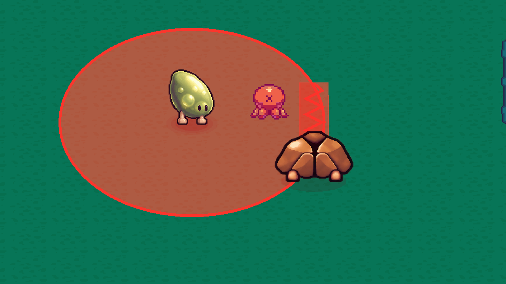
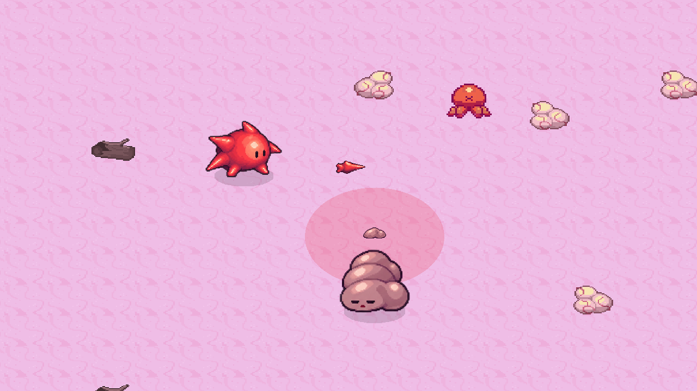
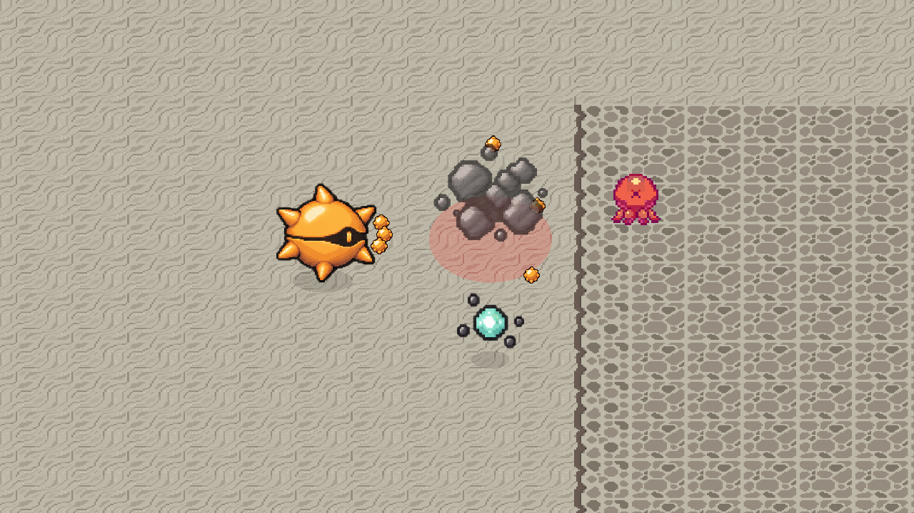
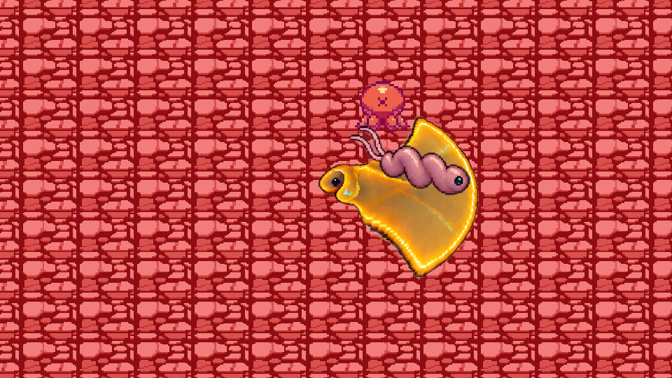

# 바이옴 엘리트 몬스터 작업 공유

- 기준: 2026.10.05
- 작업 범위: 4개 바이옴 전용 엘리트 8종, 공통 전투·밸런스·스폰·저장 시스템
- 바이옴별 몬스터 기획·구현 계획과 밸런스 분리 설계 통합 문서화
- 현재 상태: 승인된 패턴·스프라이트 제작 및 인게임 적용 완료 / 세부 수치 튜닝은 팀에서 진행

## 몬스터별 구현

- **장 · 가스낭**: 팽창 예고 후 주변 폭발 / 원거리에서는 방향을 고정한 가스탄 1발 발사
- **장 · 굳은 잔여체**: 조각을 내려놓아 이동을 막는 잔해 생성 / 플레이어 공격으로 파괴 / 좌우는 가로, 상하는 세로 배치
- **간 · 염증 불씨**: 피격 시 방향 고정 → 예고 후 가시탄 1발로 반격
- **간 · 숙취 잔재**: 잔여물을 남기고 후퇴 → 잔여물 지연 폭발 / 정면 외형을 유지하며 이동
- **폐 · 분진 뭉치**: 핵은 제자리에 남고 분진 구름만 이동 / 노출된 핵 공격 가능
- **폐 · 꽃가루 침입자**: 3갈래 발사 → 회전 예고 → 각도를 바꾼 두 번째 3갈래 발사 / 한 사이클 중복 피해 제한
- **위 · 헬리코 나선충**: 방향 고정 → 머리부터 직선 돌진 → 회복 / 꼬리 휩쓸기 제외
- **위 · 기름막 활주체**: 핵 고정 → 막을 펼쳐 전방 부채꼴 전체 단발 공격 → 회복 / 안쪽 안전지대 제거

## 공통 전투·표현 개선

- 입체감과 가독성을 보완한 2D 도트 스프라이트 제작
- 대기·이동·공격 준비·공격·회복·피격·사망 모션 연결
- 필요한 정면·후면·좌우 표현 적용 / 나선충 8방향 / 숙취 정면 고정·분진 방향 구분 없음
- 범위 공격은 빨간 면적으로 예고 / 실제 모션·피해 범위·지면 위치 정렬
- 투사체는 지면 가까이 비행 / 단순 투사체 아래 별도 범위 UI 제외
- 모든 몬스터의 몸체 접촉 피해 확인
- 플레이어가 받는 피격은 몸통 기준으로 조정 / 플레이어 공격에는 가장자리 적중 여유 적용
- 사망·청크 해제·재사용 시 공격과 생성물 정리 / 기절 시 패턴별 중단 처리 / 경험치 중복 지급 방지

## 인게임 배치·밸런스 편집

- 일반몹 처치 수와 무관한 **바이옴 전용 맵 스포너** 적용
- 맵 전체 설정 수량: **장·간·폐·위 각각 2마리**, 종류별 1마리 (2026.10.05 변경)
- 엘리트 지점 사이 최소 **64칸** 간격 / 입구·포털·보스 구역 제외 조건 적용
- 같은 런의 배치·처치 기록 유지 / 처치한 개체 재생성 방지
- 일반몹·기존 엘리트·바이옴 엘리트·보스의 기본값과 공통 난이도·진행도 배율 분리
- Unity 메뉴: **Necrocis → Balance → Open Monster Balance**
- **1 · 기본값**: 체력·공격력·이동속도·경험치·접촉 피해·패턴 피해 계수
- **1-A/B · 패턴**: 공격 거리·범위·예고·회복·재사용 대기·추가 패턴
- **2 · 난이도 / 3 · 진행도 / 4 · 배치**: 각각 별도 원본에서 편집
- 능력치·패턴 수정은 다음 생성 개체부터 반영 / 배치 수·간격 수정은 새 런의 배치 계획부터 반영
- 상단 난이도·진행도 선택은 계산 미리보기 / 실제 수치는 아래 원본 구획에서 편집

## 검증·남은 작업

- **2026.10.05 배치 조정:** 맵별 10개 시드·총 40개 실제 지형 생성, 448개 조건 검사 통과 / 실패 0. 모두 총 2마리·종류별 1마리·지점 간 64칸 이상이며, 실측 간격 100.45~316.43칸. 기존 배치/저장 검사 3그룹 통과, 원본 저장 파일 SHA-256 동일.
- Unity Editor 통합 실행 검사 **418개**, Inspector·참조 검사 **248개 통과 / 실패 0**
- Normal·Hard, 진행도 0~4, 회피·반격·접촉·사망·보상·저장·계속하기 확인
- 현재 Normal 저장의 복사본에서도 8종 실제 생성 확인 / 원본 저장 유지
- 꽃가루·기름막 Inspector의 사용하지 않는 중복 공격 항목 정리
- **팀 튜닝 예정**: 현재 8종 기본값은 체력 30·공격력 2·이동속도 1·경험치 50 / Normal·Hard 엘리트 배율도 동일한 초기 상태
- **코드리뷰 미수정**: 보스 필수 페이즈·피해 ID 누락 검증 보완
- **코드리뷰 미수정**: 기름막 표시 크기 변경 시 공격 메시에도 동일 배율 적용

## 실제 게임 화면

- 바이옴별 Unity 검증 캡처 / 조합 확인용 임시 근접 배치 포함

**장 — 가스낭·굳은 잔여체**

**간 — 염증 불씨·숙취 잔재**

**폐 — 분진 뭉치·꽃가루 침입자**

**위 — 헬리코 나선충·기름막 활주체**

